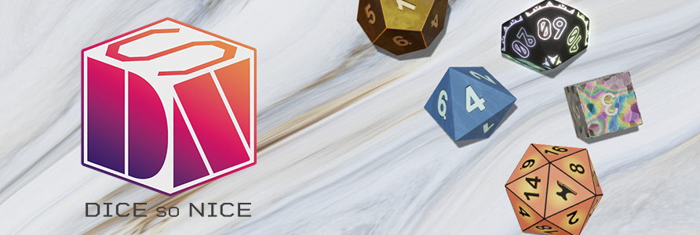

# Swerpg — Système de jeu Foundry VTT

[](https://herdev.hervedarritchon.fr/foundryvtt-swerpg/index.html)



Swerpg (aka swerpg) est un système de jeu de rôle moderne conçu pour Foundry Virtual Tabletop. Il fournit des modèles
de documents Foundry, des feuilles (`Actor`/`Item`), des actions de jeu, des packs de compendiums et des outils de
build pour travailler sur le contenu YAML/LevelDB.

Ce dépôt contient le code du système, les sources YAML des compendiums (`_source/`) et des scripts d'assemblage pour
compiler les packs destinés à Foundry.

## Principaux points

- Architecture moderne ES modules, compatible Foundry VTT v13+.
- Sources de contenu éditables en YAML dans le dossier `_source/` (compendia compilés dans `packs/`).
- Outils de build pour extraire/compresser les packs et compiler les styles (LESS).
- Tests automatisés (Vitest) et pipelines CI configurés.

## Prérequis

- Node.js (version LTS recommandée)
- pnpm (le projet utilise `pnpm` mais les scripts sont compatibles avec `npm`/`npx` pour la plupart des tâches)
- Foundry Virtual Tabletop (pour exécuter le système dans l'application)

## Démarrage rapide (développement local)

Cloner le dépôt et installer les dépendances :

```bash
git clone https://github.com/herveDarritchon/foundryvtt-swerpg.git
cd foundryvtt-swerpg
pnpm install
```

Builder et lancer les assets (scripts utiles) :

```bash
pnpm run build        # fmt + compile + rollup + less
pnpm run compile      # compile les packs depuis _source/ vers packs/
pnpm run less         # compile les fichiers LESS en CSS
pnpm run rollup       # bundle JS via Rollup
```

Pour exécuter la suite de tests :

```bash
pnpm test             # lance vitest
pnpm test:coverage    # exécute les tests et génère un rapport de couverture
```

## Workflow des compendia (packs)

- Toutes les données éditables se trouvent dans `_source/` (YAML). Ne modifiez pas directement les fichiers binaires dans
  `packs/` — utilisez le pipeline d'extraction/compilation.
- Extraire les packs existants (si nécessaire) :

```bash
pnpm run extract      # extrait les packs vers _source/
```

- Compiler les packs depuis `_source/` :

```bash
pnpm run compile
```

Cette séparation garantit que le contenu peut être versionné en clair et édité collaborativement.

## Structure du dépôt

- `module/` : code du système (documents, applications, modèles, config, importer, etc.)
- `_source/` : sources YAML éditables des compendiums
- `packs/` : packs LevelDB compilés (à déployer dans Foundry)
- `styles/` : LESS/CSS
- `tests/` : tests unitaires et d'intégration (Vitest)
- `build.mjs`, `rollup.config.mjs`, `gulpfile.mjs` : scripts de build

## Exemples utiles

- Activer l'affichage des hooks de diagnostic dans Foundry (console DevTools) :

```js
CONFIG.debug.hooks = true
```

## Tests et CI

Le projet utilise Vitest pour les tests. La CI (GitHub Actions) est configurée pour lancer les tests et publier
la couverture.

Quelques commandes utiles :

```bash
pnpm test
pnpm vitest run tests/integration/species-import.integration.spec.mjs # ex. tester un fichier d'intégration
```

## Tests E2E (Playwright) — stratégie à deux étages

Les tests end-to-end sont séparés en deux étages indépendants.

### Étage 1 — Régression (port 31001, Docker, CI)

Specs dans `e2e/regression/`. Instance Foundry éphémère créée automatiquement par Docker.
Config : `playwright.config.ts`. Env : `.env.e2e.local`.

```bash
pnpm foundry:e2e:start   # démarrer l’instance Docker (port 31001)
pnpm e2e                 # lancer la suite headless
pnpm e2e:headed          # lancer avec navigateur visible
pnpm e2e:ci              # Chromium uniquement, specs taggées [ci] (pour la CI)
pnpm foundry:e2e:stop    # arrêter l’instance Docker
```

Exemple minimal `.env.e2e.local` :

```dotenv
E2E_FOUNDRY_BASE_URL=http://localhost:31001
E2E_FOUNDRY_ADMIN_PASSWORD=admin
E2E_FOUNDRY_USERNAME=Gamemaster
E2E_FOUNDRY_PASSWORD=changeme
E2E_FOUNDRY_WORLD=Swerpg-E2E-World
```

### Étage 2 — Smoke prod (port 30000, lecture seule, hors CI)

Specs dans `e2e/smoke/`. Cible une instance Foundry déjà active — aucune mutation du monde.
Config : `playwright.smoke.config.ts`. Env : `.env.e2e.smoke.prod` (voir `.env.e2e.smoke.prod.example`).

```bash
pnpm e2e:smoke           # suite smoke headless
pnpm e2e:smoke:headed    # suite smoke avec navigateur visible
```

Vérifie : présence de `body.system-swerpg`, absence d’erreurs console critiques, assets non-404, sidebar sans clés i18n brutes ni `undefined`.

> Ne commitez jamais les fichiers `.env.e2e.*` contenant des secrets.

En cas d’échec, diagnostiquer avec la trace Playwright :

```bash
pnpm exec playwright show-trace test-results/**/trace.zip
```

Voir `e2e/README.md` et `documentation/tests/e2e/playwright-e2e-guide.md` pour les détails.

## Règles de contribution (rapide)

Pour contribuer, regardez d'abord la documentation dans `documentation/` et les fichiers sous `.github/` :

- Respectez le workflow `_source/` → `packs/` (n'éditez pas `packs/` directement).
- Suivez les conventions de codage (ESM, Prettier, ESLint). Utilisez `pnpm run fmt` avant vos commits.
- Écrivez des tests lorsqu'un comportement critique est modifié.

## Ressources et liens

- Page Foundry : [foundryvtt.com/packages/swerpg](https://foundryvtt.com/packages/swerpg)
- Documentation du projet : `documentation/` et `docs/` dans le dépôt
- Issues & discussions : utilisez le dépôt GitHub pour signaler bugs ou proposer des améliorations

## Notes importantes

> :warning: Ne modifiez jamais directement les packs binaires dans `packs/`. Éditez les sources YAML dans `_source/`
> puis exécutez la commande de compilation.

Ce README a été rédigé pour offrir une vue d'ensemble claire du dépôt et des étapes de contribution. Pour les détails
avancés (architecture interne, conventions, tests end-to-end), consultez le dossier `documentation/`.

---

Si vous voulez que j'ajoute une section spécifique (par ex. guide de déploiement, checklist de PR ou résumé des
conventions de code), dites-moi laquelle et je l'ajouterai.
