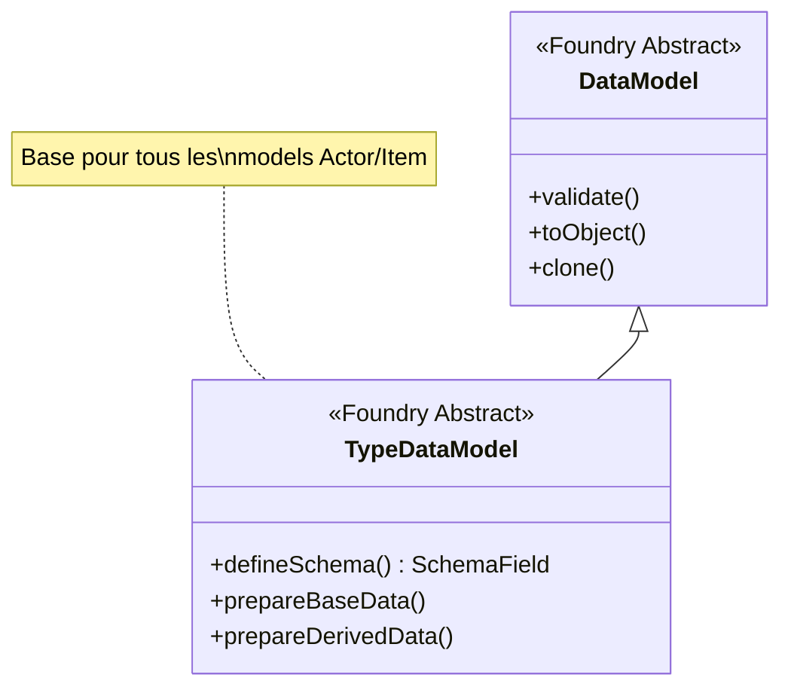
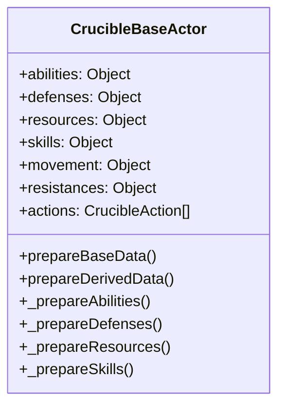
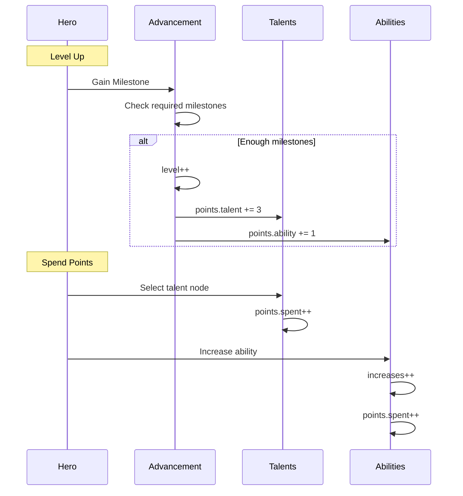
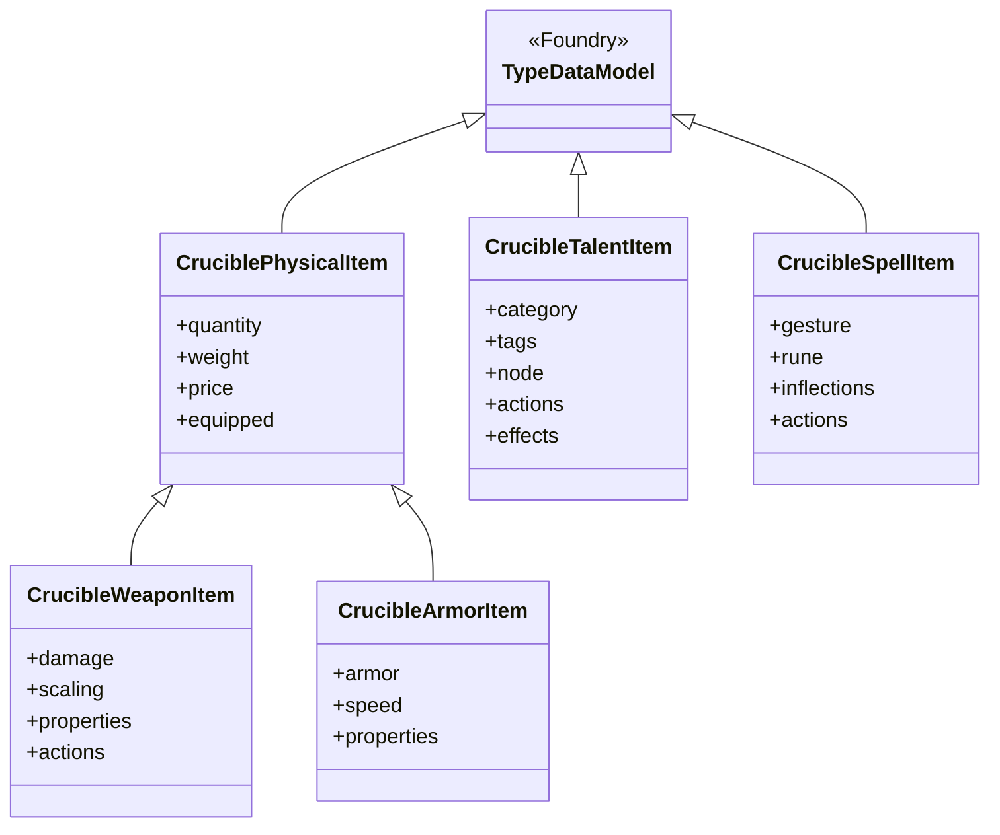
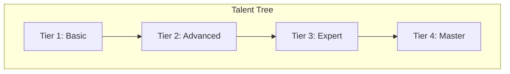
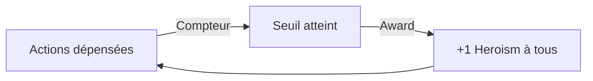
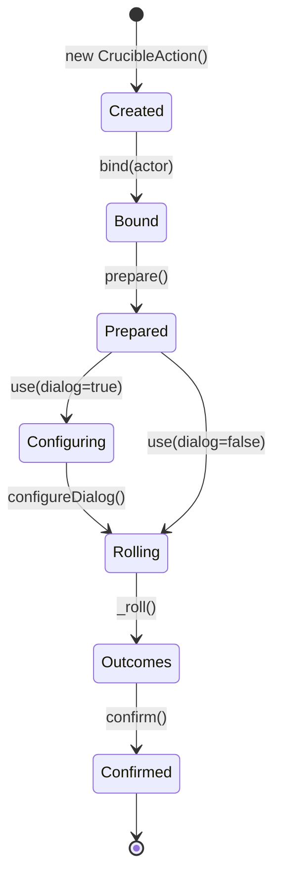
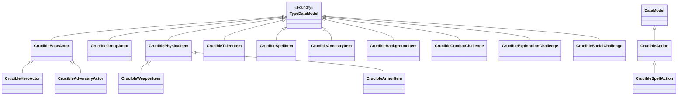

# Models de Données - Système Crucible

Ce document identifie et documente tous les modèles de données (Data Models) utilisés dans le système Crucible.

---

## Table des matières

1. [Architecture des Models](#architecture-des-models)
2. [Actor Models](#actor-models)
3. [Item Models](#item-models)
4. [Combat Models](#combat-models)
5. [Action Models](#action-models)
6. [Spellcraft Models](#spellcraft-models)
7. [Schémas de Champs](#schémas-de-champs)

---

## Architecture des Models

### Hiérarchie TypeDataModel

Crucible utilise le système `TypeDataModel` de Foundry VTT v13 pour définir des schémas de données typés et validés.



### Structure des fichiers

```
module/models/
├── _module.mjs           # Point d'entrée, exports
├── fields.mjs            # Champs personnalisés
├── action.mjs            # Model Action
├── spell-action.mjs      # Model Action de sort
├── actor-base.mjs        # Base Actor
├── actor-hero.mjs        # Hero Actor
├── actor-adversary.mjs   # Adversary Actor
├── actor-group.mjs       # Group Actor
├── item-*.mjs            # Models Item
├── combat-*.mjs          # Models Combat
└── spellcraft-*.mjs      # Models Spellcraft
```

---

## Actor Models

### CrucibleBaseActor

**Type** : Classe abstraite de base pour tous les Actors

**Héritage** : `foundry.abstract.TypeDataModel`

**Schéma** :

```javascript
static defineSchema() {
  return {
    // Caractéristiques
    abilities: new SchemaField({
      str: new SchemaField({base, increases, bonus}),
      dex: new SchemaField({base, increases, bonus}),
      sta: new SchemaField({base, increases, bonus}),
      int: new SchemaField({base, increases, bonus}),
      wis: new SchemaField({base, increases, bonus}),
      cha: new SchemaField({base, increases, bonus})
    }),

    // Défenses
    defenses: new SchemaField({
      armor: new SchemaField({base, bonus, value}),
      block: new SchemaField({base, bonus, value}),
      parry: new SchemaField({base, bonus, value}),
      dodge: new SchemaField({base, bonus, value}),
      fortitude: new SchemaField({base, bonus, value}),
      willpower: new SchemaField({base, bonus, value}),
      reflex: new SchemaField({base, bonus, value})
    }),

    // Ressources
    resources: new SchemaField({
      health: new SchemaField({value, max, temp}),
      wounds: new SchemaField({value, max}),
      morale: new SchemaField({value, max}),
      action: new SchemaField({value, max}),
      focus: new SchemaField({value, max}),
      heroism: new SchemaField({value, max})
    }),

    // Compétences
    skills: new SchemaField({
      [skillId]: new SchemaField({
        ability, rank, bonus, passive
      })
    }),

    // Mouvement
    movement: new SchemaField({
      stride, tactical, travel
    }),

    // Résistances
    resistances: new SchemaField({
      physical, poison, fire, cold,
      electricity, acid, corruption
    })
  }
}
```

**Propriétés dérivées** :

```javascript
// Calculées dans prepareBaseData()
abilities.*.value       // base + increases + bonus
defenses.*.value        // base + ability + bonus
skills.*.passive        // 10 + ability + rank + bonus

// Calculées dans prepareDerivedData()
derivedWounds           // Basé sur health et stamina
derivedMorale           // Basé sur level/threat
encumbrance            // Poids équipement
```

**Diagramme de classe** :



**Source** : `module/models/actor-base.mjs`

---

### CrucibleHeroActor

**Type** : Model pour personnages joueurs (Heroes)

**Héritage** : `CrucibleBaseActor`

**Schéma spécifique** :

```javascript
static defineSchema() {
  const schema = super.defineSchema();

  // Advancement (progression)
  schema.advancement = new SchemaField({
    level: new NumberField({min: 0, max: 24}),
    milestones: new NumberField({min: 0}),
    talentNodes: new SetField(new StringField())
  });

  // Détails narratifs
  schema.details = new SchemaField({
    ancestry: new SchemaField({
      name, img,
      ...CrucibleAncestryItem.defineSchema()
    }),
    background: new SchemaField({
      name, img,
      ...CrucibleBackgroundItem.defineSchema()
    }),
    biography: new SchemaField({
      appearance, age, height, pronouns,
      weight, public, private
    }),
    knowledge: new SetField(new StringField()),
    languages: new SetField(new StringField())
  });

  return schema;
}
```

**Propriétés dérivées** :

```javascript
points: {
  ability: {
    pool: 9,          // Points de départ
    total: level-1,   // Points gagnés
    bought: 0,        // Achetés (création)
    spent: 0,         // Dépensés (montées)
    available: 0      // Disponibles
  },
  talent: {
    total: 3 + (level-1)*3,
    spent: 0,
    available: 0
  }
}

capacity: {
  value: number,  // Poids actuel
  max: number     // Capacité (STR-based)
}
```

**Workflow de progression** :



**Source** : `module/models/actor-hero.mjs`

---

### CrucibleAdversaryActor

**Type** : Model pour adversaires/PNJ

**Héritage** : `CrucibleBaseActor`

**Schéma spécifique** :

```javascript
static defineSchema() {
  const schema = super.defineSchema();

  schema.details = new SchemaField({
    tier: new NumberField({min: 1, max: 10}),
    rank: new StringField({
      choices: ["minion", "normal", "elite", "boss"]
    }),
    taxonomy: new StringField(),
    biography: new HTMLField()
  });

  return schema;
}
```

**Propriétés dérivées** :

```javascript
// Threat calculation
threat = tier * rankScaling
// minion: 0.5, normal: 1.0, elite: 1.5, boss: 2.0

actionMax = {
  minion: 4,
  normal: 6,
  elite: 8,
  boss: 10,
}[rank]
```

**Scaling par Rank** :

| Rank   | Scaling | Action Max | Icon            |
| ------ | ------- | ---------- | --------------- |
| Minion | 0.5x    | 4          | fa-chevron-down |
| Normal | 1.0x    | 6          | fa-chevron-up   |
| Elite  | 1.5x    | 8          | fa-chevrons-up  |
| Boss   | 2.0x    | 10         | fa-skull        |

**Source** : `module/models/actor-adversary.mjs`

---

### CrucibleGroupActor

**Type** : Model pour groupes de personnages (parties)

**Héritage** : `foundry.abstract.TypeDataModel` (pas BaseActor)

**Schéma** :

```javascript
static defineSchema() {
  return {
    members: new SetField(new ForeignDocumentField(Actor)),
    pooledResources: new SchemaField({
      heroism: new SchemaField({value, max})
    })
  };
}
```

**Usage** : Gestion de ressources partagées entre membres du groupe.

**Source** : `module/models/actor-group.mjs`

---

## Item Models

### Hiérarchie Item



---

### CruciblePhysicalItem

**Type** : Base pour items physiques (équipement)

**Schéma** :

```javascript
static defineSchema() {
  return {
    quantity: new NumberField({min: 0, integer: true}),
    weight: new NumberField({min: 0}),
    equipped: new BooleanField(),
    attuned: new BooleanField(),
    identified: new BooleanField(),

    price: new SchemaField({
      gold: new NumberField({min: 0}),
      silver: new NumberField({min: 0}),
      copper: new NumberField({min: 0})
    }),

    rarity: new StringField({
      choices: ["common", "uncommon", "rare", "epic", "legendary"]
    })
  };
}
```

**Propriétés dérivées** :

```javascript
totalWeight = quantity * weight
totalValue = price (en copper)
```

**Sous-types** :

- `CrucibleWeaponItem` - Armes
- `CrucibleArmorItem` - Armures
- `CrucibleAccessoryItem` - Accessoires
- `CrucibleConsumableItem` - Consommables
- `CrucibleLootItem` - Butin
- `CrucibleSchematicItem` - Schémas craft

**Source** : `module/models/item-physical.mjs`

---

### CrucibleWeaponItem

**Schéma spécifique** :

```javascript
static defineSchema() {
  const schema = super.defineSchema();

  schema.category = new StringField({
    choices: SYSTEM.WEAPON.CATEGORIES
  });

  schema.properties = new SetField(new StringField({
    choices: SYSTEM.WEAPON.PROPERTIES
  }));

  schema.damage = new SchemaField({
    base: new StringField(),      // "2d6"
    type: new StringField(),       // "physical"
    scaling: new SchemaField({
      mode: new StringField(),     // "ability"
      formula: new StringField()   // "@abilities.str.value"
    })
  });

  schema.hands = new NumberField({choices: [0, 1, 2]});

  schema.range = new SchemaField({
    reach: new NumberField(),
    thrown: new NumberField(),
    increment: new NumberField()
  });

  return schema;
}
```

**Propriétés d'arme** :

- `melee` - Arme de mêlée
- `ranged` - Arme à distance
- `thrown` - Arme de jet
- `reload` - Nécessite rechargement
- `versatile` - Versatile (1 ou 2 mains)
- `finesse` - Finesse (DEX au lieu de STR)
- `penetrating` - Pénétrant (ignore armure)

**Source** : `module/models/item-weapon.mjs`

---

### CrucibleArmorItem

**Schéma spécifique** :

```javascript
static defineSchema() {
  const schema = super.defineSchema();

  schema.category = new StringField({
    choices: ["unarmored", "light", "medium", "heavy", "shield"]
  });

  schema.armor = new SchemaField({
    value: new NumberField({min: 0}),
    soak: new NumberField({min: 0})
  });

  schema.speed = new SchemaField({
    penalty: new NumberField({min: 0})
  });

  schema.properties = new SetField(new StringField({
    choices: SYSTEM.ARMOR.PROPERTIES
  }));

  return schema;
}
```

**Propriétés d'armure** :

- `bulky` - Encombrant (pénalité DEX)
- `noisy` - Bruyant (pénalité Stealth)
- `restrictive` - Restrictif (pénalité mobilité)

**Source** : `module/models/item-armor.mjs`

---

### CrucibleTalentItem

**Type** : Talents (capacités passives/actives)

**Schéma** :

```javascript
static defineSchema() {
  return {
    category: new SchemaField({
      primary: new StringField(),
      secondary: new StringField()
    }),

    node: new SchemaField({
      id: new StringField(),
      tier: new NumberField({min: 1, max: 4}),
      parent: new StringField(),
      coordinate: new SchemaField({x, y})
    }),

    prerequisite: new StringField(),

    actions: new ArrayField(
      new EmbeddedDataField(CrucibleAction)
    ),

    effects: new ArrayField(
      new ObjectField() // ActiveEffect data
    ),

    tags: new SetField(new StringField())
  };
}
```

**Catégories de talents** :

- **Warfare** : Combat, armes, armures
- **Magic** : Sorts, spellcasting
- **Exploration** : Compétences, survie
- **Social** : Interaction, influence
- **Profession** : Crafting, commerce

**Node Structure** :



**Source** : `module/models/item-talent.mjs`

---

### CrucibleSpellItem

**Type** : Sorts (spellcasting)

**Schéma** :

```javascript
static defineSchema() {
  return {
    gesture: new StringField({
      choices: SYSTEM.SPELL.GESTURES
    }),

    rune: new StringField({
      choices: SYSTEM.SPELL.RUNES
    }),

    inflections: new ArrayField(
      new StringField({choices: SYSTEM.SPELL.INFLECTIONS})
    ),

    circle: new NumberField({min: 1, max: 9}),

    actions: new ArrayField(
      new EmbeddedDataField(CrucibleAction)
    )
  };
}
```

**Composants de sort** :

1. **Gesture** (obligatoire) - Geste magique
2. **Rune** (obligatoire) - Rune élémentaire
3. **Inflections** (optionnelles) - Modificateurs

**Exemple de sort** :

```yaml
name: Fireball
gesture: blast
rune: fire
inflections:
  - enhance
  - area
circle: 3
```

**Source** : `module/models/item-spell.mjs`

---

### CrucibleAncestryItem

**Type** : Ascendances (races)

**Schéma** :

```javascript
static defineSchema() {
  return {
    abilities: new SchemaField({
      primary: new StringField({choices: ABILITIES}),
      secondary: new StringField({choices: ABILITIES})
    }),

    resistances: new SchemaField({
      resistance: new StringField({choices: DAMAGE_TYPES}),
      vulnerability: new StringField({choices: DAMAGE_TYPES})
    }),

    movement: new SchemaField({
      size: new NumberField({min: 1, max: 10}),
      stride: new NumberField({min: 5})
    }),

    languages: new SetField(new StringField()),

    gifts: new ArrayField(new StringField())
  };
}
```

**Source** : `module/models/item-ancestry.mjs`

---

### CrucibleBackgroundItem

**Type** : Backgrounds (historiques)

**Schéma** :

```javascript
static defineSchema() {
  return {
    skills: new ArrayField(
      new StringField({choices: SKILLS})
    ),

    knowledge: new SetField(new StringField()),

    languages: new SetField(new StringField()),

    equipment: new ArrayField(new ObjectField()),

    currency: new SchemaField({
      gold, silver, copper
    })
  };
}
```

**Source** : `module/models/item-background.mjs`

---

## Combat Models

### CrucibleCombatChallenge

**Type** : Modèle pour Combats

**Schéma** :

```javascript
static defineSchema() {
  return {
    round: new NumberField({min: 1}),

    heroism: new SchemaField({
      actions: new NumberField({min: 0}),
      awarded: new NumberField({min: 0}),
      previous: new NumberField(),
      next: new NumberField()
    }),

    status: new StringField({
      choices: ["active", "complete", "defeated"]
    })
  };
}
```

**Système Heroism** :



**Source** : `module/models/combat-combat.mjs`

---

### CrucibleExplorationChallenge

**Type** : Modèle pour Exploration

**Schéma** :

```javascript
static defineSchema() {
  return {
    turns: new NumberField({min: 0}),

    progress: new SchemaField({
      value: new NumberField({min: 0}),
      max: new NumberField({min: 0})
    })
  };
}
```

**Source** : `module/models/combat-exploration.mjs`

---

### CrucibleSocialChallenge

**Type** : Modèle pour Rencontres Sociales

**Schéma** :

```javascript
static defineSchema() {
  return {
    disposition: new SchemaField({
      value: new NumberField({min: -10, max: 10}),
      threshold: new NumberField()
    })
  };
}
```

**Source** : `module/models/combat-social.mjs`

---

## Action Models

### CrucibleAction

**Type** : Modèle central pour toutes les actions

**Schéma complet** :

```javascript
static defineSchema() {
  return {
    id: new StringField({required: true}),
    name: new StringField(),
    img: new FilePathField({categories: ["IMAGE"]}),
    description: new HTMLField(),
    condition: new StringField(),

    cost: new SchemaField({
      action: new NumberField({min: 0, integer: true}),
      focus: new NumberField({min: 0, integer: true}),
      heroism: new NumberField({min: 0, integer: true}),
      weapon: new BooleanField()
    }),

    range: new SchemaField({
      minimum: new NumberField({min: 1, nullable: true}),
      maximum: new NumberField({min: 1, nullable: true}),
      weapon: new BooleanField()
    }),

    target: new SchemaField({
      type: new StringField({
        choices: ["none", "single", "multiple", "area", "cone", "line"]
      }),
      number: new NumberField({min: 0, integer: true}),
      size: new NumberField({min: 1, integer: true}),
      scope: new NumberField({
        choices: [ALL, ALLY, ENEMY, NEUTRAL]
      }),
      limit: new NumberField({min: 1, integer: true}),
      self: new BooleanField()
    }),

    effects: new ArrayField(new ObjectField()),

    tags: new SetField(new StringField()),

    actionHooks: new ArrayField(new SchemaField({
      hook: new StringField({choices: ACTION_HOOKS}),
      fn: new JavaScriptField({async: true})
    }))
  };
}
```

**Tags disponibles** :

- **Activation** : `passive`, `reaction`, `bonus`, `free`
- **Type** : `attack`, `spell`, `skill`, `movement`
- **Effet** : `damage`, `healing`, `buff`, `debuff`, `control`
- **Cible** : `melee`, `ranged`, `self`, `aoe`

**Lifecycle** :



**Source** : `module/models/action.mjs`

---

### CrucibleSpellAction

**Type** : Sous-classe spécialisée pour le spellcasting

**Héritage** : `CrucibleAction`

**Ajouts** :

```javascript
// Propriétés additionnelles
gesture: CrucibleSpellcraftGesture
rune: CrucibleSpellcraftRune
inflections: CrucibleSpellcraftInflection[]

// Construction dynamique
_prepareData() {
  super._prepareData();

  // Combine gesture + rune + inflections
  this.#buildSpellProperties();
}
```

**Source** : `module/models/spell-action.mjs`

---

## Spellcraft Models

### CrucibleSpellcraftGesture

**Schéma** :

```javascript
static defineSchema() {
  return {
    id: new StringField(),
    name: new StringField(),
    description: new HTMLField(),
    icon: new StringField(),

    cost: new SchemaField({
      action, focus
    }),

    range: new SchemaField({
      minimum, maximum
    }),

    target: new SchemaField({
      type, number, size
    })
  };
}
```

**Gestures disponibles** : `touch`, `blast`, `ray`, `aura`, `wall`, `zone`

**Source** : `module/models/spellcraft-gesture.mjs`

---

### CrucibleSpellcraftRune

**Schéma** :

```javascript
static defineSchema() {
  return {
    id: new StringField(),
    name: new StringField(),
    description: new HTMLField(),
    icon: new StringField(),
    element: new StringField(),

    effects: new ArrayField(new ObjectField())
  };
}
```

**Runes disponibles** : `fire`, `cold`, `electricity`, `acid`, `poison`, `force`, `radiant`, `necrotic`

**Source** : `module/models/spellcraft-rune.mjs`

---

### CrucibleSpellcraftInflection

**Schéma** :

```javascript
static defineSchema() {
  return {
    id: new StringField(),
    name: new StringField(),
    description: new HTMLField(),
    icon: new StringField(),

    modifiers: new ArrayField(new ObjectField()),

    cost: new SchemaField({
      focus: new NumberField()
    })
  };
}
```

**Inflections disponibles** : `enhance`, `extend`, `enlarge`, `quicken`, `empower`, `persist`

**Source** : `module/models/spellcraft-inflection.mjs`

---

## Schémas de Champs

### Custom Fields

Crucible définit des champs personnalisés réutilisables.

**Source** : `module/models/fields.mjs`

**Exemples** :

```javascript
// Champ Ability (caractéristique)
class AbilityField extends SchemaField {
  constructor() {
    super({
      base: new NumberField({ min: 0, max: 12 }),
      increases: new NumberField({ min: 0 }),
      bonus: new NumberField(),
      value: new NumberField({ min: 0, max: 12 }),
    })
  }
}

// Champ Resource (ressource)
class ResourceField extends SchemaField {
  constructor() {
    super({
      value: new NumberField({ min: 0 }),
      max: new NumberField({ min: 0 }),
      temp: new NumberField({ min: 0 }),
    })
  }
}
```

---

## Diagramme Complet des Models



---

## Résumé des Models

| Model                        | Type     | Fichier                   | Hérite de      |
| ---------------------------- | -------- | ------------------------- | -------------- |
| **Actors**                   |
| CrucibleBaseActor            | Abstract | actor-base.mjs            | TypeDataModel  |
| CrucibleHeroActor            | Concrete | actor-hero.mjs            | BaseActor      |
| CrucibleAdversaryActor       | Concrete | actor-adversary.mjs       | BaseActor      |
| CrucibleGroupActor           | Concrete | actor-group.mjs           | TypeDataModel  |
| **Items**                    |
| CruciblePhysicalItem         | Abstract | item-physical.mjs         | TypeDataModel  |
| CrucibleWeaponItem           | Concrete | item-weapon.mjs           | PhysicalItem   |
| CrucibleArmorItem            | Concrete | item-armor.mjs            | PhysicalItem   |
| CrucibleAccessoryItem        | Concrete | item-accessory.mjs        | PhysicalItem   |
| CrucibleConsumableItem       | Concrete | item-consumable.mjs       | PhysicalItem   |
| CrucibleTalentItem           | Concrete | item-talent.mjs           | TypeDataModel  |
| CrucibleSpellItem            | Concrete | item-spell.mjs            | TypeDataModel  |
| CrucibleAncestryItem         | Concrete | item-ancestry.mjs         | TypeDataModel  |
| CrucibleBackgroundItem       | Concrete | item-background.mjs       | TypeDataModel  |
| CrucibleArchetypeItem        | Concrete | item-archetype.mjs        | TypeDataModel  |
| CrucibleTaxonomyItem         | Concrete | item-taxonomy.mjs         | TypeDataModel  |
| CrucibleSchematicItem        | Concrete | item-schematic.mjs        | PhysicalItem   |
| CrucibleLootItem             | Concrete | item-loot.mjs             | PhysicalItem   |
| **Combat**                   |
| CrucibleCombatChallenge      | Concrete | combat-combat.mjs         | TypeDataModel  |
| CrucibleExplorationChallenge | Concrete | combat-exploration.mjs    | TypeDataModel  |
| CrucibleSocialChallenge      | Concrete | combat-social.mjs         | TypeDataModel  |
| **Actions**                  |
| CrucibleAction               | Concrete | action.mjs                | DataModel      |
| CrucibleSpellAction          | Concrete | spell-action.mjs          | CrucibleAction |
| **Spellcraft**               |
| CrucibleSpellcraftGesture    | Concrete | spellcraft-gesture.mjs    | TypeDataModel  |
| CrucibleSpellcraftRune       | Concrete | spellcraft-rune.mjs       | TypeDataModel  |
| CrucibleSpellcraftInflection | Concrete | spellcraft-inflection.mjs | TypeDataModel  |

---

## Références

- **TypeDataModel API** : <https://foundryvtt.com/api/classes/foundry.abstract.TypeDataModel.html>
- **DataField API** : <https://foundryvtt.com/api/classes/foundry.data.fields.DataField.html>
