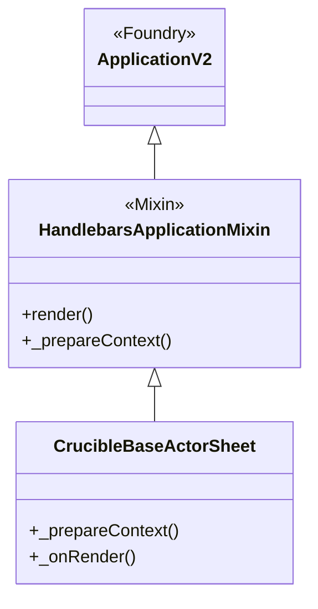
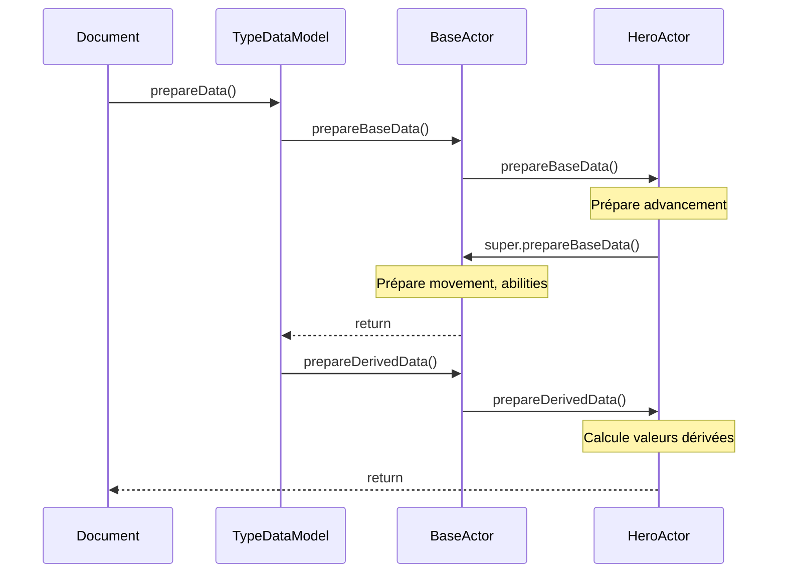
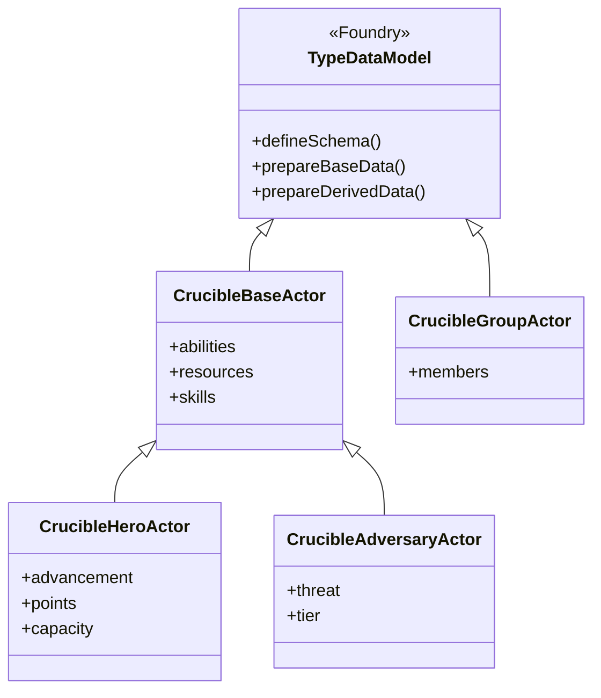
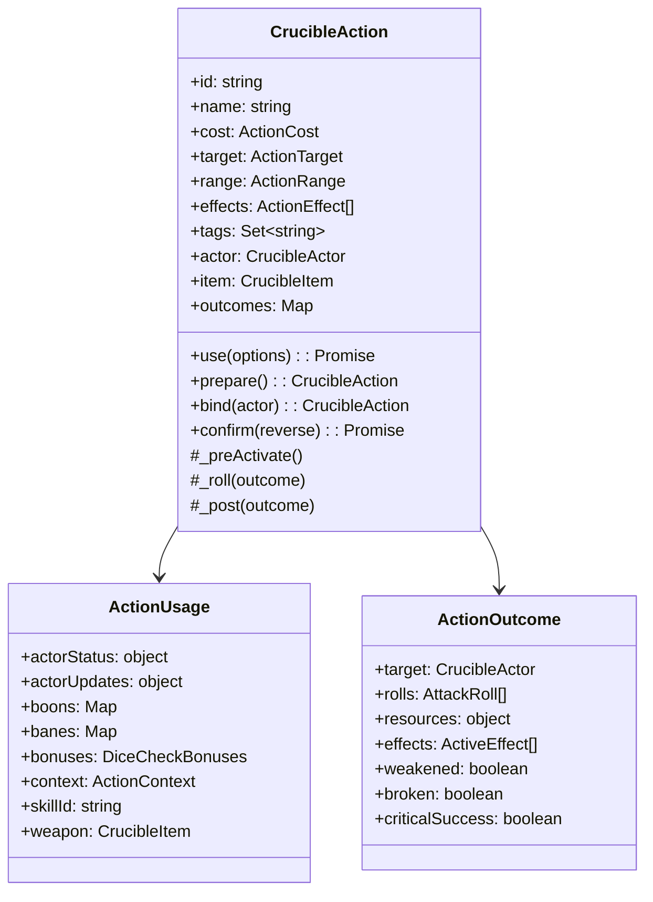
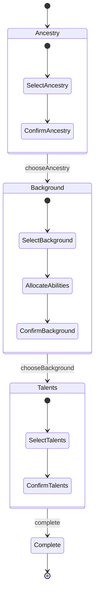
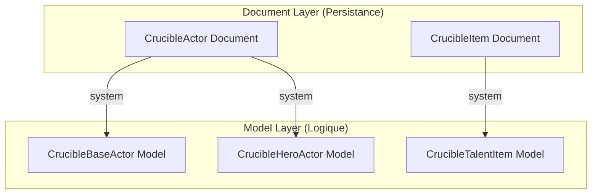
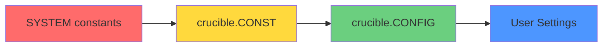

# Patterns Architecturaux - Système Crucible

Ce document identifie et documente tous les patterns de conception (Design Patterns) utilisés dans le système Crucible.

---

## Table des matières

1. [Patterns Structurels](#patterns-structurels)
2. [Patterns Comportementaux](#patterns-comportementaux)
3. [Patterns de Création](#patterns-de-création)
4. [Patterns Foundry VTT](#patterns-foundry-vtt)

---

## Patterns Structurels

### 1. Mixin Pattern

**Description** : Crucible utilise massivement le pattern Mixin pour composer les fonctionnalités des applications UI.

**Implémentation** : `HandlebarsApplicationMixin` enrichit les classes de base Foundry avec des capacités de templating Handlebars.

**Usages identifiés** :

- `CrucibleBaseActorSheet extends HandlebarsApplicationMixin(ActorSheetV2)`
- `CrucibleBaseItemSheet extends HandlebarsApplicationMixin(ItemSheetV2)`
- `CrucibleHeroCreationSheet extends HandlebarsApplicationMixin(ActorSheetV2)`
- `CrucibleActionConfig extends HandlebarsApplicationMixin(DocumentSheetV2)`
- `CrucibleTalentTreeControls extends HandlebarsApplicationMixin(ApplicationV2)`
- `CrucibleTalentHUD extends HandlebarsApplicationMixin(ApplicationV2)`
- `CompendiumSourcesConfig extends HandlebarsApplicationMixin(ApplicationV2)`

**Diagramme** :



**Avantages** :

- Réutilisation du code de templating
- Séparation des préoccupations
- Composition flexible

**Source** : `module/applications/sheets/*.mjs`

---

### 2. Template Method Pattern

**Description** : Le système utilise un Template Method pour standardiser les workflows de préparation de données des Actors et Items.

**Implémentation** : Les méthodes `prepareBaseData()` et `prepareDerivedData()` définissent un squelette d'algorithme que les sous-classes spécialisent.

**Workflow de préparation** :



**Méthodes template identifiées** :

- `prepareBaseData()` - Données de base
- `prepareDerivedData()` - Données calculées
- `_prepareDetails()` - Détails spécifiques
- `_prepareAbilities()` - Caractéristiques
- `_prepareResources()` - Ressources
- `_prepareMovement()` - Mouvement

**Exemple** :

```javascript
// Dans CrucibleBaseActor
prepareBaseData() {
  this._prepareBaseMovement();
  this._prepareDetails();
  this._prepareAbilities();
  this._prepareResources();
  this._prepareSkills();
}

// Dans CrucibleHeroActor (spécialisation)
prepareBaseData() {
  this.#prepareAdvancement();  // Spécifique aux héros
  super.prepareBaseData();     // Appel template parent
}
```

**Source** : `module/models/actor-*.mjs`, `module/models/item-*.mjs`

---

### 3. Type Object Pattern

**Description** : Foundry VTT impose le pattern Type Object via `TypeDataModel` pour modéliser les différents types d'Actors et Items.

**Implémentation** : Chaque type (Hero, Adversary, Group pour Actor ; Weapon, Spell, Talent pour Item) a son propre modèle de données.



**Models Actor** :

- `CrucibleBaseActor` - Classe abstraite de base
- `CrucibleHeroActor` - Personnages joueurs
- `CrucibleAdversaryActor` - Adversaires/PNJ
- `CrucibleGroupActor` - Groupes de personnages

**Models Item** :

- Items physiques : `CruciblePhysicalItem` → `CrucibleWeaponItem`, `CrucibleArmorItem`, etc.
- Items narratifs : `CrucibleAncestryItem`, `CrucibleBackgroundItem`, `CrucibleArchetypeItem`
- Items de progression : `CrucibleTalentItem`, `CrucibleSpellItem`

**Source** : `module/models/_module.mjs`

---

## Patterns Comportementaux

### 4. Command Pattern

**Description** : Le système `CrucibleAction` implémente le pattern Command pour encapsuler toute la logique d'exécution d'une action.

**Caractéristiques** :

- Encapsulation complète (coût, cibles, effets, dés)
- Exécution différée avec dialogue de configuration
- Support de l'annulation (reverse)
- Historique des actions

**Structure** :



**Workflow Action** :

```mermaid
sequenceDiagram
    participant Actor
    participant Action
    participant Dialog
    participant Targets
    participant Outcome

    Actor->>Action: use(options)
    Action->>Action: _canUse()
    Action->>Targets: acquireTargets()
    Action->>Outcome: configureOutcomes()

    alt dialog=true
        Action->>Dialog: configureDialog()
        Dialog-->>Action: configuration
        Action->>Targets: acquireTargets(strict)
        Action->>Outcome: configureOutcomes()
    end

    Action->>Action: _preActivate()

    loop Pour chaque target
        Action->>Outcome: _roll(outcome)
    end

    loop Pour chaque outcome
        Action->>Outcome: _post(outcome)
        Action->>Outcome: #finalizeOutcome()
    end

    Action->>Action: toMessage()
    Action-->>Actor: outcomes

    Note over Actor,Outcome: Confirmation séparée (peut être différée)
    Actor->>Action: confirm()
    Action->>Outcome: target.applyActionOutcome()
```

**Hooks d'extension** : Le système supporte des hooks personnalisés pour étendre le comportement :

- `initialize` - Initialisation de l'action
- `prepare` - Préparation avant usage
- `preActivate` - Avant activation
- `roll` - Pendant les jets de dés
- `postActivate` - Après activation
- `confirm` - Confirmation finale

**Source** : `module/models/action.mjs`, `module/models/spell-action.mjs`

---

### 5. Strategy Pattern

**Description** : Les Action Tests utilisent une stratégie pour déterminer le type de jet de dés à effectuer.

**Tests disponibles** :

- `StandardCheck` - Jets standards
- `AttackRoll` - Attaques
- `DamageRoll` - Dégâts
- `StatusRoll` - Effets de statut

**Implémentation** :

```javascript
// Chaque action définit ses tests via _tests()
_tests() {
  const tests = [];

  if (this.tags.has("attack")) {
    tests.push({
      type: "attack",
      roll: this._rollAttack,
      postActivate: this._applyDamage
    });
  }

  if (this.tags.has("spell")) {
    tests.push({
      type: "spell",
      roll: this._rollSpell
    });
  }

  return tests;
}
```

**Source** : `module/models/action.mjs`, `module/dice/*.mjs`

---

### 6. Observer Pattern

**Description** : Le système Foundry utilise des Hooks (événements) pour le pattern Observer. Crucible les exploite massivement.

**Hooks personnalisés Crucible** :

- `crucible.actorRest` - Repos d'un acteur
- `crucible.rollAction` - Jet d'action
- `crucible.dealDamage` - Application de dégâts
- `crucible.applyActionOutcome` - Application d'un résultat d'action

**Exemple** :

```javascript
// Enregistrement
Hooks.on('crucible.dealDamage', (actor, action, outcomes) => {
  console.log(`${actor.name} inflige des dégâts`)
})

// Déclenchement
this.actor.callActorHooks('dealDamage', this, this.outcomes)
```

**Source** : `module/hooks/_module.mjs`, `module/documents/actor.mjs`

---

### 7. State Pattern

**Description** : La création de personnage utilise un State Pattern pour gérer les différentes étapes.

**États définis** :

```javascript
static STEPS = {
  ancestry: {
    id: "ancestry",
    order: 1,
    initialize: #initializeAncestries,
    prepare: #prepareAncestries
  },
  background: {
    id: "background",
    order: 2,
    initialize: #initializeBackgrounds,
    prepare: #prepareBackgrounds,
    abilities: true
  },
  talents: {
    id: "talents",
    order: 3,
    talents: true
  }
}
```

**Transition d'états** :



**Source** : `module/applications/sheets/hero-creation-sheet.mjs`

---

## Patterns de Création

### 8. Factory Pattern

**Description** : Des méthodes factory créent les instances configurées des différents types.

**Exemples** :

```javascript
// StandardCheck factory
static create(actor, {
  action,
  skillId,
  abilityId,
  ...options
}) {
  // Construit et retourne un StandardCheck configuré
}

// Spell Action factory
static getDefault(actor) {
  const spell = new CrucibleSpellAction({
    id: "cast",
    name: "Cast Spell"
  });
  return spell.bind(actor);
}
```

**Source** : `module/dice/standard-check.mjs`, `module/models/spell-action.mjs`

---

### 9. Builder Pattern (implicite)

**Description** : La configuration des Actions suit un pattern Builder implicite via la méthode `prepare()`.

**Étapes de construction** :

```javascript
// 1. Création brute
const action = new CrucibleAction(data)

// 2. Binding à un acteur (builder)
const boundAction = action.bind(actor)

// 3. Préparation (finalisation)
boundAction.prepare()

// 4. Usage
await boundAction.use()
```

**Source** : `module/models/action.mjs`

---

### 10. Prototype Pattern

**Description** : Les actions sont clonées avant usage pour éviter les mutations.

**Implémentation** :

```javascript
async use(options) {
  // Clone l'action pour isolation
  const action = this.clone({}, {
    parent: this.parent,
    actor: this.actor,
    token
  });
  return action.#use(options);
}
```

**Avantages** :

- Isolation des mutations
- Permet l'annulation (reverse)
- Préserve l'action originale

**Source** : `module/models/action.mjs`

---

## Patterns Foundry VTT

### 11. Document-Model Separation

**Description** : Foundry sépare strictement les Documents (persistance) des Models (logique métier).

**Architecture** :



**Séparation** :

- **Documents** (`module/documents/`) : Gèrent la persistance, les opérations DB, les hooks Foundry
- **Models** (`module/models/`) : Définissent les schémas de données, la logique métier

**Source** : `module/documents/`, `module/models/`

---

### 12. Configuration Hierarchy Pattern

**Description** : Crucible utilise une hiérarchie de configuration en 4 niveaux.



**Niveaux** :

1. **`SYSTEM`** (`module/config/system.mjs`) - Constantes statiques du système
2. **`crucible.CONST`** - Exposition globale des constantes
3. **`crucible.CONFIG`** - Configuration runtime modifiable (packs, currency, etc.)
4. **User Settings** - Préférences utilisateur via Settings API

**Exemple** :

```javascript
// 1. Définition statique
export const COMPENDIUM_PACKS = {
  talent: 'crucible.talent',
}

// 2. Exposition globale
crucible.CONST = SYSTEM

// 3. Configuration runtime
crucible.CONFIG = {
  packs: {
    talent: new Set([SYSTEM.COMPENDIUM_PACKS.talent]),
  },
}

// 4. Settings utilisateur permettent de surcharger CONFIG
```

**Source** : `crucible.mjs`, `module/config/system.mjs`

---

### 13. Enum Pattern

**Description** : Crucible utilise des objets gelés (frozen) comme enums typés.

**Implémentation** :

```javascript
export const THREAT_RANKS = Object.freeze({
  minion: {
    id: 'minion',
    scaling: 0.5,
    actionMax: 4,
  },
  normal: {
    id: 'normal',
    scaling: 1.0,
    actionMax: 6,
  },
  elite: {
    id: 'elite',
    scaling: 1.5,
    actionMax: 8,
  },
})
```

**Utilisation avec la classe Enum** :

```javascript
import Enum from './module/config/enum.mjs'

const myEnum = new Enum({
  FOO: { label: 'Foo', value: 1 },
  BAR: { label: 'Bar', value: 2 },
})
```

**Source** : `module/config/*.mjs`, `module/config/enum.mjs`

---

## Résumé des Patterns

| Pattern          | Type           | Usage Principal                | Fichiers Clés             |
| ---------------- | -------------- | ------------------------------ | ------------------------- |
| Mixin            | Structurel     | Composition UI avec Handlebars | `applications/**/*.mjs`   |
| Template Method  | Comportemental | Préparation de données         | `models/actor-*.mjs`      |
| Type Object      | Structurel     | Modèles Actor/Item             | `models/*.mjs`            |
| Command          | Comportemental | Système d'actions              | `models/action.mjs`       |
| Strategy         | Comportemental | Tests de dés                   | `dice/*.mjs`              |
| Observer         | Comportemental | Système de hooks               | `hooks/*.mjs`             |
| State            | Comportemental | Création de personnage         | `hero-creation-sheet.mjs` |
| Factory          | Création       | Instanciation configurée       | `dice/standard-check.mjs` |
| Builder          | Création       | Construction d'actions         | `models/action.mjs`       |
| Prototype        | Création       | Clonage d'actions              | `models/action.mjs`       |
| Document-Model   | Foundry        | Séparation persistance/logique | `documents/`, `models/`   |
| Config Hierarchy | Foundry        | Configuration en couches       | `config/system.mjs`       |
| Enum             | Foundry        | Énumérations typées            | `config/*.mjs`            |

---

## Références

- **Foundry VTT API** : <https://foundryvtt.com/api/>
- **Design Patterns (GoF)** : Gang of Four Design Patterns
- **JavaScript Patterns** : Learning JavaScript Design Patterns (Addy Osmani)
