# Workflows Majeurs - Système Crucible

Ce document identifie et documente tous les workflows (flux de travail) majeurs implémentés dans le système Crucible.

---

## Table des matières

1. [Workflow Création de Personnage](#workflow-création-de-personnage)
2. [Workflow Utilisation d'Action](#workflow-utilisation-daction)
3. [Workflow Combat](#workflow-combat)
4. [Workflow Spellcasting](#workflow-spellcasting)
5. [Workflow Progression](#workflow-progression)
6. [Workflow Repos](#workflow-repos)
7. [Workflow Inventaire](#workflow-inventaire)
8. [Workflow Compendium](#workflow-compendium)

---

## Workflow Création de Personnage

### Vue d'ensemble

Le workflow de création de héros suit un processus en 3 étapes géré par `CrucibleHeroCreationSheet`.

### Diagramme de flux

```mermaid
flowchart TD
    Start([Nouveau Héros]) --> Init[Initialisation Sheet]
    Init --> Step1{Étape 1: Ancestry}

    Step1 --> LoadAnc[Charger Ancestries]
    LoadAnc --> DispAnc[Afficher choix]
    DispAnc --> SelAnc{Sélection}
    SelAnc -->|Choisir| ApplyAnc[Appliquer Ancestry]

    ApplyAnc --> Step2{Étape 2: Background}
    Step2 --> LoadBg[Charger Backgrounds]
    LoadBg --> DispBg[Afficher choix]
    DispBg --> SelBg{Sélection}
    SelBg -->|Choisir| ApplyBg[Appliquer Background]

    ApplyBg --> AllocAb[Allocation Abilities]
    AllocAb --> CheckAb{Pool = 0?}
    CheckAb -->|Non| AllocAb
    CheckAb -->|Oui| Step3{Étape 3: Talents}

    Step3 --> DispTree[Afficher Talent Tree]
    DispTree --> SelTal{Sélection Talents}
    SelTal -->|Choisir| CheckPts{Points OK?}
    CheckPts -->|Non| DispTree
    CheckPts -->|Oui| Complete[Complete Hero]

    Complete --> SaveHero[Sauvegarder]
    SaveHero --> CloseSheet[Fermer Sheet]
    CloseSheet --> End([Héros Créé])

    style Start fill:#90EE90
    style End fill:#90EE90
    style Step1 fill:#FFD700
    style Step2 fill:#FFD700
    style Step3 fill:#FFD700
```

### Séquence détaillée

```mermaid
sequenceDiagram
    participant User
    participant Sheet as HeroCreationSheet
    participant State as CreationState
    participant Pack as Compendium
    participant Actor

    User->>Sheet: Ouvrir création
    Sheet->>Sheet: _initializeApplicationState()

    Note over Sheet: ÉTAPE 1 - ANCESTRY
    Sheet->>Pack: Charger ancestries
    Pack-->>Sheet: Liste ancestries
    Sheet->>Sheet: #initializeAncestries()
    Sheet->>User: Afficher sélection

    User->>Sheet: Choisir ancestry
    Sheet->>State: ancestryId = selected
    Sheet->>Actor: Appliquer ancestry data
    Note over Actor: abilities.primary/secondary<br/>resistances<br/>movement

    Sheet->>Sheet: Transition Step 2

    Note over Sheet: ÉTAPE 2 - BACKGROUND
    Sheet->>Pack: Charger backgrounds
    Pack-->>Sheet: Liste backgrounds
    Sheet->>Sheet: #initializeBackgrounds()
    Sheet->>User: Afficher sélection

    User->>Sheet: Choisir background
    Sheet->>State: backgroundId = selected
    Sheet->>Actor: Appliquer background data
    Note over Actor: skills<br/>knowledge<br/>languages<br/>equipment

    Sheet->>User: Afficher allocation abilities
    User->>Sheet: +/- abilities
    Sheet->>State: Mettre à jour pool

    loop Tant que pool > 0
        User->>Sheet: Augmenter ability
        Sheet->>State: pool--
        Sheet->>Actor: abilities[x].base++
    end

    User->>Sheet: Confirmer abilities
    Sheet->>Sheet: Transition Step 3

    Note over Sheet: ÉTAPE 3 - TALENTS
    Sheet->>Sheet: Afficher talent tree
    User->>Sheet: Sélectionner talents
    Sheet->>State: talents.add(nodeId)
    Sheet->>Actor: advancement.talentNodes

    User->>Sheet: Complete
    Sheet->>Actor: update(finalData)
    Actor-->>Sheet: Sauvegarde OK
    Sheet->>Sheet: close()
```

### États de la création

**Type** : `CrucibleHeroCreationState`

```javascript
{
  name: string,

  // Ancestry
  ancestries: Record<string, CrucibleHeroCreationItem>,
  ancestryId: string,

  // Background
  backgrounds: Record<string, CrucibleHeroCreationItem>,
  backgroundId: string,

  // Talents
  talents: Set<string>
}
```

### Validations

#### Étape 1 (Ancestry)

- Au moins une ancestry doit être sélectionnée

#### Étape 2 (Background)

- Au moins un background doit être sélectionné
- Tous les points d'ability doivent être dépensés (pool = 0)
- Aucune ability ne peut dépasser 12

#### Étape 3 (Talents)

- Nombre de talents = 3 (niveau 1)
- Respect des prérequis de nœuds (parent)
- Talents de tier 1 uniquement

### Actions utilisateur

| Action             | Handler               | Étape  |
| ------------------ | --------------------- | ------ |
| Choisir Ancestry   | `#onChooseAncestry`   | 1      |
| Choisir Background | `#onChooseBackground` | 2      |
| +1 Ability         | `#onAbilityIncrease`  | 2      |
| -1 Ability         | `#onAbilityDecrease`  | 2      |
| Restart            | `#onRestart`          | Toutes |
| Complete           | `#onComplete`         | 3      |

### Source

`module/applications/sheets/hero-creation-sheet.mjs`

---

## Workflow Utilisation d'Action

### Vue d'ensemble

Le workflow d'utilisation d'action est le cœur du système. Il gère tout depuis la sélection jusqu'à l'application des effets.

### Diagramme de flux

```mermaid
flowchart TD
    Start([Action.use]) --> Prepare{Action préparée?}
    Prepare -->|Non| Error1[Error: Not prepared]
    Prepare -->|Oui| CheckCast{ID = 'cast'?}

    CheckCast -->|Oui| SpellFlow[Workflow Spellcasting]
    CheckCast -->|Non| FindToken[Trouver Token]

    FindToken --> Clone[Cloner Action]
    Clone --> CanUse{_canUse?}
    CanUse -->|Non| Error2[Warn + return null]
    CanUse -->|Oui| AcqTargets1[acquireTargets strict=false]

    AcqTargets1 --> ConfigOutcomes1[configureOutcomes]
    ConfigOutcomes1 --> Dialog{dialog=true?}

    Dialog -->|Oui| ShowDialog[configureDialog]
    ShowDialog --> UserConfig{Confirmation?}
    UserConfig -->|Annulé| Return1[return null]
    UserConfig -->|OK| AcqTargets2[acquireTargets strict=true]
    AcqTargets2 --> ConfigOutcomes2[configureOutcomes]

    Dialog -->|Non| PreActivate[_preActivate]
    ConfigOutcomes2 --> PreActivate

    PreActivate --> CheckPre{Succès?}
    CheckPre -->|Non| Return2[return null]
    CheckPre -->|Oui| RollLoop{Pour chaque target}

    RollLoop --> Roll[_roll outcome]
    Roll --> NextTarget{Autre target?}
    NextTarget -->|Oui| RollLoop
    NextTarget -->|Non| PostLoop{Pour chaque outcome}

    PostLoop --> Post[_post outcome]
    Post --> Update[#updateOutcome]
    Update --> Finalize[#finalizeOutcome]
    Finalize --> NextOutcome{Autre outcome?}
    NextOutcome -->|Oui| PostLoop
    NextOutcome -->|Non| Template{Template?}

    Template -->|Oui| CreateTemplate[Créer MeasuredTemplate]
    Template -->|Non| Message[toMessage]
    CreateTemplate --> Message

    Message --> Return3[return outcomes]

    Note1[Confirmation séparée]
    Return3 -.-> Confirm[confirm]
    Confirm --> ApplyOutcomes[Appliquer effets]
    ApplyOutcomes --> DeleteTemplate[Supprimer template]
    DeleteTemplate --> RecordHistory[Enregistrer historique]
    RecordHistory --> End([Terminé])

    style Start fill:#90EE90
    style End fill:#90EE90
    style Error1 fill:#FF6B6B
    style Error2 fill:#FF6B6B
    style Return1 fill:#FFA500
    style Return2 fill:#FFA500
```

### Séquence détaillée

```mermaid
sequenceDiagram
    participant Actor
    participant Action
    participant Dialog as ActionUseDialog
    participant Targets
    participant Dice
    participant Outcome
    participant ChatMsg as ChatMessage

    Actor->>Action: use(options)

    rect rgb(200, 200, 255)
        Note over Action: Phase 1: Validation
        Action->>Action: _canUse()
        alt Conditions non remplies
            Action-->>Actor: Error
        end
    end

    rect rgb(255, 200, 200)
        Note over Action: Phase 2: Configuration
        Action->>Targets: acquireTargets(strict=false)
        Targets-->>Action: initial targets
        Action->>Outcome: configureOutcomes(targets)

        alt dialog = true
            Action->>Dialog: configureDialog(targets)
            Dialog->>Dialog: render()
            User->>Dialog: Configure options
            Note over Dialog: Sélection:<br/>- Skill<br/>- Weapon<br/>- Targets<br/>- Boons/Banes
            Dialog-->>Action: configuration
            Action->>Targets: acquireTargets(strict=true)
            Targets-->>Action: final targets
            Action->>Outcome: configureOutcomes(targets)
        end
    end

    rect rgb(200, 255, 200)
        Note over Action: Phase 3: Activation
        Action->>Action: _preActivate(targets)
        Note over Action: Vérifications finales<br/>Coûts en ressources

        loop Pour chaque target
            Action->>Dice: _roll(outcome)
            alt Action has attack
                Dice->>Dice: AttackRoll.create()
                Dice->>Dice: roll()
                Dice-->>Outcome: attack result
            end
            alt Action has damage
                Dice->>Dice: DamageRoll.create()
                Dice->>Dice: roll()
                Dice-->>Outcome: damage result
            end
        end
    end

    rect rgb(255, 255, 200)
        Note over Action: Phase 4: Finalisation
        loop Pour chaque outcome
            Action->>Outcome: _post(outcome)
            Action->>Outcome: #updateOutcome(outcome)
            Note over Outcome: Calcul:<br/>- Resources delta<br/>- Status changes<br/>- Effects
            Action->>Outcome: #finalizeOutcome(outcome)
        end

        alt Template action
            Action->>canvas: Créer MeasuredTemplate
        end

        Action->>ChatMsg: toMessage()
        ChatMsg-->>Action: message created
    end

    Action-->>Actor: outcomes

    rect rgb(255, 220, 200)
        Note over Actor: Phase 5: Confirmation (différée)
        Actor->>Action: confirm()

        loop Pour chaque test
            Action->>Action: test.confirm()
        end

        Action->>Actor: onDealDamage(outcomes)

        alt Template exists
            Action->>canvas: template.delete()
        end

        loop Pour chaque outcome
            Action->>Outcome: target.applyActionOutcome()
            Outcome->>Outcome: Appliquer resources
            Outcome->>Outcome: Appliquer effects
            Outcome->>Outcome: Créer summons
        end

        Action->>Action: #recordHeroism(reverse=false)
    end
```

### Hooks du cycle de vie

Les actions supportent des hooks personnalisés pour extension :

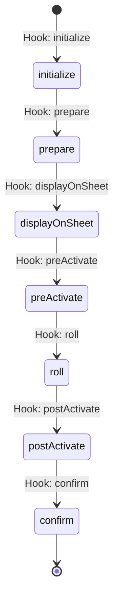

**Hooks disponibles** :

1. **initialize** - Initialisation de l'action
2. **prepare** - Préparation avant usage
3. **preActivate** - Juste avant activation
4. **roll** - Pendant les jets de dés
5. **postActivate** - Après activation
6. **confirm** - Confirmation finale

### Gestion des Outcomes

**Structure** : `CrucibleActionOutcome`

```javascript
{
  target: CrucibleActor,
  self: boolean,
  usage: ActionUsage,
  rolls: AttackRoll[],
  resources: {
    health: -10,
    focus: -2
  },
  actorUpdates: {},
  metadata: {},
  effects: ActiveEffect[],
  summons: ActionSummonConfiguration[],
  weakened: boolean,
  broken: boolean,
  incapacitated: boolean,
  criticalSuccess: boolean,
  criticalFailure: boolean,
  statusText: []
}
```

### Annulation d'action

Le système supporte l'annulation via `confirm({reverse: true})` :

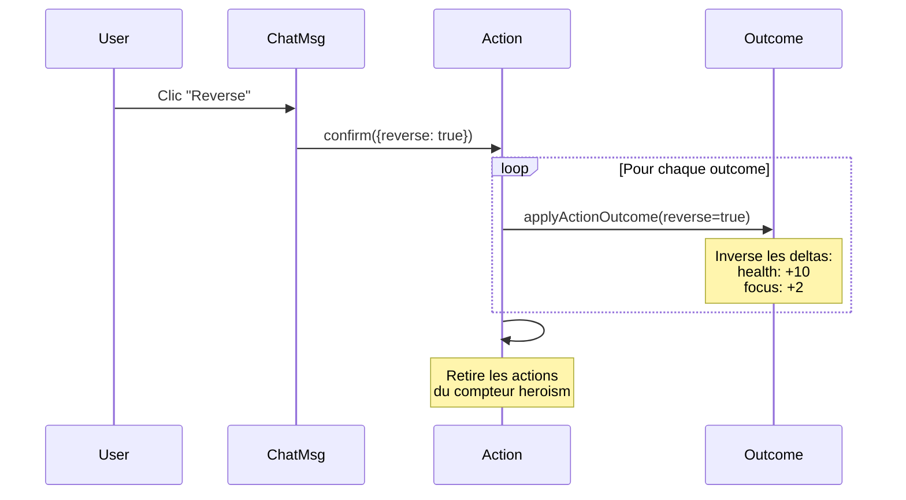

### Source

`module/models/action.mjs`

---

## Workflow Combat

### Vue d'ensemble

Le système de combat suit le tracker de Foundry mais ajoute des mécaniques spécifiques Crucible.

### Diagramme de flux

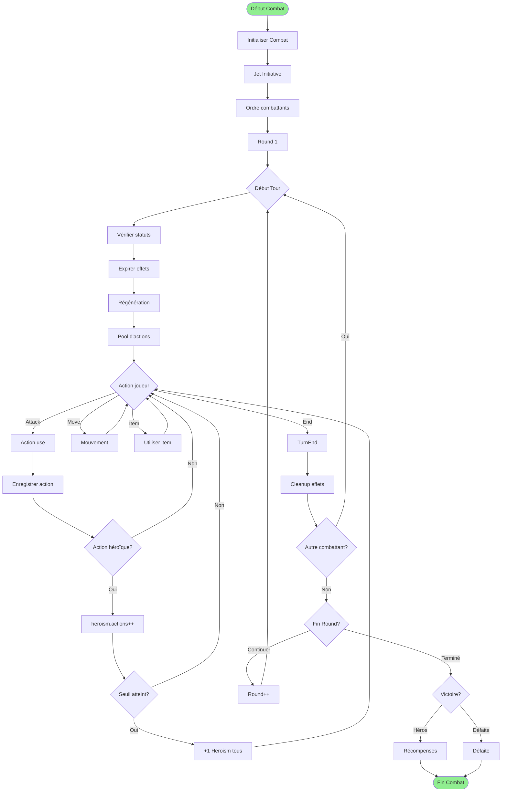

### Séquence Round

```mermaid
sequenceDiagram
    participant Combat
    participant Combatant
    participant Actor
    participant Action

    Note over Combat: Début Round
    Combat->>Combat: Round++
    Combat->>Combat: heroism.previous = heroism.next

    loop Pour chaque Combatant (ordre initiative)
        Combat->>Combatant: Activer tour
        Combatant->>Actor: turnStart()

        Note over Actor: Turn Start Workflow
        Actor->>Actor: Expirer effets (duration)
        Actor->>Actor: Régénérer ressources
        Actor->>Actor: Restaurer action pool
        Actor->>Actor: Appliquer effets continus

        Note over Combatant: Actions du tour
        loop Tant que actions disponibles
            Actor->>Action: use()
            Action-->>Actor: outcomes

            alt Action coûte action points
                Actor->>Combat: Incrémenter heroism.actions
                Combat->>Combat: Check threshold

                alt Threshold atteint
                    Combat->>Combat: heroism.awarded++
                    loop Tous les héros
                        Combat->>Actor: alterResources({heroism: +1})
                    end
                end
            end
        end

        Combatant->>Actor: turnEnd()
        Note over Actor: Turn End Workflow
        Actor->>Actor: Appliquer dégâts continus
        Actor->>Actor: Décrémenter durées effets
        Actor->>Actor: Vérifier conditions de défaite
    end

    Note over Combat: Fin Round
    Combat->>Combat: Vérifier conditions victoire
```

### Système Heroism

Le système Heroism récompense les actions héroïques en combat.

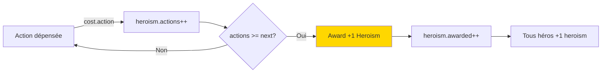

**Calcul du seuil** :

```javascript
heroism.next = heroism.previous + 2 * numHeroes
```

### Turn Start Workflow

**Ordre des opérations** :

1. Expirer effets à durée échue
2. Régénérer focus (base regen)
3. Restaurer action points (defenses.action.max)
4. Appliquer effets continus (damage, healing)
5. Vérifier statuts (stunned, etc.)
6. Décrémenter cooldowns

### Turn End Workflow

**Ordre des opérations** :

1. Appliquer dégâts continus (poison, burn, etc.)
2. Décrémenter durées effets
3. Vérifier broken/incapacitated
4. Cleanup effets expirés
5. Sauvegarder état

### Source

- `module/models/combat-combat.mjs`
- `module/documents/combat.mjs`
- `module/documents/actor.mjs` (turnStart, turnEnd)

---

## Workflow Spellcasting

### Vue d'ensemble

Le spellcasting utilise un système de construction dynamique : Gesture + Rune + Inflections.

### Diagramme de flux

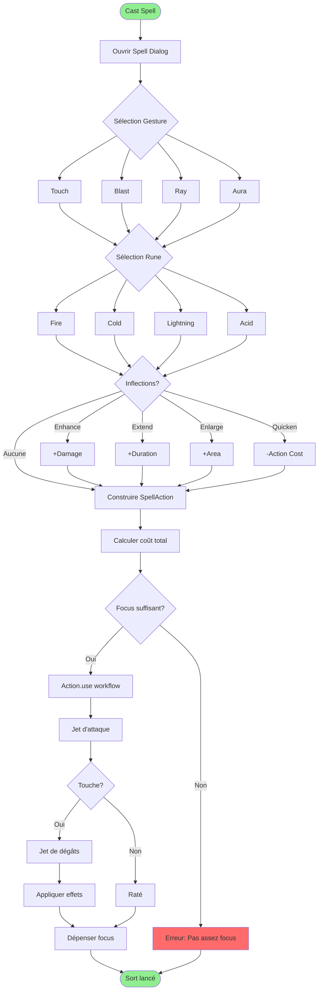

### Séquence détaillée

```mermaid
sequenceDiagram
    participant Actor
    participant SpellAction
    participant Gesture
    participant Rune
    participant Inflection
    participant Action

    Actor->>SpellAction: use()
    SpellAction->>SpellAction: Ouvrir dialog

    Note over SpellAction: Sélection composants
    User->>SpellAction: Choisir gesture
    SpellAction->>Gesture: Charger gesture data
    Gesture-->>SpellAction: {cost, range, target}

    User->>SpellAction: Choisir rune
    SpellAction->>Rune: Charger rune data
    Rune-->>SpellAction: {element, effects, damage}

    User->>SpellAction: Choisir inflections
    loop Pour chaque inflection
        SpellAction->>Inflection: Charger inflection data
        Inflection-->>SpellAction: {modifiers, cost}
    end

    Note over SpellAction: Construction
    SpellAction->>SpellAction: _prepareData()
    SpellAction->>SpellAction: Merger gesture + rune
    SpellAction->>SpellAction: Appliquer inflections

    Note over SpellAction: Calcul final
    SpellAction->>SpellAction: cost.focus = base + inflections
    SpellAction->>SpellAction: damage = rune + enhance
    SpellAction->>SpellAction: range = gesture + extend
    SpellAction->>SpellAction: area = gesture + enlarge

    SpellAction->>Actor: Vérifier focus
    alt Focus insuffisant
        Actor-->>SpellAction: Error
    else Focus OK
        SpellAction->>Action: Super.use()
        Note over Action: Workflow Action standard
        Action-->>Actor: outcomes
        Actor->>Actor: Dépenser focus
    end
```

### Construction du Sort

**Formule** :

```javascript
SpellAction = Gesture + Rune + Inflections[]

// Exemple : Fireball
const fireball = {
  gesture: "blast",        // Area damage
  rune: "fire",           // Fire damage
  inflections: [
    "enhance",            // +1d6 damage
    "enlarge"            // +5ft radius
  ]
}

// Résultat
{
  cost: {
    action: 3,
    focus: 4            // 2 (blast) + 1 (enhance) + 1 (enlarge)
  },
  target: {
    type: "area",
    size: 15             // 10 (base) + 5 (enlarge)
  },
  damage: "3d6 + 1d6"    // 3d6 (rune) + 1d6 (enhance)
}
```

### Gestures

| ID    | Name  | Type    | Cost     | Range | Target    |
| ----- | ----- | ------- | -------- | ----- | --------- |
| touch | Touch | Single  | 2 action | Touch | Single    |
| blast | Blast | Area    | 3 action | 30ft  | Area 10ft |
| ray   | Ray   | Line    | 3 action | 60ft  | Line 60ft |
| aura  | Aura  | Self    | 2 action | Self  | Aura 10ft |
| wall  | Wall  | Barrier | 3 action | 60ft  | Wall 20ft |
| zone  | Zone  | Terrain | 4 action | 120ft | Area 20ft |

### Runes

| ID        | Element   | Damage Type | Effects  |
| --------- | --------- | ----------- | -------- |
| fire      | Fire      | Fire        | Burning  |
| cold      | Cold      | Cold        | Slowed   |
| lightning | Lightning | Electricity | Stunned  |
| acid      | Acid      | Acid        | Corrode  |
| poison    | Poison    | Poison      | Poisoned |
| force     | Force     | Force       | Push     |
| radiant   | Radiant   | Radiant     | Blinded  |
| necrotic  | Necrotic  | Necrotic    | Weakened |

### Inflections

| ID      | Effect             | Cost Modifier |
| ------- | ------------------ | ------------- |
| enhance | +1d6 damage        | +1 focus      |
| extend  | +1 round duration  | +1 focus      |
| enlarge | +5ft area/range    | +1 focus      |
| quicken | -1 action cost     | +2 focus      |
| empower | Reroll 1s          | +1 focus      |
| persist | +2 rounds duration | +2 focus      |

### Source

- `module/models/spell-action.mjs`
- `module/models/spellcraft-gesture.mjs`
- `module/models/spellcraft-rune.mjs`
- `module/models/spellcraft-inflection.mjs`

---

## Workflow Progression

### Vue d'ensemble

Le système de progression gère les montées de niveau et l'allocation de points.

### Diagramme de flux

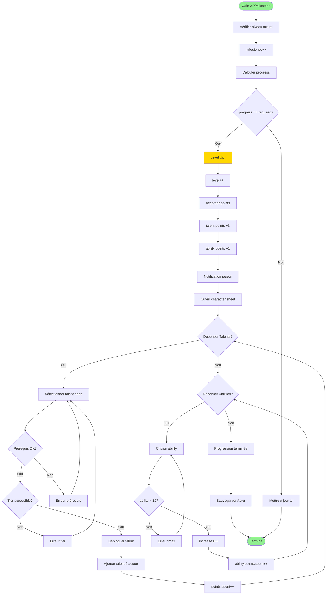

### Séquence détaillée

```mermaid
sequenceDiagram
    participant GM
    participant Actor
    participant Sheet
    participant TalentTree
    participant Points

    Note over GM,Actor: Gain Milestone
    GM->>Actor: alterResources({milestones: +1})
    Actor->>Actor: advancement.milestones++
    Actor->>Actor: prepareBaseData()

    Note over Actor: Calcul progression
    Actor->>Actor: progress = milestones - level.start
    Actor->>Actor: required = level.required
    Actor->>Actor: pct = progress / required * 100

    alt progress >= required
        Actor->>Actor: Level Up!
        Actor->>Actor: advancement.level++
        Actor->>Points: talent.total += 3
        Actor->>Points: ability.total += 1
        Actor->>Actor: prepareBaseData() // Recalc

        Note over Actor: Mise à jour dérivée
        Actor->>Actor: defenses recalc
        Actor->>Actor: resources.max recalc

        Actor->>Sheet: render(force=true)
        Sheet-->>User: Notification level up
    end

    Note over User: Dépenser Talent Points
    User->>Sheet: Ouvrir Talent Tree
    Sheet->>TalentTree: render()

    User->>TalentTree: Clic sur node
    TalentTree->>TalentTree: Vérifier prérequis

    alt Prérequis non rempli
        TalentTree-->>User: Error: Parent requis
    else Tier trop élevé
        TalentTree-->>User: Error: Tier inaccessible
    else Points insuffisants
        TalentTree-->>User: Error: Pas assez de points
    else OK
        TalentTree->>Actor: advancement.talentNodes.add(nodeId)
        TalentTree->>Actor: Créer embedded talent item
        Actor->>Points: talent.spent++
        Actor->>Points: talent.available--
        Actor->>Actor: prepareBaseData()
        TalentTree->>TalentTree: render()
    end

    Note over User: Dépenser Ability Points
    User->>Sheet: Clic +1 ability
    Sheet->>Actor: abilities[x].increases++
    Actor->>Points: ability.spent++
    Actor->>Points: ability.available--
    Actor->>Actor: prepareBaseData()
    Sheet->>Sheet: render()
```

### Calcul des Points

**Talent Points** :

```javascript
total = 3 + (level - 1) * 3
// Niveau 1: 3 points
// Niveau 2: 6 points
// Niveau 10: 30 points
```

**Ability Points** :

```javascript
total = level - 1
// Niveau 1: 0 points (création uniquement)
// Niveau 2: 1 point
// Niveau 10: 9 points
```

### Talent Tree Tiers

| Tier | Level Required | Node Cost |
| ---- | -------------- | --------- |
| 1    | 1+             | 1 point   |
| 2    | 5+             | 1 point   |
| 3    | 10+            | 1 point   |
| 4    | 15+            | 1 point   |

**Contraintes** :

- Un talent de tier N nécessite un parent de tier N-1
- Maximum 1 talent par node
- Certains talents ont des prérequis spécifiques

### Source

- `module/models/actor-hero.mjs` (#prepareAdvancement)
- `module/canvas/tree/talent-tree.mjs`
- `module/canvas/tree/talent-hud.mjs`

---

## Workflow Repos

### Vue d'ensemble

Le système de repos restaure les ressources et soigne les blessures.

### Types de repos

#### Short Rest (Repos Court)

**Durée** : 1 heure (in-game)

**Effets** :

- Restaure 50% focus
- Restaure 50% action
- Aucune restauration health/wounds

#### Long Rest (Repos Long)

**Durée** : 8 heures (in-game)

**Effets** :

- Restaure 100% focus
- Restaure 100% action
- Restaure 100% health
- Réduit wounds de 1d4 (jet de récupération)
- Supprime certains effets temporaires

### Diagramme de flux

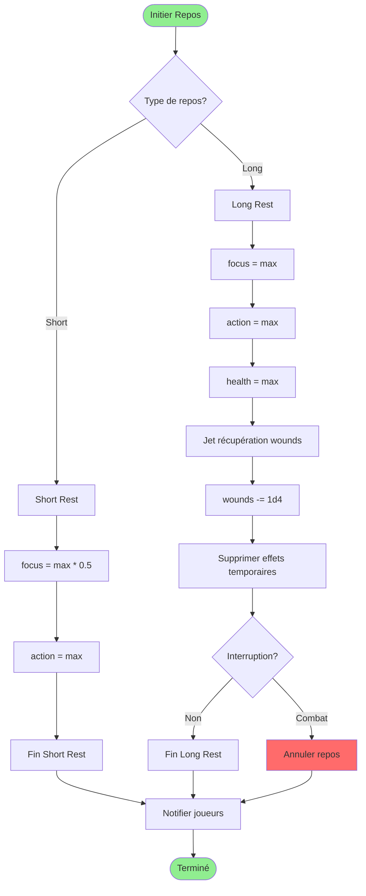

### Séquence détaillée

```mermaid
sequenceDiagram
    participant User
    participant Actor
    participant Dialog
    participant Recovery
    participant Effects

    User->>Actor: Initier repos
    Actor->>Dialog: Afficher choix repos

    alt Short Rest
        Dialog-->>Actor: Type = short
        Actor->>Actor: resources.focus += max * 0.5
        Actor->>Actor: resources.action = max
        Actor->>Actor: Hooks.call("crucible.actorRest", "short")
    else Long Rest
        Dialog-->>Actor: Type = long

        Note over Actor: Restauration complète
        Actor->>Actor: resources.focus = max
        Actor->>Actor: resources.action = max
        Actor->>Actor: resources.health = max

        Note over Actor: Récupération wounds
        Actor->>Recovery: Roll 1d4
        Recovery-->>Actor: result
        Actor->>Actor: wounds.value -= result
        Actor->>Actor: wounds.value = max(0, value)

        Note over Actor: Cleanup effets
        Actor->>Effects: getActiveEffects()
        loop Pour chaque effet
            alt duration.type === "temporary"
                Actor->>Effects: delete(effect)
            end
        end

        Actor->>Actor: Hooks.call("crucible.actorRest", "long")
    end

    Actor->>Actor: update(resources)
    Actor-->>User: Notification repos terminé
```

### Interruption de repos

**Conditions d'interruption** :

- Entrer en combat
- Subir des dégâts
- Utiliser une action (hors mouvement minimal)

```javascript
// Hook sur début combat
Hooks.on('combatStart', (combat) => {
  if (actor.isResting) {
    actor.cancelRest()
    ui.notifications.warn('Repos interrompu!')
  }
})
```

### Source

`module/documents/actor.mjs` (rest, shortRest, longRest)

---

## Workflow Inventaire

### Vue d'ensemble

Gestion de l'équipement, encombrement et équipement/déséquipement.

### Diagramme de flux

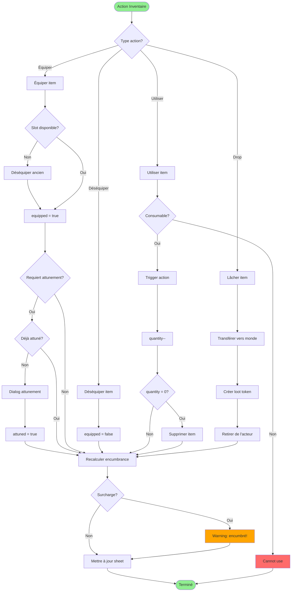

### Calcul Encumbrance

```javascript
// Capacité de charge
capacity.max = abilities.str.value * 10

// Poids total
capacity.value = items.filter((i) => i.type === 'physical').reduce((sum, i) => sum + i.system.weight * i.system.quantity, 0)

// Statuts
if (capacity.value > capacity.max) {
  status = 'overloaded' // -2 DEX, -10ft speed
} else if (capacity.value > capacity.max * 0.75) {
  status = 'encumbered' // -1 DEX, -5ft speed
} else {
  status = 'normal'
}
```

### Équipement par slot

| Slot      | Type           | Limit |
| --------- | -------------- | ----- |
| mainHand  | Weapon, Shield | 1     |
| offHand   | Weapon, Shield | 1     |
| armor     | Armor          | 1     |
| accessory | Accessory      | 3     |

**Règles** :

- Arme à 2 mains occupe mainHand + offHand
- Bouclier compte comme offHand
- Maximum 3 accessoires équipés

### Source

`module/documents/actor.mjs` (equipItem, unequipItem, useItem)

---

## Workflow Compendium

### Vue d'ensemble

Gestion du contenu via compendia YAML et compilation vers LevelDB.

### Diagramme de flux

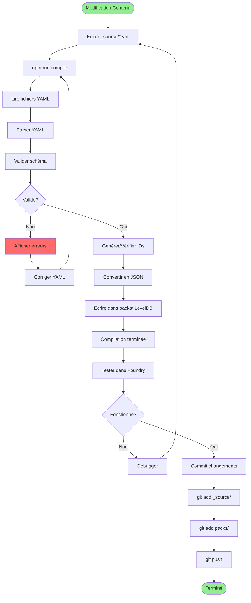

### Commandes NPM

```bash
# Extraire packs → YAML (pour édition)
npm run extract

# Compiler YAML → packs (pour Foundry)
npm run compile

# Build complet (compile + rollup + less)
npm run build
```

### Structure YAML

**Exemple** : Talent

```yaml
name: 'Power Strike'
type: talent
_id: powerStrike00000
system:
  category:
    primary: warfare
    secondary: melee
  node:
    id: powerStrike
    tier: 1
    parent: null
    coordinate:
      x: 100
      y: 200
  actions:
    - id: powerStrike
      name: 'Power Strike'
      cost:
        action: 3
        focus: 2
      tags:
        - attack
        - melee
        - damage
      effects:
        - name: 'Extra Damage'
          statuses: []
          scope: 1
```

### Processus de compilation

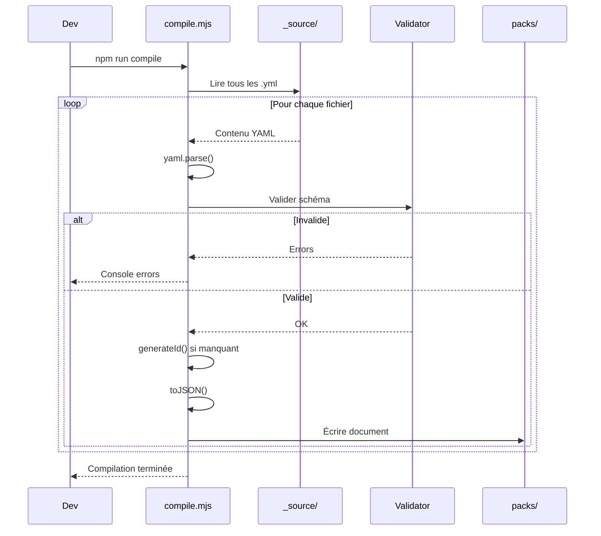

### Génération d'ID

```javascript
function generateId(name, length = 16) {
  // Crée un ID stable basé sur le nom
  // Exemple: "Power Strike" → "powerStrike00000"
  const slug = name
    .toLowerCase()
    .replace(/\s+/g, '')
    .replace(/[^a-z0-9]/g, '')

  const padding = '0'.repeat(Math.max(0, length - slug.length))
  return slug + padding
}
```

### Source

- `build.mjs` - Script de compilation
- `_source/` - Source YAML
- `packs/` - Compendia compilés LevelDB

---

## Résumé des Workflows

| Workflow           | Complexité | Fichiers Clés                       | User Facing |
| ------------------ | ---------- | ----------------------------------- | ----------- |
| Création Héros     | Haute      | hero-creation-sheet.mjs             | ✅ Oui      |
| Utilisation Action | Très Haute | action.mjs, action-use-dialog.mjs   | ✅ Oui      |
| Combat             | Haute      | combat.mjs, actor.mjs               | ✅ Oui      |
| Spellcasting       | Haute      | spell-action.mjs, spellcraft-\*.mjs | ✅ Oui      |
| Progression        | Moyenne    | actor-hero.mjs, talent-tree.mjs     | ✅ Oui      |
| Repos              | Basse      | actor.mjs (rest methods)            | ✅ Oui      |
| Inventaire         | Moyenne    | actor.mjs (equipItem, etc.)         | ✅ Oui      |
| Compendium         | Moyenne    | build.mjs                           | ❌ Dev only |

---

## Références

- **Foundry VTT Workflow Docs** : <https://foundryvtt.com/article/documents/>
- **ApplicationV2 Guide** : <https://foundryvtt.com/article/applicationv2/>
