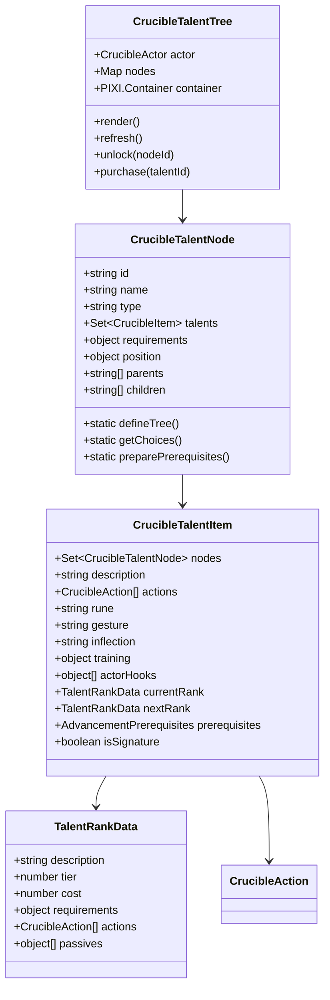
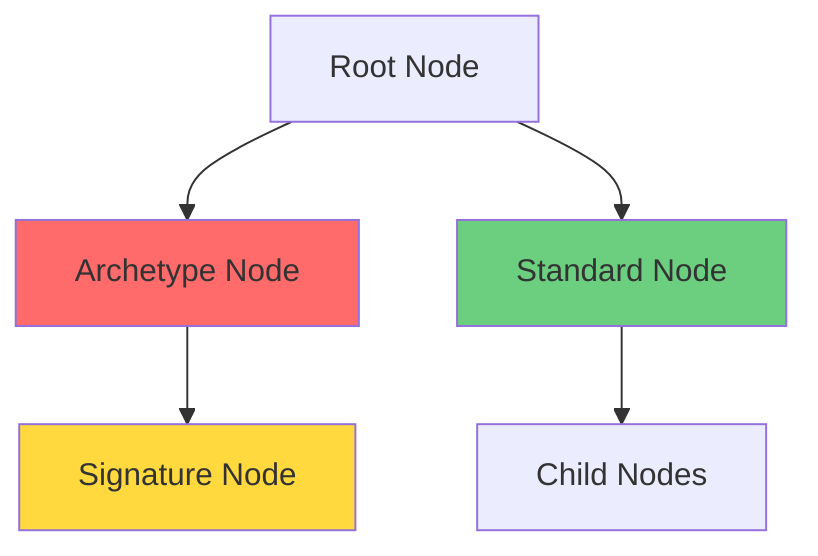
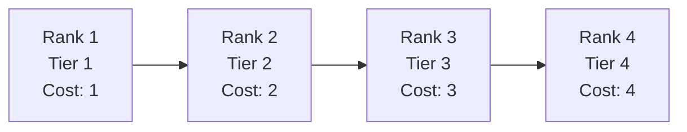
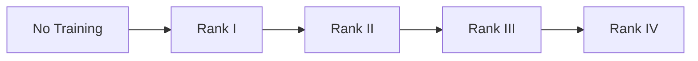

# Système de Talents - Crucible

## Vue d'Ensemble

Le système de talents de Crucible est organisé en un arbre de talents interconnectés. Les personnages progressent en débloquant des nœuds de talents et en achetant des rangs dans les talents associés.

## Architecture

### Composants Principaux



## Arbre de Talents

### Structure CrucibleTalentNode

Les nœuds de l'arbre de talents sont définis dans `module/config/talent-node.mjs` :

```javascript
class CrucibleTalentNode {
  constructor(
    id,
    {
      name, // Nom du nœud
      type, // Type: archetype, signature, standard
      parents = [], // IDs des nœuds parents
      children = [], // IDs des nœuds enfants
      requirements = {}, // Prérequis pour débloquer
      position = {}, // Position x,y dans l'arbre
    },
  ) {
    this.id = id
    this.name = name
    this.type = type
    this.parents = parents
    this.children = children
    this.requirements = requirements
    this.position = position
    this.talents = new Set() // Talents associés
  }
}
```

### Types de Nœuds



#### Types Disponibles

1. **archetype** : Nœuds de départ liés à un archétype
2. **signature** : Talents signatures puissants
3. **standard** : Nœuds de talents standards

### Définition de l'Arbre

L'arbre de talents est défini statiquement via `defineTree()` :

```javascript
static defineTree() {
  // Effacer les nœuds existants
  CrucibleTalentNode.nodes.clear();

  // Définir les nœuds
  for (const [id, config] of Object.entries(SYSTEM.TALENT.TREE)) {
    new CrucibleTalentNode(id, config);
  }

  // Établir les connexions parent-enfant
  for (const node of CrucibleTalentNode.nodes.values()) {
    for (const parentId of node.parents) {
      const parent = CrucibleTalentNode.nodes.get(parentId);
      if (parent && !parent.children.includes(node.id)) {
        parent.children.push(node.id);
      }
    }
  }
}
```

### Prérequis (Prerequisites)

#### Structure

```javascript
const prerequisites = {
  level: {
    value: 5,
    label: 'Level',
    tag: 'Level 5',
    met: false,
  },
  archetype: {
    value: 'warrior',
    label: 'Archetype',
    tag: 'Warrior',
    met: false,
  },
  training: {
    weapons: {
      value: 2,
      label: 'Weapon Training',
      tag: 'Weapon Training II',
      met: false,
    },
  },
}
```

#### Types de Prérequis

1. **level** : Niveau minimum du personnage
2. **archetype** : Archétype requis
3. **training** : Rang de formation requis (weapons, armor, magic)
4. **node** : Nœuds de talents débloqués

#### Calcul des Prérequis

```javascript
static preparePrerequisites(requirements) {
  const prerequisites = {};

  // Level
  if (requirements.level) {
    prerequisites.level = {
      value: requirements.level,
      label: "CRUCIBLE.ADVANCEMENT.Level",
      tag: `Level ${requirements.level}`
    };
  }

  // Archetype
  if (requirements.archetype) {
    prerequisites.archetype = {
      value: requirements.archetype,
      label: "CRUCIBLE.ADVANCEMENT.Archetype",
      tag: game.i18n.localize(SYSTEM.ARCHETYPE[requirements.archetype])
    };
  }

  // Training
  if (requirements.training) {
    prerequisites.training = {};
    for (const [type, rank] of Object.entries(requirements.training)) {
      prerequisites.training[type] = {
        value: rank,
        label: `CRUCIBLE.TRAINING.${type}`,
        tag: `${game.i18n.localize(type)} ${rank}`
      };
    }
  }

  return prerequisites;
}
```

## Item Talent

### Schéma de Données

```javascript
static defineSchema() {
  return {
    nodes: new SetField(
      new StringField({choices: () => CrucibleTalentNode.getChoices()})
    ),
    description: new HTMLField(),
    actions: new ArrayField(new EmbeddedDataField(CrucibleAction)),

    // Spellcraft components
    rune: new StringField({choices: SYSTEM.SPELL.RUNES}),
    gesture: new StringField({choices: SYSTEM.SPELL.GESTURES}),
    inflection: new StringField({choices: SYSTEM.SPELL.INFLECTIONS}),

    // Iconic spells
    iconicSpells: new NumberField({initial: 0, min: 0}),

    // Training
    training: new SchemaField({
      type: new StringField({choices: SYSTEM.TALENT.TRAINING_TYPES}),
      rank: new NumberField({min: 1, max: 4})
    }),

    // Actor hooks
    actorHooks: new ArrayField(new SchemaField({
      hook: new StringField({choices: SYSTEM.ACTOR.HOOKS}),
      fn: new JavaScriptField({async: true, gmOnly: true})
    }))
  }
}
```

### Rangs de Talent

Chaque talent peut avoir plusieurs rangs représentant la progression :



#### Structure TalentRankData

```javascript
{
  description: string,      // Description du rang
  tier: number,            // Tier (1-4)
  cost: number,            // Coût en points de talent
  requirements: object,    // Prérequis spécifiques
  actions: CrucibleAction[], // Actions débloquées
  passives: object[]       // Effets passifs
}
```

### Initialisation des Talents

#### Enregistrement dans l'Arbre

```javascript
initializeTree() {
  const talent = this.parent;

  // Vérifier que le talent a des nœuds
  if (!this.nodes.size) {
    throw new Error(`Talent "${talent.name}" has no valid tree nodes.`);
  }

  // Enregistrer le talent sur ses nœuds
  for (const node of this.nodes) {
    node.talents.add(talent);
  }

  // Mettre à jour les métadonnées de spellcraft
  if (this.rune) {
    SYSTEM.SPELL.RUNES[this.rune].img = talent.img;
  }
  if (this.gesture) {
    SYSTEM.SPELL.GESTURES[this.gesture].img = talent.img;
  }
  if (this.inflection) {
    SYSTEM.SPELL.INFLECTIONS[this.inflection].img = talent.img;
  }
}
```

## Formation (Training)

### Types de Formation

```javascript
TRAINING_TYPES = {
  weapons: 'Weapon Training',
  armor: 'Armor Training',
  magic: 'Magic Training',
}
```

### Rangs de Formation

Chaque type peut avoir 4 rangs de maîtrise :



#### Effets par Rang

**Weapon Training** :

- Rank I : Armes simples
- Rank II : Armes de guerre
- Rank III : Bonus +1 aux attaques
- Rank IV : Bonus +2 aux attaques

**Armor Training** :

- Rank I : Armures légères
- Rank II : Armures intermédiaires
- Rank III : Armures lourdes
- Rank IV : Réduction pénalités d'armure

**Magic Training** :

- Rank I : Sorts de niveau 1
- Rank II : Sorts de niveau 2
- Rank III : Sorts de niveau 3
- Rank IV : Sorts de niveau 4

## Progression des Talents

### Points de Talent

Les personnages gagnent des points de talent en progressant :

```javascript
points.talent = {
  total: 3 + effectiveLevel * 3, // 3 + 3 par niveau
  spent: 0, // Points dépensés
  available: 0, // Points disponibles
}
```

### Acheter un Talent

```mermaid
sequenceDiagram
    participant Player
    participant UI as Talent Tree UI
    participant Actor
    participant Item as Talent Item

    Player->>UI: Click on talent
    UI->>Actor: Check prerequisites

    alt Prerequisites Not Met
        Actor-->>Player: Error: Prerequisites not met
    end

    alt Not Enough Points
        Actor-->>Player: Error: Not enough talent points
    end

    UI->>Item: Create/Update talent item
    Item->>Actor: Add to actor
    Actor->>Actor: Spend talent points
    Actor->>Actor: Apply talent effects
    Actor-->>UI: Refresh tree
    UI-->>Player: Update display
```

### Vérification des Prérequis

```javascript
async canPurchaseTalent(talent, rank = 1) {
  const prerequisites = talent.system.prerequisites;

  // Vérifier le niveau
  if (prerequisites.level && this.advancement.level < prerequisites.level.value) {
    return {can: false, reason: "Level too low"};
  }

  // Vérifier l'archétype
  if (prerequisites.archetype && this.archetype !== prerequisites.archetype.value) {
    return {can: false, reason: "Wrong archetype"};
  }

  // Vérifier la formation
  if (prerequisites.training) {
    for (const [type, req] of Object.entries(prerequisites.training)) {
      const current = this.system.training[type] || 0;
      if (current < req.value) {
        return {can: false, reason: `${type} training too low`};
      }
    }
  }

  // Vérifier les points disponibles
  const cost = talent.system.currentRank?.cost || 1;
  if (this.points.talent.available < cost) {
    return {can: false, reason: "Not enough talent points"};
  }

  return {can: true};
}
```

## Hooks d'Acteur

Les talents peuvent enregistrer des hooks sur l'acteur pour modifier son comportement :

### Types de Hooks

```javascript
ACTOR_HOOKS = {
  prepareBaseData: 'Prepare Base Data',
  prepareDerivedData: 'Prepare Derived Data',
  preRoll: 'Before Roll',
  postRoll: 'After Roll',
  preDamage: 'Before Damage',
  postDamage: 'After Damage',
  preRest: 'Before Rest',
  postRest: 'After Rest',
}
```

### Exemple de Hook

```javascript
actorHooks: [
  {
    hook: 'prepareDerivedData',
    fn: async function () {
      // 'this' est l'acteur
      this.system.defenses.parry.bonus += 2
    },
  },
  {
    hook: 'preRoll',
    fn: async function (roll) {
      // Ajouter un bonus aux jets d'attaque
      if (roll.type === 'attack') {
        roll.bonuses.attack += 1
      }
    },
  },
]
```

## Interface Canvas

### CrucibleTalentTree

Composant PIXI.Container pour afficher l'arbre de talents :

```javascript
class CrucibleTalentTree extends PIXI.Container {
  constructor(actor) {
    super()
    this.actor = actor
    this.nodes = new Map()
  }

  async render() {
    // Nettoyer l'arbre existant
    this.removeChildren()

    // Créer les nœuds
    for (const [id, node] of CrucibleTalentNode.nodes) {
      const nodeSprite = new CrucibleTalentTreeNode(node, this.actor)
      this.nodes.set(id, nodeSprite)
      this.addChild(nodeSprite)
    }

    // Dessiner les connexions
    this.#drawConnections()
  }

  #drawConnections() {
    const graphics = new PIXI.Graphics()

    for (const node of this.nodes.values()) {
      for (const childId of node.data.children) {
        const child = this.nodes.get(childId)
        if (!child) continue

        // Dessiner une ligne entre parent et enfant
        graphics.lineStyle(2, node.unlocked ? 0x00ff00 : 0x666666)
        graphics.moveTo(node.x, node.y)
        graphics.lineTo(child.x, child.y)
      }
    }

    this.addChildAt(graphics, 0)
  }
}
```

### États de Nœud

```javascript
class CrucibleTalentNodeStates extends Map {
  /**
   * États possibles d'un nœud
   */
  static STATES = {
    LOCKED: 0, // Verrouillé (prérequis non satisfaits)
    AVAILABLE: 1, // Disponible (prérequis satisfaits)
    UNLOCKED: 2, // Débloqué (au moins un talent acheté)
    MASTERED: 3, // Maîtrisé (tous les talents au max)
  }

  getState(nodeId) {
    const node = CrucibleTalentNode.nodes.get(nodeId)
    const talents = Array.from(node.talents)

    // Vérifier si tous les talents sont maîtrisés
    if (talents.every((t) => this.actor.items.has(t.id) && t.system.currentRank.tier === 4)) {
      return CrucibleTalentNodeStates.STATES.MASTERED
    }

    // Vérifier si au moins un talent est débloqué
    if (talents.some((t) => this.actor.items.has(t.id))) {
      return CrucibleTalentNodeStates.STATES.UNLOCKED
    }

    // Vérifier les prérequis
    const prereqsMet = this.#checkPrerequisites(node)
    return prereqsMet ? CrucibleTalentNodeStates.STATES.AVAILABLE : CrucibleTalentNodeStates.STATES.LOCKED
  }
}
```

## Talents Signature

Les talents signature sont des talents puissants et uniques :

### Caractéristiques

- Type de nœud : `signature`
- Généralement un seul par archétype
- Coût plus élevé
- Effets très puissants
- Prérequis stricts

### Exemple

```javascript
{
  id: "berserkerRage",
  name: "Berserker Rage",
  nodes: ["warrior_signature"],
  description: "Enter a powerful rage...",
  actions: [{
    id: "rage",
    name: "Rage",
    type: "utility",
    cost: {action: 1, focus: 0},
    target: {type: "self"},
    effects: [{
      name: "Rage",
      statuses: ["enraged"],
      duration: {rounds: 5}
    }]
  }],
  training: {
    type: "weapons",
    rank: 3
  }
}
```

## Spellcraft via Talents

Les talents peuvent débloquer des composants de spellcraft :

### Runes

```javascript
{
  rune: "fire",  // Débloque la rune de feu
  iconicSpells: 1 // Permet d'apprendre 1 sort iconique de feu
}
```

### Gestures

```javascript
{
  gesture: 'cone' // Débloque le geste cone
}
```

### Inflections

```javascript
{
  inflection: 'damage' // Débloque l'inflection de dégâts
}
```

## Gestion des Talents dans l'Acteur

### Stockage

Les talents sont stockés comme items dans l'acteur :

```javascript
// Récupérer tous les talents
const talents = actor.items.filter((i) => i.type === 'talent')

// Récupérer un talent spécifique
const talent = actor.items.getName('Power Strike')

// Vérifier la possession d'un talent
const hasTalent = actor.items.some((i) => i.type === 'talent' && i.system.nodes.has('warrior_01'))
```

### Synchronisation

Méthode pour synchroniser les talents avec les compendia :

```javascript
async syncTalents() {
  const updates = [];

  for (const talent of this.items.filter(i => i.type === "talent")) {
    // Trouver la version du compendium
    const compendiumTalent = await fromUuid(
      `Compendium.crucible.talent.Item.${talent.id}`
    );

    if (!compendiumTalent) continue;

    // Vérifier si une mise à jour est nécessaire
    if (talent.system.actions.length !== compendiumTalent.system.actions.length) {
      updates.push({
        _id: talent.id,
        system: compendiumTalent.system.toObject()
      });
    }
  }

  if (updates.length) {
    await this.updateEmbeddedDocuments("Item", updates);
  }
}
```

## Effets Passifs

Les talents peuvent fournir des effets passifs :

### Structure

```javascript
passives: [
  {
    type: 'bonus',
    target: 'defenses.parry',
    value: 2,
    condition: 'wielding shield',
  },
  {
    type: 'resistance',
    damageType: 'fire',
    value: 5,
  },
]
```

### Application

```javascript
_prepareDerivedData() {
  // Appliquer les effets passifs des talents
  for (const talent of this.items.filter(i => i.type === "talent")) {
    const rank = talent.system.currentRank;
    if (!rank?.passives) continue;

    for (const passive of rank.passives) {
      this.#applyPassiveEffect(passive);
    }
  }
}

#applyPassiveEffect(passive) {
  switch (passive.type) {
    case "bonus":
      const current = foundry.utils.getProperty(this, passive.target);
      foundry.utils.setProperty(this, passive.target, current + passive.value);
      break;

    case "resistance":
      this.resistances[passive.damageType] ||= 0;
      this.resistances[passive.damageType] += passive.value;
      break;
  }
}
```

## Bonnes Pratiques

### 1. Toujours Initialiser l'Arbre

```javascript
// Au chargement du système
CrucibleTalentNode.defineTree()
```

### 2. Vérifier les Prérequis

```javascript
const { can, reason } = await actor.canPurchaseTalent(talent)
if (!can) {
  ui.notifications.warn(reason)
  return
}
```

### 3. Synchroniser les Talents

```javascript
// Après une mise à jour du système
await actor.syncTalents()
```

### 4. Utiliser les Hooks

```javascript
// Hook pour modifications post-achat
Hooks.on('createItem', (item, options, userId) => {
  if (item.type === 'talent' && item.isOwned) {
    // Logique personnalisée
  }
})
```

## Références

- **Fichiers sources** :
  - `module/config/talent-node.mjs` - Nœuds d'arbre
  - `module/config/talents.mjs` - Configuration des talents
  - `module/models/item-talent.mjs` - Modèle de données
  - `module/canvas/tree/talent-tree.mjs` - Interface canvas
  - `module/applications/sheets/item-talent-sheet.mjs` - Feuille de talent
