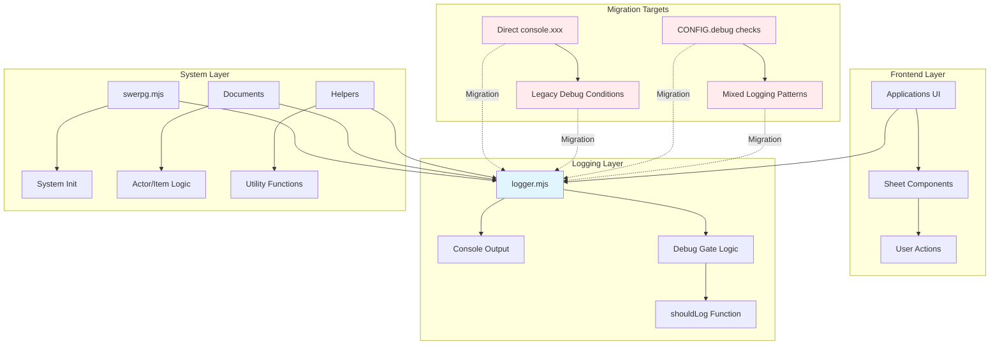
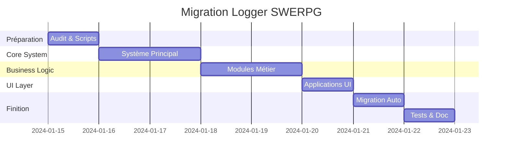

# Plan d'Implémentation : Migration vers Logger Centralisé SWERPG

## Objectif

Migration complète de tous les appels `console.xxx` directs vers l'utilisation du logger centralisé pour homogénéiser la codebase selon les règles du coding style SWERPG. Cette migration permettra un contrôle unifié du logging et une meilleure expérience de debug pour les développeurs.

## Exigences

### Exigences Fonctionnelles

- **REQ-001** : Remplacer tous les appels `console.log`, `console.warn`, `console.error`, `console.info`, `console.debug` par leurs équivalents logger
- **REQ-002** : Maintenir la cohérence des niveaux de logging (debug → debug, info → info, etc.)
- **REQ-003** : Préserver tous les messages existants avec préfixe "SWERPG ||"
- **REQ-004** : Conserver les conditions `CONFIG.debug.xxx` existantes en les adaptant au logger
- **REQ-005** : Assurer la compatibilité avec le mode développement détecté automatiquement

### Exigences Non-Fonctionnelles

- **NFR-001** : Aucun impact sur les performances du système
- **NFR-002** : Migration transparente sans changement d'interface utilisateur
- **NFR-003** : Tests de régression complets pour valider le comportement
- **NFR-004** : Conformité stricte au coding style SWERPG

## Considérations Techniques

### Aperçu de l'Architecture Système



### Sélection de la Stack Technique

- **Logger Existant** : `module/utils/logger.mjs` déjà implémenté et testé
- **API complète** : debug, info, warn, error, log + méthodes avancées (group, table, time, etc.)
- **Contrôle centralisé** : `setDebug()`, `isDebugEnabled()`, configuration par défaut basée sur le mode développement
- **Compatibilité** : Foundry VTT v13+, ES2022 modules

### Architecture de Déploiement

- **Migration par phases** : Traitement par groupes de fichiers logiques
- **Tests automatisés** : Validation continue avec Vitest
- **Scripts d'automatisation** : Utilisation de sed pour la migration de masse
- **Rollback possible** : Git pour revenir en arrière si nécessaire

### Considérations de Scalabilité

- **Impact minimal** : Migration technique sans changement fonctionnel
- **Performance** : Logger optimisé avec gate de debug pour éviter les évaluations inutiles
- **Maintenance** : Code plus homogène et facile à maintenir

### Schéma de Conception Base de Données

*Non applicable - cette migration ne concerne que le code JavaScript.*

### Conception API

#### Interface Logger Actuelle

```typescript
interface SwerpgLogger {
  // Control methods
  enableDebug(): void
  disableDebug(): void
  setDebug(value: boolean): void
  isDebugEnabled(): boolean
  
  // Basic logging methods
  log(...args: any[]): void
  info(...args: any[]): void
  warn(...args: any[]): void
  error(...args: any[]): void
  debug(...args: any[]): void
  
  // Advanced logging methods
  group(...args: any[]): void
  groupCollapsed(...args: any[]): void
  groupEnd(): void
  table(...args: any[]): void
  time(label: string): void
  timeEnd(label: string): void
  trace(...args: any[]): void
  assert(condition: boolean, ...args: any[]): void
}
```

#### Stratégies de Migration par Pattern

##### Pattern 1 : Appels console directs

```javascript
// AVANT
console.log('Message informationnel')
console.warn('Avertissement')  
console.error('Erreur critique')

// APRÈS
import { logger } from '../utils/logger.mjs'
logger.info('Message informationnel')
logger.warn('Avertissement')
logger.error('Erreur critique')
```

##### Pattern 2 : Conditions CONFIG.debug

```javascript
// AVANT
if (CONFIG.debug?.sheets) {
  console.debug('Debug sheet')
}

// APRÈS
import { logger } from '../utils/logger.mjs'
logger.debug('Debug sheet')
```

##### Pattern 3 : Conditions développement spécifiques

```javascript
// AVANT
if (CONFIG.debug.flanking) this._visualizeEngagement()

// APRÈS
import { logger } from '../utils/logger.mjs'
if (logger.isDebugEnabled()) this._visualizeEngagement()
```

### Architecture Frontend

#### Structure des Composants

Aucun changement requis au niveau des composants UI. La migration est transparente pour l'interface utilisateur.

#### Gestion d'État

- **État du logger** : Contrôlé par `detectDevelopmentMode()` au démarrage
- **Configuration runtime** : Possible via console de développeur
- **Persistance** : Pas de persistance requise, basé sur la détection automatique

### Sécurité et Performance

#### Sécurité

- **Pas d'exposition de données sensibles** : Maintien des niveaux de logging appropriés
- **Contrôle d'accès** : Logging debug uniquement en mode développement
- **Validation** : Pas de validation requise, migration technique

#### Performance

- **Optimisation debug gate** : Évaluation lazy des arguments de logging
- **Impact minimal** : Remplacement 1:1 des appels existants
- **Métriques** : Pas de dégradation de performance attendue

## Phases d'Implémentation

### Phase 1 : Préparation et Audit (Durée : 1 jour)

#### Tâches Critiques Phase 1

- **TASK-1.1** : Audit complet des fichiers contenant des `console.xxx`
- **TASK-1.2** : Classification des patterns de logging existants
- **TASK-1.3** : Validation du logger existant et de ses tests
- **TASK-1.4** : Préparation des scripts de migration automatisée

#### Critères d'Acceptation Phase 1

- Inventaire complet des 50+ occurrences de `console.xxx`
- Documentation des patterns identifiés
- Scripts sed validés sur fichiers de test
- Tests du logger existant passent à 100%

### Phase 2 : Migration du Système Principal (Durée : 2 jours)

#### Tâches Critiques Phase 2

- **TASK-2.1** : Migration `swerpg.mjs` (messages d'initialisation système)
- **TASK-2.2** : Migration `module/config/system.mjs` (configuration système)
- **TASK-2.3** : Migration des documents core (`actor.mjs`, `item.mjs`, `actor-origin.mjs`)
- **TASK-2.4** : Tests de régression système principal

#### Critères d'Acceptation Phase 2

- Tous les appels `console.xxx` remplacés par `logger.xxx`
- Messages d'initialisation conservent leur visibilité
- Fonctionnalités des documents inchangées
- Tests de régression passent

### Phase 3 : Migration des Modules Métier (Durée : 2 jours)

#### Tâches Critiques Phase 3

- **TASK-3.1** : Migration `module/lib/talents/` (logique talents)
- **TASK-3.2** : Migration `module/config/talent-tree.mjs` (configuration arbres)
- **TASK-3.3** : Migration modules importer (`oggDude.mjs` et sous-modules)
- **TASK-3.4** : Migration helpers et utilitaires

#### Critères d'Acceptation Phase 3

- Logique métier préservée intégralement
- Debug des talents fonctionne avec le logger
- Import OggDude logs correctement
- Helpers maintiennent leur comportement

### Phase 4 : Migration des Applications UI (Durée : 1 jour)

#### Tâches Critiques Phase 4

- **TASK-4.1** : Migration des sheets et applications
- **TASK-4.2** : Migration des helpers serveur
- **TASK-4.3** : Migration des composants canvas
- **TASK-4.4** : Validation interface utilisateur

#### Critères d'Acceptation Phase 4

- Sheets affichent les mêmes informations debug
- Applications conservent leur comportement
- Canvas et token flanking fonctionnent
- Aucun changement visible utilisateur

### Phase 5 : Migration Automatisée et Finition (Durée : 1 jour)

#### Tâches Critiques Phase 5

- **TASK-5.1** : Script de migration automatisée pour fichiers restants
- **TASK-5.2** : Validation complète de la migration
- **TASK-5.3** : Tests de régression exhaustifs
- **TASK-5.4** : Documentation et cleanup

#### Critères d'Acceptation Phase 5

- Aucun `console.xxx` direct restant (hors logger.mjs et tests)
- Tous les tests passent
- Performance maintenue
- Documentation mise à jour

## Plan de Tests

### Tests Unitaires

```javascript
describe('Logger Migration Validation', () => {
  test('should have no direct console calls in system files', async () => {
    const systemFiles = await glob('module/**/*.mjs', { ignore: ['**/logger.mjs', '**/tests/**'] })
    
    for (const file of systemFiles) {
      const content = await fs.readFile(file, 'utf8')
      expect(content).not.toMatch(/console\.(log|warn|error|info|debug)/)
    }
  })
  
  test('should import logger in files with logging', async () => {
    const systemFiles = await glob('module/**/*.mjs', { ignore: ['**/logger.mjs'] })
    
    for (const file of systemFiles) {
      const content = await fs.readFile(file, 'utf8')
      if (content.match(/logger\.(log|warn|error|info|debug)/)) {
        expect(content).toMatch(/import.*logger.*from.*logger\.mjs/)
      }
    }
  })
})
```

### Tests d'Intégration

- **Integration-1** : Démarrage système avec logger activé/désactivé
- **Integration-2** : Fonctionnement talents avec debug logger
- **Integration-3** : Import OggDude avec logging approprié
- **Integration-4** : Sheets avec debug contextuel

### Tests de Régression

- **Regression-1** : Toutes les fonctionnalités système inchangées
- **Regression-2** : Performance identique ou améliorée
- **Regression-3** : Messages debug cohérents et utiles
- **Regression-4** : Mode développement détecté correctement

## Scripts d'Automatisation

### Script de Migration de Masse

```bash
#!/bin/bash
# migrate-console-to-logger.sh

MODULES_DIR="module"
EXCLUDE_PATTERN="logger.mjs|tests/"

echo "🔄 Migration console.xxx vers logger..."

# Find all .mjs files except logger and tests
find "$MODULES_DIR" -name "*.mjs" | grep -Ev "$EXCLUDE_PATTERN" | while read -r file; do
  echo "Processing: $file"
  
  # Add logger import if not present and file has console calls
  if grep -q "console\.\(log\|warn\|error\|info\|debug\)" "$file" && ! grep -q "import.*logger" "$file"; then
    # Determine relative path to logger
    depth=$(echo "$file" | tr -cd '/' | wc -c)
    depth=$((depth - 1))  # Remove one for module/ prefix
    logger_path=$(printf "%*s" $depth | tr ' ' '.')
    logger_path="${logger_path}../utils/logger.mjs"
    
    # Add import after existing imports
    sed -i '' "/^import.*from/a\\
import { logger } from '$logger_path'
" "$file"
  fi
  
  # Replace console calls
  sed -i '' -e 's/console\.debug(/logger.debug(/g' \
            -e 's/console\.log(/logger.info(/g' \
            -e 's/console\.info(/logger.info(/g' \
            -e 's/console\.warn(/logger.warn(/g' \
            -e 's/console\.error(/logger.error(/g' "$file"
done

echo "✅ Migration terminée"
```

### Script de Validation

```bash
#!/bin/bash
# validate-migration.sh

echo "🔍 Validation de la migration..."

# Check for remaining console calls
remaining=$(find module -name "*.mjs" | grep -v "logger.mjs\|tests/" | xargs grep -l "console\.\(log\|warn\|error\|info\|debug\)" | wc -l)

if [ "$remaining" -gt 0 ]; then
  echo "❌ Migration incomplète. Fichiers restants:"
  find module -name "*.mjs" | grep -v "logger.mjs\|tests/" | xargs grep -l "console\.\(log\|warn\|error\|info\|debug\)"
  exit 1
else
  echo "✅ Migration complète"
fi

# Run tests
echo "🧪 Exécution des tests..."
npm test

echo "✅ Validation terminée"
```

## Risques et Mitigation

### Risques Identifiés

| Risque | Probabilité | Impact | Mitigation |
|--------|-------------|---------|------------|
| Régression fonctionnelle | Faible | Élevé | Tests de régression exhaustifs + rollback Git |
| Performance dégradée | Très faible | Moyen | Profiling avant/après + optimisation logger |
| Messages debug perdus | Faible | Faible | Validation manuelle des logs critiques |
| Import paths incorrects | Moyen | Moyen | Script d'import automatique + validation |

### Plan de Rollback

1. **Git revert** : Rollback complet via Git si problème majeur
2. **Rollback partiel** : Restauration par phase si problème spécifique
3. **Validation rapide** : Tests automatisés pour validation post-rollback

## Planning et Ressources

### Timeline Détaillé



### Ressources Requises

- **1 Développeur Senior** : 7 jours (architecture + migration complexe)
- **Outils** : Git, sed, grep, npm/vitest pour tests
- **Infrastructure** : Environnement de développement local

## Métriques de Succès

### Métriques Techniques

- **Zero console.xxx** : Aucun appel direct hors logger.mjs et tests
- **100% test coverage** : Tous les tests existants passent
- **Performance maintenue** : Pas de dégradation > 5%
- **Import consistency** : Tous les imports logger corrects

### Métriques Qualité

- **Code consistency** : Conformité coding style SWERPG à 100%
- **Debug experience** : Messages debug cohérents et utiles
- **Developer experience** : Logger centralisé facile à utiliser
- **Maintenance** : Code plus facile à maintenir et débugger

## Conclusion

Cette migration vers le logger centralisé est essentielle pour homogénéiser la codebase SWERPG selon les standards définis. Elle améliore la maintenabilité, la cohérence des messages de debug, et prépare le système pour une meilleure expérience de développement future.

La migration est technique et transparente pour les utilisateurs finaux, avec un risque faible et un impact positif sur la qualité du code. Le planning de 7 jours permet une migration méthodique et complète avec tests de validation appropriés.
