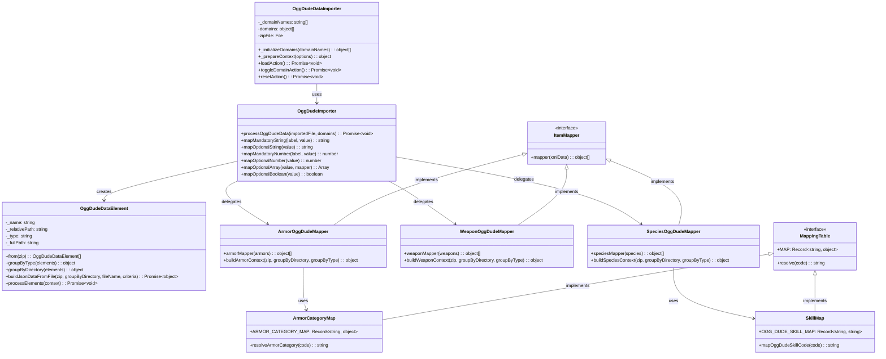
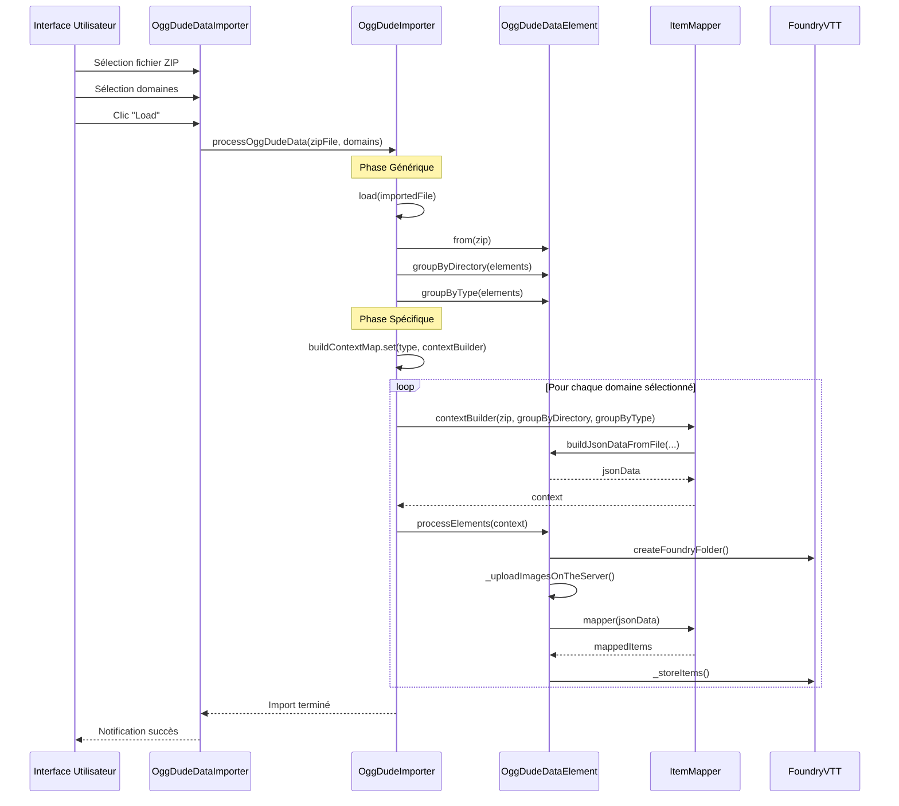
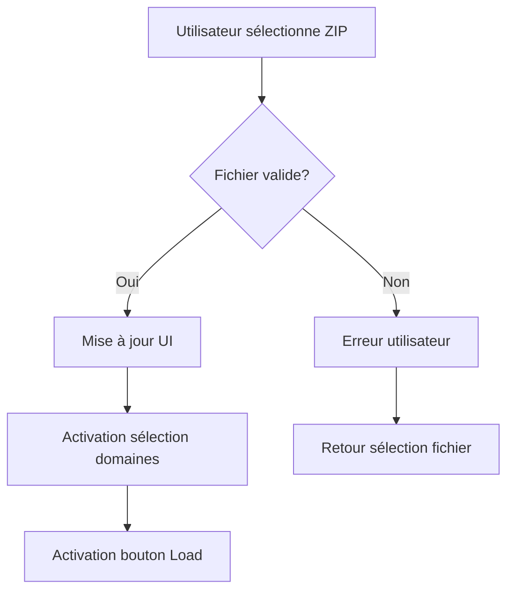
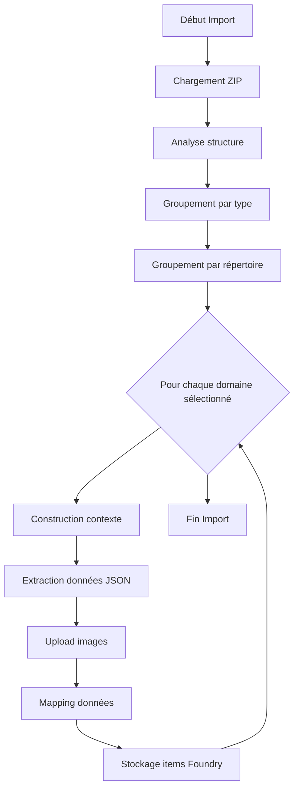
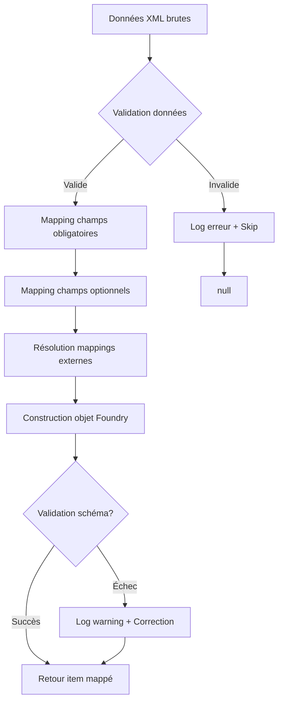

# Architecture d'Import OggDude - Plan d'Implémentation


Ce document présente l'architecture d'import OggDude pour le système Foundry VTT SWERPG et identifie le statut
d'implémentation de chaque composant.

## 1. Requirements & Constraints

- **REQ-001**: Le système DOIT permettre l'import sélectif de domaines OggDude (weapon, armor, gear, species, career)
- **REQ-002**: Le système DOIT suivre les patterns architecturaux établis (Strategy, Builder, Registry, Template Method)
- **REQ-003**: Le système DOIT valider les données et gérer les erreurs gracieusement
- **REQ-004**: Le système DOIT fournir une observabilité complète (logs, statistiques, métriques)
- **SEC-001**: Le système DOIT valider tous les chemins de fichier pour prévenir les attaques de traversée
- **CON-001**: Le système DOIT rester compatible avec Foundry VTT v13
- **PAT-001**: Chaque nouveau type d'item DOIT suivre le pattern de mapping établi pour maintenir la cohérence

## 2. Implementation Steps

### Implementation Phase 1 - Architecture de Base (✅ COMPLETED)

- GOAL-001: Implémenter l'infrastructure de base pour l'import OggDude

| Task     | Description                                                                   | Completed | Date       |
| -------- | ----------------------------------------------------------------------------- | --------- | ---------- |
| TASK-001 | Créer OggDudeDataImporter (interface utilisateur)                             | ✅        | 2025-11-13 |
| TASK-002 | Créer OggDudeImporter (orchestrateur principal)                               | ✅        | 2025-11-13 |
| TASK-003 | Créer OggDudeDataElement (modèle de données ZIP)                              | ✅        | 2025-11-13 |
| TASK-004 | Implémenter le template Handlebars pour l'interface                           | ✅        | 2025-11-13 |
| TASK-005 | Implémenter les méthodes utilitaires de mapping (mapOptional*, mapMandatory*) | ✅        | 2025-11-13 |

### Implementation Phase 2 - Mappers Core Items (✅ COMPLETED)

- GOAL-002: Implémenter les mappers pour les types d'objets principaux

| Task     | Description                                    | Completed | Date       |
| -------- | ---------------------------------------------- | --------- | ---------- |
| TASK-006 | Créer ArmorMapper avec buildArmorContext()     | ✅        | 2025-11-13 |
| TASK-007 | Créer WeaponMapper avec buildWeaponContext()   | ✅        | 2025-11-13 |
| TASK-008 | Créer GearMapper avec buildGearContext()       | ✅        | 2025-11-13 |
| TASK-009 | Créer SpeciesMapper avec buildSpeciesContext() | ✅        | 2025-11-13 |
| TASK-010 | Créer CareerMapper avec buildCareerContext()   | ✅        | 2025-11-13 |

### Implementation Phase 3 - Tables de Mapping (✅ COMPLETED)

- GOAL-003: Implémenter les tables de correspondance OggDude vers système

| Task     | Description                                                          | Completed | Date       |
| -------- | -------------------------------------------------------------------- | --------- | ---------- |
| TASK-011 | Créer oggdude-skill-map.mjs avec mapOggDudeSkillCode()               | ✅        | 2025-11-13 |
| TASK-012 | Créer oggdude-armor-category-map.mjs avec resolveArmorCategory()     | ✅        | 2025-11-13 |
| TASK-013 | Créer oggdude-armor-property-map.mjs avec resolveArmorProperties()   | ✅        | 2025-11-13 |
| TASK-014 | Créer oggdude-weapon-\*.mjs (skill, quality, range, hands)           | ✅        | 2025-11-13 |
| TASK-015 | Créer oggdude-career-skill-map.mjs avec mapCareerOggDudeSkillCodes() | ✅        | 2025-11-13 |

### Implementation Phase 4 - Registry et Orchestration (✅ COMPLETED)

- GOAL-004: Implémenter le système de registre et l'orchestration des imports

| Task     | Description                                               | Completed | Date       |
| -------- | --------------------------------------------------------- | --------- | ---------- |
| TASK-016 | Implémenter buildContextMap registry dans OggDudeImporter | ✅        | 2025-11-13 |
| TASK-017 | Intégrer tous les mappers dans le processus d'import      | ✅        | 2025-11-13 |
| TASK-018 | Implémenter la sélection de domaines dans l'interface     | ✅        | 2025-11-13 |
| TASK-019 | Implémenter la validation et gestion d'erreurs            | ✅        | 2025-11-13 |

### Implementation Phase 5 - Localisation et Interface (✅ COMPLETED)

- GOAL-005: Finaliser l'interface utilisateur et la localisation

| Task     | Description                                                                       | Completed | Date       |
| -------- | --------------------------------------------------------------------------------- | --------- | ---------- |
| TASK-020 | Ajouter les libellés de localisation en anglais (lang/en.json)                    | ✅        | 2025-11-13 |
| TASK-021 | Implémenter la gestion des états UI (boutons, sélections)                         | ✅        | 2025-11-13 |
| TASK-022 | Implémenter les actions utilisateur (loadAction, toggleDomainAction, resetAction) | ✅        | 2025-11-13 |

### Implementation Phase 6 - Observabilité et Utilitaires (🔄 IN PROGRESS)

- GOAL-006: Implémenter l'observabilité complète et les utilitaires de diagnostic

| Task     | Description                                             | Completed | Date       |
| -------- | ------------------------------------------------------- | --------- | ---------- |
| TASK-023 | Créer armor-import-utils.mjs avec getArmorImportStats() | ✅        | 2025-11-13 |
| TASK-024 | Implémenter les statistiques d'import pour weapons      |           |            |
| TASK-025 | Implémenter les statistiques d'import pour gear         |           |            |
| TASK-026 | Implémenter les statistiques d'import pour species      |           |            |
| TASK-027 | Implémenter les statistiques d'import pour careers      |           |            |
| TASK-028 | Créer un système de métriques globales d'import         |           |            |

### Implementation Phase 7 - Tests et Validation (🔄 IN PROGRESS)

- GOAL-007: Assurer la couverture de tests complète de l'architecture d'import

| Task     | Description                                                   | Completed | Date       |
| -------- | ------------------------------------------------------------- | --------- | ---------- |
| TASK-029 | Créer tests d'intégration species-import.integration.spec.mjs | ✅        | 2025-11-13 |
| TASK-030 | Créer tests d'intégration career-import.integration.spec.mjs  | ✅        | 2025-11-13 |
| TASK-031 | Créer tests unitaires pour OggDudeDataImporter                |           |            |
| TASK-032 | Créer tests unitaires pour OggDudeImporter                    |           |            |
| TASK-033 | Créer tests unitaires pour OggDudeDataElement                 |           |            |
| TASK-034 | Créer tests d'intégration pour armor-import                   |           |            |
| TASK-035 | Créer tests d'intégration pour weapon-import                  |           |            |
| TASK-036 | Créer tests d'intégration pour gear-import                    |           |            |

### Implementation Phase 8 - Documentation et Guides (🔄 IN PROGRESS)

- GOAL-008: Finaliser la documentation et les guides d'extension

| Task     | Description                                              | Completed | Date       |
| -------- | -------------------------------------------------------- | --------- | ---------- |
| TASK-037 | Créer documentation architecture complète                | ✅        | 2025-11-13 |
| TASK-038 | Créer guide d'implémentation pour nouveaux types         | ✅        | 2025-11-13 |
| TASK-039 | Créer documentation des patterns utilisés                | ✅        | 2025-11-13 |
| TASK-040 | Créer DOCUMENTATION_PROCESS.md                           | ✅        | 2025-11-13 |
| TASK-041 | Créer exemples pratiques d'extension                     |           |            |
| TASK-042 | Valider les guides avec implémentation d'un type exemple |           |            |

### Implementation Phase 9 - Améliorations et Optimisations (📋 PLANNED)

- GOAL-009: Implémenter les améliorations d'expérience utilisateur et performance

| Task     | Description                                          | Completed | Date |
| -------- | ---------------------------------------------------- | --------- | ---- |
| TASK-043 | Implémenter prévisualisation avant import (REQ-006)  |           |      |
| TASK-044 | Implémenter indicateurs de progression               |           |      |
| TASK-045 | Optimiser performance pour gros fichiers (streaming) |           |      |
| TASK-046 | Implémenter traitement parallèle des domaines        |           |      |
| TASK-047 | Ajouter cache pour résolutions de mapping            |           |      |
| TASK-048 | Implémenter retry automatique sur erreurs transients |           |      |

## 3. Alternatives

- **ALT-001**: Import direct sans interface graphique (ligne de commande) - Rejeté pour privilégier l'UX
- **ALT-002**: Processing synchrone au lieu d'asynchrone - Rejeté pour éviter le blocage UI
- **ALT-003**: Mappers monolithiques au lieu du pattern Strategy - Rejeté pour maintenir la maintenabilité

## 4. Dependencies

- **DEP-001**: Foundry VTT v13 API (ApplicationV2, HandlebarsApplicationMixin)
- **DEP-002**: JSZip pour traitement des archives ZIP OggDude
- **DEP-003**: xml2js pour parsing XML vers JSON
- **DEP-004**: Système de logging Swerpg (module/utils/logger.mjs)
- **DEP-005**: Utilitaires de répertoires (module/settings/directories.mjs)

## 5. Files

- **FILE-001**: `module/settings/OggDudeDataImporter.mjs` - Interface principale (✅ IMPLEMENTED)
- **FILE-002**: `module/importer/oggDude.mjs` - Orchestrateur principal (✅ IMPLEMENTED)
- **FILE-003**: `module/settings/models/OggDudeDataElement.mjs` - Modèle de données (✅ IMPLEMENTED)
- **FILE-004**: `templates/settings/oggDudeDataImporter.hbs` - Template interface (✅ IMPLEMENTED)
- **FILE-005**: `module/importer/items/*.mjs` - Mappers par type (✅ IMPLEMENTED)
- **FILE-006**: `module/importer/mappings/*.mjs` - Tables de mapping (✅ IMPLEMENTED)
- **FILE-007**: `module/importer/utils/*.mjs` - Utilitaires observabilité (✅ MÉTRIQUES & AGRÉGATEUR)
- **FILE-008**: `lang/*.json` - Fichiers de localisation (✅ EN & FR étendus import)
- **FILE-009**: `tests/importer/*.spec.mjs` - Tests d'intégration (🔄 PARTIAL)
- **FILE-010**: `documentation/swerpg/architecture/oggdude/*.md` - Documentation (✅ IMPLEMENTED)

## 6. Testing

- **TEST-001**: Tests d'intégration pour chaque mapper (species ✅, career ✅, autres ❌)
- **TEST-002**: Tests unitaires pour utilitaires de mapping (✅ import-stats-utils.spec.mjs)
- **TEST-003**: Tests d'interface pour OggDudeDataImporter (❌ MISSING)
- **TEST-004**: Tests de performance pour gros fichiers ZIP (❌ MISSING)
- **TEST-005**: Tests de sécurité pour validation chemins (❌ MISSING)

## 7. Risks & Assumptions

- **RISK-001**: Changements de format XML OggDude dans futures versions
- **RISK-002**: Limitations mémoire avec très gros fichiers ZIP
- **RISK-003**: Compatibilité avec futures versions Foundry VTT
- **ASSUMPTION-001**: Structure XML OggDude reste stable
- **ASSUMPTION-002**: Utilisateurs ont accès à des données OggDude valides
- **ASSUMPTION-003**: Performance acceptable avec fichiers < 50MB

## 8. Related Specifications / Further Reading

- [Plan de Refactoring Armor Mapper](../../plan/refactor-armor-oggdude-mapper.md)
- [Plan de Refactoring Gear Mapper](../../plan/refactor-gear-oggdude-mapper.md)
- [Plan de Refactoring Weapon Mapper](../../plan/refactor-weapon-oggdude-mapper.md)
- [Fix Mapper Species OggDude](../../plan/features/fix-mapper-species-oggdude.md)
- [Import des Armures OggDude](../../importer/import-armor.md)
- [Import des Carrières OggDude](../../importer/import-career.md)
- [Import des Équipements OggDude](../../importer/import-gear.md)
- [Foundry DataModel API](https://foundryvtt.com/api/classes/foundry.abstract.TypeDataModel.html)
- [Logging Guidelines](../../../DEVELOPER_GUIDE_LOGGING.md)

## 9. OggDude Data Types Reference

Cette section documente tous les types de données disponibles dans les fichiers OggDude d'intégration, classés par
catégorie et niveau d'implémentation.

### Core Game Objects (Objets de Jeu Principaux)

#### Equipment & Gear (✅ IMPLEMENTED)

| Type            | File                  | Description                            | Status         | Priority |
| --------------- | --------------------- | -------------------------------------- | -------------- | -------- |
| Armor           | `Armor.xml`           | Armures et équipements de protection   | ✅ IMPLEMENTED | HIGH     |
| Weapons         | `Weapons.xml`         | Armes de toutes catégories             | ✅ IMPLEMENTED | HIGH     |
| Gear            | `Gear.xml`            | Équipements généraux et outils         | ✅ IMPLEMENTED | HIGH     |
| ItemAttachments | `ItemAttachments.xml` | Attachements et modifications d'objets | 📋 PLANNED     | MEDIUM   |
| ItemDescriptors | `ItemDescriptors.xml` | Descripteurs et propriétés d'objets    | 📋 PLANNED     | LOW      |

#### Characters & Species (✅ IMPLEMENTED)

| Type            | File/Directory          | Description                                     | Status         | Priority |
| --------------- | ----------------------- | ----------------------------------------------- | -------------- | -------- |
| Species         | `Species/*.xml`         | 100+ espèces jouables (Human, Twi'lek, etc.)    | ✅ IMPLEMENTED | HIGH     |
| Careers         | `Careers/*.xml`         | 20 carrières de base (Ace, Bounty Hunter, etc.) | ✅ IMPLEMENTED | HIGH     |
| Specializations | `Specializations/*.xml` | 100+ spécialisations (Pilot, Assassin, etc.)    | 📋 PLANNED     | HIGH     |

### Force & Abilities (🔄 IN PROGRESS)

## Schéma des Statistiques & Métriques (Observabilité)

### Statistiques par Domaine

Chaque fonction `get<Domain>ImportStats()` retourne:

````json
{
  total: number,
  rejected: number,
  imported: number,
  // total - rejected
  unknown<Aspect>: number,
  // ex: unknownSkills, unknownProperties
  <aspect>Details: string[] // ex: skillDetails
}
```json
{
"total": "number",
"rejected": "number",
"imported": "number", // total - rejected
"unknown<Aspect>": "number", // ex: unknownSkills, unknownProperties
"<aspect>Details": ["string"] // ex: skillDetails
}
Spécificités par domaine: Armor ajoute unknownCategories, unknownProperties & rejectionReasons interne.

### Métriques Globales

`aggregateImportMetrics()` retourne: ```json
{
overallDurationMs: number,
domainsCount: number,
errorRate: number, // totalRejected / totalProcessed
archiveSizeBytes: number,
itemsPerSecond: number, // totalImported / (overallDurationMs/1000)
domains: { [domain: string]: {
durationMs: number
}
},
totalProcessed: number,
totalRejected: number,
totalImported: number
}
````

### Instrumentation Runtime

Dans `OggDudeImporter.processOggDudeData`:

- `markGlobalStart()` / `markGlobalEnd()`
- `recordDomainStart()` / `recordDomainEnd()` pour chaque domaine sélectionné
- `markArchiveSize(file.size)` pour la taille de l'archive

Exposées à l'UI via `_prepareContext()` => rendu tableau + métriques globales.

#### Force Powers & Abilities

| Type            | File/Directory        | Description                          | Status     | Priority |
| --------------- | --------------------- | ------------------------------------ | ---------- | -------- |
| Force Powers    | `Force Powers/*.xml`  | Pouvoirs de Force (Move, Heal, etc.) | 📋 PLANNED | HIGH     |
| Force Abilities | `Force Abilities.xml` | Capacités liées à la Force           | 📋 PLANNED | MEDIUM   |
| Talents         | `Talents.xml`         | Talents généraux (7000+ entrées)     | 📋 PLANNED | HIGH     |
| SigAbilities    | `SigAbilities/*.xml`  | Capacités de signature uniques       | 📋 PLANNED | LOW      |

### Character Development & Background

#### Background Elements

| Type                | File                      | Description                | Status     | Priority |
| ------------------- | ------------------------- | -------------------------- | ---------- | -------- |
| Obligations         | `Obligations.xml`         | Obligations de personnage  | 📋 PLANNED | MEDIUM   |
| Duty                | `Duty.xml`                | Devoirs et responsabilités | 📋 PLANNED | MEDIUM   |
| Moralities          | `Moralities.xml`          | Codes moraux et éthiques   | 📋 PLANNED | MEDIUM   |
| Motivations         | `Motivations.xml`         | Motivations générales      | 📋 PLANNED | LOW      |
| SpecificMotivations | `SpecificMotivations.xml` | Motivations spécifiques    | 📋 PLANNED | LOW      |

#### Social & Reputation

| Type        | File              | Description                | Status     | Priority |
| ----------- | ----------------- | -------------------------- | ---------- | -------- |
| Attitudes   | `Attitudes.xml`   | Attitudes comportementales | 📋 PLANNED | LOW      |
| Reputations | `Reputations.xml` | Systèmes de réputation     | 📋 PLANNED | LOW      |
| Hooks       | `Hooks.xml`       | Accroches narratives       | 📋 PLANNED | LOW      |
| Rewards     | `Rewards.xml`     | Récompenses et bénéfices   | 📋 PLANNED | LOW      |

### Game Mechanics & Rules

#### Core Systems

| Type            | File                  | Description                | Status     | Priority |
| --------------- | --------------------- | -------------------------- | ---------- | -------- |
| Skills          | `Skills.xml`          | Compétences du système     | 📋 PLANNED | HIGH     |
| Characteristics | `Characteristics.xml` | Caractéristiques primaires | 📋 PLANNED | HIGH     |
| Classes         | `Classes.xml`         | Classes de personnages     | 📋 PLANNED | MEDIUM   |

#### Crafting & Customization

| Type              | File                    | Description                  | Status     | Priority |
| ----------------- | ----------------------- | ---------------------------- | ---------- | -------- |
| CraftTemplates    | `CraftTemplates.xml`    | Modèles d'artisanat          | 📋 PLANNED | LOW      |
| CraftImprovements | `CraftImprovements.xml` | Améliorations d'artisanat    | 📋 PLANNED | LOW      |
| CraftDroidTraits  | `CraftDroidTraits.xml`  | Traits de droïdes artisanaux | 📋 PLANNED | LOW      |

### Vehicles & Transportation

#### Vehicle Systems

| Type         | File/Directory     | Description            | Status     | Priority |
| ------------ | ------------------ | ---------------------- | ---------- | -------- |
| Vehicles     | `Vehicles/*.xml`   | Véhicules et vaisseaux | 📋 PLANNED | MEDIUM   |
| VehActions   | `VehActions.xml`   | Actions véhiculaires   | 📋 PLANNED | MEDIUM   |
| VehPositions | `VehPositions.xml` | Positions d'équipage   | 📋 PLANNED | LOW      |

### Specialized Content

#### Inquisitor Content

| Type                | File                      | Description              | Status     | Priority |
| ------------------- | ------------------------- | ------------------------ | ---------- | -------- |
| InquisitorAbilities | `InquisitorAbilities.xml` | Capacités d'Inquisiteur  | 📋 PLANNED | LOW      |
| InquisitorEquipment | `InquisitorEquipment.xml` | Équipement d'Inquisiteur | 📋 PLANNED | LOW      |
| InquisitorPackages  | `InquisitorPackages.xml`  | Paquets d'Inquisiteur    | 📋 PLANNED | LOW      |
| InquisitorTalents   | `InquisitorTalents.xml`   | Talents d'Inquisiteur    | 📋 PLANNED | LOW      |

#### Advanced Systems

| Type             | File                   | Description           | Status     | Priority |
| ---------------- | ---------------------- | --------------------- | ---------- | -------- |
| BaseFoci         | `BaseFoci.xml`         | Foci de base          | 📋 PLANNED | LOW      |
| BaseOfOperations | `BaseOfOperations.xml` | Bases d'opérations    | 📋 PLANNED | LOW      |
| BaseUpgrades     | `BaseUpgrades.xml`     | Améliorations de base | 📋 PLANNED | LOW      |
| CoreSources      | `CoreSources.xml`      | Sources principales   | 📋 PLANNED | LOW      |

### Assets & Media

#### Image Assets

| Type               | Directory             | Description              | Status     | Priority |
| ------------------ | --------------------- | ------------------------ | ---------- | -------- |
| BaseImages         | `BaseImages/`         | Images de base système   | 📋 PLANNED | LOW      |
| EquipmentImages    | `EquipmentImages/`    | Images d'équipements     | 📋 PLANNED | MEDIUM   |
| SpeciesImages      | `SpeciesImages/`      | Portraits d'espèces      | 📋 PLANNED | MEDIUM   |
| VehicleImages      | `VehicleImages/`      | Images de véhicules      | 📋 PLANNED | LOW      |
| VehicleSilhouettes | `VehicleSilhouettes/` | Silhouettes de véhicules | 📋 PLANNED | LOW      |
| GroupEmblems       | `GroupEmblems/`       | Emblèmes de groupes      | 📋 PLANNED | LOW      |

### Implementation Priority Matrix

#### Phase 1: Core Items (✅ COMPLETED)

- **Armor, Weapons, Gear** - Objets essentiels du jeu
- **Species, Careers** - Éléments de création de personnage

#### Phase 2: Character Systems (📋 HIGH PRIORITY)

- **Skills, Characteristics** - Mécaniques de base
- **Talents** - Système de progression
- **Specializations** - Développement des carrières

#### Phase 3: Force Content (📋 HIGH PRIORITY)

- **Force Powers** - Pouvoirs de la Force
- **Force Abilities** - Capacités spécialisées

#### Phase 4: Background & Social (📋 MEDIUM PRIORITY)

- **Obligations, Duty, Moralities** - Éléments narratifs
- **ItemAttachments** - Modifications d'équipement

#### Phase 5: Vehicles & Advanced (📋 LOW PRIORITY)

- **Vehicles, VehActions** - Système véhiculaire
- **Crafting Systems** - Artisanat avancé

#### Phase 6: Specialized Content (📋 LOW PRIORITY)

- **Inquisitor Content** - Contenu spécialisé
- **Base Systems** - Systèmes avancés

### Data Volume Analysis

| Category                | Estimated Items | Complexity | Development Effort |
| ----------------------- | --------------- | ---------- | ------------------ |
| Equipment               | ~500 items      | Medium     | 2-3 sprints        |
| Species                 | ~100 species    | Medium     | 1-2 sprints        |
| Careers/Specializations | ~120 items      | High       | 3-4 sprints        |
| Talents                 | ~7000 talents   | High       | 4-6 sprints        |
| Force Powers            | ~20 powers      | High       | 2-3 sprints        |
| Vehicles                | ~200 vehicles   | Medium     | 2-3 sprints        |
| Background Elements     | ~300 items      | Low        | 1-2 sprints        |

### Extension Guidelines

Pour chaque nouveau type de données OggDude :

1. **Analyse du Format** : Examiner la structure XML du fichier source
2. **Mapping Schema** : Définir la correspondance vers les modèles Foundry
3. **Validation Rules** : Établir les règles de validation des données
4. **Test Coverage** : Créer les tests d'intégration appropriés
5. **Documentation** : Documenter le processus de mapping

---

### Documentation Technique Complète

#### Architecture Générale

##### Diagramme de Classes UML



### Diagramme de Séquence - Processus d'Import



## Exigences Fonctionnelles

### Exigences Must Have

- **REQ-001**: Le système DOIT permettre de sélectionner un fichier ZIP contenant les données OggDude
  - **Type**: Must
  - **Rationale**: Condition préalable à tout import de données
  - **Source**: `OggDudeDataImporter.mjs`, méthode `_onOggdudeZipFileChange`
  - **Priority**: Must have
  - **Category**: Usability

- **REQ-002**: Le système DOIT permettre de sélectionner les domaines d'import (weapon, armor, gear, species, career)
  - **Type**: Must
  - **Rationale**: Permet un import sélectif pour éviter la surcharge
  - **Source**: `OggDudeDataImporter.mjs`, propriété `_domainNames`
  - **Priority**: Must have
  - **Category**: Usability

- **REQ-003**: Le système DOIT valider la structure du fichier ZIP avant traitement
  - **Type**: Must
  - **Rationale**: Prévention d'erreurs lors du traitement
  - **Source**: `OggDudeDataElement.mjs`, méthode `from`
  - **Priority**: Must have
  - **Category**: Security

### Exigences Should Have

- **REQ-004**: Le système DEVRAIT fournir des statistiques d'import détaillées
  - **Type**: Should
  - **Rationale**: Observabilité et diagnostic des imports
  - **Source**: `armor-import-utils.mjs`, fonction `getArmorImportStats`
  - **Priority**: Should have
  - **Category**: Maintainability

- **REQ-005**: Le système DEVRAIT mapper automatiquement les compétences/propriétés OggDude vers le système
  - **Type**: Should
  - **Rationale**: Réduction des erreurs de mapping manuel
  - **Source**: `oggdude-skill-map.mjs`, `oggdude-armor-category-map.mjs`
  - **Priority**: Should have
  - **Category**: Performance

### Exigences Could Have

- **REQ-006**: Le système POURRAIT permettre la prévisualisation avant import
  - **Type**: Could
  - **Rationale**: Validation avant engagement
  - **Source**: Non implémenté actuellement
  - **Priority**: Could have
  - **Category**: Usability

## Exigences Non-Fonctionnelles

### Performance

- **NFR-001**: L'import d'un fichier ZIP de 50MB DOIT se terminer en moins de 2 minutes
  - **Type**: Must
  - **Rationale**: Expérience utilisateur acceptable
  - **Source**: Contrainte système globale
  - **Priority**: Must have
  - **Category**: Performance

### Sécurité

- **NFR-002**: Le système DOIT valider tous les chemins de fichier pour prévenir les attaques de traversée
  - **Type**: Must
  - **Rationale**: Sécurité système
  - **Source**: `OggDudeDataElement.mjs`, méthode `_getRelativePath`
  - **Priority**: Must have
  - **Category**: Security

### Maintainabilité

- **NFR-003**: Chaque nouveau type d'item DOIT suivre le pattern de mapping établi
  - **Type**: Must
  - **Rationale**: Cohérence architecturale
  - **Source**: Pattern défini dans tous les mappers existants
  - **Priority**: Must have
  - **Category**: Maintainability

## Patterns Architecturaux

### 1. Pattern Strategy pour les Mappers

Chaque type d'item utilise une stratégie de mapping spécifique :

```javascript
// Interface commune
export function itemMapper(items) {
  return items.map(mapOggDudeItem).filter((item) => item !== null)
}

// Implémentation spécifique
function mapOggDudeItem(xmlItem) {
  // Validation
  // Transformation
  // Retour objet Foundry
}
```

### 2. Pattern Builder pour les Contextes

Chaque type utilise un builder de contexte :

```javascript
export async function buildItemContext(zip, groupByDirectory, groupByType) {
    return {
        jsonData: await OggDudeDataElement.buildJsonDataFromFile(...),
        zip: {elementFileName, content, directories},
        image: {criteria, worldPath, systemPath, images, prefix},
        folder: {name, type},
        element: {jsonCriteria, mapper, type}
    }
}
```

### 3. Pattern Template Method

Le processus d'import suit un template method :

1. **Phase Générique** : Analyse du ZIP, groupement par type/répertoire
2. **Phase Spécifique** : Construction du contexte, mapping, storage

### 4. Pattern Registry pour les Mappers

```javascript
const buildContextMap = new Map()
buildContextMap.set('armor', { type: 'armor', contextBuilder: buildArmorContext })
buildContextMap.set('weapon', { type: 'weapon', contextBuilder: buildWeaponContext })
```

## Modèles de Données

### Contexte d'Import (OggDudeElementContext)

```typescript
interface OggDudeElementContext {
  jsonData: any[] // Données XML parsées
  zip: {
    // Métadonnées ZIP
    elementFileName: string
    content: JSZip
    directories: Record<string, OggDudeDataElement[]>
  }
  image: {
    // Configuration images
    criteria: string // Chemin source dans ZIP
    worldPath: string // Chemin destination monde
    systemPath: string // Chemin par défaut système
    images: OggDudeDataElement[]
    prefix: string // Préfixe fichiers
  }
  folder: {
    // Dossier Foundry
    name: string
    type: string
  }
  element: {
    // Configuration mapping
    jsonCriteria: string // XPath données JSON
    mapper: Function // Fonction transformation
    type: string // Type item Foundry
  }
}
```

### Élément de Données (OggDudeDataElement)

```typescript
class OggDudeDataElement {
  private _name: string // Nom fichier
  private _relativePath: string // Chemin relatif
  private _type: string // Type: directory|image|xml
  private _fullPath: string // Chemin complet

  // Méthodes de classification
  isDir(): boolean

  isImage(): boolean

  isXml(): boolean

  // Méthodes statiques de traitement
  static from(zip): OggDudeDataElement[]

  static groupByType(elements): Record<string, OggDudeDataElement[]>

  static groupByDirectory(elements): Record<string, OggDudeDataElement[]>
}
```

## Workflows Principaux

### Workflow 1: Sélection et Validation Fichier



### Workflow 2: Traitement d'Import



### Workflow 3: Mapping d'un Item



## Guide d'Implémentation d'un Nouveau Type

### Étape 1: Créer le Mapper

**Fichier**: `module/importer/items/montype-ogg-dude.mjs`

```javascript
import OggDudeImporter from '../oggDude.mjs'
import OggDudeDataElement from '../../settings/models/OggDudeDataElement.mjs'
import { buildArmorImgWorldPath, buildItemImgSystemPath } from '../../settings/directories.mjs'
import { logger } from '../../utils/logger.mjs'

/**
 * MonType Array Mapper : Map the MonType XML data to SwerpgMonType objects.
 * @param {Array} items The MonType data from the XML file.
 * @returns {Array} The SwerpgMonType object array.
 */
export function monTypeMapper(items) {
  return items
    .map((xmlItem) => {
      const name = OggDudeImporter.mapMandatoryString('montype.Name', xmlItem.Name)
      const key = OggDudeImporter.mapMandatoryString('montype.Key', xmlItem.Key)

      logger.debug('[MonTypeImporter] Mapping item', { key, name })

      return {
        name,
        type: 'montype',
        system: {
          // Mapper les champs selon le modèle SwerpgMonType
          description: OggDudeImporter.mapOptionalString(xmlItem.Description),
          // ... autres champs
        },
        flags: {
          swerpg: {
            oggdudeKey: key,
          },
        },
      }
    })
    .filter((item) => item !== null)
}

/**
 * Build the MonType context for the importer process.
 */
export async function buildMonTypeContext(zip, groupByDirectory, groupByType) {
  return {
    jsonData: await OggDudeDataElement.buildJsonDataFromFile(
      zip,
      groupByDirectory,
      'MonType.xml', // Nom du fichier XML dans OggDude
      'MonTypes.MonType', // XPath vers les données
    ),
    zip: {
      elementFileName: 'MonType.xml',
      content: zip,
      directories: groupByDirectory,
    },
    image: {
      criteria: 'Data/MonTypeImages', // Chemin images dans ZIP
      worldPath: buildArmorImgWorldPath('montypes'),
      systemPath: buildItemImgSystemPath('montype.svg'),
      images: groupByType.image,
      prefix: 'MonType',
    },
    folder: {
      name: 'Swerpg - MonTypes',
      type: 'Item',
    },
    element: {
      jsonCriteria: 'MonTypes.MonType',
      mapper: monTypeMapper,
      type: 'montype',
    },
  }
}
```

### Étape 2: Créer les Tables de Mapping (si nécessaire)

**Fichier**: `module/importer/mappings/oggdude-montype-property-map.mjs`

```javascript
/**
 * Table de correspondance des propriétés MonType OggDude vers système
 */
export const MONTYPE_PROPERTY_MAP = Object.freeze({
  OggDudeProp1: {
    swerpgProperty: 'systemProp1',
    description: 'Description de la correspondance',
  },
  // ... autres correspondances
})

/**
 * Résout une propriété OggDude vers le système
 * @param {string} oggDudeCode
 * @returns {string|null}
 */
export function resolveMonTypeProperty(oggDudeCode) {
  const mapping = MONTYPE_PROPERTY_MAP[oggDudeCode]
  return mapping?.swerpgProperty || null
}
```

### Étape 3: Enregistrer le Type dans le Système Principal

**Fichier**: `module/importer/oggDude.mjs`

```javascript
// Ajouter l'import
import { buildMonTypeContext } from './items/montype-ogg-dude.mjs'

// Dans la classe OggDudeImporter
export default class OggDudeImporter {
  static async processOggDudeData(importedFile, domains) {
    // ... code existant ...

    // Ajouter dans buildContextMap
    buildContextMap.set('montype', { type: 'montype', contextBuilder: buildMonTypeContext })

    // ... reste du code ...
  }
}
```

### Étape 4: Ajouter le Domaine à l'Interface

**Fichier**: `module/settings/OggDudeDataImporter.mjs`

```javascript
export class OggDudeDataImporter extends HandlebarsApplicationMixin(ApplicationV2) {
  // Ajouter 'montype' à la liste des domaines
  _domainNames = ['weapon', 'armor', 'gear', 'species', 'career', 'montype']
}
```

### Étape 5: Ajouter les Libellés de Localisation

**Fichier**: `lang/fr.json`

```json
{
  "SETTINGS": {
    "OggDudeDataImporter": {
      "loadWindow": {
        "domains": {
          "montype": "MonTypes"
        }
      }
    }
  }
}
```

### Étape 6: Créer les Tests

**Fichier**: `tests/integration/montype-import.integration.spec.mjs`

```javascript
import { describe, it, expect, vi } from 'vitest'
import { monTypeMapper } from '../../module/importer/items/montype-ogg-dude.mjs'

describe('MonType OggDude Import', () => {
  it('should map valid MonType data correctly', () => {
    const xmlData = [
      {
        Name: 'Test MonType',
        Key: 'TEST_KEY',
        Description: 'Test description',
      },
    ]

    const result = monTypeMapper(xmlData)

    expect(result).toHaveLength(1)
    expect(result[0].name).toBe('Test MonType')
    expect(result[0].type).toBe('montype')
    expect(result[0].flags.swerpg.oggdudeKey).toBe('TEST_KEY')
  })
})
```

## Bonnes Pratiques

### Gestion d'Erreurs

1. **Validation des Données** : Toujours valider les champs obligatoires
2. **Logging Structuré** : Utiliser des logs avec contexte pour le diagnostic
3. **Fallbacks** : Prévoir des valeurs par défaut pour les champs optionnels
4. **Statistiques** : Tracker les succès/échecs pour l'observabilité

### Optimisations Performance

1. **Traitement par Lots** : Éviter les opérations individuelles
2. **Streaming** : Pour les gros fichiers, traiter en flux
3. **Cache** : Mettre en cache les résolutions de mapping
4. **Parallélisation** : Traiter les domaines en parallèle quand possible

### Considérations Sécurité

1. **Validation des Chemins** : Prévenir les attaques de traversée
2. **Sanitisation** : Nettoyer les entrées utilisateur
3. **Limitations** : Imposer des limites de taille de fichier
4. **Permissions** : Vérifier les droits d'écriture

## Utilisation des Patterns

### Pattern Utilisé: Registry Pattern

Le système utilise un registre pour mapper les types d'imports :

```javascript
const buildContextMap = new Map()
buildContextMap.set('armor', { type: 'armor', contextBuilder: buildArmorContext })
// Facilite l'extension avec de nouveaux types
```

### Pattern Utilisé: Template Method Pattern

Le processus d'import suit une structure fixe avec points d'extension :

1. **Phase commune** : Analyse ZIP, groupement
2. **Phase spécifique** : Contexte, mapping (points d'extension)
3. **Phase commune** : Stockage, nettoyage

### Pattern Utilisé: Strategy Pattern

Chaque type d'item a sa propre stratégie de mapping :

```javascript
// Interface commune
function itemMapper(items) {
  /* ... */
}

// Stratégies spécifiques
function armorMapper(armors) {
  /* ... */
}

function weaponMapper(weapons) {
  /* ... */
}
```

## Scénarios de Déploiement

### Déploiement Development

- **Logging niveau DEBUG activé**
- **Validation stricte des schémas**
- **Statistiques détaillées affichées**

### Déploiement Production

- **Logging niveau INFO**
- **Validation basique pour performance**
- **Statistiques agrégées seulement**

## Fonctionnalités d'Utilisabilité

### Interface Intuitive

1. **Sélection Progressive** : Fichier → Domaines → Import
2. **Feedback Visuel** : États des boutons, tooltips
3. **Validation en Temps Réel** : Désactivation automatique des options invalides

### Gestion d'Erreurs Utilisateur

1. **Messages Clairs** : Erreurs expliquées en langage naturel
2. **Actions Suggérées** : Indications pour corriger les problèmes
3. **Récupération Gracieuse** : Possibilité de recommencer sans perdre le contexte

## Liens Connexes

- [Import des Armures OggDude](../../importer/import-armor.md)
- [Import des Carrières OggDude](../../importer/import-career.md)
- [Import des Équipements OggDude](../../importer/import-gear.md)
- [Foundry DataModel API](https://foundryvtt.com/api/classes/foundry.abstract.TypeDataModel.html)
- [Logging Guidelines](../../../DEVELOPER_GUIDE_LOGGING.md)

---

_Cette documentation a été générée selon les instructions du prompt retro-doc et suit les standards MOSCOW pour les
exigences._
