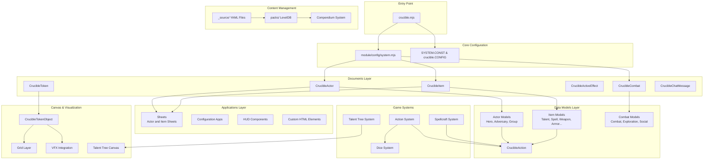
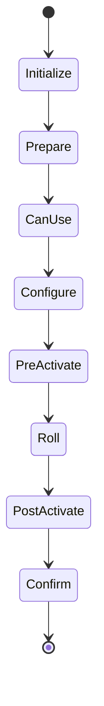
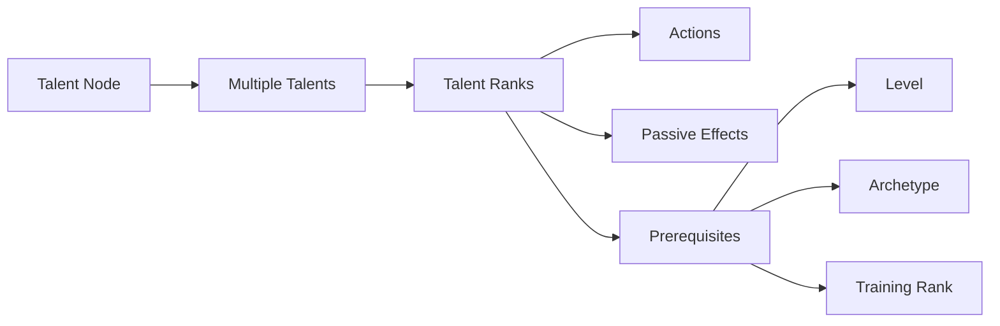
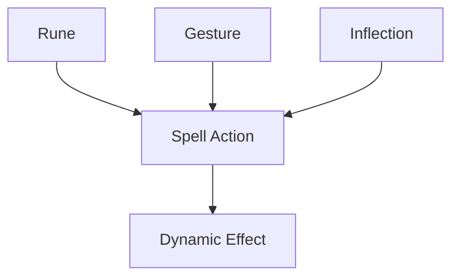
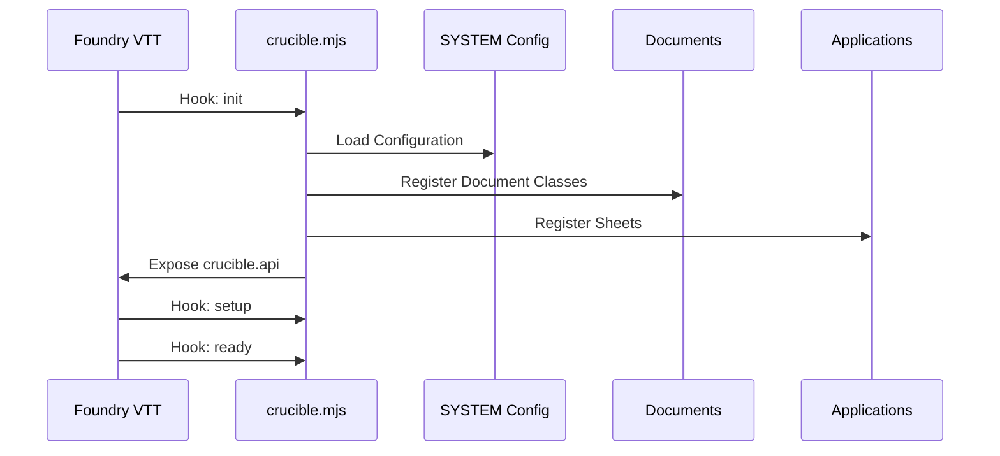
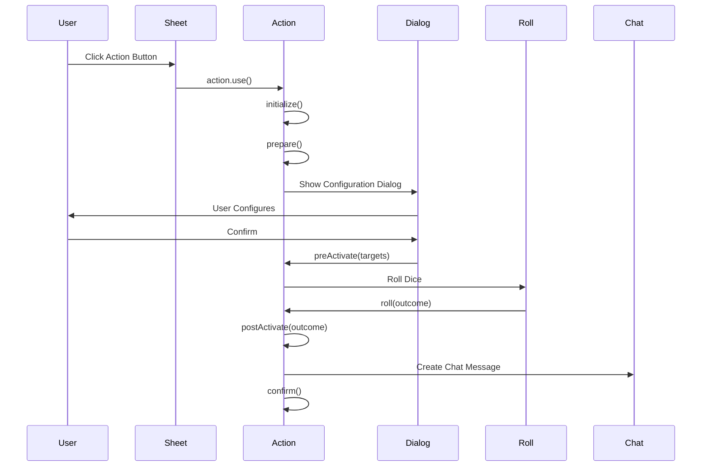
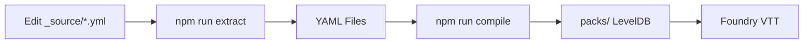

# Architecture Overview - Système Crucible

## Introduction

Crucible est un système de jeu de rôle moderne conçu exclusivement pour Foundry Virtual Tabletop v13+. L'architecture tire parti des capacités uniques de Foundry VTT pour offrir une automatisation riche tout en maintenant une mécanique narrative profonde.

## Architecture Globale



## Principes Architecturaux

### 1. Séparation des Préoccupations

L'architecture suit une séparation claire entre :

- **Documents** : Extensions des classes de base Foundry
- **Data Models** : Schémas de données utilisant `TypeDataModel`
- **Applications** : Interface utilisateur avec ApplicationV2
- **Systèmes de jeu** : Logique métier (Actions, Talents, Sorts)

### 2. Hiérarchie de Configuration

```mermaid
SYSTEM (constants statiques)
    ↓
crucible.CONST (exposé globalement)
    ↓
crucible.CONFIG (runtime configurable)
    ↓
User Settings (paramètres utilisateur)
```

### 3. Pattern de Données

Crucible utilise le pattern **TypeDataModel** de Foundry v13 :

```javascript
// Définition du schéma
static defineSchema() {
  return {
    fieldName: new fields.StringField({...options})
  }
}

// Préparation des données
prepareBaseData() { /* Données brutes */ }
prepareDerivedData() { /* Données calculées */ }
```

## Composants Principaux

### Document Extensions

| Document | Classe | Responsabilité |
|----------|--------|----------------|
| Actor | `CrucibleActor` | Gestion des créatures et personnages |
| Item | `CrucibleItem` | Gestion des objets, talents, sorts |
| Combat | `CrucibleCombat` | Gestion des rencontres de combat |
| ActiveEffect | `CrucibleActiveEffect` | Gestion des effets actifs |
| Token | `CrucibleToken` | Représentation canvas des acteurs |
| ChatMessage | `CrucibleChatMessage` | Messages de chat enrichis |

### Data Models

#### Actor Models
- **CrucibleHeroActor** : Personnages joueurs avec progression, talents
- **CrucibleAdversaryActor** : Adversaires avec threat ranks
- **CrucibleGroupActor** : Groupes de personnages (party)

#### Item Models
- **CrucibleTalentItem** : Talents avec système d'arbre
- **CrucibleSpellItem** : Sorts iconiques
- **CrucibleWeaponItem** : Armes avec actions d'attaque
- **CrucibleArmorItem** : Armures avec défenses
- **CrucibleAncestryItem** : Races de personnages
- **CrucibleBackgroundItem** : Historiques de personnages

### Système d'Actions

Le cœur mécanique de Crucible :



Chaque action suit un cycle de vie complet avec hooks à chaque étape.

### Système de Talents



### Système de Spellcraft

Composition dynamique de sorts via :
- **Runes** : Type de sort (feu, glace, etc.)
- **Gestures** : Forme de l'effet (cone, blast, etc.)
- **Inflections** : Modificateurs (damage, healing, etc.)



## Flux de Données

### Initialisation



### Utilisation d'une Action



## Gestion du Contenu

### Workflow YAML → LevelDB



**Important** : Ne jamais modifier directement les packs binaires !

## Patterns de Code

### 1. Action Binding

```javascript
// Les actions sont liées à un acteur
const action = item.actions[0].bind(actor);
await action.use();
```

### 2. Data Access

```javascript
// Accès au modèle de données typé
item.system // Type-specific data model
item.actions // Array of CrucibleAction
item.config.category.id // Configuration
```

### 3. Localisation

```javascript
// Toujours utiliser l'internationalisation
game.i18n.localize("CRUCIBLE.ActionUse")
```

### 4. Fusion d'Objets

```javascript
// Utiliser les utilitaires Foundry
foundry.utils.mergeObject(target, source);
// Jamais Object.assign() directement !
```

## Intégrations Externes

### VFX Module

Détection automatique du module `foundryvtt-vfx` :

```javascript
crucible.vfxEnabled = !!game.modules.get("foundryvtt-vfx")?.active;
```

Active les effets visuels améliorés pour les actions de frappe.

## Conventions de Fichiers

### Structure des Modules

```
module/
├── config/          # Configuration statique
├── documents/       # Extensions de documents
├── models/          # Schémas de données
├── applications/    # Interface utilisateur
│   ├── sheets/      # Feuilles de personnage/objet
│   ├── config/      # Applications de configuration
│   ├── hud/         # HUD personnalisés
│   └── elements/    # Éléments HTML personnalisés
├── dice/            # Système de dés
├── canvas/          # Composants canvas
└── hooks/           # Hooks Foundry
```

### Nommage

- **Classes** : `PascalCase` (ex: `CrucibleAction`)
- **Variables/Fonctions** : `camelCase` (ex: `prepareBaseData`)
- **Constants** : `UPPER_SNAKE_CASE` (ex: `TARGET_TYPES`)
- **IDs de Documents** : Générés via `generateId(name, length)`

## Compatibilité

- **Minimum** : Foundry VTT v13.347
- **Vérifié** : Foundry VTT v14.349
- **Maximum** : Foundry VTT v14

Le système doit rester compatible avec Foundry VTT v13.

## Points d'Extension

### Hooks Personnalisés

Le système expose des hooks à différentes étapes :
- `crucible.action.*` : Lifecycle des actions
- `crucible.talent.*` : Gestion des talents
- `crucible.combat.*` : Combat encounters

### API Publique

```javascript
crucible.api = {
  applications,  // Classes d'applications
  audio,         // Audio helpers
  canvas,        // Canvas components
  dice,          // Dice system
  documents,     // Document classes
  models,        // Data models
  methods,       // Utility methods
  talents,       // Talent system
  hooks          // Hook handlers
}
```

## Références

- [Foundry VTT v13 API](https://foundryvtt.com/api/)
- [Foundry VTT Knowledge Base](https://foundryvtt.com/kb/)
- [TypeDataModel Documentation](https://foundryvtt.com/api/classes/foundry.abstract.TypeDataModel.html)
- [ApplicationV2 Guide](https://foundryvtt.com/api/classes/foundry.applications.api.ApplicationV2.html)

