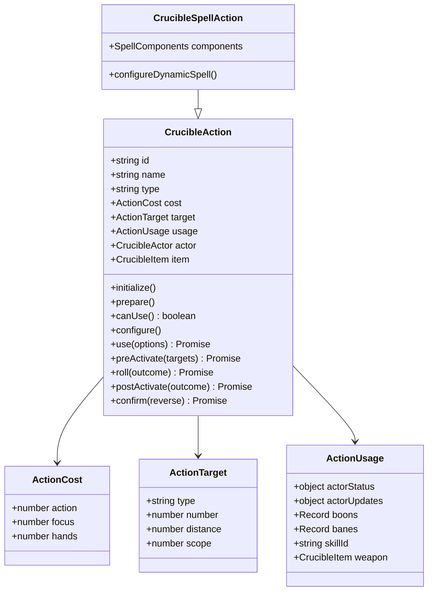
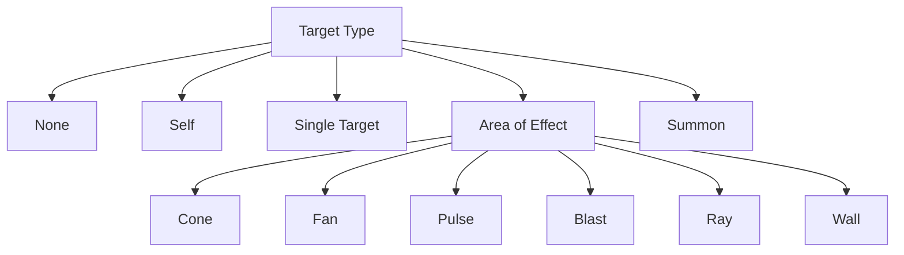
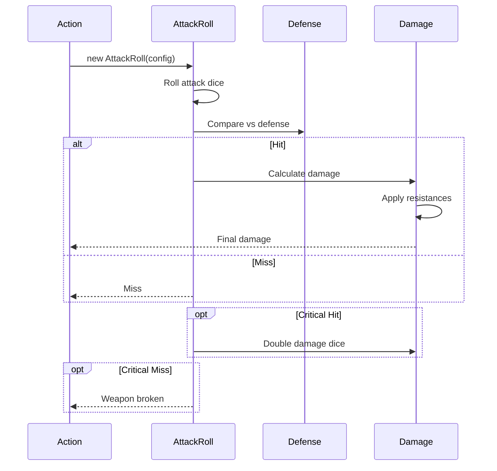
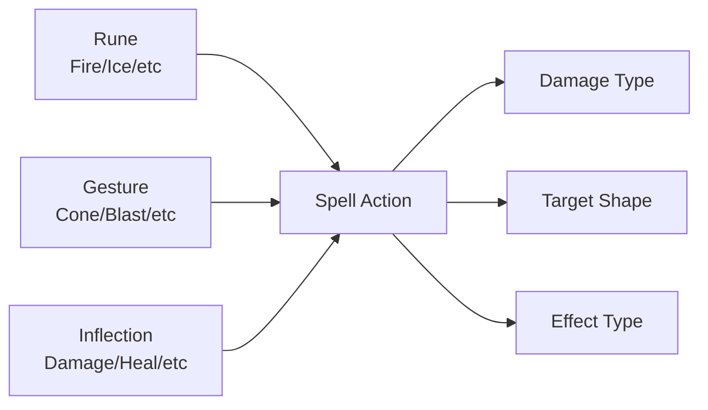

# Système d'Actions - Crucible

## Vue d'Ensemble

Le système d'Actions est le cœur mécanique de Crucible. Chaque interaction de jeu significative (attaque, sort, compétence, etc.) est encapsulée dans une instance de `CrucibleAction`.

## Architecture des Actions

### Classe CrucibleAction



## Cycle de Vie d'une Action

### Diagramme de Séquence

```mermaid
sequenceDiagram
    participant User
    participant Sheet
    participant Action
    participant Dialog
    participant Dice
    participant Actor
    participant Chat
    
    User->>Sheet: Clic sur action
    Sheet->>Action: bind(actor)
    activate Action
    
    Action->>Action: initialize()
    Note over Action: Initialisation des données
    
    Action->>Action: prepare()
    Note over Action: Préparation du contexte
    
    Action->>Action: canUse()
    alt Cannot Use
        Action-->>User: Error notification
    end
    
    opt Dialog Enabled
        Action->>Dialog: show()
        Dialog->>User: Configuration UI
        User->>Dialog: Configure & Confirm
        Dialog->>Action: configuration data
    end
    
    Action->>Action: configure()
    Note over Action: Application configuration
    
    Action->>Action: preActivate(targets)
    Note over Action: Validation des cibles
    
    opt Has Dice Roll
        Action->>Dice: Roll attack/check
        Dice-->>Action: Roll result
    end
    
    Action->>Action: roll(outcome)
    Note over Action: Calcul des résultats
    
    Action->>Actor: Apply effects
    Actor-->>Action: Updated state
    
    Action->>Action: postActivate(outcome)
    Note over Action: Post-traitement
    
    Action->>Chat: Create message
    Chat-->>User: Chat card displayed
    
    Action->>Action: confirm()
    Note over Action: Finalisation
    
    deactivate Action
```

### Hooks d'Action

Chaque étape du cycle de vie expose un hook personnalisable :

```javascript
const ACTION_HOOKS = {
  initialize: {
    argNames: [],
    async: false
  },
  prepare: {
    argNames: [],
    async: false
  },
  canUse: {
    argNames: [],
    async: false
  },
  configure: {
    argNames: [],
    async: false
  },
  preActivate: {
    argNames: ["targets"],
    async: true
  },
  roll: {
    argNames: ["outcome"],
    async: true
  },
  postActivate: {
    argNames: ["outcome"],
    async: true
  },
  confirm: {
    argNames: ["reverse"],
    async: true
  }
}
```

## Types d'Actions

### Types de Ciblage



#### Configuration des Templates

| Type | Template | Anchor | Scope |
|------|----------|--------|-------|
| `none` | null | - | NONE |
| `self` | null | - | SELF |
| `single` | null | - | ALL |
| `cone` | cone, 60° | self | ALL |
| `fan` | cone, 210° | self | ALL |
| `pulse` | circle | self | ALL |
| `blast` | circle | vertex | ALL |
| `ray` | ray, width 1 | self | ALL |
| `summon` | rect | vertex | SELF |
| `wall` | rect | edge | ALL |

### Target Scopes

```javascript
TARGET_SCOPES = {
  NONE: 0,    // Aucune cible
  SELF: 1,    // Uniquement soi-même
  ALLIES: 2,  // Alliés seulement
  ENEMIES: 3, // Ennemis seulement
  ALL: 4      // Tous les types
}
```

## Coûts d'Action

### Structure ActionCost

```javascript
{
  action: number,  // Coût en points d'action
  focus: number,   // Coût en points de focus
  hands: number    // Nombre de mains requises
}
```

### Exemples

- **Attaque basique** : `{action: 2, focus: 0, hands: 1}`
- **Sort puissant** : `{action: 3, focus: 2, hands: 2}`
- **Action bonus** : `{action: 1, focus: 0, hands: 0}`

## Résultats d'Action (Outcomes)

### Structure CrucibleActionOutcome

```javascript
{
  target: CrucibleActor,        // Acteur cible
  self: boolean,                 // Est-ce l'acteur lui-même ?
  usage: ActionUsage,            // Configuration d'utilisation
  rolls: AttackRoll[],           // Jets de dés
  resources: object,             // Modifications de ressources
  actorUpdates: object,          // Mises à jour de l'acteur
  effects: ActionEffect[],       // Effets actifs à créer
  metadata: object,              // Données métier
  
  // Flags de statut
  weakened: boolean,
  broken: boolean,
  incapacitated: boolean,
  criticalSuccess: boolean,
  criticalFailure: boolean,
  
  statusText: object[]           // Texte de statut affiché
}
```

### ActionEffect

```javascript
{
  name: string,                  // Nom de l'effet
  scope: number,                 // Portée (TARGET_SCOPES)
  statuses: string[],            // Statuts appliqués
  duration: {
    rounds: number,
    turns: number
  }
}
```

## Utilisation d'une Action

### Méthode Principale : `use()`

```javascript
/**
 * Utiliser une action
 * @param {CrucibleActionUsageOptions} options
 * @returns {Promise<CrucibleActionOutcomes>}
 */
async use(options = {}) {
  // 1. Initialize
  this.initialize();
  
  // 2. Prepare
  this.prepare();
  
  // 3. Check if can use
  if (!this.canUse()) {
    throw new Error("Cannot use this action");
  }
  
  // 4. Show dialog (optional)
  if (options.dialog) {
    await this.#showDialog();
  }
  
  // 5. Configure
  this.configure();
  
  // 6. Pre-activate with targets
  const targets = await this.preActivate(options);
  
  // 7. Roll dice
  const outcomes = new Map();
  for (const target of targets) {
    const outcome = await this.roll(target);
    outcomes.set(target, outcome);
  }
  
  // 8. Post-activate
  for (const [target, outcome] of outcomes) {
    await this.postActivate(outcome);
  }
  
  // 9. Create chat message
  await this.#createChatMessage(outcomes);
  
  // 10. Confirm
  await this.confirm(false);
  
  return outcomes;
}
```

### Binding d'Action

Les actions doivent être liées à un acteur avant utilisation :

```javascript
// Récupérer une action depuis un item
const item = actor.items.get(itemId);
const actionData = item.actions[0];

// Lier l'action à l'acteur
const action = actionData.bind(actor);

// Utiliser l'action
await action.use({
  dialog: true,
  rollMode: "publicroll"
});
```

## Actions de Combat

### Attack Actions

Les actions d'attaque utilisent le système de dés `AttackRoll` :



### Strike Action

Action d'attaque de mêlée standard :

```javascript
{
  id: "strike",
  name: "Strike",
  type: "strike",
  cost: {action: 2, focus: 0, hands: 1},
  target: {
    type: "single",
    scope: TARGET_SCOPES.ENEMIES
  },
  hooks: {
    roll: async function(outcome) {
      const roll = new AttackRoll({
        actor: this.actor,
        weapon: this.usage.weapon,
        target: outcome.target
      });
      await roll.evaluate();
      outcome.rolls.push(roll);
    }
  }
}
```

## Actions de Sort

### CrucibleSpellAction

Sous-classe spécialisée pour les sorts :

```javascript
class CrucibleSpellAction extends CrucibleAction {
  
  /**
   * Configuration des composants de sort
   */
  configureDynamicSpell() {
    const {rune, gesture, inflection} = this.components;
    
    // Rune détermine le type de dégâts
    this.damageType = rune.damageType;
    
    // Gesture détermine la forme
    this.target.type = gesture.targetType;
    this.target.number = gesture.size;
    
    // Inflection modifie l'effet
    this.applyInflection(inflection);
  }
}
```

### Composition de Sort



## Tags d'Action

### ActionTags

Système de tags pour décrire le contexte d'utilisation :

```javascript
class CrucibleActionTags extends Set {
  
  groups = {
    activation: new ActionTagGroup({
      icon: "fa-bolt",
      tooltip: "Activation Requirements"
    }),
    action: new ActionTagGroup({
      icon: "fa-hand-fist",
      tooltip: "Action Properties"
    }),
    context: new ActionTagGroup({
      icon: "fa-circle-info",
      tooltip: "Usage Context"
    })
  }
}
```

### Groupes de Tags

1. **Activation** : Conditions d'activation (coûts, prérequis)
2. **Action** : Propriétés de l'action (type, portée, cibles)
3. **Context** : Contexte d'utilisation (arme, compétence)

## Configuration d'Action

### ActionUseDialog

Dialog de configuration avant utilisation :

```javascript
class ActionUseDialog extends foundry.applications.api.DialogV2 {
  
  static DEFAULT_OPTIONS = {
    classes: ["crucible", "action-use-dialog"],
    window: {
      title: "Configure Action Use"
    }
  }
  
  async _prepareContext() {
    return {
      action: this.action,
      skills: this.#getAvailableSkills(),
      weapons: this.#getAvailableWeapons(),
      boons: this.#getAvailableBoons(),
      banes: this.#getAvailableBanes()
    }
  }
}
```

## Historique d'Actions

### Action History

Chaque acteur maintient un historique des actions effectuées :

```javascript
{
  id: string,              // ID de l'action
  messageId: string,       // ID du message de chat
  combat: {                // État du combat
    id: string,
    round: number,
    turn: number
  }
}
```

### Utilisation

```javascript
// Récupérer l'historique
const history = actor.getFlag("crucible", "actionHistory");

// Dernière action
const lastAction = history[history.length - 1];

// Filtrer par type
const attacks = history.filter(h => {
  const action = actor.actions.get(h.id);
  return action?.type === "strike";
});
```

## Intégration VFX

### Configuration VFX pour Strike

```javascript
function configureStrikeVFXEffect(action, outcome) {
  if (!crucible.vfxEnabled) return;
  
  const config = {
    from: action.actor.token,
    to: outcome.target.token,
    effect: outcome.criticalSuccess ? "criticalHit" : "hit",
    damageType: action.damageType
  };
  
  game.modules.get("foundryvtt-vfx").api.playEffect(config);
}
```

## Bonnes Pratiques

### 1. Toujours Lier à un Acteur

```javascript
// ✅ Correct
const action = item.actions[0].bind(actor);
await action.use();

// ❌ Incorrect
await item.actions[0].use(); // Pas d'acteur !
```

### 2. Gérer les Erreurs

```javascript
try {
  await action.use();
} catch(err) {
  ui.notifications.error(`Cannot use action: ${err.message}`);
  console.error(err);
}
```

### 3. Vérifier canUse()

```javascript
if (!action.canUse()) {
  ui.notifications.warn("Action cannot be used");
  return;
}
await action.use();
```

### 4. Utiliser les Hooks

```javascript
// Hook personnalisé pour modifier l'outcome
Hooks.on("crucible.action.postActivate", (action, outcome) => {
  if (action.type === "strike") {
    // Logique personnalisée
  }
});
```

## Exemples Complets

### Action d'Attaque Simple

```javascript
const strikeAction = {
  id: "basicStrike",
  name: "Basic Strike",
  type: "strike",
  cost: {action: 2, focus: 0, hands: 1},
  target: {
    type: "single",
    scope: TARGET_SCOPES.ENEMIES,
    distance: 5
  },
  hooks: {
    canUse: function() {
      return this.actor.resources.action.value >= this.cost.action;
    },
    
    roll: async function(outcome) {
      const roll = new AttackRoll({
        actor: this.actor,
        weapon: this.usage.weapon,
        target: outcome.target,
        skillId: this.usage.skillId
      });
      
      await roll.evaluate();
      outcome.rolls.push(roll);
      
      if (roll.isHit) {
        outcome.resources.wounds = roll.totalDamage;
      }
    },
    
    confirm: async function() {
      await this.actor.update({
        "system.resources.action.value": 
          this.actor.resources.action.value - this.cost.action
      });
    }
  }
};
```

### Action de Soin

```javascript
const healAction = {
  id: "heal",
  name: "Heal",
  type: "utility",
  cost: {action: 2, focus: 1, hands: 0},
  target: {
    type: "single",
    scope: TARGET_SCOPES.ALLIES,
    distance: 30
  },
  hooks: {
    roll: async function(outcome) {
      const healRoll = new Roll("2d6 + @healing", {
        healing: this.actor.abilities.presence.value
      });
      await healRoll.evaluate();
      
      const healing = healRoll.total;
      outcome.resources.wounds = -healing; // Négatif pour guérison
      outcome.statusText.push({
        text: `+${healing} HP`,
        color: "green"
      });
    }
  }
};
```

## Références

- **Fichiers sources** :
  - `module/models/action.mjs` - Classe CrucibleAction
  - `module/config/action.mjs` - Configuration des actions
  - `module/dice/action-use-dialog.mjs` - Dialog de configuration
  - `module/dice/attack-roll.mjs` - Système d'attaque
