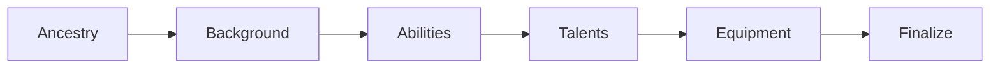

# Fonctionnalités d'Utilisabilité - Système Crucible

## Introduction

Ce document décrit les fonctionnalités et principes d'utilisabilité du système Crucible, visant à offrir une expérience utilisateur optimale pour les joueurs et maîtres de jeu.

## 1. Interface Utilisateur

### 1.1 Design Cohérent

**Thématique Crucible**

Le système utilise un design cohérent inspiré de l'esthétique fantasy médiévale :

- **Palette de couleurs** : Tons sombres avec accents dorés
- **Typographie** : Polices personnalisées (CaslonAntique, Vollkorn, AwerySmallcaps)
- **Iconographie** : Font Awesome pour cohérence et reconnaissance

**Éléments visuels** :

```less
// styles/variables.less
@color-primary: #8b4513;      // Brun sombre
@color-secondary: #d4af37;    // Or
@color-background: #2b2520;   // Fond sombre
@color-text: #e8e6e3;         // Texte clair
```

### 1.2 Navigation Intuitive

**Feuilles de Personnage**

Organisation par onglets :

- **Main** : Vue principale avec ressources, caractéristiques, équipement
- **Actions** : Liste des actions disponibles
- **Talents** : Arbre de talents et progression
- **Spells** : Grimoire et spellcraft
- **Bio** : Biographie, apparence, langues, connaissances

**Indicateurs visuels** :

- 🔴 Ressources basses (wounds élevés)
- 🟢 Ressources normales
- ⚡ Actions disponibles
- 🔒 Talents non accessibles (prérequis non satisfaits)
- ✅ Talents débloqués

### 1.3 Responsive Design (partiel)

**Résolutions supportées** :

- 1920x1080 (Full HD) : Optimal
- 1280x720 (HD) : Fonctionnel
- < 1280x720 : Scrolling nécessaire

**Limitations** :

- Pas d'optimisation mobile/tablette
- Interface conçue pour desktop

## 2. Feedback Utilisateur

### 2.1 Notifications

**Types de notifications** :

```javascript
// Succès
ui.notifications.info("Action successfully used!");

// Avertissement
ui.notifications.warn("Not enough action points");

// Erreur
ui.notifications.error("Cannot use this action");
```

**Placement** : En haut de l'écran, auto-dismiss après 3-5 secondes

### 2.2 Messages de Chat

**Chat Cards enrichies** :

- Header avec icône et titre de l'action
- Corps avec détails (cibles, jets de dés)
- Footer avec résultats (dégâts, effets)
- Boutons interactifs (appliquer dégâts, etc.)

**Exemple** :

```
┌─────────────────────────────────┐
│ ⚔️ Strike                        │
│ Hero attacks Goblin              │
├─────────────────────────────────┤
│ Attack Roll: 15 vs Defense: 12   │
│ Hit! Damage: 8                   │
├─────────────────────────────────┤
│ [Apply Damage]                   │
└─────────────────────────────────┘
```

### 2.3 Tooltips

**Data-tooltip** sur éléments interactifs :

```html
<button data-tooltip="Use this action to strike an enemy">
  <i class="fa-solid fa-sword"></i>
  Strike
</button>
```

**Contenu des tooltips** :

- Description courte de l'action
- Coût en ressources
- Effets principaux
- Raccourcis clavier (si applicable)

### 2.4 Animations

**Transitions fluides** :

- Ouverture/fermeture de feuilles : fade + scale
- Mise à jour de ressources : smooth number change
- Highlight d'éléments : pulse effect
- Drag & drop : preview visual

```css
.sheet-open {
  animation: fadeIn 0.3s ease-in-out;
}

@keyframes fadeIn {
  from {
    opacity: 0;
    transform: scale(0.95);
  }
  to {
    opacity: 1;
    transform: scale(1);
  }
}
```

### 2.5 Sons (optionnel)

**Audio contextuel** :

- Sons d'attaque (épée, arc)
- Sons de sorts (feu, glace)
- Sons d'interface (clic, hover)
- Musique de combat (via module audio)

**Configuration** :

```javascript
// module/audio.mjs
export function playActionSound(action) {
  if (!game.settings.get("crucible", "soundEnabled")) return;
  
  const soundPath = action.config.sound || "systems/crucible/audio/default.ogg";
  AudioHelper.play({ src: soundPath, volume: 0.5 });
}
```

## 3. Accessibilité

### 3.1 Labels ARIA

**Exemple d'implémentation** :

```html
<button 
  aria-label="Use Action: Strike against selected target"
  data-action="use-action"
  data-action-id="strike">
  <i class="fa-solid fa-sword" aria-hidden="true"></i>
  <span>Strike</span>
</button>
```

### 3.2 Navigation Clavier

**Raccourcis supportés** :

- `Tab` : Navigation entre champs
- `Enter` : Confirmer/utiliser action
- `Esc` : Fermer dialog/sheet
- `Space` : Toggle checkbox/radio

**Focus visible** :

```css
button:focus {
  outline: 2px solid var(--color-secondary);
  outline-offset: 2px;
}
```

### 3.3 Contraste

**WCAG AA minimum** :

- Texte sur fond : ratio 4.5:1
- Éléments interactifs : ratio 3:1
- Icônes importantes : ratio 3:1

**Vérification** :

```
Texte principal (#e8e6e3) sur fond (#2b2520) : 10.8:1 ✅
Liens/actions (#d4af37) sur fond (#2b2520) : 6.2:1 ✅
```

### 3.4 Taille de Texte

**Tailles minimales** :

- Texte principal : 14px
- Titres : 18-24px
- Labels : 12px (minimum)

**Scalabilité** :

- Support du zoom navigateur (100%-200%)
- Pas de breakpoint du layout

## 4. Wizard de Création de Personnage

### 4.1 Flux Guidé

**Étapes de création** :



### 4.2 Caractéristiques

**Navigation** :

- Boutons "Next" / "Previous" toujours visibles
- Progress bar en haut
- Validation à chaque étape
- Possibilité de revenir en arrière

**Aide contextuelle** :

- Preview des choix (ancestry, background)
- Tooltips explicatifs
- Calcul automatique des points disponibles

**Exemple d'interface** :

```
┌─────────────────────────────────────────┐
│ Character Creation [████████░░] 80%     │
├─────────────────────────────────────────┤
│                                         │
│  Select Ancestry                        │
│                                         │
│  [Human]  [Elf]  [Dwarf]  [Halfling]   │
│                                         │
│  Preview:                               │
│  Humans are versatile and adaptive...   │
│                                         │
├─────────────────────────────────────────┤
│  [← Previous]              [Next →]     │
└─────────────────────────────────────────┘
```

## 5. Arbre de Talents Interactif

### 5.1 Interface Canvas

**Composants PIXI.js** :

- Nœuds cliquables avec états visuels
- Connexions parent-enfant
- Zoom et pan pour navigation
- Highlight au survol

**États visuels** :

- 🔒 **Locked** : Gris, non cliquable
- 🟡 **Available** : Jaune, cliquable
- 🟢 **Unlocked** : Vert, au moins un talent acheté
- 🌟 **Mastered** : Or, tous talents au maximum

### 5.2 Navigation

**Contrôles** :

- Molette : Zoom in/out
- Drag : Pan de l'arbre
- Clic : Sélectionner un nœud
- Double-clic : Ouvrir le talent

**Minimap** (optionnel) :

- Vue d'ensemble de l'arbre
- Indicateur de position actuelle

### 5.3 Informations Contextuelles

**Panel latéral** :

```
┌─────────────────────┐
│ Selected Node       │
├─────────────────────┤
│ Power Strike        │
│                     │
│ Requirements:       │
│ ✅ Level 3          │
│ ✅ Weapon Training  │
│                     │
│ Talents:            │
│ • Basic Strike      │
│ • Improved Strike   │
│                     │
│ [Purchase] [Cancel] │
└─────────────────────┘
```

## 6. Dialog de Configuration d'Action

### 6.1 Présentation

**ActionUseDialog** :

- Modal centré
- Sections clairement séparées
- Preview des effets
- Validation avant confirmation

### 6.2 Sections

**1. Targeting** :

- Sélection de cibles (si multiple)
- Distance affichée
- Validation de portée

**2. Configuration** :

- Choix de compétence (si applicable)
- Choix d'arme (si applicable)
- Consommable à utiliser (si applicable)

**3. Boons & Banes** :

- Liste des boons disponibles
- Liste des banes appliqués
- Calcul du total

**4. Preview** :

- Résumé de l'action
- Coût total (action, focus)
- Effets attendus

### 6.3 Exemple

```
┌─────────────────────────────────────┐
│ Use Action: Fireball                │
├─────────────────────────────────────┤
│ Targets: [3 selected]               │
│ ├─ Goblin A                         │
│ ├─ Goblin B                         │
│ └─ Goblin C                         │
│                                     │
│ Skill: [Spellcasting]               │
│                                     │
│ Boons:                              │
│ ☑ High Ground (+1)                  │
│ ☐ Inspiration (+1)                  │
│                                     │
│ Cost: 3 Action, 2 Focus             │
│                                     │
│ [Confirm] [Cancel]                  │
└─────────────────────────────────────┘
```

## 7. Gestion d'Inventaire

### 7.1 Organisation

**Catégories** :

- Weapons (armes)
- Armor (armures)
- Accessories (accessoires)
- Consumables (consommables)
- Loot (butin)

**Tri et Filtrage** :

- Par catégorie
- Par nom (alphabétique)
- Par poids
- Par valeur
- Équipé / Non équipé

### 7.2 Drag & Drop

**Fonctionnalités** :

- Déplacer items entre personnages
- Équiper/déséquiper par drag
- Organiser l'inventaire
- Ajouter depuis compendium

**Visual feedback** :

- Preview de l'item en drag
- Drop zones highlighted
- Validation de capacité (encombrement)

### 7.3 Affichage Compact

**Liste d'items** :

```
┌────────────────────────────────────┐
│ Equipment (15/30 capacity)         │
├────────────────────────────────────┤
│ ⚔️ Longsword [E]       2 lbs   50g │
│ 🛡️ Shield [E]          5 lbs   25g │
│ 🧪 Potion of Healing   0.5 lbs 50g │
│ 💰 Gold Coins                  125g │
└────────────────────────────────────┘

[E] = Equipped
```

## 8. Combat Tracker

### 8.1 Interface Compacte

**Affichage par combattant** :

```
┌──────────────────────────────────┐
│ Initiative | Name       | HP     │
├──────────────────────────────────┤
│ ▶ 18       | Hero       | 25/30  │
│   15       | Goblin A   | 8/12   │
│   12       | Goblin B   | 12/12  │
│   10       | Ally       | 18/20  │
└──────────────────────────────────┘
```

**Indicateurs** :

- ▶ : Tour actuel
- 💀 : Incapacité/mort
- 🛡️ : Défense modifiée
- ⚡ : Actions restantes

### 8.2 Actions Rapides

**Depuis le tracker** :

- Appliquer dégâts (clic droit)
- Changer initiative
- Passer le tour
- Gérer les effets

## 9. Tooltips Avancés

### 9.1 Contenu Riche

**Au survol d'une caractéristique** :

```
┌─────────────────────────┐
│ Strength: 5             │
├─────────────────────────┤
│ Base: 3                 │
│ Increases: 2            │
│ Bonus: 0                │
├─────────────────────────┤
│ Effects:                │
│ • Melee damage: +5      │
│ • Carry capacity: +10   │
└─────────────────────────┘
```

### 9.2 Calculs Détaillés

**Au survol d'une défense** :

```
┌─────────────────────────┐
│ Parry: 14               │
├─────────────────────────┤
│ Base: 10                │
│ Strength: +5            │
│ Shield: +2              │
│ Talent bonus: +1        │
│ Condition: -4 (wounded) │
└─────────────────────────┘
```

## 10. Personnalisation

### 10.1 Settings

**Paramètres utilisateur** :

- Affichage des tooltips (on/off)
- Sons d'interface (on/off)
- Animations (on/off)
- Compendium sources (configuration)

### 10.2 Macros

**Support de macros** :

```javascript
// Macro: Use Strike Action
const actor = canvas.tokens.controlled[0]?.actor;
if (!actor) {
  ui.notifications.warn("Select a token first");
  return;
}

const strikeAction = actor.actions.find(a => a.id === "strike");
if (strikeAction) {
  await strikeAction.use({ dialog: false });
} else {
  ui.notifications.error("Strike action not found");
}
```

### 10.3 Raccourcis Personnalisés

**Keybindings** (via module externe) :

- Ouvrir feuille de personnage : `C`
- Utiliser action 1 : `1`
- Utiliser action 2 : `2`
- Repos court : `R`

## 11. Aide et Documentation In-App

### 11.1 Compendium de Règles

**crucible.rules** :

- Règles de base
- Exemples de jeu
- FAQ
- Référence rapide

### 11.2 Tooltips d'Aide

**Icône "?" à côté des sections complexes** :

```html
<h3>
  Talents
  <i class="fa-solid fa-circle-question" 
     data-tooltip="Talents are special abilities you unlock by spending talent points...">
  </i>
</h3>
```

### 11.3 Onboarding (futur)

**Guide pour nouveaux utilisateurs** :

- Tour guidé de l'interface
- Création de premier personnage
- Premier combat tutorial

## 12. Messages d'Erreur Clairs

### 12.1 Validation

**Messages explicites** :

```javascript
// ❌ Mauvais
"Error"

// ✅ Bon
"Cannot use action: not enough action points (need 3, have 1)"
```

### 12.2 Suggestions

**Proposer des solutions** :

```javascript
// Erreur avec suggestion
"Cannot equip heavy armor: requires Armor Training II. 
You can unlock this talent in the Warrior tree."
```

## 13. Performance Utilisateur

### 13.1 Chargement

**Indicateurs de chargement** :

- Spinner lors du chargement de sheets
- Progress bar lors de l'extraction de compendia
- Messages informatifs

### 13.2 Réactivité

**Feedback immédiat** :

- Changement de ressource : update instantané
- Équipement d'item : update visuel immédiat
- Utilisation d'action : confirmation avant exécution longue

## 14. Cohérence avec Foundry VTT

### 14.1 Conventions Foundry

**Respect des patterns Foundry** :

- ApplicationV2 pour toutes les apps
- Utilisation de `data-tooltip` standard
- Drag & drop standard Foundry
- Context menus standard

### 14.2 Intégration Native

**Fonctionnalités Foundry utilisées** :

- ActiveEffects
- Chat system
- Combat tracker
- Token HUD
- Ruler tool

## Conclusion

Le système Crucible met l'accent sur une expérience utilisateur fluide et intuitive, en tirant parti des capacités de Foundry VTT tout en ajoutant des fonctionnalités spécifiques pour améliorer le gameplay. L'interface est conçue pour être accessible tout en restant puissante pour les utilisateurs avancés.

---

**Dernière Mise à Jour** : 2025-11-04  
**Version du système** : 0.8.1
