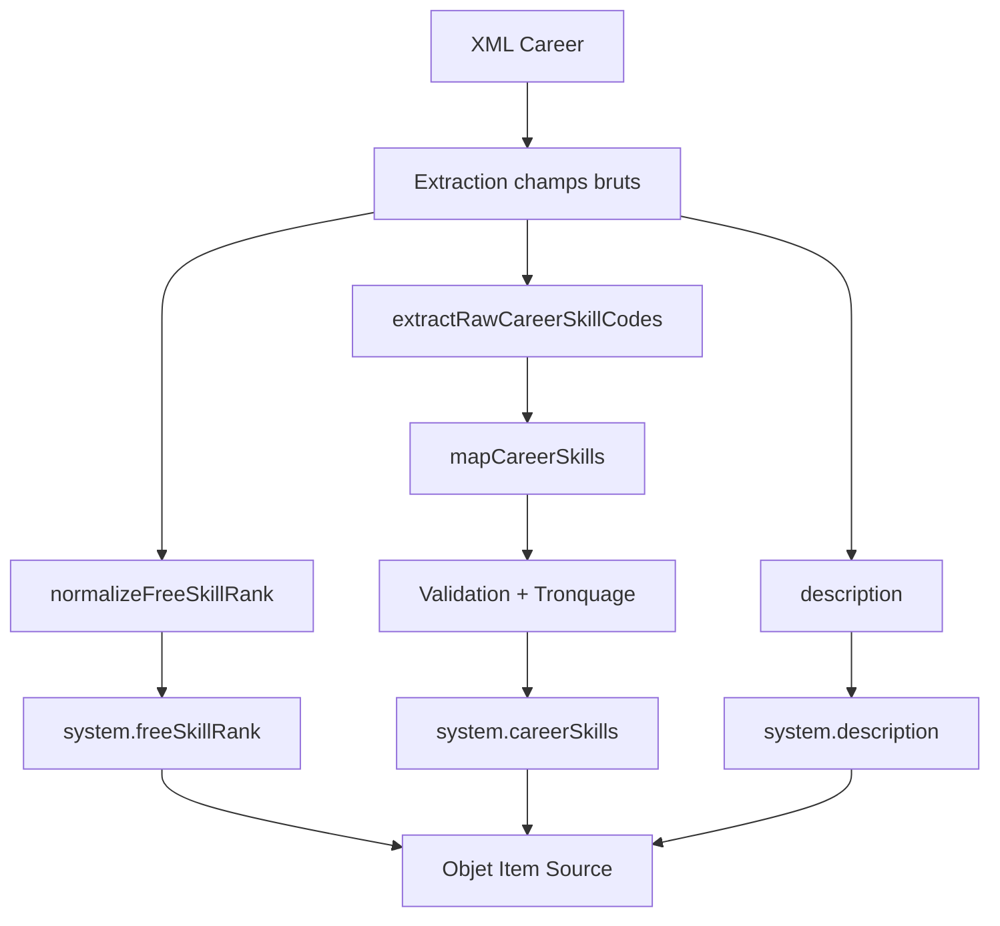

# Import OggDude Career

## Objectif

Mapper les entrées XML OggDude "Career" vers des objets conformes au schéma `SwerpgCareer` (champ `system` contenant uniquement `description`, `careerSkills`, `freeSkillRank`).

## Schéma Cible (`module/models/career.mjs`)

```text
system.description: HTMLField
system.careerSkills: Set<{ id: string }>, taille 0–8
system.freeSkillRank: NumberField entier, 0–8 (initial 4)
```

## Flux de Transformation



## Détails des Fonctions

### `normalizeFreeSkillRank(raw)`

- Convertit en entier.
- Défaut 4 si NaN.
- Clamp entre 0 et 8.

### `extractRawCareerSkillCodes(xmlCareer)`

- Supporte plusieurs structures:
  - `CareerSkills` tableau de chaînes.
  - `CareerSkills.CareerSkill[]` objets avec propriété `Key`.
  - Fallback sur variantes `Skill`, `Skills`.

### `mapCareerSkills(rawCodes)`

- Utilise `mapOggDudeSkillCodes` (table déterministe `OGG_DUDE_SKILL_MAP`).
- Exclut codes inconnus (log.warn via mapOggDudeSkillCode).
- Filtre par présence dans `SYSTEM.SKILLS`.
- Tronque à 8.
- Retourne `[{id}]`.

## Validation

- Longueur finale `careerSkills` ∈ [0,8].
- Chaque `id` appartient à `SYSTEM.SKILLS`.
- `freeSkillRank` borné 0–8.

## Logging

- `logger.debug` récap par carrière: key, freeSkillRank, skillCount, ignoredSkillCodes.
- `logger.warn` pour chaque code inconnu (depuis mapOggDudeSkillCode).

## Champs Ignorés

Les anciens champs (`sources`, `attributes`, `careerSpecializations`, `freeRanks`) sont supprimés car non présents dans le schéma `SwerpgCareer`.

## Exemple Simplifié

```js
const xml = {
  Name: 'Soldier',
  Key: 'soldier',
  Description: 'Desc',
  CareerSkills: { CareerSkill: [{ Key: 'ATHL' }, { Key: 'PERC' }] },
  FreeRanks: '3',
}
const [mapped] = careerMapper([xml])
// mapped.system.careerSkills => [{id:'athletics'},{id:'perception'}]
// mapped.system.freeSkillRank => 3
```

## Risques / Edge Cases

- Structure inattendue des compétences => liste vide.
- Codes valides mais absents dans `SYSTEM.SKILLS` => exclus silencieusement.
- FreeRanks négatif ou > 8 => clamp.

## Tests Couverts

- Déduplication.
- Tronquage >8.
- Exclusion inconnu.
- Défaut freeSkillRank.
- Clamp freeSkillRank.
- Transformation structure objet/array.

## Extension Future

Utiliser `oggdude-career-skill-map.mjs` pour ajouter des mappings spécifiques carrière si divergence souhaitée avec species.
