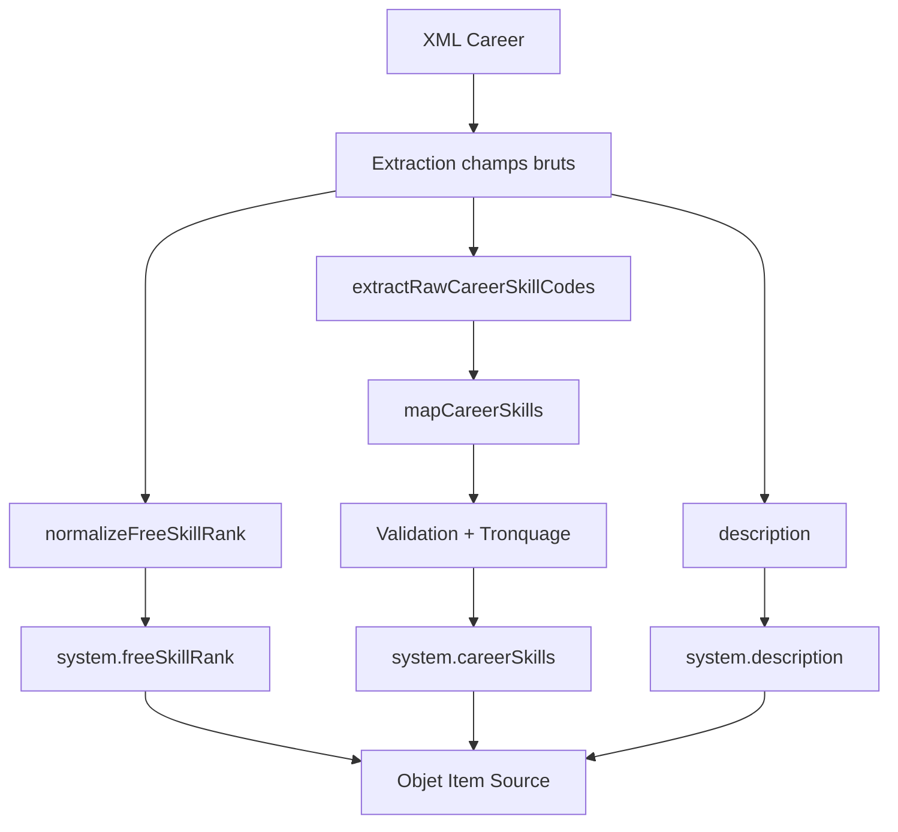

# Import OggDude Career

## Objectif

Mapper les entrées XML OggDude "Career" vers des objets conformes au schéma `SwerpgCareer` (champ `system` contenant uniquement `description`, `careerSkills`, `freeSkillRank`).

## Schéma Cible (`module/models/career.mjs`)

```text
system.description: HTMLField
system.careerSkills: Set<{ id: string }>, taille 0–8
system.freeSkillRank: NumberField entier, 0–8 (initial 4)
```

## Flux de Transformation



## Détails des Fonctions

### `normalizeFreeSkillRank(raw)`

- Convertit en entier.
- Défaut 4 si NaN.
- Clamp entre 0 et 8.

### `extractRawCareerSkillCodes(xmlCareer)`

- Supporte plusieurs structures:
  - `CareerSkills` tableau de chaînes.
  - `CareerSkills.CareerSkill[]` objets avec propriété `Key`.
  - Fallback sur variantes `Skill`, `Skills`.

### `mapCareerSkills(rawCodes)`

- Utilise `mapOggDudeSkillCodes` (table déterministe `OGG_DUDE_SKILL_MAP`).
- Exclut codes inconnus (log.warn via mapOggDudeSkillCode).
- Filtre par présence dans `SYSTEM.SKILLS`.
- Tronque à 8.
- Retourne `[{id}]`.

## Mappings de Compétences OggDude → SWERPG

Le mapping des codes de compétences OggDude vers les identifiants SWERPG est géré par la table `OGG_DUDE_SKILL_MAP` dans `/module/importer/mappings/oggdude-skill-map.mjs`.

### Codes Supportés

**General Skills** (compétences générales) :

- `COOL` → `cool`
- `DISC`, `DISCIPLINE` → `discipline`
- `LEAD`, `LEADERSHIP` → `leadership`
- `NEG`, `NEGOTIATION` → `negotiation`
- `COERC`, `COERCION` → `coercion`
- `VIGIL`, `VIGILANCE` → `vigilance`
- `RESIL`, `RESILIENCE` → `resilience`
- `SW`, `STREETWISE` → `streetwise`
- `SURV`, `SURVIVAL` → `survival`
- `ASTRO`, `ASTROGATION` → `astrogation`
- `PILOTPL`, `PILOTINGPLANETARY` → `pilotingplanetary`
- `PILOTSP`, `PILOTINGSPACE` → `pilotingspace`
- `MECH`, `MECHANICS` → `mechanics`
- `MED`, `MEDICINE` → `medicine`
- `COMP`, `COMPUTERS` → `computers`
- `COORD`, `COORDINATION` → `coordination`
- `ATHL`, `ATHLETICS` → `athletics`
- `CHARM`, `CHARMING` → `charm`
- `DECEP`, `DECEPTION` → `deception`
- `PERC`, `PERCEPTION` → `perception`
- `SKUL`, `SKULDUGGERY` → `skulduggery`
- `STEA`, `STEAL`, `STEALTH` → `stealth`

**Combat Skills** (compétences de combat) :

- `BRAWL` → `brawl`
- `MELEE` → `melee`
- `RANGLT`, `RANGEDLIGHT` → `rangedlight`
- `RANGHVY`, `RANGEDHEAVY` → `rangedheavy`
- `GUNN`, `GUNNERY` → `gunnery`

**Knowledge Skills** (compétences de connaissance) :

- `CORE`, `COREWORLDS` → `coreworlds`
- `LORE` → `lore`
- `OUT`, `OUTERRIM` → `outerrim`
- `XEN`, `XENOLOGY` → `xenology`
- `EDU`, `EDUCATION` → `education`

### Codes Non Mappables

Les codes suivants ne peuvent pas être mappés car les compétences correspondantes n'existent pas dans le système SWERPG :

- **`LTSABER`** (Lightsaber) : Compétence spécifique à Force and Destiny, non présente dans `SYSTEM.SKILLS`
- **`WARF`** (Warfare) : Compétence Knowledge non présente dans `SYSTEM.SKILLS`

Ces codes génèrent un warning lors de l'import mais ne bloquent pas le traitement de la carrière.

### Notes Importantes

- **CORE vs COORD** : `CORE` mappe vers `coreworlds` (Knowledge: Core Worlds), tandis que `COORD` mappe vers `coordination` (General: Coordination). Ne pas confondre les deux.
- **Insensibilité à la casse** : Le mapping est case-insensitive, donc `COOL`, `cool`, et `Cool` produisent tous le même résultat.
- **Synonymes** : Plusieurs variantes (forme courte et forme longue) sont supportées pour chaque compétence afin d'assurer la compatibilité avec différentes versions des fichiers OggDude.

## Validation

- Longueur finale `careerSkills` ∈ [0,8].
- Chaque `id` appartient à `SYSTEM.SKILLS`.
- `freeSkillRank` borné 0–8.

## Logging

- `logger.debug` récap par carrière: key, freeSkillRank, skillCount, ignoredSkillCodes.
- `logger.warn` pour chaque code inconnu (depuis mapOggDudeSkillCode).

## Champs Ignorés

Les anciens champs (`sources`, `attributes`, `careerSpecializations`, `freeRanks`) sont supprimés car non présents dans le schéma `SwerpgCareer`.

## Exemple Simplifié

```js
const xml = {
  Name: 'Soldier',
  Key: 'soldier',
  Description: 'Desc',
  CareerSkills: { CareerSkill: [{ Key: 'ATHL' }, { Key: 'PERC' }] },
  FreeRanks: '3',
}
const [mapped] = careerMapper([xml])
// mapped.system.careerSkills => [{id:'athletics'},{id:'perception'}]
// mapped.system.freeSkillRank => 3
```

## Risques / Edge Cases

- Structure inattendue des compétences => liste vide.
- Codes valides mais absents dans `SYSTEM.SKILLS` => exclus silencieusement.
- FreeRanks négatif ou > 8 => clamp.

## Tests Couverts

- Déduplication.
- Tronquage >8.
- Exclusion inconnu.
- Défaut freeSkillRank.
- Clamp freeSkillRank.
- Transformation structure objet/array.

## Extension Future

Utiliser `oggdude-career-skill-map.mjs` pour ajouter des mappings spécifiques carrière si divergence souhaitée avec species.
