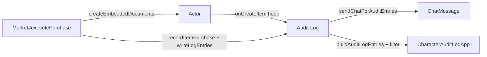

# Plan : Cadrage métier — Extension Audit Log pour achats d'items (Market)

## Vue d'ensemble

**TL;DR** : Étendre le système d'audit log existant (actuellement XP, skills, talents, caractéristiques) pour tracer les achats d'items via le Market. Cela implique : un nouveau type d'entrée `item.purchase`, une nouvelle famille de filtre `purchases`, un message chat dédié au même format que les entrées XP/talents, et les clés i18n associées. Le Market (`#executePurchase`) appellera `writeLogEntries()` après un achat réussi.

## Objectifs

1. **Traçabilité complète** : Chaque achat d'item via le Market doit être enregistré dans l'audit log du personnage.
2. **Cohérence visuelle** : Le message chat pour les achats suit le même template et thème que les entrées XP/talents (variante `add`, couleurs de gain, médaille Star Wars).
3. **Filtrage granulaire** : Un filtre `purchases` distinct permet d'isoler les achats d'items du reste de l'audit log.
4. **État du portefeuille** : Capture du solde en crédits avant/après pour auditabilité financière.

## Périmètre détaillé

### Inclus

- Nouveau type d'entrée audit `item.purchase`
- Nouvelle famille de filtre `purchases` dans `AUDIT_LOG_FAMILIES`
- Fonction `recordItemPurchase(actor, { itemName, itemType, price, creditsAfter })`
- Contexte chat pour affichage en jeu (`_buildChatContext`)
- Description localisée (`buildAuditLogDescription`)
- Snapshot optionnel `creditsDelta` pour suivi financier
- Clés i18n EN/FR complètes
- Tests unitaires et d'intégration

### Exclus

- Migration rétroactive des achats passés
- Intégration avec d'autres markets tiers-partis
- Graphiques/analytics sur les dépenses
- Contrôle d'accès détaillé par type d'item

### Hypothèses

- Le Market utilise `createEmbeddedDocuments('Item', [...])` pour ajouter les items
- Les crédits sont déduits automatiquement via `_prepareCredits()` au moment de la création d'item
- L'user qui déclenche l'achat est identifiable via `userId` des hooks Foundry
- Le template chat existant `audit-entry.hbs` peut accepter un `creditDelta` en sus de `xpDelta`

### Contraintes

- Pas de modification du Market flow existant (injection de l'audit APRÈS l'ajout d'item)
- Snapshot crédits doit être capturé au moment de l'appel (pas retrouvé après)
- Taille max de l'audit log existante (FIFO) doit être respectée

## Architecture



### Points d'entrée

1. **Market** (`module/applications/market/market-application.mjs`) — appelle `recordItemPurchase` après `createEmbeddedDocuments` réussi
2. **Audit Log** (`module/utils/audit-log.mjs`) — enregistre l'entrée et envoie chat
3. **Character Audit Log UI** (`module/applications/character-audit-log.mjs`) — affiche et filtre

### Snapshot

```javascript
{
  creditsBefore: 150,
  creditsAfter: 50,
  creditsDelta: -100
}
```

Cette snapshot sera optionnelle (pas capturable pour tous les types de purchase).

## Structure des données

### Entrée audit

```javascript
{
  type: 'item.purchase',
  data: {
    itemId: 'item-uuid-or-id',
    itemName: 'Blaster Pistol',
    itemType: 'weapon', // weapon, armor, gear, etc.
    price: 100,
    quantity: 1
  },
  creditDelta: -100, // nouveau champ optionnel, distinct de xpDelta
  snapshot: { creditsBefore: 150, creditsAfter: 50 },
  timestamp: 1234567890,
  userId: 'user-123',
  userName: 'GameMaster'
}
```

### Contexte chat

```javascript
{
  actorImg: '...',
  actorName: 'Pax Mondala',
  eventLabel: 'Item purchased',
  previousValue: null,
  nextValue: 'Blaster Pistol (weapon)',
  description: 'Purchased Blaster Pistol for 100 credits.',
  metaLeft: '100 credits',
  metaRight: '50 credits remaining',
  hasMeta: true,
  variant: 'add',
  creditDelta: -100 // pour CSS si besoin
}
```

## Tâches implémentation

### 1. Nouveau type audit-log `item.purchase` + fonction `recordItemPurchase`

**Fichiers** : `module/utils/audit-log.mjs`, `module/utils/audit-diff.mjs`

**Contenu** :

- Créer `recordItemPurchase(actor, { itemName, itemType, price, quantity = 1, creditsAfter })`
- Construire entité via `makeEntry({ type: 'item.purchase', data: {...}, creditDelta, snapshot })`
- Appeler `writeLogEntries(actor, [entry])`
- Capturer snapshot crédit au moment de l'appel (via `actor.system.credits`)

**Tests** :

- ✓ Entrée créée avec tous les champs obligatoires
- ✓ Snapshot crédits capturé correctement
- ✓ `creditDelta` calculé comme `-price * quantity`

### 2. Famille de filtre `purchases` et mappage

**Fichiers** : `module/applications/character-audit-log.mjs`

**Contenu** :

- Ajouter `purchases: 'purchases'` à `AUDIT_LOG_FAMILIES`
- Ajouter à `AUDIT_LOG_FILTER_ORDER`
- Ajouter mapping `[AUDIT_LOG_FAMILIES.purchases]: 'SWERPG.AUDIT_LOG.FILTER.PURCHASES'` à `AUDIT_LOG_FILTER_LABELS`
- Ajouter case dans `getAuditLogFamily()` : `case 'item.purchase': return AUDIT_LOG_FAMILIES.purchases`

**Tests** :

- ✓ `getAuditLogFamily('item.purchase')` retourne `purchases`
- ✓ Filtre est présent dans l'ordre et les labels

### 3. Message chat pour achat d'item

**Fichiers** : `module/utils/audit-log.mjs` (fonction `_buildChatContext`)

**Contenu** :

- Ajouter case `item.purchase` dans le switch
- Construire contexte :
  - `eventLabel` = `game.i18n.localize('SWERPG.AUDIT_LOG.TYPE.ITEM_PURCHASE')`
  - `nextValue` = `${data.itemName} (${data.itemType})`
  - `variant` = `'add'`
  - `metaLeft` = `game.i18n.format('...PRICE', { price: data.price })`
  - `metaRight` = `game.i18n.format('...REMAINING_CREDITS', { credits: snapshot.creditsAfter })`

**Tests** :

- ✓ Contexte construit correctement
- ✓ Variante = `add` (vert)
- ✓ Métadonnées présentes

### 4. Description localisée `buildAuditLogDescription`

**Fichiers** : `module/applications/character-audit-log.mjs`

**Contenu** :

- Ajouter case `item.purchase` :
  ```javascript
  case 'item.purchase':
    return game.i18n.format('SWERPG.AUDIT_LOG.DESCRIPTION.ITEM_PURCHASE', {
      itemName: data.itemName,
      itemType: data.itemType,
      price: data.price,
      quantity: data.quantity ?? 1
    })
  ```

**Tests** :

- ✓ Description formatée correctement en EN et FR

### 5. Intégration Market → Audit Log

**Fichiers** : `module/applications/market/market-application.mjs`

**Contenu** :

- Dans `#executePurchase`, après `createEmbeddedDocuments` réussi :
  ```javascript
  // Enregistrer audit entry après la création d'item
  const { recordItemPurchase } = await import('../../utils/audit-log.mjs')
  try {
    await recordItemPurchase(buyer, {
      itemName: entry.name,
      itemType: item.type,
      price: finalValidation.finalPrice,
      quantity: 1, // ou item.system.quantity si applicable
      creditsAfter: finalValidation.creditsAfter,
    })
  } catch (err) {
    logger.warn('[Market] Could not record purchase audit entry', err)
  }
  ```

**Tests** :

- ✓ Achat déclenche création d'entrée audit
- ✓ Pas de blocage du Market si audit échoue
- ✓ Achat via Market populaire les logs

### 6. Clés i18n

**Fichiers** : `lang/en.json`, `lang/fr.json`

**Clés** :

```json
{
  "SWERPG.AUDIT_LOG.TYPE.ITEM_PURCHASE": "Item purchased",
  "SWERPG.AUDIT_LOG.FILTER.PURCHASES": "Purchases",
  "SWERPG.AUDIT_LOG.DESCRIPTION.ITEM_PURCHASE": "Purchased {itemName} ({itemType}) for {price} credits"
}
```

Et équivalents FR :

```json
{
  "SWERPG.AUDIT_LOG.TYPE.ITEM_PURCHASE": "Article acheté",
  "SWERPG.AUDIT_LOG.FILTER.PURCHASES": "Achats",
  "SWERPG.AUDIT_LOG.DESCRIPTION.ITEM_PURCHASE": "Achat de {itemName} ({itemType}) pour {price} crédits"
}
```

### 7. Tests unitaires et manuels

**Fichiers** : `tests/utils/audit-log.test.mjs`, `tests/applications/character-audit-log.test.mjs`, `documentation/tests/manuel/audit-log/README.md`

**Couverture** :

- ✓ `recordItemPurchase` crée entrée valide
- ✓ Snapshot crédits capturé
- ✓ Filtre `purchases` fonctionne
- ✓ Chat format correct
- ✓ Achat Market → audit log intégration
- ✓ Export CSV inclut les achats

**Tests manuels** :

- ✓ Achat d'une arme → entrée audit créée
- ✓ Achat d'une armure → entrée audit créée
- ✓ Message chat affiché avec bonne mise en forme
- ✓ Filtre "Purchases" affiche uniquement les achats
- ✓ Solde crédits affiché correctement dans sidebar UI

## Découpage en issues GitHub

| #   | Titre                                                                   | Périmètre                                                                  | Dépendances    | Story Points |
| --- | ----------------------------------------------------------------------- | -------------------------------------------------------------------------- | -------------- | ------------ |
| 1   | **feat: Nouveau type audit-log `item.purchase` + `recordItemPurchase`** | `audit-log.mjs`, `audit-diff.mjs`, tests unitaires                         | —              | 5            |
| 2   | **feat: Famille de filtre `purchases` dans Character Audit Log**        | `character-audit-log.mjs`, tests                                           | Issue 1        | 3            |
| 3   | **feat: Message chat pour achat d'item**                                | `_buildChatContext`, `audit-entry.hbs`, tests                              | Issue 1        | 5            |
| 4   | **feat: Description localisée `item.purchase` dans audit log**          | `character-audit-log.mjs`, i18n, tests                                     | Issue 1        | 3            |
| 5   | **feat: Intégration Market → Audit Log**                                | `market-application.mjs`, import `recordItemPurchase`, tests d'intégration | Issues 1, 3, 4 | 5            |
| 6   | **chore: Clés i18n complètes (EN + FR) pour item purchase audit**       | `lang/en.json`, `lang/fr.json`                                             | Issues 1–5     | 2            |
| 7   | **test: Tests manuels et E2E achat → audit-log → chat**                 | Manuel, éventuellement E2E regression                                      | Issues 1–5     | 3            |

**Total estimation** : ~26 SP (2 sprints de développement)

## Considérations supplémentaires

### 1. Snapshot crédits vs XP

Actuellement, les entrées audit peuvent capturer un snapshot XP (`{ xpAvailable, xpSpent, xpGained }`). Pour les achats, nous capturons crédit avant/après.

**Recommandation** : Ajouter un champ `creditDelta` distinct dans l'entrée (ne pas écraser `xpDelta`). Cela permet d'afficher soit le delta XP soit le delta crédit selon le type d'entrée.

### 2. Granularité type d'item

Faut-il créer des types séparés (`item.purchase.weapon`, `item.purchase.armor`, etc.) ou un seul type `item.purchase` avec metadata ?

**Recommandation** : Un seul type `item.purchase` avec `data.itemType` pour simplifier et éviter explosion combinatoire. Le filtrage subséquent peut affiner si besoin.

### 3. Affichage delta crédit dans l'UI

L'UI audit-log affiche actuellement `formattedXpDelta` colorée. Pour les achats, faut-il afficher un `creditDelta` coloré (négatif = rouge, comme XP spend) ?

**Recommandation** : Oui, adapter `buildAuditLogEntries` pour calculer un `creditDelta` optionnel et afficher en rouge pour achats. Utiliser le même CSS (is-spend) mais avec label "credits" au lieu de "XP".

### 4. Template chat : réutilisabilité

Le template `audit-entry.hbs` peut-il afficher indifféremment XP et crédits sans refonte ?

**Recommandation** : Oui, adapter le template pour afficher soit `xpDelta` soit un des métadonnées crédits dans `metaLeft`. Le template est déjà flexible.

### 5. Contrôle d'accès

Qui peut voir les achats dans l'audit log ? Même GM + joueur propriétaire ?

**Recommandation** : Respecter les permissions existantes de l'audit log (visible par le propriétaire de l'acteur et les GMs).

## Validation de succès

- ✓ Chaque achat Market est enregistré dans `actor.flags.swerpg.logs`
- ✓ Un message chat est envoyé avec le bon format visual (vert, icône +, star wars theme)
- ✓ Le filtre "Purchases" affiche/masque les entrées achat correctement
- ✓ Description localisée EN et FR affiche item, type, prix
- ✓ Solde crédits restants est visible dans le message chat et l'UI
- ✓ Export CSV inclut les achats (colonnes standard)
- ✓ Aucun blocage/erreur du Market si audit échoue
- ✓ Tests unitaires + manuels couvrent tous les chemins happy path et erreur

## Prochaines étapes

1. **Affiner ce plan** : Feedback utilisateur, review architectural
2. **Détailler Issue 1** : `recordItemPurchase` avec signature exacte et tests
3. **Créer issues GitHub** : Break down par issue, estimer, assigner
4. **Implémenter par ordre** : 1 → 2 → 3 → 4 → 5 → 6 → 7
5. **Review + merge** : PR par issue avec tests, doc, i18n
