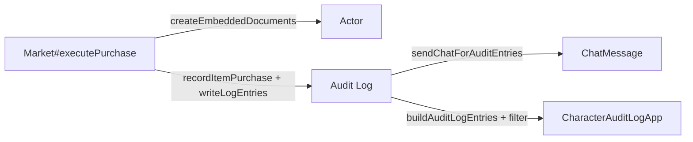

# Plan : Extension Audit Log pour achats Market (Issue #489)

## Vue d'ensemble

**TL;DR** : Étendre le système d'audit log existant pour tracer les achats d'items via le Market. Cela implique un nouveau type d'entrée `item.purchase`, une nouvelle famille de filtre `purchases`, un message chat dédié au même format que les entrées XP/talents, et les clés i18n associées. Le Market (`#executePurchase`) appellera `recordItemPurchase()` après un achat réussi.

## Objectifs

1. **Traçabilité complète** : Chaque achat d'item via le Market doit être enregistré dans l'audit log du personnage.
2. **Cohérence visuelle** : Le message chat pour les achats suit le même template et thème que les entrées XP/talents (variante `add`, couleurs de gain, médaille Star Wars).
3. **Filtrage granulaire** : Un filtre `purchases` distinct permet d'isoler les achats d'items du reste de l'audit log.
4. **État du portefeuille** : Capture du solde en crédits avant/après pour auditabilité financière.

## Périmètre détaillé

### Inclus

- Nouveau type d'entrée audit `item.purchase`
- Nouvelle famille de filtre `purchases` dans `AUDIT_LOG_FAMILIES`
- Fonction `recordItemPurchase(actor, { itemName, itemType, price, creditsAfter })`
- Contexte chat pour affichage en jeu (`_buildChatContext`)
- Description localisée (`buildAuditLogDescription`)
- Snapshot optionnel `creditsDelta` pour suivi financier
- Clés i18n EN/FR complètes
- Tests unitaires et d'intégration

### Exclus

- Migration rétroactive des achats passés
- Intégration avec d'autres markets tiers-partis
- Graphiques/analytics sur les dépenses
- Contrôle d'accès détaillé par type d'item
- Colonnes CSV additionnelles pour `creditDelta` (reporter)
- Affichage CSS du `creditDelta` dans l'UI (reporter)

### Hypothèses

- Le Market utilise `createEmbeddedDocuments('Item', [...])` pour ajouter les items
- Les crédits sont déduits automatiquement via `_prepareCredits()` au moment de la création d'item
- L'user qui déclenche l'achat est identifiable via `userId` des hooks Foundry
- Le template chat existant `audit-entry.hbs` peut accepter des métadonnées crédits en sus de `xpDelta`
- Granularité : un seul type `item.purchase` avec `data.itemType` (pas de sous-types par catégorie)

### Contraintes

- Pas de modification du Market flow existant (injection de l'audit APRÈS l'ajout d'item)
- Snapshot crédits doit être capturé au moment de l'appel (pas retrouvé après)
- Taille max de l'audit log existante (FIFO) doit être respectée
- Fire-and-forget : l'audit ne doit jamais bloquer l'achat

## Architecture



### Points d'entrée

1. **Market** (`module/applications/market/market-application.mjs`) — appelle `recordItemPurchase` après `createEmbeddedDocuments` réussi
2. **Audit Log** (`module/utils/audit-log.mjs`) — enregistre l'entrée et envoie chat
3. **Character Audit Log UI** (`module/applications/character-audit-log.mjs`) — affiche et filtre

### Snapshot

```javascript
{
  creditsBefore: 150,
  creditsAfter: 50,
  creditsDelta: -100
}
```

Cette snapshot sera optionnelle (pas capturable pour tous les types de purchase).

## Structure des données

### Entrée audit

```javascript
{
  type: 'item.purchase',
  data: {
    itemId: 'item-uuid-or-id',
    itemName: 'Blaster Pistol',
    itemType: 'weapon', // weapon, armor, gear, etc.
    price: 100,
    quantity: 1
  },
  creditDelta: -100, // nouveau champ optionnel, distinct de xpDelta
  snapshot: { creditsBefore: 150, creditsAfter: 50 },
  timestamp: 1234567890,
  userId: 'user-123',
  userName: 'GameMaster'
}
```

### Contexte chat

```javascript
{
  actorImg: '...',
  actorName: 'Pax Mondala',
  eventLabel: 'Item purchased',
  previousValue: null,
  nextValue: 'Blaster Pistol (weapon)',
  description: 'Purchased Blaster Pistol for 100 credits.',
  metaLeft: '100 credits',
  metaRight: '50 credits remaining',
  hasMeta: true,
  variant: 'add',
  creditDelta: -100 // pour CSS si besoin
}
```

## Tâches implémentation

### Tâche 1 : Créer `recordItemPurchase()` dans `module/utils/audit-log.mjs`

**Fichiers** : `module/utils/audit-log.mjs`

**Contenu** :

- Créer fonction async `recordItemPurchase(actor, { itemName, itemType, price, quantity = 1, creditsAfter })`
- Construire entité via `makeEntry({ type: 'item.purchase', data: {...}, creditDelta: -price * quantity, snapshot })`
- Capturer snapshot crédit au moment de l'appel via `actor.system.creditBudget?.availableCredits ?? actor.system?.credits`
- Appeler `writeLogEntries(actor, [entry])`
- Exporter la fonction

**Structure** :

```javascript
/**
 * Record an item purchase audit entry when an item is bought via Market.
 * Non-blocking: failures are caught internally without throwing.
 *
 * @param {object} actor The actor document instance.
 * @param {object} purchaseData
 * @param {string} purchaseData.itemName
 * @param {string} purchaseData.itemType
 * @param {number} purchaseData.price
 * @param {number} [purchaseData.quantity=1]
 * @param {number} purchaseData.creditsAfter
 */
async function recordItemPurchase(actor, purchaseData) {
  // ...implementation
}
```

**Tests** :

- ✓ Entrée créée avec tous les champs obligatoires
- ✓ Snapshot crédits capturé correctement
- ✓ `creditDelta` calculé comme `-price * quantity`
- ✓ Fonction exportée

### Tâche 2 : Ajouter famille `purchases` dans `module/applications/character-audit-log.mjs`

**Fichiers** : `module/applications/character-audit-log.mjs`

**Contenu** :

- Ajouter `purchases: 'purchases'` à `AUDIT_LOG_FAMILIES` (Object.freeze)
- Ajouter `AUDIT_LOG_FAMILIES.purchases` à `AUDIT_LOG_FILTER_ORDER`
- Ajouter mapping `[AUDIT_LOG_FAMILIES.purchases]: 'SWERPG.AUDIT_LOG.FILTER.PURCHASES'` à `AUDIT_LOG_FILTER_LABELS`
- Ajouter `'item.purchase': 'SWERPG.AUDIT_LOG.TYPE.ITEM_PURCHASE'` à `AUDIT_LOG_TYPE_LABELS`
- Ajouter case dans `getAuditLogFamily()` : `case 'item.purchase': return AUDIT_LOG_FAMILIES.purchases`

**Tests** :

- ✓ `getAuditLogFamily('item.purchase')` retourne `purchases`
- ✓ Filtre est présent dans l'ordre et les labels
- ✓ Type label existe et est localisable

### Tâche 3 : Ajouter le case `item.purchase` dans `_buildChatContext()`

**Fichiers** : `module/utils/audit-log.mjs`

**Contenu** :

- Ajouter case `item.purchase` dans le switch de `_buildChatContext()`
- Construire contexte :
  - `eventLabel` = `game.i18n.localize('SWERPG.AUDIT_LOG.TYPE.ITEM_PURCHASE')`
  - `nextValue` = `${data.itemName} (${data.itemType})`
  - `variant` = `'add'` (vert, gain)
  - `metaLeft` = `game.i18n.format('SWERPG.AUDIT_LOG.META.PRICE', { price: data.price })`
  - `metaRight` = `game.i18n.format('SWERPG.AUDIT_LOG.META.CREDITS_REMAINING', { credits: snapshot.creditsAfter })`
  - `hasMeta` = `true`
  - `description` = optionnel (peut rester `null`)

**Tests** :

- ✓ Contexte construit correctement
- ✓ Variante = `add` (vert)
- ✓ Métadonnées présentes
- ✓ Snapshot affichée correctement

### Tâche 4 : Ajouter le case `item.purchase` dans `buildAuditLogDescription()`

**Fichiers** : `module/applications/character-audit-log.mjs`

**Contenu** :

- Ajouter case `item.purchase` dans le switch de `buildAuditLogDescription()` :
  ```javascript
  case 'item.purchase':
    return game.i18n.format('SWERPG.AUDIT_LOG.DESCRIPTION.ITEM_PURCHASE', {
      itemName: getAuditLogName(data.itemName, 'SWERPG.AUDIT_LOG.UNKNOWN_ITEM'),
      itemType: data.itemType ?? '',
      price: data.price ?? 0,
      quantity: data.quantity ?? 1
    })
  ```

**Tests** :

- ✓ Description formatée correctement en EN et FR
- ✓ Fallback UNKNOWN_ITEM quand itemName absent
- ✓ Quantity par défaut à 1

### Tâche 5 : Intégrer dans `module/applications/market/market-application.mjs`

**Fichiers** : `module/applications/market/market-application.mjs`

**Contenu** :

- Dans `#executePurchase`, après `createEmbeddedDocuments` réussi (mais avant `ui.notifications.info`), ajouter :
  ```javascript
  // Record item purchase in audit log (non-blocking)
  try {
    const { recordItemPurchase } = await import('../../utils/audit-log.mjs')
    await recordItemPurchase(buyer, {
      itemName: entry.name,
      itemType: item.type,
      price: finalValidation.finalPrice,
      quantity: 1,
      creditsAfter: finalValidation.creditsAfter,
    })
  } catch (err) {
    logger.warn('[Market] Could not record item purchase audit entry', err)
  }
  ```

**Considérations** :

- Utiliser `try/catch` non-bloquant (fire-and-forget pattern)
- Placer APRÈS `createEmbeddedDocuments` (pour capturer l'état post-achat)
- Avant `ui.notifications.info` si possible (meilleur ordre logique)
- Utiliser `logger.warn` et non `logger.error` (ce n'est pas un blocage)

**Tests** :

- ✓ Achat déclenche création d'entrée audit
- ✓ Pas de blocage du Market si audit échoue
- ✓ Achat via Market populaire les logs
- ✓ Données passées correctement

### Tâche 6 : Ajouter les clés i18n

**Fichiers** : `lang/en.json`, `lang/fr.json`

**Clés EN** :

```json
{
  "SWERPG.AUDIT_LOG.TYPE.ITEM_PURCHASE": "Item purchased",
  "SWERPG.AUDIT_LOG.FILTER.PURCHASES": "Purchases",
  "SWERPG.AUDIT_LOG.DESCRIPTION.ITEM_PURCHASE": "Purchased {itemName} ({itemType}) for {price} credits",
  "SWERPG.AUDIT_LOG.META.PRICE": "{price} credits",
  "SWERPG.AUDIT_LOG.META.CREDITS_REMAINING": "{credits} credits remaining",
  "SWERPG.AUDIT_LOG.UNKNOWN_ITEM": "Unknown item"
}
```

**Clés FR** :

```json
{
  "SWERPG.AUDIT_LOG.TYPE.ITEM_PURCHASE": "Article acheté",
  "SWERPG.AUDIT_LOG.FILTER.PURCHASES": "Achats",
  "SWERPG.AUDIT_LOG.DESCRIPTION.ITEM_PURCHASE": "Achat de {itemName} ({itemType}) pour {price} crédits",
  "SWERPG.AUDIT_LOG.META.PRICE": "{price} crédits",
  "SWERPG.AUDIT_LOG.META.CREDITS_REMAINING": "{credits} crédits restants",
  "SWERPG.AUDIT_LOG.UNKNOWN_ITEM": "Article inconnu"
}
```

**Tests** :

- ✓ Clés EN/FR existent
- ✓ Clés sont utilisées dans le code
- ✓ Pas de fallback UNKNOWN pour clés existantes

### Tâche 7 : Tests unitaires et manuels

**Fichiers** : `tests/utils/audit-log.test.mjs`, `tests/applications/character-audit-log.test.mjs`

**Couverture** :

- ✓ `recordItemPurchase` crée entrée valide avec tous les champs
- ✓ Snapshot crédits capturé correctement (creditsBefore, creditsAfter)
- ✓ `creditDelta` calculé comme `-price * quantity`
- ✓ Filtre `purchases` fonctionne et isole les achats
- ✓ `getAuditLogFamily('item.purchase')` retourne `purchases`
- ✓ Chat format correct (variant='add', métadonnées présentes)
- ✓ Description localisée EN et FR formate correctement
- ✓ Type label existe et s'affiche
- ✓ Achat Market → audit log intégration end-to-end (si possible)
- ✓ Log n'est jamais bloquant pour l'achat

**Tests manuels** :

- ✓ Achat d'une arme via Market → entrée audit créée dans l'historique
- ✓ Achat d'une armure via Market → entrée audit créée
- ✓ Message chat affiché avec bonne mise en forme (vert, "Item purchased", prix, crédit restant)
- ✓ Filtre "Purchases" affiche uniquement les achats
- ✓ Filtre "All" inclut les achats
- ✓ Export CSV inclut les achats (colonnes standard, pas creditDelta pour cette issue)
- ✓ Description lisible dans l'UI
- ✓ Solde crédits affichée correctement dans le chat et l'audit log

## Considérations supplémentaires

### 1. Snapshot crédits vs XP

Actuellement, les entrées audit capturent un snapshot XP (`{ xpAvailable, xpSpent, xpGained }`). Pour les achats, nous capturons crédit avant/après.

**Approche** : Ajouter un champ `creditDelta` distinct dans l'entrée (ne pas écraser `xpDelta`). Cela permet d'afficher soit le delta XP soit le delta crédit selon le type d'entrée. Le champ `creditDelta` reste optionnel (non présent pour entrées sans crédits).

### 2. Granularité type d'item

Faut-il créer des types séparés (`item.purchase.weapon`, `item.purchase.armor`, etc.) ou un seul type `item.purchase` avec metadata ?

**Recommandation (confirmée)** : Un seul type `item.purchase` avec `data.itemType` pour simplifier et éviter explosion combinatoire. Le filtrage subséquent peut affiner si besoin futur.

### 3. Fire-and-forget pattern

L'intégration Market doit utiliser le même pattern que `auditTalentNode` : `try/catch` non-bloquant, `logger.warn` en cas d'erreur, jamais de `throw`. L'audit ne doit jamais interrompre l'achat.

### 4. Considérations futures (hors scope)

- Affichage CSS du `creditDelta` (red pour dépense, green pour gain) → issue séparée
- Colonnes CSV additionnelles pour `creditDelta` → issue séparée
- Analytics/graphiques sur dépenses → issue séparée
- Intégration avec d'autres markets → issue séparée
- Migration rétroactive → issue séparée

## Validation de succès

- ✓ Chaque achat Market est enregistré dans `actor.flags.swerpg.logs`
- ✓ Un message chat est envoyé avec le bon format visual (vert, icône +, star wars theme)
- ✓ Le filtre "Purchases" affiche/masque les entrées achat correctement
- ✓ Description localisée EN et FR affiche item, type, prix
- ✓ Solde crédits restants est visible dans le message chat et l'UI
- ✓ Export CSV inclut les achats (colonnes standard, `creditDelta` non inclus dans scope)
- ✓ Aucun blocage/erreur du Market si audit échoue
- ✓ Tests unitaires + manuels couvrent tous les chemins happy path et erreur

## Prochaines étapes

1. **Affiner ce plan** : Feedback utilisateur, review architectural
2. **Implémenter par ordre** : Tâche 1 → 2 → 3 → 4 → 5 → 6 → 7
3. **Review + merge** : PR avec tests, doc, i18n
4. **Issues futures** : CSS creditDelta display, CSV columns, analytics
