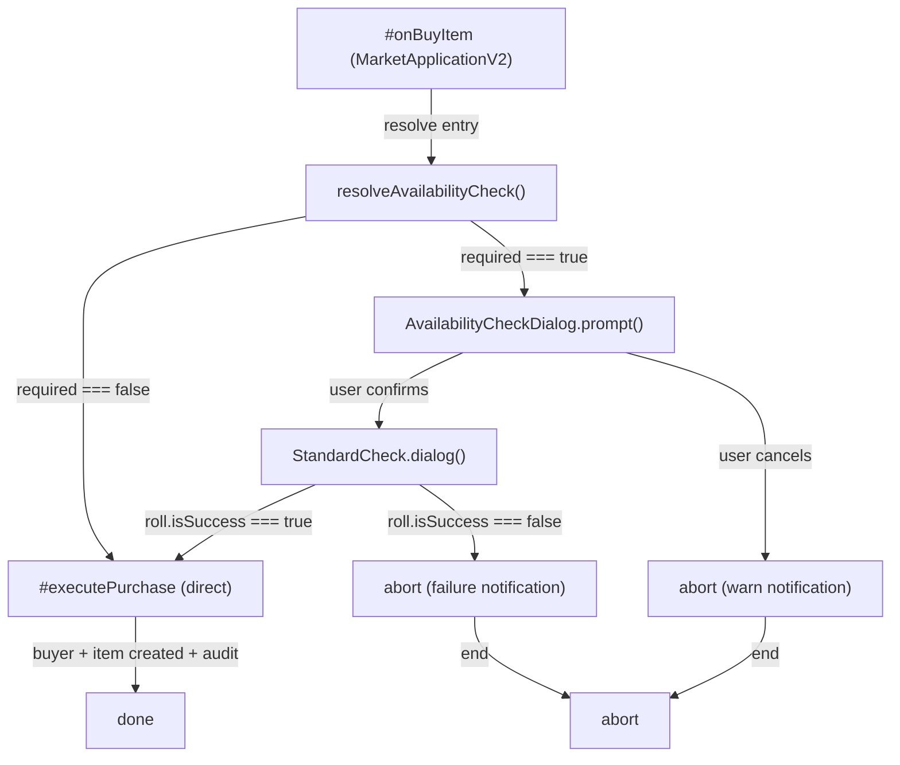

# Plan : Test de disponibilité obligatoire avant achat Market (Issue #480)

## Vue d'ensemble

**TL;DR** : Intercepter le flow d'achat dans `#onBuyItem` pour déclencher un test de compétence obligatoire (Négociation ou Pègre/Streetwise) lorsque la rareté effective ≥ 4 ou l'item est restreint/militaire/illégal. On réutilise `StandardCheck` + `StandardCheckDialog` existants. La logique pure de détermination (seuil, compétence, difficulté) vit dans un nouveau module `module/lib/market/availability-check.mjs`. Un dialog ApplicationV2 dédié (`AvailabilityCheckDialog`) affiche le contexte narratif avant le lancer de dés réel.

## Objectifs

1. **Bloquer les achats d'items rares/restreints sans test** : Items légaux avec rareté ≥ 4 nécessitent un test de Négociation. Items restreints/militaires/illégaux nécessitent un test de Pègre (Streetwise).
2. **Réutiliser le dice pool existant** : Intégrer `StandardCheck` et `StandardCheckDialog` sans modifications. Le test utilise la compétence du buyer et la difficulté calculée.
3. **Cohérence UX** : Dialog ApplicationV2 dédié, cohérent avec les patterns existants (NegotiationDialog, ConsequencesDialog).
4. **Auditabilité** : Capturer le résultat du test dans les logs audit ou notifications pour traçabilité.

## Périmètre détaillé

### Inclus

- Module logique pure `module/lib/market/availability-check.mjs` avec fonctions de détermination (`isAvailabilityCheckRequired`, `resolveAvailabilityCheck`)
- Dialog ApplicationV2 `AvailabilityCheckDialog` affichant contexte + boutons
- Intégration dans `#onBuyItem` de `MarketApplicationV2` pour interception du flow
- Calcul de difficulté réutilisant `rarityToDifficulty` de `negotiation.mjs`
- Choix de compétence basé sur `restrictionLevel` (restriction → streetwise, sinon → negotiation)
- Clés i18n EN/FR pour messages dialog, description narrative, résultats
- Tests unitaires pour logique pure (seuils, choix skill, DC)
- MàJ documentation si besoin

### Exclus

- Modification du `StandardCheck` ou `StandardCheckDialog` (réutilisation as-is)
- Migration rétroactive des achats passés
- Analytics ou graphiques sur les tests échoués
- Intégration avec d'autres systèmes de test (uniquement Market)

### Hypothèses

- L'item acheté a toujours un `rarity` (0–10) et `restrictionLevel` disponibles dans `MarketEntry`
- Le buyer a toujours les compétences requises (Negotiation ou Streetwise) accessibles via `actor.system.skills[skillKey]`
- Le `StandardCheck` accept un dictionnaire de données `{ actorId, skill, ability, dc }` pour construction du pool
- Le dialog applique la même permission check que `#onBuyItem` (buyer actor doit exister et être accessible)
- Le seuil de rareté pour déclencher un test est fixe en V1 (≥ 4)

### Contraintes

- Ne pas bloquer le Market si le test échoue silencieusement (notification warn suffisante)
- Pas de modification du flow existant de `#executePurchase` (injection du test avant seulement)
- Le dialog doit garder le buyer actor en contexte pour le lancer de dés
- Pas de dépendance à issue #477 (rareté contextuelle) en V1 — utiliser `entry.rarity` brut comme fallback

## Architecture



### Points d'entrée

1. **`#onBuyItem` dans `module/applications/market/market-application.mjs`** — appel `resolveAvailabilityCheck(entry)`, branching sur `required`
2. **`AvailabilityCheckDialog` nouvelle** — (`module/applications/market/availability-check-dialog.mjs`)
3. **`availability-check.mjs` nouveau** — (`module/lib/market/availability-check.mjs`)

### Snapshot de flux

```javascript
// 1. Résolution de l'availability check requirement
const checkSpec = resolveAvailabilityCheck({
  rarity: entry.rarity, // 0-10
  restrictionLevel: entry.restrictionLevel, // 'none' | 'restricted' | 'military' | 'illegal'
})

// 2. Si requis, afficher dialog et attendre résultat
if (checkSpec.required) {
  const dialogResult = await AvailabilityCheckDialog.prompt({
    entry,
    buyer,
    checkSpec,
  })
  if (!dialogResult?.passed) return // abort
}

// 3. Poursuivre vers #executePurchase
await MarketApplicationV2.#executePurchase.call(this, { item, entry, buyer })
```

## Structure des données

### Availability Check Spec (retour de `resolveAvailabilityCheck`)

```javascript
{
  required: true,
  skillKey: 'streetwise',       // 'negotiation' ou 'streetwise'
  difficulty: 3,                // 1-5 FFG difficulty
  rarity: 5,                    // used for description
  restrictionLevel: 'restricted', // used for description
  descriptionKey: 'MARKET.AvailabilityCheck.Description.Restricted'
}
```

### Dialog Result (retour de `AvailabilityCheckDialog.prompt()`)

```javascript
{
  confirmed: true,
  passed: true,          // roll.isSuccess
  roll: StandardCheck,   // for audit trail if needed
  successRanks: 2        // optional, for future narrative consequences
}
```

## Décisions architecturales clés

### D1 : Dialog séparé vs modal inline ?

**Décision** : ApplicationV2 dédié (`AvailabilityCheckDialog`), cohérent avec `NegotiationDialog`.

**Rationale** :

- Pattern déjà établi dans le projet (NegotiationDialog existe)
- Template + state isolé, réutilisable
- Separation of concerns : dialog présente contexte, délègue au StandardCheckDialog natif pour lancer de dés

**Trade-off** : une couche supplémentaire de prompts (AvailabilityCheckDialog → StandardCheckDialog), mais c'est intentionnel pour l'UX narrative

### D2 : Réutilisation de `rarityToDifficulty` ou recréer ?

**Décision** : Réutiliser `rarityToDifficulty` de `negotiation.mjs`, l'importer dans `availability-check.mjs`.

**Rationale** : Source unique de vérité, évite duplication. Le mapping rarity → difficulty est métier stable.

### D3 : Seuil de rareté fixe ou paramétrable ?

**Décision** : Seuil fixe ≥ 4 en V1, stockable dans `module/config/market.mjs` pour future extraction.

**Rationale** : Moins de complexité pour V1. Peut devenir configurable via settings ui future.

### D4 : Dépendance à #477 (rareté contextuelle) ?

**Décision** : NON. Utiliser `entry.rarity` brut. Planifier slot `effectiveRarity` dans la future V1.1.

**Rationale** : #477 est bloqué. `entry.rarity` suffit pour le MVP. Préparer un slot `effectiveRarity` optionnel dans les tests pour version future.

## Tâches implémentation

### 1. Module logique pure `availability-check.mjs`

**Fichiers** : `module/lib/market/availability-check.mjs`

**Contenu** :

```javascript
export const AVAILABILITY_CHECK_RARITY_THRESHOLD = 4
export const AVAILABILITY_CHECK_SKILLS = Object.freeze({
  restriction: 'streetwise', // restricted, military, illegal
  rarity: 'negotiation', // legal items with high rarity
})

export function isAvailabilityCheckRequired({ rarity, restrictionLevel }) {
  // Si restricted/military/illegal → test requis
  if (['restricted', 'military', 'illegal'].includes(restrictionLevel)) return true
  // Si rareté légale ≥ 4 → test requis (negotiation)
  return restrictionLevel === 'none' && rarity >= AVAILABILITY_CHECK_RARITY_THRESHOLD
}

export function resolveAvailabilityCheck({ rarity, restrictionLevel }) {
  if (!isAvailabilityCheckRequired({ rarity, restrictionLevel })) {
    return { required: false }
  }

  const isRestricted = ['restricted', 'military', 'illegal'].includes(restrictionLevel)
  const skillKey = isRestricted ? AVAILABILITY_CHECK_SKILLS.restriction : AVAILABILITY_CHECK_SKILLS.rarity
  const difficulty = rarityToDifficulty(rarity)
  const descriptionKey = isRestricted
    ? `MARKET.AvailabilityCheck.Description.${restrictionLevel}` // e.g. Description.Restricted
    : 'MARKET.AvailabilityCheck.Description.Rarity'

  return {
    required: true,
    skillKey,
    difficulty,
    rarity,
    restrictionLevel,
    descriptionKey,
  }
}
```

**Tests** :

- ✓ `isAvailabilityCheckRequired` = false si rarity < 4 et restriction 'none'
- ✓ `isAvailabilityCheckRequired` = true si rarity >= 4 et restriction 'none'
- ✓ `isAvailabilityCheckRequired` = true si restriction in ['restricted', 'military', 'illegal']
- ✓ `resolveAvailabilityCheck` retourne `{ required: false }` quand pas requis
- ✓ `resolveAvailabilityCheck` retourne `{ required: true, skillKey: 'negotiation', ... }` pour rarity ≥ 4
- ✓ `resolveAvailabilityCheck` retourne `{ required: true, skillKey: 'streetwise', ... }` pour restricted/military/illegal

### 2. Dialog ApplicationV2 `AvailabilityCheckDialog`

**Fichiers** : `module/applications/market/availability-check-dialog.mjs`

**Contenu** :

```javascript
export default class AvailabilityCheckDialog extends api.HandlebarsApplicationMixin(api.ApplicationV2) {
  static DEFAULT_OPTIONS = {
    id: 'market-availability-check',
    classes: ['swerpg', 'application', 'market-availability-check-dialog'],
    tag: 'div',
    window: {
      title: 'MARKET.AvailabilityCheck.Dialog.Title',
      minimizable: false,
      resizable: false,
    },
    position: { width: 450 },
    actions: {
      rollCheck: AvailabilityCheckDialog.#onRollCheck,
      cancel: AvailabilityCheckDialog.#onCancel,
    },
  }

  static PARTS = {
    form: {
      template: 'systems/swerpg/templates/market/availability-check-dialog.hbs',
    },
  }

  #entry = null
  #buyer = null
  #checkSpec = null

  constructor(options = {}) {
    super(options)
    this.#entry = options.entry
    this.#buyer = options.buyer
    this.#checkSpec = options.checkSpec
  }

  async _prepareContext(options) {
    const context = await super._prepareContext(options)
    const skill = SYSTEM.SKILLS[this.#checkSpec.skillKey]
    const actor = this.#buyer

    context.entry = {
      name: this.#entry.name,
      rarity: this.#entry.rarity,
      restrictionLevel: this.#entry.restrictionLevel,
    }
    context.checkSpec = {
      skillKey: this.#checkSpec.skillKey,
      skillName: skill?.name ?? this.#checkSpec.skillKey,
      difficulty: this.#checkSpec.difficulty,
      difficultyLabel: this._getDifficultyLabel(this.#checkSpec.difficulty),
      descriptionKey: this.#checkSpec.descriptionKey,
    }
    context.actor = {
      name: actor.name,
      skillRank: actor.system.skills[this.#checkSpec.skillKey]?.rank?.value ?? 0,
    }
    context.characteristic = {
      name: skill?.characteristic?.name ?? 'unknown',
      value: actor.system.characteristics[skill?.characteristic?.key]?.rank?.value ?? 0,
    }

    return context
  }

  _getDifficultyLabel(dc) {
    const diff = Object.entries(SYSTEM.dice.checkDifficulties).find(([k]) => parseInt(k) === dc)
    return diff ? diff[1] : 'Unknown'
  }

  static async #onRollCheck(_event, _target, _dialog) {
    const actor = this.#buyer
    const skillKey = this.#checkSpec.skillKey
    const skill = SYSTEM.SKILLS[skillKey]
    if (!skill) throw new Error(`Skill ${skillKey} not found in SYSTEM.SKILLS`)

    const skillRank = actor.system.skills[skillKey]?.rank?.value ?? 0
    const characteristic = actor.system.characteristics[skill.characteristic.key]?.rank?.value ?? 0
    const dc = this._dcForDifficulty(this.#checkSpec.difficulty)

    const roll = new StandardCheck({
      actorId: actor.id,
      skill: skillRank,
      ability: characteristic,
      dc,
      type: skillKey,
    })

    const result = await roll.dialog({
      title: game.i18n.format('MARKET.AvailabilityCheck.RollTitle', { skill: skill.name }),
      flavor: game.i18n.localize(this.#checkSpec.descriptionKey),
    })

    if (result === null) {
      return { confirmed: false, passed: false }
    }

    return {
      confirmed: true,
      passed: result.isSuccess,
      roll: result,
    }
  }

  _dcForDifficulty(difficulty) {
    // Map FFG difficulty (1-5) to d20 DC
    // difficulty 1 → DC 8, difficulty 2 → DC 11, ..., difficulty 5 → DC 20
    const dcMap = { 1: 8, 2: 11, 3: 14, 4: 17, 5: 20 }
    return dcMap[difficulty] ?? 14
  }

  static async #onCancel() {
    return { confirmed: false, passed: false }
  }

  static async prompt(options) {
    const dialog = new this(options)
    return dialog._prepareContext({}).then(() => {
      return new Promise((resolve) => {
        dialog.element.closest('.window-app').addEventListener('close', () => {
          resolve({ confirmed: false, passed: false })
        })
        const rollBtn = dialog.element.querySelector('[data-action="rollCheck"]')
        rollBtn?.addEventListener('click', async (e) => {
          e.preventDefault()
          const result = await AvailabilityCheckDialog.#onRollCheck.call(dialog, e, null, dialog)
          resolve(result)
          dialog.close()
        })
      })
    })
  }
}
```

**Template** : `templates/market/availability-check-dialog.hbs`

```handlebars
<section class='availability-check__content'>
  <h3 class='availability-check__header'>{{localize 'MARKET.AvailabilityCheck.Dialog.Title'}}</h3>

  <p class='availability-check__narrative'>
    {{localize checkSpec.descriptionKey}}
  </p>

  <div class='availability-check__specs'>
    <div class='spec-row'>
      <strong>{{localize 'MARKET.AvailabilityCheck.Item'}}:</strong>
      <span>{{entry.name}}</span>
    </div>
    <div class='spec-row'>
      <strong>{{localize 'MARKET.AvailabilityCheck.Skill'}}:</strong>
      <span>{{checkSpec.skillName}}</span>
    </div>
    <div class='spec-row'>
      <strong>{{localize 'MARKET.AvailabilityCheck.Difficulty'}}:</strong>
      <span>{{checkSpec.difficultyLabel}}</span>
    </div>
  </div>

  <footer class='availability-check__footer'>
    <button type='button' class='action-button frame-brown' data-action='rollCheck'>
      <i class='fas fa-dice'></i>
      {{localize 'MARKET.AvailabilityCheck.RollButton'}}
    </button>
    <button type='button' class='action-button' data-action='cancel'>
      {{localize 'MARKET.AvailabilityCheck.CancelButton'}}
    </button>
  </footer>
</section>
```

**Tests** :

- ✓ Dialog initializes avec entry, buyer, checkSpec
- ✓ Context preparé affiche skill name, difficulty label, actor name
- ✓ RollButton ouvre StandardCheckDialog
- ✓ Result passed/failed forwarded correctement

### 3. Intégration Market → Availability Check

**Fichiers** : `module/applications/market/market-application.mjs` (modification `#onBuyItem`)

**Contenu** (injection avant appel `#executePurchase`):

```javascript
// Dans #onBuyItem, après construction de entry :
const { resolveAvailabilityCheck } = await import('../../lib/market/availability-check.mjs')
const { AvailabilityCheckDialog } = await import('./availability-check-dialog.mjs')

const checkSpec = resolveAvailabilityCheck({
  rarity: entry.rarity,
  restrictionLevel: entry.restrictionLevel,
})

if (checkSpec.required) {
  const checkResult = await AvailabilityCheckDialog.prompt({
    entry,
    buyer,
    checkSpec,
  })

  if (!checkResult?.passed) {
    logger.debug('[Market] Availability check failed', { uuid, checkSpec })
    ui.notifications.warn(
      game.i18n.format('MARKET.AvailabilityCheck.FailedNotification', {
        skill: SYSTEM.SKILLS[checkSpec.skillKey].name,
        item: entry.name,
      }),
    )
    return
  }

  logger.info('[Market] Availability check passed', { uuid, checkSpec })
}

// Poursuivre vers #executePurchase
await MarketApplicationV2.#executePurchase.call(this, { item, entry, buyer })
```

**Tests** :

- ✓ Item avec rarity < 4 et restriction 'none' → pas de dialog, achat direct
- ✓ Item avec rarity >= 4 et restriction 'none' → dialog s'ouvre, negotiation skill
- ✓ Item restricted/military/illegal → dialog s'ouvre, streetwise skill
- ✓ Dialog cancel → abort achat, warn notification
- ✓ Dialog roll failure → abort achat, warn notification
- ✓ Dialog roll success → poursuivre #executePurchase

### 4. Clés i18n EN/FR

**Fichiers** : `lang/en.json`, `lang/fr.json`

**Clés EN** :

```json
{
  "MARKET.AvailabilityCheck.Dialog.Title": "Availability Check",
  "MARKET.AvailabilityCheck.RollTitle": "Availability Check: {skill}",
  "MARKET.AvailabilityCheck.Item": "Item",
  "MARKET.AvailabilityCheck.Skill": "Required Skill",
  "MARKET.AvailabilityCheck.Difficulty": "Difficulty",
  "MARKET.AvailabilityCheck.RollButton": "Roll Check",
  "MARKET.AvailabilityCheck.CancelButton": "Cancel Purchase",
  "MARKET.AvailabilityCheck.FailedNotification": "Failed to obtain {item}: {skill} check required.",
  "MARKET.AvailabilityCheck.Description.Rarity": "This item is rare. You must succeed at a Negotiation check to obtain it.",
  "MARKET.AvailabilityCheck.Description.Restricted": "This item is restricted. You must succeed at a Streetwise check to find it.",
  "MARKET.AvailabilityCheck.Description.Military": "This item is military-grade. You must succeed at a Streetwise check to acquire it.",
  "MARKET.AvailabilityCheck.Description.Illegal": "This item is illegal. You must succeed at a Streetwise check to secure it."
}
```

**Clés FR** :

```json
{
  "MARKET.AvailabilityCheck.Dialog.Title": "Vérification de disponibilité",
  "MARKET.AvailabilityCheck.RollTitle": "Vérification de disponibilité : {skill}",
  "MARKET.AvailabilityCheck.Item": "Article",
  "MARKET.AvailabilityCheck.Skill": "Compétence requise",
  "MARKET.AvailabilityCheck.Difficulty": "Difficulté",
  "MARKET.AvailabilityCheck.RollButton": "Lancer le test",
  "MARKET.AvailabilityCheck.CancelButton": "Annuler l'achat",
  "MARKET.AvailabilityCheck.FailedNotification": "Impossible d'obtenir {item} : test de {skill} échoué.",
  "MARKET.AvailabilityCheck.Description.Rarity": "Cet article est rare. Vous devez réussir un test de Négociation pour l'obtenir.",
  "MARKET.AvailabilityCheck.Description.Restricted": "Cet article est restreint. Vous devez réussir un test de Pègre pour le trouver.",
  "MARKET.AvailabilityCheck.Description.Military": "Cet article est militaire. Vous devez réussir un test de Pègre pour l'acquérir.",
  "MARKET.AvailabilityCheck.Description.Illegal": "Cet article est illégal. Vous devez réussir un test de Pègre pour le sécuriser."
}
```

### 5. Tests unitaires

**Fichiers** : `tests/lib/market/availability-check.test.mjs`

**Couverture** :

- ✓ `isAvailabilityCheckRequired` retourne `false` si rarity < 4 ET restriction === 'none'
- ✓ `isAvailabilityCheckRequired` retourne `true` si rarity >= 4 ET restriction === 'none'
- ✓ `isAvailabilityCheckRequired` retourne `true` pour restriction 'restricted'
- ✓ `isAvailabilityCheckRequired` retourne `true` pour restriction 'military'
- ✓ `isAvailabilityCheckRequired` retourne `true` pour restriction 'illegal'
- ✓ `resolveAvailabilityCheck` retourne `{ required: false }` si pas requis
- ✓ `resolveAvailabilityCheck` retourne skill 'negotiation' pour rarity >= 4, restriction 'none'
- ✓ `resolveAvailabilityCheck` retourne skill 'streetwise' pour restriction 'restricted'
- ✓ `resolveAvailabilityCheck` retourne skill 'streetwise' pour restriction 'military'
- ✓ `resolveAvailabilityCheck` retourne skill 'streetwise' pour restriction 'illegal'
- ✓ `resolveAvailabilityCheck` calcule difficulty via `rarityToDifficulty`
- ✓ `resolveAvailabilityCheck` retourne descriptionKey correct selon restriction

## Découpage en issues GitHub

| #   | Titre                                                                    | Périmètre                                                                                   | Dépendances | Story Points |
| --- | ------------------------------------------------------------------------ | ------------------------------------------------------------------------------------------- | ----------- | ------------ |
| 1   | **feat: Logique pure availability check (`availability-check.mjs`)**     | Pure functions, constants, `rarityToDifficulty` reuse, unit tests                           | —           | 5            |
| 2   | **feat: Dialog ApplicationV2 pour availability check**                   | `AvailabilityCheckDialog`, template Handlebars, integration StandardCheck                   | Issue 1     | 8            |
| 3   | **feat: Intégration Market → Availability Check dans `#onBuyItem`**      | Interception flow, branching, notification handling                                         | Issues 1, 2 | 5            |
| 4   | **chore: Clés i18n complètes (EN + FR) pour availability check**         | `lang/en.json`, `lang/fr.json`, validation                                                  | Issues 1–3  | 2            |
| 5   | **test: Tests Vitest pour availability check logic + integration tests** | Unit tests `availability-check.test.mjs`, integration tests Market flow (mock buyer + roll) | Issue 1     | 5            |
| 6   | **test: Tests E2E regression + manual tests (availability check flow)**  | Playwright regression, documentation tests manuels avec checklist                           | Issues 1–5  | 5            |

**Total estimation** : ~30 SP (2+ sprints)

## Considérations approfondies

### 1. Passage du résultat du test au flow

Le `AvailabilityCheckDialog.prompt()` retourne une promesse qui resolve quand :

- User clique Cancel → `{ confirmed: false, passed: false }`
- StandardCheckDialog.prompt() retourne un roll → `{ confirmed: true, passed: roll.isSuccess, roll }`

Pattern identique au `ConsequencesDialog` existant.

### 2. Intégration avec audit log (future)

Si audit log d'achat (issue #489–492) est activée, capturer optionnellement le résultat du test :

```javascript
// Future : dans recordItemPurchase, ajouter:
availabilityCheckResult: { passed: true, skill: 'negotiation', successRanks: 2 }
```

### 3. Rareté contextuelle (future, post-#477)

Planifier un slot dans `resolveAvailabilityCheck` pour `effectiveRarity` optionnel :

```javascript
export function resolveAvailabilityCheck({ rarity, restrictionLevel, effectiveRarity = null }) {
  const finalRarity = effectiveRarity ?? rarity // fallback
  // ...
}
```

### 4. Difficulté: Mapping FFG → d20 DC

Dans V1, utiliser un mapping simple `ffgDifficulty → d20 DC` :

| FFG | d20 |
| --- | --- |
| 1   | 8   |
| 2   | 11  |
| 3   | 14  |
| 4   | 17  |
| 5   | 20  |

Peut devenir configurable dans `module/config/market.mjs` future.

## Statut de déploiement (Preview)

Ceci est un plan de **Phase 1**, en attente de :

- ✅ Validation architecturale (cf HITL decisions D1–D4)
- ⏳ Review specification par stakeholder (GM/Player UX)
- ⏳ Implémentation échelonnée par issue

## Procédure de validation de succès

- ✅ Achat item rarity < 4, restriction 'none' → **pas de dialog**
- ✅ Achat item rarity >= 4, restriction 'none' → **dialog + negotiation skill test**
- ✅ Achat item restriction 'restricted' → **dialog + streetwise skill test**
- ✅ Achat item restriction 'military' → **dialog + streetwise skill test**
- ✅ Achat item restriction 'illegal' → **dialog + streetwise skill test**
- ✅ Test échoue → **abort + warn notification**
- ✅ Test réussit → **continue toward #executePurchase**
- ✅ Clés i18n EN/FR + messages cohérents
- ✅ Vitest unit + integration + E2E regression

## Prochaines étapes

1. **HITL Validation** : Review D1–D4 avec stakeholder
2. **Affinage** : Feedback utilisateur sur dialog UX, textes narratifs
3. **Créer issues GitHub** : Break down par issue, assigner priorités
4. **Implémentation** : 1 → 2 → 3 → 4 → 5 → 6
5. **Review + merge** : PR par issue avec tests, doc, i18n

---

## Annexe A : Exemple d'enchaînement utilisateur

1. **GM ouvre Market**, buyer = `Pax Mondala`
2. **Buyer cherche `Blaster Pistol (rarity=5, restriction='none')`**, clique "Buy"
3. **`#onBuyItem` détecte rarity=5 ≥ 4** → `resolveAvailabilityCheck` retourne `{ required: true, skillKey: 'negotiation', difficulty: 3, ... }`
4. **`AvailabilityCheckDialog` s'affiche** : "This item is rare. You must succeed at a Negotiation check to obtain it."
5. **Buyer clique "Roll Check"** → `StandardCheckDialog` s'affiche pour Negotiation (Pax Mondala has Negotiation rank 2, advantage 3)
6. **Buyer roule le pool**, obtient ✓✓ succès
7. **Dialog ferme** → `resolveAvailabilityCheck` retourne `{ confirmed: true, passed: true }`
8. **Market poursuit** → `#executePurchase`, item ajouté, crédits déduits, audit log enregistré
9. **Chat notification** : "Pax Mondala purchased Blaster Pistol for 500 credits"

---

## Notes finales

- Ce plan reste **draft subject to HITL review**
- Les codes de difficulté FFG → d20 DC peuvent être ajustés post-feedback
- La narrative française peut être améliorée pour cohérence Star Wars Edge RPG
- Tests manuels requis pour vérifier UX fluidity du dialog + StandardCheckDialog chaining
