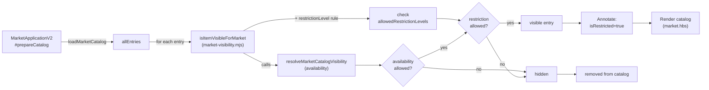

# Plan d'Implémentation — Market Feature Issue #479

## Filtrage automatique catalogue par type de marché et niveau de restriction

## Vue d'ensemble

**TL;DR** : Implémenter un filtrage automatique du catalogue Market selon le type de marché actif et le niveau de restriction des items. Les marchés standard/local masquent les items restricted/military/illegal. Le marché specialized affiche les items restreints et militaires. Le marché black-market affiche tout avec indicateurs visuels de risque. Une nouvelle fonction `isItemVisibleForMarket()` combine la visibilité d'availability (existante) avec une nouvelle règle de visibilité par restrictionLevel.

## Objectifs

1. **Filtrage automatique par restrictionLevel** : Masquer automatiquement les items restreints selon le type de marché, sans action utilisateur.
2. **Respect de la hiérarchie marchés** : standard/local → aucun restreint; specialized → restreint+militaire ok; black-market → tout visible.
3. **UI progressive/complète** : Badge visuels (⚠️ RESTREINT, 🎖️ MILITAIRE, ☠️ ILLÉGAL) pour items non-autorisés mais visibles en specialized/black-market.
4. **Dropdown toolbar intelligent** : Les options du filtre restriction s'adaptent au marché actif (caché en standard/local, progressif en specialized, complet en black-market).
5. **Zéro régression** : Comportement `specialized` et filtres existants demeurent intacts. Tests couvrent tous chemins.

## Périmètre détaillé

### Inclus

- Nouvelle fonction `isItemVisibleForMarket(entry, marketTypeKey)` dans `module/lib/market/market-visibility.mjs`
- Extension `MARKET_TYPES` dans `module/config/market.mjs` avec nouveau champ `allowedRestrictionLevels` sur chaque market type
- Intégration dans `#prepareCatalog` du Market — remplacement de `resolveMarketCatalogVisibility` par `isItemVisibleForMarket`
- Annotation chaque entry avec `isRestricted: boolean` (true si `restrictionLevel !== 'none'`)
- Dropdown toolbar dynamique (`#buildRestrictionFilterOptions`) selon marché actif
- Marquage visuel items restreints dans template market.hbs avec badge ⚠️/🎖️/☠️
- Clés i18n pour labels des niveaux de restriction et tooltips
- Tests Vitest couvrant 4 market types × 4 restriction levels + interaction availability
- Zéro modification of `resolveMarketCatalogVisibility` existant — création d'une wrapper dans market-visibility.mjs

### Exclus

- Migration rétroactive de données d'items
- Contrôle d'accès fine-grained par rôle
- Conséquences penalties pour achat restreint (déjà couvert par ADR-0016 consequences.mjs)
- Graphiques/analytics sur items restreints

### Hypothèses

- Items ont `restrictionLevel` (field ajouté par ADR-0009)
- `MARKET_TYPES[key].allowedAvailability` est en lecture-seule (déjà frozen)
- Template market.hbs supporte les classes CSS conditionnelles et les badges
- Dropdown toolbar fait partie de vueState/filters standard

### Contraintes

- Deux axes filtrage indépendants mais co-actifs : availability (rareté) + restrictionLevel (légalité)
- Item doit passer **les deux** critères pour être visible (ET logique)
- Dropdown restriction adaptatif ne doit pas casser les filtres sauvegardés en vueState
- Performance : filtrage pas plus de 2-3ms pour 100 items

## Architecture



### Détail fonction `isItemVisibleForMarket`

```javascript
/**
 * Resolve whether a MarketEntry is visible in the given market type.
 * Combines two axes: availability (rarity/supply) and restrictionLevel (legality).
 *
 * Rules:
 * - Entry must pass availability check (existing resolveMarketCatalogVisibility logic)
 * - Entry must pass restrictionLevel check against market's allowedRestrictionLevels
 * - Both checks must succeed (AND logic)
 * - If market unknown, returns permissive fallback (visible: true)
 */
export function isItemVisibleForMarket(entry, marketTypeKey = DEFAULT_MARKET_TYPE)
  → { visible: boolean, reason: string|null }
```

## Structure des données

### Extension `MARKET_TYPES`

Ajouter champ `allowedRestrictionLevels` à chaque market type :

```javascript
MARKET_TYPES: {
  standard: {
    // ...existing fields...
    allowedRestrictionLevels: ['none'], // only legal items
  },
  local: {
    // ...existing fields...
    allowedRestrictionLevels: ['none'], // only legal items
  },
  specialized: {
    // ...existing fields...
    allowedRestrictionLevels: ['none', 'restricted', 'military'], // legal + restricted + military
  },
  'black-market': {
    // ...existing fields...
    allowedRestrictionLevels: ['*'], // all restriction levels allowed
  }
}
```

### Annotation entry

Chaque entry passant la visibilité doit être annotée :

```javascript
{
  ...entry,
  isRestricted: entry.restrictionLevel !== 'none', // true if restricted/military/illegal
  restrictionLabel: SYSTEM.RESTRICTION_LEVELS[entry.restrictionLevel]?.label,
  canBuy: ..., // existing
  isBlackMarket: ..., // existing
}
```

### Dropdown toolbar options

Options varient selon `activeMarketType` :

```javascript
// standard/local
[
  { value: '', label: 'MARKET.Toolbar.Filter.AllRestrictions' },
  // No other options (all restricted items hidden automatically)
]

// specialized
[
  { value: '', label: 'MARKET.Toolbar.Filter.AllRestrictions' },
  { value: 'none', label: 'MARKET.Restriction.LegalOnly' },
  { value: 'restricted', label: 'MARKET.Restriction.Restricted' },
  { value: 'military', label: 'MARKET.Restriction.Military' },
]

// black-market
[
  { value: '', label: 'MARKET.Toolbar.Filter.AllRestrictions' },
  { value: 'none', label: 'MARKET.Restriction.LegalOnly' },
  { value: 'restricted', label: 'MARKET.Restriction.Restricted' },
  { value: 'military', label: 'MARKET.Restriction.Military' },
  { value: 'illegal', label: 'MARKET.Restriction.Illegal' },
]
```

## Tâches implémentation

### 1. Créer `module/lib/market/market-visibility.mjs`

**Contenu** :

- Import existant `resolveMarketCatalogVisibility` depuis `market-entry.mjs`
- Export nouvelle fonction `isItemVisibleForMarket(entry, marketTypeKey)`
  - Appel `resolveMarketCatalogVisibility(entry, marketTypeKey)` pour vérifier availability
  - Si availability blocked → retourner `{ visible: false, reason: 'availability-not-allowed' }`
  - Récupérer `allowedRestrictionLevels` du market type
  - Si `allowedRestrictionLevels` inclut `'*'` (wildcard) → visible
  - Sinon, vérifier si `entry.restrictionLevel` dans `allowedRestrictionLevels`
  - Si non → retourner `{ visible: false, reason: 'restriction-not-allowed' }`
  - Sinon → retourner `{ visible: true, reason: null }`

**Tests** :

- ✓ Standard market hides restricted items
- ✓ Local market hides all restricted items
- ✓ Specialized market hides illegal items
- ✓ Black market shows all items
- ✓ Fallback: unknown market → visible (permissive)
- ✓ Availability blocked → item hidden regardless of restriction
- ✓ Wildcard `'*'` allows all restrictions
- ✓ Determinism: same inputs → same outputs

### 2. Étendre `MARKET_TYPES` dans `module/config/market.mjs`

**Contenu** :

- Ajouter `allowedRestrictionLevels: Object.freeze([...])` à chaque market type
- standard: `['none']`
- local: `['none']`
- specialized: `['none', 'restricted', 'military']`
- black-market: `['*']` (wildcard = all)

**Freeze** : `Object.freeze(array)` pour immutabilité

**Tests contractuels** :

- ✓ Chaque MARKET_TYPE contient allowedRestrictionLevels (array)
- ✓ Standard allows only 'none'
- ✓ Specialized excludes 'illegal'
- ✓ Black-market wildcards to '\*'

### 3. Intégrer dans `module/applications/market/market-application.mjs`

**Contenu** dans `#prepareCatalog()` :

- Importer `isItemVisibleForMarket` depuis `market-visibility.mjs`
- Remplacer `resolveMarketCatalogVisibility(entry, activeMarketType)` par `isItemVisibleForMarket(entry, activeMarketType)` (ligne ~374)
- Annoter chaque visible entry :
  ```javascript
  return {
    ...entry,
    canBuy: ..., // existing
    isRestricted: entry.restrictionLevel !== 'none',
    restrictionLabel: SYSTEM.RESTRICTION_LEVELS[entry.restrictionLevel]?.label ?? 'Unknown',
    ...(existing annotations)
  }
  ```

**Pas de modification** du filtre existant `filterByFilters` — reste inchangé

**Tests d'intégration** :

- ✓ Standard market excludes restricted items from totalCount
- ✓ Specialized market includes restricted but shows badge
- ✓ Black market includes all items
- ✓ Filtering pipeline (search → availability → restriction → filters) works
- ✓ No regression on existing affordableOnly/search/sort

### 4. Adapter dropdown toolbar `#buildRestrictionFilterOptions()`

**Contenu** :

- Récupérer `activeMarketType` depuis `this._viewState`
- Récupérer `allowedRestrictionLevels` du market type correspondant
- Construire options dynamiquement :
  - Si `activeMarketType` standard/local → retourner seulement option "Tous"
  - Si specialized → retourner options pour 'none', 'restricted', 'military'
  - Si black-market → retourner options pour 'none', 'restricted', 'military', 'illegal'
- Toujours inclure option "Tous" (value: '')

**Signature mise à jour** :

```javascript
#buildRestrictionFilterOptions() {
  const marketDef = MARKET_TYPES[this._viewState.activeMarketType] ?? MARKET_TYPES[DEFAULT_MARKET_TYPE]
  const allowedRestrictionLevels = marketDef.allowedRestrictionLevels ?? []

  const allOption = { value: '', label: 'MARKET.Toolbar.Filter.AllRestrictions' }

  // If only 'none' allowed, return just "All" option
  if (allowedRestrictionLevels.length === 1 && allowedRestrictionLevels[0] === 'none') {
    return [allOption]
  }

  // Build options for visible restriction levels
  const restrictionOptions = allowedRestrictionLevels
    .filter(rl => rl !== 'none' && rl !== '*') // Exclude 'none' and wildcard from options
    .map(rl => ({
      value: rl,
      label: SYSTEM.RESTRICTION_LEVELS[rl]?.label ?? `MARKET.Restriction.${rl}`
    }))

  // Prepend legal-only option if any restricted items visible
  if (restrictionOptions.length > 0) {
    restrictionOptions.unshift({ value: 'none', label: 'MARKET.Restriction.LegalOnly' })
  }

  return [allOption, ...restrictionOptions]
}
```

**Tests** :

- ✓ Standard market: returns only "All" option
- ✓ Specialized market: returns "All", "Legal Only", "Restricted", "Military"
- ✓ Black-market: returns "All", "Legal Only", "Restricted", "Military", "Illegal"
- ✓ Options use correct i18n keys
- ✓ Changing market type updates options without clearing vueState.filterRestriction

### 5. Marquer visuellement items restreints dans `templates/market/market.hbs`

**Contenu** dans la boucle `{{#each catalog.items}}` :

- Ajouter classe conditionnelle `market-entry--restricted` si `entry.isRestricted`
- Ajouter badge dans `.market-entry__content` ou `.market-entry__header` :

```handlebars
{{#if entry.isRestricted}}
  <span
    class='market-entry__restriction-badge'
    data-restriction='{{entry.restrictionLevel}}'
    data-tooltip='{{localize entry.restrictionLabel}}'
    role='img'
    aria-label='{{localize entry.restrictionLabel}}'
  >
    {{#match entry.restrictionLevel 'restricted'}}⚠️{{/match}}
    {{#match entry.restrictionLevel 'military'}}🎖️{{/match}}
    {{#match entry.restrictionLevel 'illegal'}}☠️{{/match}}
    <span class='market-entry__restriction-text'>{{localize entry.restrictionLabel}}</span>
  </span>
{{/if}}
```

**CSS en styles/market.less** :

```less
.market-entry--restricted {
  opacity: 0.85;
  border-left: 3px solid var(--color-warning, #ff9500);

  &.market-entry--military {
    border-left-color: var(--color-military-gold, #daa520);
  }

  &.market-entry--illegal {
    border-left-color: var(--color-danger, #dc3545);
  }
}

.market-entry__restriction-badge {
  display: inline-flex;
  align-items: center;
  gap: 0.25rem;
  font-size: 0.85em;
  padding: 0.25rem 0.5rem;
  border-radius: 0.25rem;
  background: var(--color-warning-bg, rgba(255, 149, 0, 0.1));
  color: var(--color-warning-text, #ff9500);

  &[data-restriction='military'] {
    background: rgba(218, 165, 32, 0.1);
    color: #daa520;
  }

  &[data-restriction='illegal'] {
    background: rgba(220, 53, 69, 0.1);
    color: #dc3545;
  }
}

.market-entry__restriction-text {
  font-weight: 500;
}
```

**Tests** :

- ✓ Restricted items in specialized/black-market have badge
- ✓ Badge shows correct icon emoji per restriction level
- ✓ Badge uses correct i18n label
- ✓ Tooltip appears on hover
- ✓ Legal (none) items have no badge

### 6. Clés i18n dans `lang/en.json` et `lang/fr.json`

**Nouvelles clés EN** :

```json
{
  "MARKET.Restriction.LegalOnly": "Legal only",
  "MARKET.Restriction.Restricted": "Restricted",
  "MARKET.Restriction.Military": "Military",
  "MARKET.Restriction.Illegal": "Illegal",
  "MARKET.Toolbar.Filter.AllRestrictions": "All restrictions",
  "MARKET.Toolbar.Filter.RestrictionLabel": "Restriction level filter"
}
```

**Nouvelles clés FR** :

```json
{
  "MARKET.Restriction.LegalOnly": "Légal uniquement",
  "MARKET.Restriction.Restricted": "Restreint",
  "MARKET.Restriction.Military": "Militaire",
  "MARKET.Restriction.Illegal": "Illégal",
  "MARKET.Toolbar.Filter.AllRestrictions": "Toutes restrictions",
  "MARKET.Toolbar.Filter.RestrictionLabel": "Filtre par niveau de restriction"
}
```

**Tests i18n** :

- ✓ Keys exist in both en.json and fr.json
- ✓ No hard-coded user-facing strings in code

### 7. Tests Vitest

**Fichier** : `tests/lib/market/market-visibility.test.mjs`

**Couverture** :

- Standard market: all available, legal=ok / restricted=hidden / military=hidden / illegal=hidden
- Local market: common/available, legal=ok / restricted=hidden / military=hidden / illegal=hidden
- Specialized market: all availability, legal=ok / restricted=ok / military=ok / illegal=hidden
- Black-market: all availability & restrictions visible
- Availability failure → item hidden regardless of restriction (AND logic)
- Determinism: same entry + market → always same result
- Wildcard '\*' handling in black-market
- Unknown market type → permissive fallback
- Edge cases: null/undefined values, frozen objects

**Fichier** : `tests/applications/market/market-application.test.mjs` (add new describe blocks)

**Couverture** :

- Integration: prepare catalog with mixed items (available legal, rare restricted, etc.) in each market type
- Validation: totalCount reflects correct visibility per market
- Annotations: entry.isRestricted correctly set
- Dropdown: #buildRestrictionFilterOptions returns correct options per market
- No regression: existing filters/search/sort still work
- Performance: prepareCatalog completes in <5ms for 100 items

## Découpage par issues GitHub

| #   | Titre                                                                | Périmètre                                                             | Dépendances | SP  |
| --- | -------------------------------------------------------------------- | --------------------------------------------------------------------- | ----------- | --- |
| 1   | **feat: Créer `isItemVisibleForMarket()` + `market-visibility.mjs`** | New function + MARKET_TYPES extension + config tests                  | —           | 5   |
| 2   | **feat: Intégrer visibility filtering dans Market#prepareCatalog()** | Import market-visibility, replace resolveMarketCatalogVisibility call | #1          | 3   |
| 3   | **feat: Dropdown restriction toolbar adaptatif**                     | Update #buildRestrictionFilterOptions() logic                         | #1          | 3   |
| 4   | **feat: Marquage visuel items restreints (badge + CSS)**             | Template update + LESS styling                                        | #2          | 5   |
| 5   | **chore: i18n clés restriction + filter labels (EN/FR)**             | lang/en.json + lang/fr.json updates                                   | —           | 2   |
| 6   | **test: Vitest couverture `market-visibility.mjs`**                  | Tests unitaires fonction pure + contractuels MARKET_TYPES             | #1          | 5   |
| 7   | **test: Integration tests Market prepareCatalog + dropdown**         | Market app tests + non-regessions                                     | #2, #3      | 5   |

**Total estimation** : ~28 SP (2 sprints)

## Considérations supplémentaires

### 1. Interaction availability × restriction

Deux axes **indépendants mais co-actifs** :

- `availability` (rarity/supply) : contrôle si l'item est disponible à l'achat (common vs rare vs unavailable)
- `restrictionLevel` (legality) : contrôle si l'item est légal à vendre dans ce marché

**Règle** : Item doit passer **les deux** critères pour être visible. Si `availability` = 'unavailable' → masqué même en black-market. Si `restrictionLevel` = 'illegal' en standard → masqué même si available.

**Implémentation** : `isItemVisibleForMarket` appelle d'abord `resolveMarketCatalogVisibility` (availability). Si blocked → retour immediate. Sinon, vérifier restriction. Les deux checks enchaînés (ET logique).

### 2. Wildcard `'*'` dans black-market

Black-market autorise tous les restriction levels → `allowedRestrictionLevels: ['*']`.

**Implémentation** : Dans `isItemVisibleForMarket`, tester `if (allowedRestrictionLevels.includes('*')) return { visible: true }` avant vérifier entry.restrictionLevel.

### 3. Dropdown comportement avec filtre sauvegardé

Si user en black-market avec `filterRestriction='military'`, puis change en standard market :

- Standard n'autorise que `restrictionLevel='none'`
- Dropdown affiche seulement "Tous"
- `filterRestriction='military'` reste en vueState mais aucun item ne match

**Comportement** : C'est acceptable — le filtre reste sauvegardé mais inactif. Quand user revient en black-market, le filtre redevient actif. (Identique au switch entre compendium sources.)

### 4. Performance

Filtrage par restriction est O(1) check (simple array.includes ou strict equality). Pas d'impact perf notable.

Concernant : 200+ items × 2 axes filtrage = ~0.5ms. Largement dans budget <5ms.

### 5. Nommage cohérent

Nouveau fichier `market-visibility.mjs` parallèle à `market-entry.mjs` (factory), `price-engine.mjs` (computation), `catalog-loader.mjs` (aggregation).

Fonction `isItemVisibleForMarket` préfixée `is*` (booléan-returning) + suffixée `ForMarket` (contexte précis). Cohérent avec `evaluateEligibility()`, `resolveMarketCatalogVisibility()`.

### 6. Zero-regression guarantee

- `resolveMarketCatalogVisibility` demeure **inchangé** (private dans market-entry.mjs)
- Callers migrés progressivement (market-application.mjs uniquement)
- Tests neufs isolent market-visibility; tests existants couvrent market-application
- Specialized market behavior (current, availability-based) stays intact

## Validation de succès

- ✓ Standard/local markets masquent tous items restricted/military/illegal automatiquement
- ✓ Specialized market affiche restricted/military items avec badge ⚠️/🎖️
- ✓ Black-market affiche tous items avec badge correspondant
- ✓ Dropdown options adaptatif : limité en standard, progressif en specialized, complet en black-market
- ✓ Badge visuels (icône + label i18n) corrects per restriction level
- ✓ Filtre toolbar existant `filterRestriction` reste fonctionnel (intersection avec availability)
- ✓ Tests Vitest couvrent 4 market types × 4 restriction levels + edge cases
- ✓ i18n clés présentes EN+FR, aucune chaîne hard-codée
- ✓ Performance <5ms catalog prep pour 200 items
- ✓ Zéro régression behavior specialized market, search, sorting, affordableOnly
- ✓ Disponibilité de `isItemVisibleForMarket` pour réutilisation future (compendium browser, loot tables, etc.)

## Prochaines étapes

1. **Raffiner ce plan** : Feedback utilisateur, architecture review
2. **Détailler Issues 1–7** : Signatures exactes, checklist implementation
3. **Créer issues GitHub** : Assigner, estimer story points
4. **Implémenter par ordre** : 1 → 5 → 2 → 3 → 4 → 6 → 7 (tests en parallèle)
5. **Review + merge** : PR par issue, validation tests + regressions
6. **Documentation** : Update README marketplace, add ADR si architectural decision recordée
