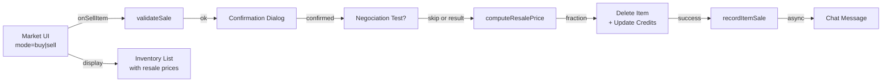

# Plan : Vente d'items via le Market (Issue #478)

## Vue d'ensemble

**TL;DR** : Ajouter un mode "vente" au Market permettant à un acteur de vendre ses items (weapon/armor/gear). La logique de valorisation pure (`sell-valuation.mjs`) calcule le prix de revente (25%/50%/75% du basePrice selon négociation). L'UI ajoute un onglet/PART "Mes articles" listant l'inventaire vendable. Un test de Négociation optionnel améliore le prix. La transaction supprime l'item (`deleteEmbeddedDocuments`) et crédite l'acteur (`update`). L'audit log enregistre via un nouveau type `item.sale`.

## Objectifs

1. **Traçabilité complète** : Chaque vente d'item via le Market est enregistrée dans l'audit log du personnage avec type `item.sale`.
2. **Logique de valorisation pure** : Calcul du prix de revente indépendant de Foundry, testable en isolation.
3. **Négociation optionnelle** : Un test de Négociation/Persuasion/Tromperie peut améliorer la fraction de revente (25% → 50% → 75%).
4. **Interface cohérente** : Mode buy/sell dans le même Market, UI inventaire vendable claire.
5. **Mutations complètes** : Suppression d'item + crédit d'acteur atomiques, audit log synchronisé.

## Périmètre détaillé

### Inclus

- Nouveau module `sell-valuation.mjs` — logique pure de calcul prix revente
- Nouveau module `sell-validation.mjs` — validation logique vente
- PART `inventory` dans MarketApplicationV2 stateful avec mode buy/sell
- Action `sellItem` — orchestre validation → négociation optionnelle → mutations
- Nouveau type audit `item.sale` + `recordItemSale()`
- Famille de filtre `sales` dans Character Audit Log
- Tests Vitest complets (valuation, validation, intégration)
- Clés i18n EN/FR pour tous les nouveaux termes

### Exclus

- Migration rétroactive des ventes passées
- Historique des prix de revente par item type
- Vente par lot (un item à la fois)
- Intégration avec autres systèmes de commerce tiers-partis
- Restrictions de localisation ou légales (toutes les ventes autorisées au même titre que les achats)

### Hypothèses

- L'acteur qui vend possède l'item (UX: liste seulement les items de l'inventaire)
- Les items vendables sont les mêmes que les types achetables (`PURCHASABLE_ITEM_TYPES`)
- Le test de négociation utilise le même pool que à l'achat (Négociation/Persuasion/Tromperie)
- Les crédits sont déduits/crédités via `actor.update({ 'system.credits': newValue })` direct
- Le Market UI peut basculer entre buy/sell sans fermer/rouvrir

### Contraintes

- Pas de modification du flow d'achat existant
- Vente non bloquée si audit log échoue (non-critical)
- Taille max audit log existante (FIFO) doit être respectée
- Item supprimé ← avant → crédits créditées dans le même `update()`
- Aucune ressource Foundry ne doit être laissée orpheline

## Architecture



### Points d'entrée

1. **Market UI** (`module/applications/market/market-application.mjs`) — mode toggle, inventory PART, action `sellItem`
2. **Sell Valuation** (`module/lib/market/sell-valuation.mjs`) — calcul prix revente pur
3. **Sell Validation** (`module/lib/market/sell-validation.mjs`) — vérifications inventaire/type
4. **Audit Log** (`module/utils/audit-log.mjs`) — enregistre `item.sale`, famille `sales`
5. **Character Audit Log UI** (`module/applications/character-audit-log.mjs`) — affiche et filtre ventes

### Données d'exemple

```javascript
// Input
const actor = { /* ... */ }
const item = { name: 'Blaster Pistol', type: 'weapon', system: { price: 100 } }

// sell-validation
const validation = validateSale({ actor, item })
// ✓ { canSell: true }

// Negociation (optional, user choice)
const negotiationResult = { successRanks: 1, isDisaster: false, outcome: 'success' }

// sell-valuation
const valuation = computeResalePrice({
  basePrice: 100,
  negotiationOutcome: 'success' // or 'failure', 'triumph', 'disaster'
})
// ✓ { resalePrice: 50, fraction: 0.5 }

// Audit Entry
{
  type: 'item.sale',
  data: {
    itemId: '...',
    itemName: 'Blaster Pistol',
    itemType: 'weapon',
    basePrice: 100,
    resalePrice: 50,
    fraction: 0.5,
    negotiationOutcome: 'success'
  },
  creditDelta: 50,
  snapshot: { creditsBefore: 100, creditsAfter: 150, creditsDelta: 50 },
  timestamp: 1234567890,
  userId: 'user-123'
}
```

## Tâches implémentation

### 1. Créer `module/lib/market/sell-valuation.mjs`

**Fichiers** : `module/lib/market/sell-valuation.mjs`, tests `tests/lib/market/sell-valuation.test.mjs`

**Contenu** :

```javascript
// Constants
export const SELL_BASE_FRACTION = 0.25 // 25% de basePrice
export const SELL_NEGOTIATED_FRACTION = 0.5 // 50% avec succès
export const SELL_MAX_FRACTION = 0.75 // 75% avec triomphe
export const SELL_DISASTER_FRACTION = 0.1 // 10% en cas de désastre

// Pure function
export function computeResalePrice({ basePrice, negotiationOutcome = 'failure' }) {
  // Validate inputs
  if (!Number.isFinite(basePrice) || basePrice < 0) {
    throw new TypeError(`basePrice must be a non-negative number, got ${basePrice}`)
  }

  // Determine fraction based on negotiation outcome
  let fraction = SELL_BASE_FRACTION
  if (negotiationOutcome === 'triumph') {
    fraction = SELL_MAX_FRACTION
  } else if (negotiationOutcome === 'success') {
    fraction = SELL_NEGOTIATED_FRACTION
  } else if (negotiationOutcome === 'disaster') {
    fraction = SELL_DISASTER_FRACTION
  }

  // Calculate and floor
  const resalePrice = Math.floor(basePrice * fraction)

  return {
    resalePrice,
    fraction,
    basePrice,
    outcome: negotiationOutcome,
  }
}
```

**Tests** :

- ✓ Calcul standard 25% du basePrice
- ✓ Succès → 50%
- ✓ Triomphe → 75%
- ✓ Désastre → 10%
- ✓ Valeur négative rejetée
- ✓ basePrice = 0 → resalePrice = 0
- ✓ Résultat toujours un entier (Math.floor)

### 2. Créer `module/lib/market/sell-validation.mjs`

**Fichiers** : `module/lib/market/sell-validation.mjs`, tests `tests/lib/market/sell-validation.test.mjs`

**Contenu** :

```javascript
import { PURCHASABLE_ITEM_TYPES } from '../../config/market.mjs'

/**
 * @typedef {Object} SaleValidationResult
 * @property {boolean} canSell       Whether all pre-conditions are satisfied
 * @property {string}  reason        Machine-readable reason key
 * @property {string}  [messageKey]  i18n key for user-facing message
 */

export function validateSale({ actor, item } = {}) {
  // Validate actor
  if (!actor || typeof actor !== 'object') {
    return {
      canSell: false,
      reason: 'missing-actor',
      messageKey: 'MARKET.Sale.Error.MissingActor',
    }
  }

  // Validate item
  if (!item || typeof item !== 'object') {
    return {
      canSell: false,
      reason: 'missing-item',
      messageKey: 'MARKET.Sale.Error.MissingItem',
    }
  }

  // Check item type is sellable
  if (!item.type || !(item.type in PURCHASABLE_ITEM_TYPES)) {
    return {
      canSell: false,
      reason: 'unsellable-type',
      messageKey: 'MARKET.Sale.Error.UnsellableType',
    }
  }

  // Check item exists in actor's inventory
  const hasItem = actor.items && Array.isArray(actor.items) ? actor.items.some((i) => i.id === item.id || i.uuid === item.uuid) : false

  if (!hasItem) {
    return {
      canSell: false,
      reason: 'not-in-inventory',
      messageKey: 'MARKET.Sale.Error.NotInInventory',
    }
  }

  // Check basePrice exists
  const basePrice = item.system?.price ?? 0
  if (typeof basePrice !== 'number' || basePrice < 0) {
    return {
      canSell: false,
      reason: 'invalid-price',
      messageKey: 'MARKET.Sale.Error.InvalidPrice',
    }
  }

  return {
    canSell: true,
    reason: '',
    basePrice,
  }
}
```

**Tests** :

- ✓ Item vendable retourne `canSell: true`
- ✓ Type non vendable rejeté
- ✓ Item absent de l'inventaire rejeté
- ✓ Prix négatif rejeté
- ✓ Tous les messageKey sont définis

### 3. Modifier `MarketApplicationV2` — ajouter PART `inventory` et state toggle

**Fichiers** : `module/applications/market/market-application.mjs`

**Contenu** :

- Ajouter `mode: 'buy' | 'sell'` à `_viewState`
- Ajouter PART dans `static PARTS`:
  ```javascript
  inventory: {
    template: 'systems/swerpg/templates/market/market-inventory.hbs',
    scrollable: ['.market-inventory']
  }
  ```
- Ajouter action `toggleMode: MarketApplicationV2.#onToggleMode`
- Ajouter action `sellItem: MarketApplicationV2.#onSellItem`
- Dans `_preparePartContext`:
  ```javascript
  if (partId === 'inventory' && this._viewState.mode === 'sell') {
    context.inventory = this.#prepareInventory(buyer)
  }
  ```

### 4. Implémenter action `#onSellItem`

**Fichiers** : `module/applications/market/market-application.mjs`

**Contenu** :

```javascript
static async #onSellItem(_event, target) {
  const seller = this._buyerActor
  if (!seller) return

  const itemId = target.dataset?.itemId
  if (!itemId) return

  const item = seller.items.get(itemId)
  if (!item) {
    ui.notifications.error('MARKET.Sale.Error.ItemNotFound')
    return
  }

  // Validate sale
  const validation = validateSale({ actor: seller, item })
  if (!validation.canSell) {
    ui.notifications.warn(game.i18n.localize(validation.messageKey))
    return
  }

  // Compute resale price (base 25%)
  const valuation = computeResalePrice({
    basePrice: validation.basePrice,
    negotiationOutcome: 'failure'
  })

  // Show confirmation dialog
  const currentCredits = seller.system?.creditBudget?.availableCredits ?? seller.system?.credits ?? 0
  const creditsAfter = currentCredits + valuation.resalePrice

  const confirmed = await foundry.applications.api.DialogV2.confirm({
    window: {
      title: game.i18n.format('MARKET.Sale.Confirm.Title', { name: item.name })
    },
    content: `<p>${game.i18n.format('MARKET.Sale.Confirm.Content', {
      name: item.name,
      price: valuation.resalePrice,
      credits: currentCredits,
      remaining: creditsAfter
    })}</p>`,
    yes: {
      label: game.i18n.format('MARKET.Sale.Confirm.Sell', { price: valuation.resalePrice }),
      icon: 'fa-solid fa-coins'
    },
    no: {
      label: game.i18n.localize('MARKET.Sale.Confirm.Cancel'),
      icon: 'fa-solid fa-xmark'
    }
  })

  if (!confirmed) return

  // Optional: allow negotiation
  const offerNegotiation = await foundry.applications.api.DialogV2.confirm({
    window: {
      title: 'MARKET.Sale.Negotiate.Title'
    },
    content: game.i18n.localize('MARKET.Sale.Negotiate.Offer'),
    yes: {
      label: 'MARKET.Sale.Negotiate.Accept',
      icon: 'fa-solid fa-handshake'
    },
    no: {
      label: 'MARKET.Sale.Negotiate.Skip',
      icon: 'fa-solid fa-xmark'
    }
  })

  let finalValuation = valuation
  if (offerNegotiation) {
    // Open NegotiationDialog (reuse existing for selling)
    const negotiationResult = await NegotiationDialog.prompt({
      entry: { name: item.name, rarity: item.system?.rarity ?? 0 },
      buyer: seller,
      forSale: true
    })

    if (negotiationResult?.confirmed) {
      finalValuation = computeResalePrice({
        basePrice: validation.basePrice,
        negotiationOutcome: negotiationResult.outcome
      })
    }
  }

  // Execute sale: delete item + credit actor
  try {
    await seller.deleteEmbeddedDocuments('Item', [item.id])
    const newCredits = currentCredits + finalValuation.resalePrice
    await seller.update({ 'system.credits': newCredits })

    // Record in audit log
    try {
      const { recordItemSale } = await import('../../utils/audit-log.mjs')
      await recordItemSale(seller, {
        itemName: item.name,
        itemType: item.type,
        basePrice: validation.basePrice,
        resalePrice: finalValuation.resalePrice,
        fraction: finalValuation.fraction,
        negotiationOutcome: finalValuation.outcome,
        creditsAfter: newCredits,
        itemId: item.id
      })
    } catch (auditErr) {
      logger.warn('[Market] Could not record item sale audit entry', auditErr)
    }

    ui.notifications.info(
      game.i18n.format('MARKET.Sale.Success', {
        name: item.name,
        price: finalValuation.resalePrice,
        remaining: newCredits
      })
    )

    logger.info('[Market] Item sale completed', {
      actorId: seller.id,
      actorName: seller.name,
      itemId: item.id,
      itemName: item.name,
      basePrice: validation.basePrice,
      resalePrice: finalValuation.resalePrice,
      creditsAfter: newCredits
    })

    await this.render()
  } catch (err) {
    logger.error('[Market] Sale failed', err)
    ui.notifications.error('MARKET.Sale.Error.WriteFailed')
  }
}
```

### 5. Créer template `templates/market/market-inventory.hbs` et intégrer dans Market

**Fichiers** : `templates/market/market-inventory.hbs`

**Contenu** :

```handlebars
{{! Market Inventory — part: inventory }}
<div class='market-inventory scrollable' data-application-part='inventory'>
  <div class='market-selector'>
    <p class='market-selector__description'>{{localize 'MARKET.Inventory.Description'}}</p>
  </div>

  {{#if inventory.items.length}}
    <div class='inventory-list'>
      {{#each inventory.items as |item|}}
        <div class='inventory-item' data-item-id='{{item.id}}'>
          <div class='inventory-item__header'>
            
            <div class='inventory-item__info'>
              <h3 class='inventory-item__name'>{{item.name}}</h3>
              <p class='inventory-item__type'>{{localize item.typeLabel}}</p>
            </div>
          </div>
          <div class='inventory-item__pricing'>
            <div class='inventory-item__price-row'>
              <span class='label'>{{localize 'MARKET.Inventory.BasePrice'}}:</span>
              <span class='value'>{{item.basePrice}}</span>
            </div>
            <div class='inventory-item__price-row estimate'>
              <span class='label'>{{localize 'MARKET.Inventory.ResaleEstimate'}}:</span>
              <span class='value'>{{item.resaleEstimate}} ({{item.resaleFraction}}%)</span>
            </div>
          </div>
          <button
            class='inventory-item__sell-btn'
            data-action='sellItem'
            data-item-id='{{item.id}}'
            aria-label='{{localize "MARKET.Inventory.SellAriaLabel"}} {{item.name}}'
          >
            {{localize 'MARKET.Inventory.SellButton'}}
            {{item.resaleEstimate}}
            {{localize 'MARKET.Currency'}}
          </button>
        </div>
      {{/each}}
    </div>
  {{else}}
    <div class='inventory-empty'>
      <p>{{localize 'MARKET.Inventory.Empty'}}</p>
    </div>
  {{/if}}
</div>
```

### 6. Ajouter type audit `item.sale` + `recordItemSale()`

**Fichiers** : `module/utils/audit-log.mjs`, `module/applications/character-audit-log.mjs`

**Contenu dans audit-log.mjs** :

```javascript
export async function recordItemSale(actor, { itemName, itemType, basePrice, resalePrice, fraction, negotiationOutcome = 'failure', creditsAfter, itemId }) {
  const ts = Date.now()
  const creditsBefore = actor.system?.creditBudget?.availableCredits ?? actor.system?.credits ?? null
  const creditsDelta = creditsBefore !== null && creditsAfter !== null ? creditsAfter - creditsBefore : null
  const snapshot = { creditsBefore, creditsAfter, creditsDelta }
  const user = game.users?.get(game.user?.id) ?? null

  const entry = {
    ...makeEntry({
      type: 'item.sale',
      data: {
        itemName,
        itemType,
        basePrice,
        resalePrice,
        fraction,
        negotiationOutcome,
        itemId,
      },
      xpDelta: 0,
      ts,
      userId: game.user?.id,
      user,
      snapshot,
    }),
    creditDelta: resalePrice,
  }

  await writeLogEntries(actor, [entry])
}
```

**Contenu dans character-audit-log.mjs** :

- Ajouter `sales: 'sales'` à `AUDIT_LOG_FAMILIES`
- Ajouter mapping dans `AUDIT_LOG_FILTER_LABELS`
- Ajouter case dans `getAuditLogFamily()`: `case 'item.sale': return AUDIT_LOG_FAMILIES.sales`
- Ajouter case dans `buildAuditLogDescription()`:
  ```javascript
  case 'item.sale':
    return game.i18n.format('SWERPG.AUDIT_LOG.DESCRIPTION.ITEM_SALE', {
      itemName: data.itemName,
      itemType: data.itemType,
      resalePrice: data.resalePrice,
      fraction: Math.round(data.fraction * 100)
    })
  ```
- Ajouter case dans `_buildChatContext()`:
  ```javascript
  case 'item.sale':
    return {
      actorImg: actor.img ?? '',
      actorName: actor.name,
      eventLabel: game.i18n.localize('SWERPG.AUDIT_LOG.TYPE.ITEM_SALE'),
      previousValue: null,
      nextValue: `${data.itemName} (${data.itemType})`,
      description: game.i18n.format('SWERPG.AUDIT_LOG.DESCRIPTION.ITEM_SALE', {
        itemName: data.itemName,
        resalePrice: data.resalePrice
      }),
      metaLeft: game.i18n.format('SWERPG.AUDIT_LOG.META.SoldFor', { price: data.resalePrice }),
      metaRight: game.i18n.format('SWERPG.AUDIT_LOG.META.RemainingCredits', { credits: snapshot.creditsAfter }),
      hasMeta: true,
      variant: 'gain'
    }
  ```

### 7. Clés i18n complètes EN/FR

**Fichiers** : `lang/en.json`, `lang/fr.json`

**Clés** :

```json
{
  "MARKET.Sell.Confirm.Title": "Sell {name}",
  "MARKET.Sell.Confirm.Content": "<p>Confirm sale of <strong>{name}</strong> for <strong>{price} credits</strong>.</p><p>Current credits: {credits} → {remaining} after sale</p>",
  "MARKET.Sell.Confirm.Sell": "Sell for {price}",
  "MARKET.Sell.Confirm.Cancel": "Cancel",
  "MARKET.Sell.Negotiate.Title": "Improve Resale Price",
  "MARKET.Sell.Negotiate.Offer": "Attempt to negotiate a better price? (Uses Negotiation, Persuasion, or Deception skill)",
  "MARKET.Sell.Negotiate.Accept": "Attempt Negotiation",
  "MARKET.Sell.Negotiate.Skip": "Keep Base Price (25%)",
  "MARKET.Sale.Success": "Sold {name} for {price} credits. Credits remaining: {remaining}",
  "MARKET.Sale.Error.MissingActor": "No seller actor found.",
  "MARKET.Sale.Error.MissingItem": "Item not found.",
  "MARKET.Sale.Error.UnsellableType": "This item type cannot be sold.",
  "MARKET.Sale.Error.NotInInventory": "Item is not in your inventory.",
  "MARKET.Sale.Error.InvalidPrice": "Item has no valid base price.",
  "MARKET.Sale.Error.ItemNotFound": "Item was not found in your inventory.",
  "MARKET.Sale.Error.WriteFailed": "Failed to complete sale. Check console.",
  "MARKET.Inventory.Description": "Select items from your inventory to sell.",
  "MARKET.Inventory.BasePrice": "Base Price",
  "MARKET.Inventory.ResaleEstimate": "Resale Estimate (25%)",
  "MARKET.Inventory.SellAriaLabel": "Sell",
  "MARKET.Inventory.SellButton": "Sell",
  "MARKET.Inventory.Empty": "Your inventory is empty or contains no sellable items.",
  "MARKET.Currency": "credits",
  "SWERPG.AUDIT_LOG.TYPE.ITEM_SALE": "Item sold",
  "SWERPG.AUDIT_LOG.FILTER.SALES": "Sales",
  "SWERPG.AUDIT_LOG.DESCRIPTION.ITEM_SALE": "Sold {itemName} ({itemType}) for {resalePrice} credits ({fraction}% of base price)",
  "SWERPG.AUDIT_LOG.META.SoldFor": "Sold for {price} credits",
  "SWERPG.AUDIT_LOG.META.RemainingCredits": "{credits} credits remaining"
}
```

**Équivalents FR** :

```json
{
  "MARKET.Sell.Confirm.Title": "Vendre {name}",
  "MARKET.Sell.Confirm.Content": "<p>Confirmer la vente de <strong>{name}</strong> pour <strong>{price} crédits</strong>.</p><p>Crédits actuels : {credits} → {remaining} après vente</p>",
  "MARKET.Sell.Confirm.Sell": "Vendre pour {price}",
  "MARKET.Sell.Confirm.Cancel": "Annuler",
  "MARKET.Sell.Negotiate.Title": "Améliorer le prix de revente",
  "MARKET.Sell.Negotiate.Offer": "Tenter de négocier un meilleur prix ? (Utilise Négociation, Persuasion ou Tromperie)",
  "MARKET.Sell.Negotiate.Accept": "Tenter une négociation",
  "MARKET.Sell.Negotiate.Skip": "Garder le prix de base (25%)",
  "MARKET.Sale.Success": "{name} vendu pour {price} crédits. Crédits restants : {remaining}",
  "MARKET.Sale.Error.MissingActor": "Aucun vendeur trouvé.",
  "MARKET.Sale.Error.MissingItem": "Article non trouvé.",
  "MARKET.Sale.Error.UnsellableType": "Ce type d'article ne peut pas être vendu.",
  "MARKET.Sale.Error.NotInInventory": "L'article n'est pas dans votre inventaire.",
  "MARKET.Sale.Error.InvalidPrice": "L'article n'a pas de prix de base valide.",
  "MARKET.Sale.Error.ItemNotFound": "L'article n'a pas été trouvé dans votre inventaire.",
  "MARKET.Sale.Error.WriteFailed": "Impossible de compléter la vente. Consulter la console.",
  "MARKET.Inventory.Description": "Sélectionnez des articles dans votre inventaire à vendre.",
  "MARKET.Inventory.BasePrice": "Prix de base",
  "MARKET.Inventory.ResaleEstimate": "Estimation de revente (25%)",
  "MARKET.Inventory.SellAriaLabel": "Vendre",
  "MARKET.Inventory.SellButton": "Vendre",
  "MARKET.Inventory.Empty": "Votre inventaire est vide ou ne contient aucun article vendable.",
  "MARKET.Currency": "crédits",
  "SWERPG.AUDIT_LOG.TYPE.ITEM_SALE": "Article vendu",
  "SWERPG.AUDIT_LOG.FILTER.SALES": "Ventes",
  "SWERPG.AUDIT_LOG.DESCRIPTION.ITEM_SALE": "Vente de {itemName} ({itemType}) pour {resalePrice} crédits ({fraction}% du prix de base)",
  "SWERPG.AUDIT_LOG.META.SoldFor": "Vendu pour {price} crédits",
  "SWERPG.AUDIT_LOG.META.RemainingCredits": "{credits} crédits restants"
}
```

### 8. Tests Vitest

**Fichiers** : `tests/lib/market/sell-valuation.test.mjs`, `tests/lib/market/sell-validation.test.mjs`, tests d'intégration dans `tests/applications/market/market-application.test.mjs`

**Coverage** :

- ✓ sell-valuation: calcul 25/50/75%, désastre, bornes, Math.floor
- ✓ sell-validation: items vendables, non-vendables, inventaire, prix invalides
- ✓ action sellItem: validation failure flow, confirmation aborted, successful sale
- ✓ audit log: type item.sale enregistré, famille sales affichée, CSV contient creditDelta

## Découpage en issues GitHub

| #   | Titre                                                           | Périmètre                                         | Dépendances | Story Points |
| --- | --------------------------------------------------------------- | ------------------------------------------------- | ----------- | ------------ |
| 1   | **feat: sell-valuation.mjs — logique pure calcul prix revente** | sell-valuation.mjs, tests pour fractions          | —           | 5            |
| 2   | **feat: sell-validation.mjs — validation logique vente**        | sell-validation.mjs, tests pour inventaire        | Issue 1     | 3            |
| 3   | **feat: UI Market PART inventory + mode toggle buy/sell**       | market-application.mjs PARTS, UI template         | Issues 1–2  | 8            |
| 4   | **feat: Action sellItem — orchestration vente complète**        | market-application.mjs action, deleteEmbedded     | Issues 1–3  | 8            |
| 5   | **feat: Type audit item.sale + recordItemSale()**               | audit-log.mjs, character-audit-log.mjs            | Issues 1–4  | 5            |
| 6   | **feat: Template market-inventory.hbs et styling**              | templates/market, styles/market.less              | Issues 3–5  | 3            |
| 7   | **feat: Intégration négociation optionnelle pour vente**        | NegotiationDialog adapt, sell-valuation.mjs adapt | Issues 1–5  | 5            |
| 8   | **chore: Clés i18n complètes (EN + FR) pour item sale**         | lang/en.json, lang/fr.json                        | Issues 1–7  | 2            |
| 9   | **test: Tests Vitest sellItem action, audit log integration**   | tests/ complets, e2e smoke regression             | Issues 1–8  | 8            |

**Total estimation** : ~47 SP (3 sprints de développement)

## Considérations supplémentaires

### 1. Mode UI (buy/sell)

**Question** : Ajouter un toggle buy/sell dans le header du Market (même fenêtre, même PART switch) plutôt qu'un onglet ApplicationV2 séparé ?

**Recommandation** : Oui, toggle dans le header du Market avec deux boutons "Buy" / "Sell" qui basculent `_viewState.mode = 'buy' | 'sell'`. Cela :

- Reste cohérent avec l'architecture existante (`_viewState`)
- Évite perte de contexte (Market fermeture/réouverture)
- Réutilise le même Market window plutôt que deux apps
- Permet au joueur de passer rapidement buy → sell → buy sans friction

### 2. Crédits : mutation directe

**Question** : À l'achat, crédits déduits automatiquement via `_prepareCredits()`. À la vente, faut-il un `actor.update()` explicite ?

**Recommandation** : Oui, `actor.update({ 'system.credits': currentCredits + salePrice })` direct après `deleteEmbeddedDocuments`. Raison :

- La suppression d'un item ne "rend" pas les crédits automatiquement
- L'update est atomique avec la suppression dans le même tick
- Gérée immédiatement post-vente sans raccrochage

### 3. Item équipé

**Question** : Interdire vente si equipped, ou déséquiper automatiquement ?

**Recommandation** : Interdire la vente avec message clair "Item is currently equipped. Unequip it first to sell." Raison :

- Évite surprise utilisateur (perdre une arme équipée)
- Cohérent avec achat existant (pas de cas limite)
- Laisse contrôle explicite au joueur
- Facilite debug si problème

### 4. Négociation pour vente

**Question** : Est-ce que NegotiationDialog réutilisable pour sell, ou créer SaleNegotiationDialog ?

**Recommandation** : Adapter le `NegotiationDialog` existant via paramètre `forSale: boolean`. Cela :

- Réutilise la logique de skill selection et success computation
- Réduit duplication de code
- Même UX pour buy/sell negotiation
- Simpler à tester

### 5. Audit trail

**Question** : Tracer le `negotiationOutcome` dans audit log ?

**Recommandation** : Oui, ajouter `negotiationOutcome` à `entry.data` pour vente. Cela :

- Facilite audit finance (comprendre % final appliqué)
- Trace les comportements de négociation
- Aide diagnostic si besoin

## Validation de succès

- ✓ Chaque vente est enregistrée dans `actor.flags.swerpg.logs` avec type `item.sale`
- ✓ Item supprimé de l'inventaire après vente réussie
- ✓ Crédits de l'acteur augmentés du prix de revente
- ✓ Un message chat est envoyé avec variante `gain` (vert)
- ✓ Le filtre "Sales" affiche/masque les entrées vente correctement
- ✓ Négociation optionnelle modifie la fraction (25% → 50% → 75%)
- ✓ Export CSV inclut les ventes avec creditDelta positif
- ✓ Tests Vitest couvrent tous les chemins happy path et erreur
- ✓ Aucun blocage du Market si audit échoue
- ✓ Clés i18n EN/FR complètes et testées

## Prochaines étapes

1. **Affiner ce plan** : Feedback utilisateur sur UI mode toggle, négociation optionnelle, fraction par défaut
2. **Détailler Issue 1** : sell-valuation.mjs avec signature exacte et tous les tests
3. **Créer issues GitHub** : Break down par issue, estimer, assigner
4. **Implémenter par ordre** : Domaine pur (1–2) → UI (3–6) → Audit (5) → Négociation (7) → Tests (9)
5. **Review + merge** : PR par issue avec tests, doc, i18n validés

---

## Statut (Template pour future mise à jour)

### Phases à compléter

- [ ] Phase 1 : Logique pure (Issues #1–2)
- [ ] Phase 2 : UI et mutations (Issues #3–6)
- [ ] Phase 3 : Audit et i18n (Issues #5, #8)
- [ ] Phase 4 : Négociation et tests (Issues #7–9)

---
