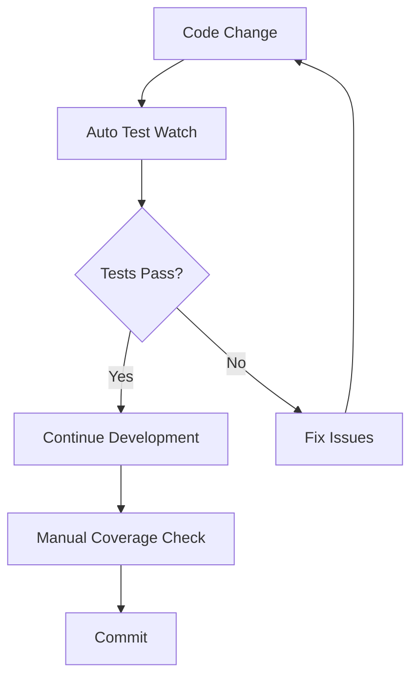
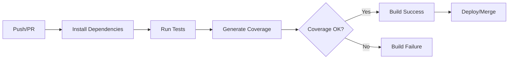
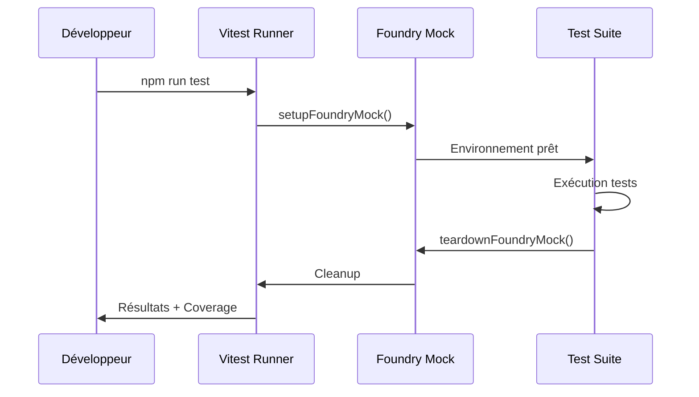

# Stratégie de Tests - Système SweRPG

## Vue d'ensemble

Le système SweRPG (Star Wars Edge RPG pour FoundryVTT) implémente une stratégie de test complète basée sur **Vitest** pour garantir la fiabilité des mécaniques de jeu complexes et l'intégration avec FoundryVTT v13.

## Architecture de Test

### Configuration Principale

#### Vitest Configuration (`vitest.config.js`)

```javascript
export default defineConfig({
  test: {
    setupFiles: ['./tests/vitest-setup.js'],
    coverage: {
      provider: 'v8',
      reporter: ['text', 'lcov', 'html'],
      reportsDirectory: './coverage',
    },
  },
})
```

#### Setup Global (`tests/vitest-setup.js`)

```javascript
beforeEach(() => {
  setupFoundryMock()
  ensureFoundryUtils()
  vi.clearAllMocks()
})

afterEach(() => {
  vi.clearAllMocks()
  teardownFoundryMock()
})
```

### Structure des Tests

```text
tests/
├── vitest-setup.js              # Configuration globale Vitest
├── setupTests.js               # Setup spécifique (legacy)
├── helpers/
│   └── mock-foundry.mjs        # Mocks centralisés FoundryVTT
├── utils/                      # Factories de test
│   ├── actors/actor.mjs        # Factory acteurs
│   ├── skills/skill.mjs        # Factory compétences
│   ├── talents/talent.mjs      # Factory talents
│   └── characteristics/characteristic.mjs
├── lib/                        # Tests logique métier
│   ├── skills/                 # Tests compétences
│   ├── talents/                # Tests talents
│   └── jauges/                 # Tests jauges
├── applications/               # Tests UI/Sheets
└── utils/                      # Tests utilitaires
```

## Patterns de Test

Respect des Meilleures Pratiques Vitest :
✅ Pattern AAA (Arrange-Act-Assert)
✅ Isolation des tests avec beforeEach/afterEach
✅ Mocks centralisés et cleanup automatique
✅ Tests paramétrés pour les cas multiples
✅ Gestion complète des cas de bordure

### 1. Organisation des Tests

#### Nomenclature

- **Tests unitaires** : `*.test.mjs` (logique métier)
- **Tests d'intégration** : `*.spec.js` (composants, sheets)
- **Structure miroir** : `/tests/` reflète `/module/`

#### Organisation en blocs

```javascript
describe('Career Free Skill', () => {
  describe('process a skill', () => {
    describe('should return an error skill if', () => {
      describe('you train a skill', () => {
        test('and career free skill rank is greater than 1', () => {
          // Test spécifique
        })
      })
    })
  })
})
```

### 2. Mocking Foundry VTT

Toujours utiliser un mock pour les appels aux APIs de FoundryVtt lorsque que l'on exécute via un Tests Unitaires.

Ne jamais faire de `// Defensive access to global Foundry object for test environments where it may be undefined.` sur les appels d'API de FoundryVTT pour éviter des problèmes lorsque l'on exécute du code dans un contexte de Test Unitaire qui n'a pas accès à Foundry VTT.

#### Mock Centralisé (`tests/helpers/mock-foundry.mjs`)

Enrichir les mocks si besoin. Si les mocks sont enrichis alors il faut enrichir ce document.

```javascript
export function setupFoundryMock(options = {}) {
  globalThis.foundry = {
    applications: {
      api: { HandlebarsApplicationMixin: (base) => base },
    },
    utils: { deepClone, getProperty, mergeObject },
  }

  globalThis.game = {
    i18n: { localize: vi.fn((key) => translations[key] || key) },
    system: { config: {} },
    packs: new Map(),
  }

  globalThis.ui = {
    notifications: {
      error: vi.fn(),
      warn: vi.fn(),
      info: vi.fn(),
    },
  }
}
```

#### Utilitaires Mock

- **`setCombatMock()`** : Mock système de combat
- **`addPacksMock()`** : Mock compendia
- **`extendFoundryMock()`** : Extension dynamique

### 3. Factories de Test

#### Factory Acteur (`tests/utils/actors/actor.mjs`)

Enrichir si nécessaire les Factory d'objet Foundry VTT. Si c'est enrichi, il faut les rajouter dans ce document.

```javascript
export function createActor({ careerSpent = 0, specializationSpent = 0, items = [] } = {}) {
  return {
    items,
    freeSkillRanks: {
      career: { spent: careerSpent, gained: 4, available: 4 },
    },
    experiencePoints: {
      spent: 0,
      gained: 0,
      total: 100,
      available: 100,
    },
    system: {
      skills: {
        /* structure complète */
      },
    },
  }
}
```

#### Factory Talent (`tests/utils/talents/talent.mjs`)

```javascript
export function createTalentData(id, { name = 'talent-name', type = 'talent', isRanked = false } = {}) {
  const baseData = {
    name,
    type,
    id,
    system: {
      trees: ['Item.assassin00000000'],
      isRanked,
      rank: { idx: 0, cost: 0 },
    },
  }

  baseData.updateSource = function (changes) {
    // Simulation méthode Foundry
  }

  return baseData
}
```

### 4. Patterns de Test Async

#### Test avec Mocks d'Actor

```javascript
test('should update the state of the train talent', async () => {
  const data = createTalentData('1')
  const actor = createActor({ items: [] })

  const updateMock = vi.fn().mockResolvedValue({})
  actor.update = updateMock

  const createEmbeddedDocumentsMock = vi.fn().mockResolvedValue([data.toObject()])
  actor.createEmbeddedDocuments = createEmbeddedDocumentsMock

  const trainedTalent = new TrainedTalent(actor, data, params, options)
  await trainedTalent.updateState()

  expect(updateMock).toHaveBeenCalledTimes(1)
  expect(createEmbeddedDocumentsMock).toHaveBeenCalledWith('Item', [data.toObject()])
})
```

#### Gestion des Erreurs

```javascript
test('create embedded fails', async () => {
  const createEmbeddedDocumentsMock = vi.fn().mockRejectedValueOnce(new Error('Erreur sur create embedded'))
  actor.createEmbeddedDocuments = createEmbeddedDocumentsMock

  const result = await processedTalent.updateState()

  expect(result).toBeInstanceOf(ErrorTalent)
  expect(result.options.message).toContain('Erreur sur create embedded')
})
```

## Stratégie de Couverture

### Scripts NPM

```json
{
  "scripts": {
    "test": "vitest",
    "test:watch": "vitest --watch",
    "test:coverage": "pnpm vitest run --coverage"
  }
}
```

### Rapports de Couverture

- **Provider** : V8 (performance optimale)
- **Formats** : Text, LCOV, HTML
- **Répertoire** : `./coverage/`
- **Intégration CI/CD** : GitHub Actions

## Exigences Fonctionnelles Couvertes

### Compétences (Skills)

- **Requirement** : Validation des rangs de compétences gratuites
- **Type** : Must
- **Rationale** : Éviter l'exploitation des règles de progression
- **Source** : `tests/lib/skills/career-free-skill.test.mjs`
- **Priority** : Must have
- **Category** : Performance/Game Balance

### Talents

- **Requirement** : Gestion des coûts et prérequis des talents
- **Type** : Must
- **Rationale** : Intégrité du système de progression
- **Source** : `tests/lib/talents/trained-talent.test.mjs`
- **Priority** : Must have
- **Category** : Maintainability

### Intégration FoundryVTT

- **Requirement** : Simulation complète de l'environnement FoundryVTT
- **Type** : Must
- **Rationale** : Tests fiables sans dépendance externe
- **Source** : `tests/helpers/mock-foundry.mjs`
- **Priority** : Must have
- **Category** : Maintainability

## Exigences Non-Fonctionnelles

### Performance

- **Tests rapides** : < 100ms par test unitaire
- **Feedback instantané** : Mode watch pour développement
- **Parallélisation** : Exécution simultanée des suites

### Maintenabilité

- **Structure miroir** : Navigation intuitive tests ↔ code
- **Factories réutilisables** : DRY pour setup de données
- **Mocks centralisés** : Cohérence entre tests

### Fiabilité

- **Isolation** : Chaque test indépendant
- **Reproductibilité** : Même résultat à chaque exécution
- **Mock complet** : Pas de dépendance FoundryVTT réel

## Workflows de Test

### Développement Local



### CI/CD Pipeline



### Test Execution Strategy



## Patterns Avancés

### Test Logging Integration

```javascript
vi.mock('../../../module/utils/logger.mjs', () => ({
  logger: {
    debug: vi.fn(),
    info: vi.fn(),
    warn: vi.fn(),
    error: vi.fn(),
  },
}))
```

### Mock Dynamic Extension

```javascript
beforeEach(() => {
  extendFoundryMock({
    applications: {
      sheets: { CustomSheet: MockCustomSheet },
    },
  })
})
```

### Test Data Builders

```javascript
const complexActor = createActor().withExperience(150).withSkills(['cool', 'discipline']).withTalents(['adversary', 'lethal-blows']).build()
```

## Métriques et Monitoring

### Objectifs de Couverture

- **Branches** : 80%+
- **Functions** : 80%+
- **Lines** : 80%+
- **Statements** : 80%+

### Types de Tests

- **Unit Tests** : ~70% (logique métier isolée)
- **Integration Tests** : ~25% (composants + interactions)
- **End-to-End Tests** : ~5% (workflows complets)

## Migration et Évolution

### Historique

- **v1.0** : Jest → Vitest migration (ADR-0004)
- **v1.1** : Ajout coverage V8
- **v1.2** : Mock FoundryVTT centralisé

### Roadmap

- **Phase 2** : Tests E2E avec Playwright
- **Phase 3** : Visual regression testing
- **Phase 4** : Performance benchmarking

## Troubleshooting

### Problèmes Courants

#### Mock Path Issues

```javascript
// ❌ Incorrect
vi.mock('../../module/utils/logger.mjs')

// ✅ Correct
vi.mock('../../../module/utils/logger.mjs')
```

#### Async Test Timeouts

```javascript
// Configuration timeout
test('slow operation', async () => {
  // Implementation
}, 10000) // 10s timeout
```

#### Memory Leaks

```javascript
afterEach(() => {
  vi.clearAllMocks()
  teardownFoundryMock()
  // Force garbage collection
  if (global.gc) global.gc()
})
```

## Documentation Process

### Fichiers Analysés

- `vitest.config.js` - Configuration principale
- `tests/vitest-setup.js` - Setup global
- `tests/helpers/mock-foundry.mjs` - Mocks centralisés
- `tests/utils/**/*.mjs` - Factories de test
- `tests/lib/**/*.test.mjs` - Tests métier
- `tests/applications/**/*.spec.js` - Tests UI
- `package.json` - Scripts et dépendances
- `docs/adr/adr-0004-vitest-testing-strategy.md` - ADR référence

### Processus de Documentation

1. **Analyse du code source** - Exploration structure tests
2. **Identification des patterns** - Extraction patterns récurrents
3. **Cartographie fonctionnelle** - Mapping features ↔ tests
4. **Documentation workflows** - Processus développement
5. **Création diagrammes** - Visualisation architecture

Cette documentation sert de référence complète pour comprendre, maintenir et faire évoluer la stratégie de test du système SweRPG.
