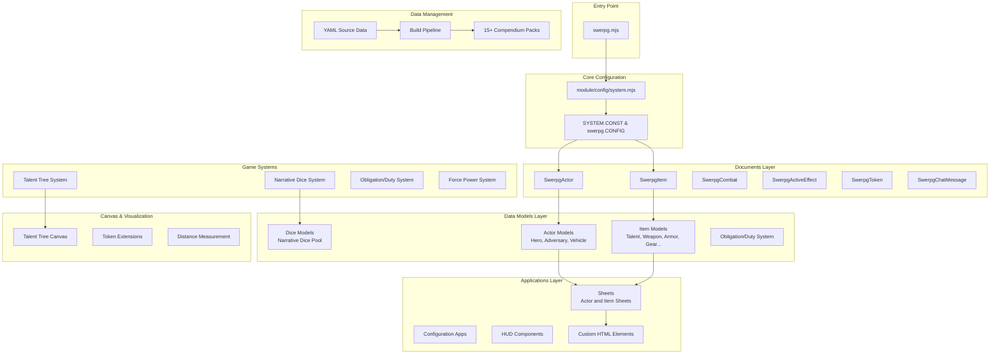
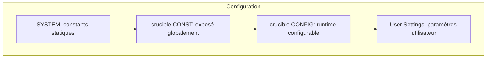
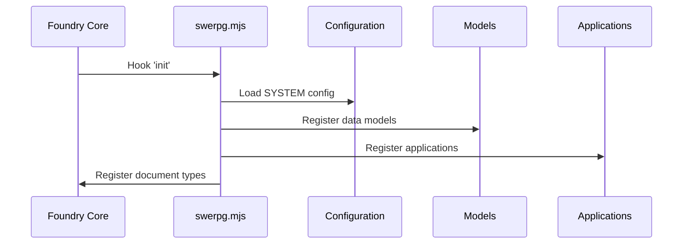
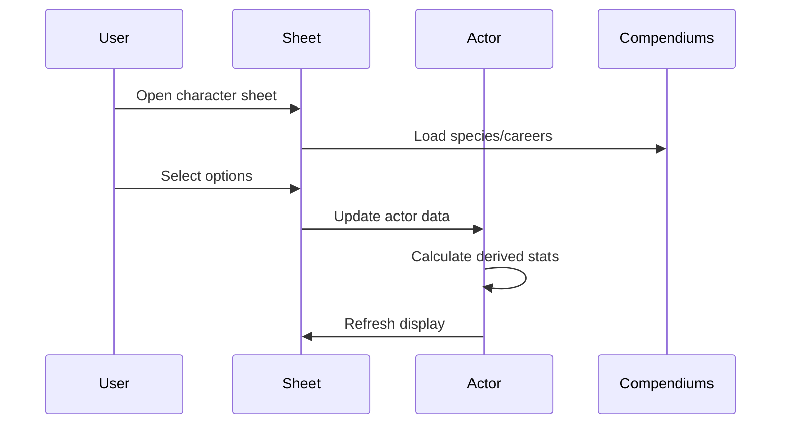
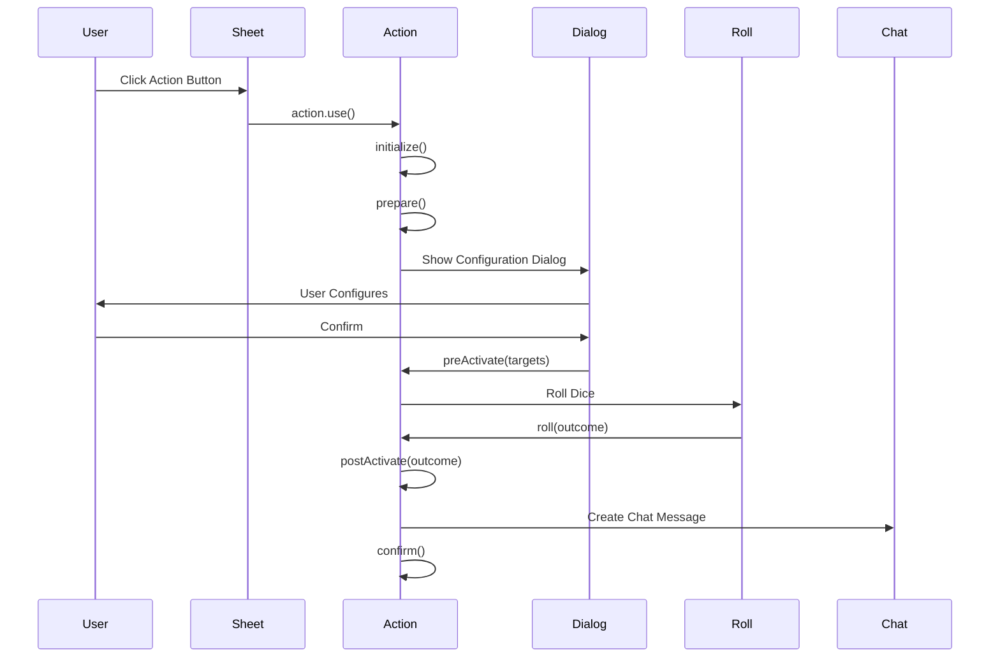

# Architecture Overview - Système Star Wars Edge RPG (swerpg)

## Introduction

Star Wars Edge RPG (swerpg) est un système de jeu de rôle narratif conçu exclusivement pour Foundry Virtual Tabletop v13+. L'architecture tire parti des capacités uniques de Foundry VTT pour offrir une automatisation riche du système de dés narratifs tout en maintenant l'esprit cinématographique de Star Wars.

## Architecture Globale



## Principes Architecturaux

### 1. Séparation des Préoccupations

L'architecture sépare clairement :

- **Documents** : Extensions des classes de base Foundry
- **Configuration** : Toutes les constantes dans `/module/config/`
- **Data Models** : Logique métier dans `/module/models/` utilisant `TypeDataModel`
- **Interface** : Composants UI dans `/module/applications/` implémentant `ApplicationV2`
- **Données** : Sources YAML dans `/_source/`, compilées vers `/packs/`

### 2. Hiérarchie de Configuration



### 3. Pattern de Données

Swerpg utilise le pattern **TypeDataModel** de Foundry v13 :

```javascript
// Définition du schéma
static defineSchema() {
  return {
    fieldName: new fields.StringField({...options})
  }
}

// Préparation des données
prepareBaseData() { /* Données brutes */ }
prepareDerivedData() { /* Données calculées */ }
```

## Composants Principaux

### Configuration Système (`/module/config/`)

```javascript
// Structure principale de configuration
export const SYSTEM = {
    id: "swerpg",
    CONST: {
        DICE: { /* Types de dés narratifs */ },
        SKILLS: { /* Compétences par catégorie */ },
        CHARACTERISTICS: { /* 6 caractéristiques */ },
        OBLIGATIONS: { /* Types d'obligations */ }
    }
};
```

#### Fichiers de Configuration Clés

- **`system.mjs`** : Configuration centrale et constantes
- **`dice.mjs`** : Définition des dés narratifs et symboles
- **`skills.mjs`** : Compétences organisées par catégories
- **`attributes.mjs`** : Caractéristiques et dérivées
- **`talent-tree.mjs`** : Structure des arbres de talents

### Documents Foundry (`/module/documents/`)

### Document Extensions

| Document | Classe | Responsabilité |
|----------|--------|----------------|
| Actor | `SwerpgActor` | Gestion des personnages et adversaires |
| Item | `SwerpgItem` | Gestion des objets, talents, sorts |
| Combat | `SwerpgCombat` | Gestion des rencontres de combat |
| ActiveEffect | `SwerpgActiveEffect` | Gestion des effets actifs |
| Token | `SwerpgToken` | Représentation canvas des acteurs |
| ChatMessage | `SwerpgChatMessage` | Messages de chat enrichis |

### Data Models

#### Actor Models

- **SwerpgCharacter** : Personnages joueurs avec progression et talents
- **SwerpgAdversary** : Adversaires avec threat ranks

#### Item Models

- **SwerpgTalent** : Talents avec système d'arbre
- **SwerpgSpell** : Sorts iconiques
- **SwerpgWeapon** : Armes avec actions d'attaque
- **SwerpgArmor** : Armures avec défenses
- **SwerpgSpecies** : Espèces de personnages
- **SwerpgCareer** : Carrières de personnages
- **SwerpgSpecialization** : Spécialisations
- **SwerpgBackground** : Historiques de personnages
- **SwerpgGear** : Équipements génériques

## Flux de Données

### 1. Initialisation du Système



### 2. Création de Personnage



### 3. Utilisation d'une Action



## Patterns de Code

### 1. Configuration Hiérarchique

```javascript
// Hiérarchie de configuration claire
globalThis.SYSTEM = SYSTEM;           // Configuration globale
game.system.swerpg.CONST = SYSTEM;    // Accès via game
CONFIG.SWERPG = SYSTEM;               // Intégration Foundry
```

### 2. Action Binding

```javascript
// Les actions sont liées à un acteur
const action = item.actions[0].bind(actor);
await action.use();
```

### 3. Data Access

```javascript
// Accès au modèle de données typé
item.system // Type-specific data model
item.actions // Array of SwerpgAction
item.config.category.id // Configuration
```

## Points d'Extension

### 4. Localisation

```javascript
// Toujours utiliser l'internationalisation
game.i18n.localize("SWERPG.ActionUse")
```

### 5. Fusion d'Objets

```javascript
// Utiliser les utilitaires Foundry
foundry.utils.mergeObject(target, source);
// Jamais Object.assign() directement !
```

## Intégrations Foundry

### 1. ApplicationV2 et Handlebars

```javascript
class SwerpgActorSheet extends api.HandlebarsApplicationMixin(sheets.ActorSheetV2) {
    static DEFAULT_OPTIONS = {
        classes: ["swerpg", "actor", "sheet"],
        position: { width: 720, height: 800 },
        window: { title: "SWERPG.ActorSheet" }
    };
}
```

### 2. Compendium Management

```javascript
// Gestion automatisée des packs
export const COMPENDIUM_PACKS = {
    ancestry: "swerpg.ancestry",
    archetype: "swerpg.archetype",
    background: "swerpg.background",
    species: "swerpg.species",
    career: "swerpg.careers",
    specialization: "swerpg.specializations",
    talent: "swerpg.talents"
    // ...
};
```

### 3. Socket Integration

```javascript
// Communication temps réel
game.socket.on("system.swerpg", handleSocketEvent);

function handleSocketEvent(data) {
    // Synchronisation multi-joueurs
    // Effets globaux (Destinée)
    // Notifications système
}
```

## Sécurité et Performance

### 1. Validation des Données

```javascript
// Validation stricte des entrées
static defineSchema() {
    return {
        characteristics: new foundry.data.fields.SchemaField({
            brawn: new foundry.data.fields.NumberField({
                required: true,
                initial: 2,
                min: 1,
                max: 6,
                integer: true
            })
        })
    };
}
```

### 2. Lazy Loading

```javascript
// Chargement différé des assets
async _loadCompendiumData() {
    if (!this._compendiumCache) {
        this._compendiumCache = await this._fetchCompendiumData();
    }
    return this._compendiumCache;
}
```

### 3. Mise en Cache

```javascript
// Cache intelligent des calculs
get derivedAttributes() {
    if (!this._derivedCache || this._needsRecalculation) {
        this._derivedCache = this._calculateDerived();
        this._needsRecalculation = false;
    }
    return this._derivedCache;
}
```

## Évolution et Maintenance

### 1. Versioning des Données

```javascript
// Migration automatique des données
static migrateData(data, version) {
    if (version < "1.2.0") {
        // Migration vers nouveau format
    }
    return data;
}
```

### 2. Backward Compatibility

```javascript
// Compatibilité avec anciennes versions
static getCompat(property) {
    return this[property] ?? this[`legacy_${property}`];
}
```

### API Publique

```javascript
swerpg.api = {
  applications,  // Classes d'applications
  canvas: {      // Canvas components
    SwerpgTalentTree
  },
  dice,          // Dice system
  documents,     // Document classes
  models,        // Data models
  methods: {     // Utility methods
    generateId,
    packageCompendium,
    resetAllActorTalents,
    standardizeItemIds,
    syncTalents
  },
  talents: {     // Talent system
    SwerpgTalentNode,
    nodes: SwerpgTalentNode.nodes
  },
  hooks          // Hook handlers
}
```

## Conclusion

L'architecture de swerpg privilégie la robustesse, l'extensibilité et l'intégration harmonieuse avec Foundry VTT. Le système d'actions unifie les mécaniques de jeu tout en maintenant les performances et la facilité d'utilisation.

Les développeurs peuvent étendre le système en suivant les patterns établis et en utilisant les hooks fournis, garantissant une évolution cohérente du système.
