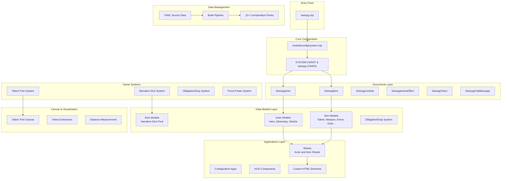
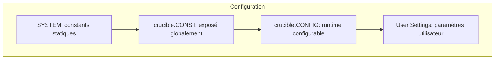
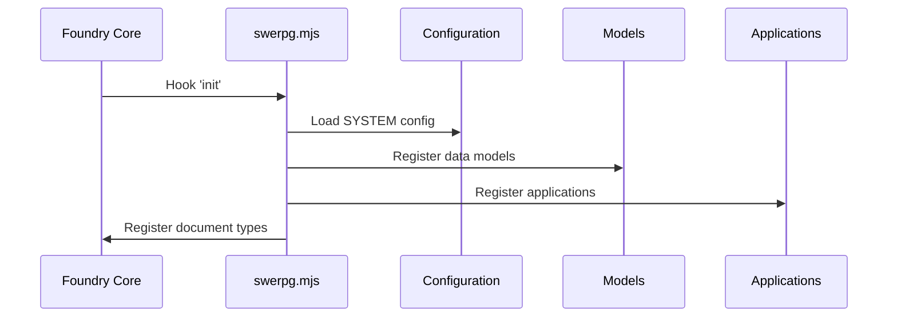
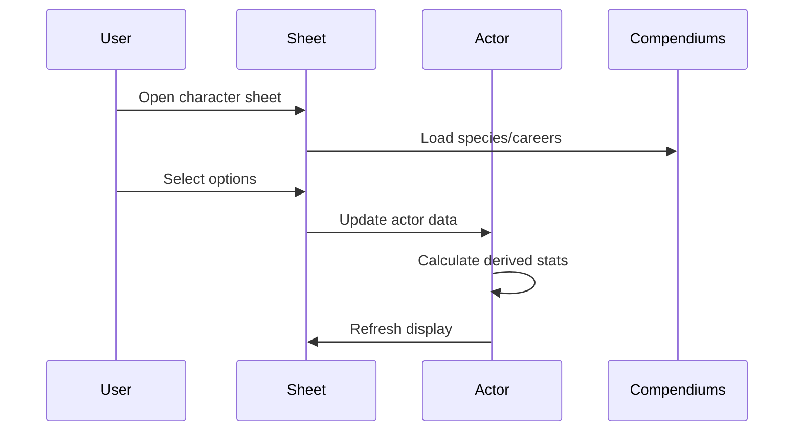
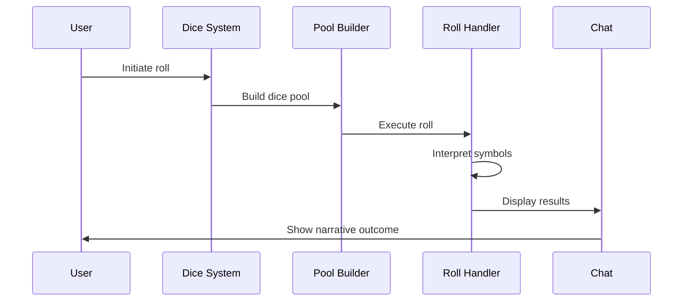

# Architecture Overview - Système Star Wars Edge RPG (swerpg)

## Introduction

Star Wars Edge RPG (swerpg) est un système de jeu de rôle narratif conçu exclusivement pour Foundry Virtual Tabletop v13+. L'architecture tire parti des capacités uniques de Foundry VTT pour offrir une automatisation riche du système de dés narratifs tout en maintenant l'esprit cinématographique de Star Wars.

## Architecture Globale



## Principes Architecturaux

### 1. Séparation des Préoccupations

L'architecture sépare clairement :

- **Documents** : Extensions des classes de base Foundry
- **Configuration** : Toutes les constantes dans `/module/config/`
- **Data Models** : Logique métier dans `/module/models/` utilisant `TypeDataModel`
- **Interface** : Composants UI dans `/module/applications/` implémentant `ApplicationV2`
- **Données** : Sources YAML dans `/_source/`, compilées vers `/packs/`

### 2. Hiérarchie de Configuration



### 3. Mécaniques Narratives

L'architecture privilégie :

- **Dés Narratifs** : Système unique avec symboles multiples [Système de Dés](../rules/NARRATIVE_DICE.md)
- **Interprétation** : Résultats riches en possibilités narratives
- **Flexibilité** : Adaptation aux situations diverses

## Composants Principaux

### Configuration Système (`/module/config/`)

```javascript
// Structure principale de configuration
export const SYSTEM = {
    id: "swerpg",
    CONST: {
        DICE: { /* Types de dés narratifs */ },
        SKILLS: { /* Compétences par catégorie */ },
        CHARACTERISTICS: { /* 6 caractéristiques */ },
        OBLIGATIONS: { /* Types d'obligations */ }
    }
};
```

#### Fichiers de Configuration Clés

- **`system.mjs`** : Configuration centrale et constantes
- **`dice.mjs`** : Définition des dés narratifs et symboles
- **`skills.mjs`** : Compétences organisées par catégories
- **`attributes.mjs`** : Caractéristiques et dérivées
- **`talent-tree.mjs`** : Structure des arbres de talents

### Documents Foundry (`/module/documents/`)

Extensions des classes de base Foundry pour intégrer les mécaniques Star Wars :

```javascript
class SwerpgActor extends Actor {
    // Gestion des caractéristiques, compétences, stress, obligations
    // Calculs automatiques de défense, seuil de blessure, etc.
}

class SwerpgItem extends Item {
    // Talents, équipements, pouvoirs de Force
    // Actions automatisées, effets passifs
}
```

### Modèles de Données (`/module/models/`)

Utilisation des `TypeDataModel` de Foundry v13 :

```javascript
class CharacterModel extends SwerpgBaseActor {
    static defineSchema() {
        return {
            characteristics: new foundry.data.fields.SchemaField({
                brawn: new foundry.data.fields.NumberField(),
                agility: new foundry.data.fields.NumberField(),
                // ...
            }),
            obligations: new foundry.data.fields.ArrayField(),
            // ...
        };
    }
}
```

## Flux de Données

### 1. Initialisation du Système



### 2. Création de Personnage



### 3. Résolution de Jet de Dés



## Patterns de Code

### 1. Configuration Hiérarchique

```javascript
// Hiérarchie de configuration claire
globalThis.SYSTEM = SYSTEM;           // Configuration globale
game.system.swerpg.CONST = SYSTEM;    // Accès via game
CONFIG.SWERPG = SYSTEM;               // Intégration Foundry
```

### 2. Factory Pattern pour les Dés

```javascript
class SwerpgDicePool {
    static create(characteristic, skill, difficulty) {
        // Construction intelligente du pool
        // Gestion automatique des upgrades
        // Ajout de dés spécialisés
    }
}
```

### 3. Observer Pattern pour les Talents

```javascript
class SwerpgTalent {
    static observeChanges(actor) {
        // Surveillance des changements de talents
        // Recalcul automatique des bonus
        // Mise à jour des capacités
    }
}
```

## Points d'Extension

### 1. Nouveaux Types d'Acteurs

```javascript
// Exemple : Droïdes
class DroidDataModel extends SwerpgActorModel {
    static defineSchema() {
        return foundry.utils.mergeObject(super.defineSchema(), {
            droidType: new foundry.data.fields.StringField(),
            // Spécificités des droïdes
        });
    }
}
```

### 2. Nouveaux Systèmes de Dés

```javascript
// Extension pour nouveaux dés spécialisés
export const CUSTOM_DICE = {
    force: {
        class: "SwerpgForceDie",
        denomination: "f",
        faces: 12
    }
};
```

### 3. Modules de Règles

```javascript
// Hooks pour modules tiers
Hooks.on("swerpg.beforeRoll", (actor, rollData) => {
    // Modifications avant jet
});

Hooks.on("swerpg.afterRoll", (actor, result) => {
    // Traitement après jet
});
```

## Intégrations Foundry

### 1. ApplicationV2 et Handlebars

```javascript
class SwerpgActorSheet extends api.HandlebarsApplicationMixin(sheets.ActorSheetV2) {
    static DEFAULT_OPTIONS = {
        classes: ["swerpg", "actor", "sheet"],
        position: { width: 720, height: 800 },
        window: { title: "SWERPG.ActorSheet" }
    };
}
```

### 2. Compendium Management

```javascript
// Gestion automatisée des packs
export const COMPENDIUM_PACKS = {
    ancestry: "swerpg.species",
    career: "swerpg.careers",
    specialization: "swerpg.specializations",
    talent: "swerpg.talents"
    // ...
};
```

### 3. Socket Integration

```javascript
// Communication temps réel
game.socket.on("system.swerpg", handleSocketEvent);

function handleSocketEvent(data) {
    // Synchronisation multi-joueurs
    // Effets globaux (Destinée)
    // Notifications système
}
```

## Sécurité et Performance

### 1. Validation des Données

```javascript
// Validation stricte des entrées
static defineSchema() {
    return {
        characteristics: new foundry.data.fields.SchemaField({
            brawn: new foundry.data.fields.NumberField({
                required: true,
                initial: 2,
                min: 1,
                max: 6,
                integer: true
            })
        })
    };
}
```

### 2. Lazy Loading

```javascript
// Chargement différé des assets
async _loadCompendiumData() {
    if (!this._compendiumCache) {
        this._compendiumCache = await this._fetchCompendiumData();
    }
    return this._compendiumCache;
}
```

### 3. Mise en Cache

```javascript
// Cache intelligent des calculs
get derivedAttributes() {
    if (!this._derivedCache || this._needsRecalculation) {
        this._derivedCache = this._calculateDerived();
        this._needsRecalculation = false;
    }
    return this._derivedCache;
}
```

## Évolution et Maintenance

### 1. Versioning des Données

```javascript
// Migration automatique des données
static migrateData(data, version) {
    if (version < "1.2.0") {
        // Migration vers nouveau format
    }
    return data;
}
```

### 2. Backward Compatibility

```javascript
// Compatibilité avec anciennes versions
static getCompat(property) {
    return this[property] ?? this[`legacy_${property}`];
}
```

### 3. Extensibilité Future

```javascript
// Hooks pour futures extensions
Hooks.call("swerpg.systemReady", game.system);
Hooks.call("swerpg.actorPrepared", actor);
Hooks.call("swerpg.rollComplete", result);
```

## Conclusion

L'architecture de swerpg privilégie la robustesse, l'extensibilité et l'intégration harmonieuse avec Foundry VTT. Le système de dés narratifs unique de Star Wars Edge RPG est parfaitement supporté tout en maintenant les performances et la facilité d'utilisation.

Les développeurs peuvent étendre le système en suivant les patterns établis et en utilisant les hooks fournis, garantissant une évolution cohérente du système.