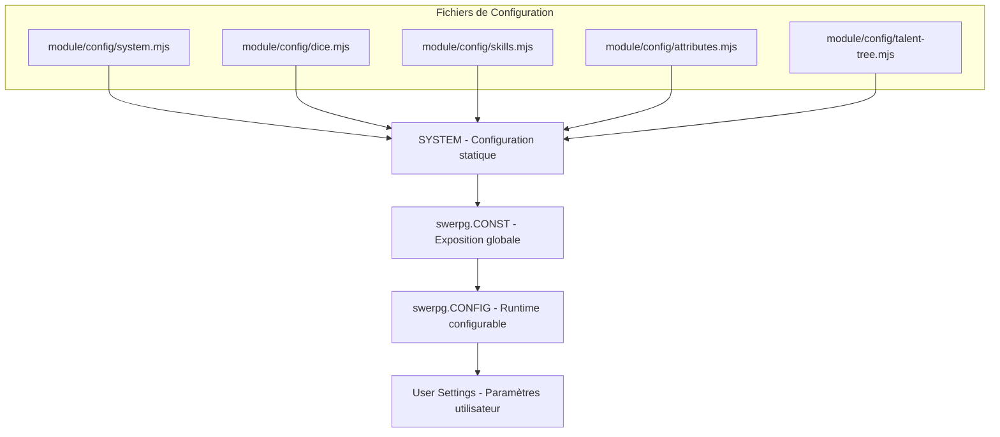

# Configuration System - Architecture Core

## 🎯 Vue d'ensemble

Le système de configuration de swerpg suit une hiérarchie claire pour permettre l'extensibilité tout en maintenant des valeurs par défaut cohérentes.

## 🏗️ Hiérarchie de Configuration



## 📁 Structure des Fichiers

### Configuration Centrale

**`module/config/system.mjs`** - Point d'entrée principal

```javascript
export const SYSTEM = {
    id: "swerpg",
    CONST: {
        DICE: { /* Types de dés narratifs */ },
        SKILLS: { /* Compétences par catégorie */ },
        CHARACTERISTICS: { /* 6 caractéristiques */ },
        OBLIGATIONS: { /* Types d'obligations */ }
    },
    COMPENDIUM_PACKS: {
        ancestry: "swerpg.ancestry",
        archetype: "swerpg.archetype",
        // ...
    }
};
```

### Fichiers Spécialisés

| Fichier | Responsabilité | Contenu |
|---------|----------------|---------|
| `dice.mjs` | Système de dés narratifs | Types de dés, symboles, probabilités |
| `skills.mjs` | Compétences et spécialisations | Organisation par catégories, modificateurs |
| `attributes.mjs` | Caractéristiques et dérivées | Calculs de base, seuils |
| `talent-tree.mjs` | Arbres de talents | Structure hiérarchique, prérequis |

## 🔄 Cycle d'Initialisation

### 1. Hook 'init'

```javascript
// swerpg.mjs
Hooks.once('init', () => {
    // 1. Configuration globale
    globalThis.SYSTEM = SYSTEM;
    
    // 2. Exposition via game.system
    game.system.swerpg = {
        CONST: SYSTEM.CONST,
        CONFIG: foundry.utils.deepClone(SYSTEM.CONST)
    };
    
    // 3. Intégration Foundry
    CONFIG.SWERPG = SYSTEM.CONST;
});
```

### 2. Fusion Runtime

```javascript
// Configuration runtime modifiable
swerpg.CONFIG = foundry.utils.mergeObject(
    foundry.utils.deepClone(SYSTEM.CONST),
    game.settings.get('swerpg', 'systemConfiguration') || {}
);
```

## 🎛️ Patterns de Configuration

### 1. Configuration Statique (SYSTEM)

```javascript
// Immuable, défini au développement
export const DICE_TYPES = {
    ABILITY: "ability",
    PROFICIENCY: "proficiency",
    BOOST: "boost",
    SETBACK: "setback",
    CHALLENGE: "challenge",
    DIFFICULTY: "difficulty"
};
```

### 2. Configuration Runtime (CONFIG)

```javascript
// Modifiable en cours d'exécution
swerpg.CONFIG.DICE.DISPLAY_MODE = "symbols"; // ou "text"
swerpg.CONFIG.SKILLS.AUTO_CALCULATION = true;
```

### 3. Settings Utilisateur

```javascript
// Sauvegardé dans la base Foundry
game.settings.register('swerpg', 'diceDisplayMode', {
    name: "SWERPG.Settings.DiceDisplayMode.Name",
    hint: "SWERPG.Settings.DiceDisplayMode.Hint",
    scope: "client",
    config: true,
    type: String,
    choices: {
        "symbols": "SWERPG.DiceDisplay.Symbols",
        "text": "SWERPG.DiceDisplay.Text"
    },
    default: "symbols"
});
```

## 🔧 Accès aux Configurations

### Depuis les Documents

```javascript
class SwerpgActor extends Actor {
    get skillCategories() {
        return CONFIG.SWERPG.SKILLS.CATEGORIES;
    }
    
    get characteristics() {
        return CONFIG.SWERPG.CHARACTERISTICS;
    }
}
```

### Depuis les Applications

```javascript
class SwerpgActorSheet extends ActorSheet {
    async _prepareContext() {
        const context = await super._prepareContext();
        context.config = CONFIG.SWERPG;
        context.skills = CONFIG.SWERPG.SKILLS;
        return context;
    }
}
```

### Depuis les Modèles de Données

```javascript
class SwerpgCharacterData extends TypeDataModel {
    static defineSchema() {
        const characteristics = CONFIG.SWERPG.CHARACTERISTICS;
        const schema = {};
        
        for (const [key, config] of Object.entries(characteristics)) {
            schema[key] = new fields.NumberField({
                required: true,
                initial: config.initial,
                min: config.min,
                max: config.max
            });
        }
        
        return schema;
    }
}
```

## 🎯 Compendium Packs Configuration

### Référencement des Packs

```javascript
export const COMPENDIUM_PACKS = {
    // Character Creation
    ancestry: "swerpg.ancestry",
    archetype: "swerpg.archetype", 
    background: "swerpg.background",
    species: "swerpg.species",
    
    // Progression
    career: "swerpg.careers",
    specialization: "swerpg.specializations", 
    talent: "swerpg.talents",
    
    // Equipment
    armor: "swerpg.armors",
    weapon: "swerpg.weapons",
    gear: "swerpg.gears",
    
    // Game Systems
    obligations: "swerpg.obligations",
    rules: "swerpg.rules"
};
```

### Chargement Runtime

```javascript
async function loadCompendiumData(packId) {
    const pack = game.packs.get(SYSTEM.COMPENDIUM_PACKS[packId]);
    if (!pack) {
        console.warn(`Compendium pack '${packId}' not found`);
        return [];
    }
    
    return await pack.getDocuments();
}
```

## 🔒 Validation et Sécurité

### Validation des Configurations

```javascript
function validateConfiguration(config) {
    const schema = {
        DICE: { required: true, type: "object" },
        SKILLS: { required: true, type: "object" },
        CHARACTERISTICS: { required: true, type: "object" }
    };
    
    for (const [key, rules] of Object.entries(schema)) {
        if (rules.required && !(key in config)) {
            throw new Error(`Missing required configuration: ${key}`);
        }
        
        if (rules.type && typeof config[key] !== rules.type) {
            throw new Error(`Invalid type for ${key}: expected ${rules.type}`);
        }
    }
}
```

### Fusion Sécurisée

```javascript
// Toujours utiliser foundry.utils.mergeObject
function updateConfiguration(updates) {
    swerpg.CONFIG = foundry.utils.mergeObject(
        swerpg.CONFIG,
        updates,
        { insertKeys: false, insertValues: false } // Sécurité
    );
}
```

## 🎨 Bonnes Pratiques

### 1. **Immutabilité des CONST**

```javascript
// ✅ Correct
const skills = foundry.utils.deepClone(CONFIG.SWERPG.SKILLS);
skills.CUSTOM_SKILL = {...};

// ❌ Incorrect
CONFIG.SWERPG.SKILLS.CUSTOM_SKILL = {...}; // Mutation directe
```

### 2. **Namespace des Clés**

```javascript
// ✅ Correct - namespace clair
SWERPG.DICE.ABILITY_DIE
SWERPG.SKILLS.CATEGORIES.GENERAL

// ❌ Incorrect - pollution globale
ABILITY_DIE
GENERAL_SKILLS
```

### 3. **Localisation Systématique**

```javascript
// ✅ Correct
name: game.i18n.localize("SWERPG.Skills.Pilot.Name")

// ❌ Incorrect
name: "Pilot" // Chaîne codée en dur
```

### 4. **Validation d'Entrée**

```javascript
function setDiceDisplayMode(mode) {
    const validModes = ["symbols", "text", "icons"];
    if (!validModes.includes(mode)) {
        throw new Error(`Invalid dice display mode: ${mode}`);
    }
    
    swerpg.CONFIG.DICE.DISPLAY_MODE = mode;
}
```

## 🔄 Migration et Versions

### Versioning des Configurations

```javascript
export const CONFIG_VERSION = "1.2.0";

function migrateConfiguration(oldConfig, oldVersion) {
    if (foundry.utils.isNewerVersion("1.2.0", oldVersion)) {
        // Migration vers 1.2.0
        oldConfig.DICE.NEW_FEATURE = true;
    }
    
    return oldConfig;
}
```

### Compatibilité Ascendante

```javascript
function getConfigValue(path, fallback) {
    return foundry.utils.getProperty(swerpg.CONFIG, path) ?? 
           foundry.utils.getProperty(swerpg.CONST, path) ?? 
           fallback;
}
```

---

> 📖 **Voir aussi** : [System Initialization](./INITIALIZATION.md) | [Public API](./API.md)