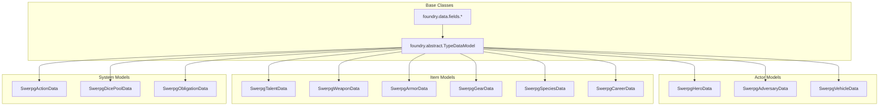

# Data Models - Architecture des Données

## 🎯 Vue d'ensemble

Les modèles de données de swerpg utilisent exclusivement `foundry.abstract.TypeDataModel` pour garantir la validation, la structure et l'évolution cohérente des données.

## 🏗️ Architecture des Modèles



## 📊 Actor Models

### SwerpgHeroData - Personnages Joueurs

```javascript
export class SwerpgHeroData extends foundry.abstract.TypeDataModel {
    static defineSchema() {
        const fields = foundry.data.fields;
        
        return {
            // Caractéristiques principales
            characteristics: new fields.SchemaField({
                brawn: new fields.NumberField({
                    required: true, initial: 2, min: 1, max: 6, integer: true
                }),
                agility: new fields.NumberField({
                    required: true, initial: 2, min: 1, max: 6, integer: true
                }),
                intellect: new fields.NumberField({
                    required: true, initial: 2, min: 1, max: 6, integer: true
                }),
                cunning: new fields.NumberField({
                    required: true, initial: 2, min: 1, max: 6, integer: true
                }),
                willpower: new fields.NumberField({
                    required: true, initial: 2, min: 1, max: 6, integer: true
                }),
                presence: new fields.NumberField({
                    required: true, initial: 2, min: 1, max: 6, integer: true
                })
            }),
            
            // Attributs dérivés
            derived: new fields.SchemaField({
                wounds: new fields.SchemaField({
                    value: new fields.NumberField({
                        required: true, initial: 0, min: 0, integer: true
                    }),
                    max: new fields.NumberField({
                        required: true, initial: 10, min: 1, integer: true
                    })
                }),
                strain: new fields.SchemaField({
                    value: new fields.NumberField({
                        required: true, initial: 0, min: 0, integer: true
                    }),
                    max: new fields.NumberField({
                        required: true, initial: 10, min: 1, integer: true
                    })
                }),
                defense: new fields.SchemaField({
                    melee: new fields.NumberField({
                        required: true, initial: 0, min: 0, integer: true
                    }),
                    ranged: new fields.NumberField({
                        required: true, initial: 0, min: 0, integer: true
                    })
                })
            }),
            
            // Progression
            experience: new fields.SchemaField({
                total: new fields.NumberField({
                    required: true, initial: 0, min: 0, integer: true
                }),
                available: new fields.NumberField({
                    required: true, initial: 0, min: 0, integer: true
                })
            }),
            
            // Obligations/Devoirs
            obligations: new fields.ArrayField(
                new fields.SchemaField({
                    type: new fields.StringField({ required: true }),
                    magnitude: new fields.NumberField({
                        required: true, initial: 5, min: 0, max: 20, integer: true
                    }),
                    description: new fields.StringField({ required: false })
                })
            ),
            
            // Talents et Compétences liés
            talents: new fields.ObjectField({ required: false }),
            skills: new fields.ObjectField({ required: false })
        };
    }
    
    // Préparation des données de base
    prepareBaseData() {
        // Calculs des attributs dérivés
        this._calculateDerivedAttributes();
        this._prepareSkills();
    }
    
    // Préparation des données dérivées (après embedded documents)
    prepareDerivedData() {
        this._calculateTotalDefense();
        this._updateTalentBonuses();
    }
    
    _calculateDerivedAttributes() {
        const char = this.characteristics;
        
        // Seuil de blessure = Brawn + 10
        this.derived.wounds.max = char.brawn + 10;
        
        // Seuil de fatigue = Willpower + 10  
        this.derived.strain.max = char.willpower + 10;
    }
    
    _calculateTotalDefense() {
        // Défense de base des caractéristiques
        let meleeDefense = 0;
        let rangedDefense = 0;
        
        // Bonus d'armure et talents
        const armors = this.parent.items.filter(i => i.type === "armor" && i.system.equipped);
        for (const armor of armors) {
            meleeDefense += armor.system.defense.melee || 0;
            rangedDefense += armor.system.defense.ranged || 0;
        }
        
        this.derived.defense.melee = meleeDefense;
        this.derived.defense.ranged = rangedDefense;
    }
}
```

### SwerpgAdversaryData - Adversaires et PNJ

```javascript
export class SwerpgAdversaryData extends foundry.abstract.TypeDataModel {
    static defineSchema() {
        const fields = foundry.data.fields;
        
        return {
            // Type d'adversaire
            adversaryType: new fields.StringField({
                required: true,
                initial: "minion",
                choices: ["minion", "rival", "nemesis"]
            }),
            
            // Caractéristiques similaires aux héros
            characteristics: new fields.SchemaField({
                brawn: new fields.NumberField({ required: true, initial: 2, min: 1, max: 6 }),
                agility: new fields.NumberField({ required: true, initial: 2, min: 1, max: 6 }),
                intellect: new fields.NumberField({ required: true, initial: 2, min: 1, max: 6 }),
                cunning: new fields.NumberField({ required: true, initial: 2, min: 1, max: 6 }),
                willpower: new fields.NumberField({ required: true, initial: 2, min: 1, max: 6 }),
                presence: new fields.NumberField({ required: true, initial: 2, min: 1, max: 6 })
            }),
            
            // Attributs simplifiés pour adversaires
            wounds: new fields.SchemaField({
                value: new fields.NumberField({ required: true, initial: 0, min: 0 }),
                threshold: new fields.NumberField({ required: true, initial: 5, min: 1 })
            }),
            
            // Compétences pré-définies
            skills: new fields.ObjectField({ required: false }),
            
            // Capacités spéciales
            abilities: new fields.ArrayField(
                new fields.StringField({ required: true })
            )
        };
    }
    
    prepareBaseData() {
        // Calcul du seuil de blessure pour adversaires
        if (this.adversaryType === "minion") {
            this.wounds.threshold = this.characteristics.brawn + 2;
        } else {
            this.wounds.threshold = this.characteristics.brawn + 10;
        }
    }
}
```

## 🎯 Item Models

### SwerpgTalentData - Talents et Capacités

```javascript
export class SwerpgTalentData extends foundry.abstract.TypeDataModel {
    static defineSchema() {
        const fields = foundry.data.fields;
        
        return {
            // Métadonnées du talent
            tier: new fields.NumberField({
                required: true, initial: 1, min: 1, max: 5, integer: true
            }),
            
            activation: new fields.StringField({
                required: true,
                initial: "passive",
                choices: ["passive", "active_incidental", "active_action", "active_maneuver"]
            }),
            
            // Prérequis
            prerequisites: new fields.SchemaField({
                characteristics: new fields.ObjectField({ required: false }),
                skills: new fields.ObjectField({ required: false }),
                talents: new fields.ArrayField(
                    new fields.StringField({ required: true })
                ),
                other: new fields.StringField({ required: false })
            }),
            
            // Rang et coût
            ranked: new fields.BooleanField({ required: true, initial: false }),
            currentRank: new fields.NumberField({
                required: true, initial: 1, min: 1, max: 5, integer: true
            }),
            maxRank: new fields.NumberField({
                required: true, initial: 1, min: 1, max: 5, integer: true
            }),
            
            // Position dans l'arbre de talents
            treePosition: new fields.SchemaField({
                tree: new fields.StringField({ required: false }),
                row: new fields.NumberField({ required: false, min: 1, max: 5 }),
                column: new fields.NumberField({ required: false, min: 1, max: 4 })
            }),
            
            // Effets mécaniques
            effects: new fields.ArrayField(
                new fields.SchemaField({
                    type: new fields.StringField({ required: true }),
                    target: new fields.StringField({ required: true }),
                    value: new fields.StringField({ required: true }),
                    condition: new fields.StringField({ required: false })
                })
            ),
            
            // Actions associées
            actions: new fields.ArrayField(
                new fields.ObjectField({ required: true })
            )
        };
    }
    
    prepareBaseData() {
        // Validation des prérequis
        this._validatePrerequisites();
        
        // Préparation des effets
        this._prepareEffects();
    }
    
    _validatePrerequisites() {
        if (!this.parent?.parent) return;
        
        const actor = this.parent.parent;
        // Logique de validation des prérequis...
    }
    
    _prepareEffects() {
        // Préparation des effets basés sur le rang actuel
        for (const effect of this.effects) {
            effect.computedValue = this._computeEffectValue(effect, this.currentRank);
        }
    }
}
```

### SwerpgWeaponData - Armes et Équipement de Combat

```javascript
export class SwerpgWeaponData extends foundry.abstract.TypeDataModel {
    static defineSchema() {
        const fields = foundry.data.fields;
        
        return {
            // Statistiques de combat
            damage: new fields.NumberField({
                required: true, initial: 3, min: 0, integer: true
            }),
            
            critical: new fields.NumberField({
                required: true, initial: 3, min: 1, max: 5, integer: true
            }),
            
            range: new fields.StringField({
                required: true,
                initial: "short",
                choices: ["engaged", "short", "medium", "long", "extreme"]
            }),
            
            // Compétence associée
            skill: new fields.StringField({
                required: true,
                choices: ["brawl", "melee", "lightsaber", "ranged_light", "ranged_heavy", "gunnery"]
            }),
            
            // Caractéristique liée
            characteristic: new fields.StringField({
                required: true,
                choices: ["brawn", "agility", "intellect", "cunning", "willpower", "presence"]
            }),
            
            // Propriétés spéciales
            qualities: new fields.ArrayField(
                new fields.SchemaField({
                    name: new fields.StringField({ required: true }),
                    rating: new fields.NumberField({ required: false, min: 0 }),
                    description: new fields.StringField({ required: false })
                })
            ),
            
            // Munitions (si applicable)
            ammunition: new fields.SchemaField({
                current: new fields.NumberField({ required: true, initial: 0, min: 0 }),
                max: new fields.NumberField({ required: true, initial: 0, min: 0 })
            }),
            
            // État
            equipped: new fields.BooleanField({ required: true, initial: false }),
            encumbrance: new fields.NumberField({ required: true, initial: 1, min: 0 })
        };
    }
    
    prepareBaseData() {
        // Calculs des dégâts basés sur la caractéristique
        this._calculateBaseDamage();
        
        // Préparation des qualités
        this._prepareQualities();
    }
    
    _calculateBaseDamage() {
        if (!this.parent?.parent) return;
        
        const actor = this.parent.parent;
        const characteristic = actor.system.characteristics[this.characteristic];
        
        // Dégâts = base + caractéristique
        this.totalDamage = this.damage + characteristic;
    }
}
```

## 🎲 System Models

### SwerpgActionData - Actions de Jeu

```javascript
export class SwerpgActionData extends foundry.abstract.TypeDataModel {
    static defineSchema() {
        const fields = foundry.data.fields;
        
        return {
            // Type d'action
            type: new fields.StringField({
                required: true,
                choices: ["attack", "skill_check", "force_power", "talent_activation"]
            }),
            
            // Configuration de base
            activation: new fields.StringField({
                required: true,
                choices: ["action", "maneuver", "incidental", "reaction"]
            }),
            
            // Pool de dés
            dicePool: new fields.SchemaField({
                characteristic: new fields.StringField({ required: false }),
                skill: new fields.StringField({ required: false }),
                difficulty: new fields.StringField({
                    required: true,
                    initial: "average",
                    choices: ["simple", "easy", "average", "hard", "daunting", "formidable"]
                }),
                modifiers: new fields.ArrayField(
                    new fields.SchemaField({
                        type: new fields.StringField({ required: true }),
                        value: new fields.NumberField({ required: true })
                    })
                )
            }),
            
            // Effets de l'action
            effects: new fields.ArrayField(
                new fields.ObjectField({ required: true })
            ),
            
            // Conditions d'utilisation
            usage: new fields.SchemaField({
                limited: new fields.BooleanField({ required: true, initial: false }),
                usesPerSession: new fields.NumberField({ required: false, min: 1 }),
                currentUses: new fields.NumberField({ required: false, min: 0 }),
                refresh: new fields.StringField({
                    required: false,
                    choices: ["session", "scene", "encounter", "rest"]
                })
            })
        };
    }
    
    prepareBaseData() {
        // Configuration du pool de dés
        this._prepareDicePool();
        
        // Validation des conditions d'usage
        this._validateUsage();
    }
    
    _prepareDicePool() {
        if (!this.parent?.parent) return;
        
        const actor = this.parent.parent;
        const pool = this.dicePool;
        
        // Construction du pool basé sur caractéristique + compétence
        if (pool.characteristic && pool.skill) {
            const charValue = actor.system.characteristics[pool.characteristic] || 0;
            const skillValue = actor.system.skills[pool.skill]?.rank || 0;
            
            pool.abilityDice = Math.max(charValue, skillValue);
            pool.proficiencyDice = Math.min(charValue, skillValue);
        }
    }
}
```

## 🔧 Patterns Communs

### 1. Validation des Schémas

```javascript
// Validation avec messages d'erreur personnalisés
static defineSchema() {
    return {
        characteristics: new fields.SchemaField({
            brawn: new fields.NumberField({
                required: true,
                initial: 2,
                min: 1,
                max: 6,
                integer: true,
                validate: (value) => {
                    if (value < 1 || value > 6) {
                        throw new Error("SWERPG.Validation.CharacteristicRange");
                    }
                }
            })
        })
    };
}
```

### 2. Relations entre Modèles

```javascript
// Référence vers d'autres documents
talents: new fields.ArrayField(
    new fields.DocumentUUIDField({
        type: "Item",
        embedded: false
    })
),

// Méthode pour résoudre les références
async getReferencedTalents() {
    const talents = [];
    for (const uuid of this.talents) {
        const talent = await fromUuid(uuid);
        if (talent) talents.push(talent);
    }
    return talents;
}
```

### 3. Migration de Données

```javascript
static migrateData(data, version) {
    // Migration vers version 1.2.0
    if (foundry.utils.isNewerVersion("1.2.0", version)) {
        // Renommage de propriété
        if (data.oldProperty !== undefined) {
            data.newProperty = data.oldProperty;
            delete data.oldProperty;
        }
        
        // Nouvelle structure
        if (!data.newStructure) {
            data.newStructure = { value: 0, max: 10 };
        }
    }
    
    return data;
}
```

### 4. Calculs Performants

```javascript
// Cache des calculs coûteux
get derivedStats() {
    if (!this._derivedCache || this._needsRecalculation) {
        this._derivedCache = this._calculateDerived();
        this._needsRecalculation = false;
    }
    return this._derivedCache;
}

// Invalidation du cache
_onCharacteristicChange() {
    this._needsRecalculation = true;
}
```

## 🎯 Bonnes Pratiques

### 1. **Structure Cohérente**

- Utilisez toujours `SchemaField` pour grouper les propriétés liées
- Définissez des valeurs par défaut sensées
- Validez les entrées avec `min`, `max`, `choices`

### 2. **Performance**

- Mise en cache des calculs complexes
- Lazy loading des références externes
- Évitez les calculs dans les getters fréquemment appelés

### 3. **Validation**

- Validation côté schéma ET côté méthodes
- Messages d'erreur localisés
- Gestion gracieuse des données corrompues

### 4. **Évolution**

- Méthodes de migration pour chaque version
- Rétrocompatibilité avec les anciennes structures
- Documentation des changements de schéma

---

> 📖 **Voir aussi** : [Document Extensions](./DOCUMENTS.md) | [Compendium Management](./COMPENDIUMS.md)