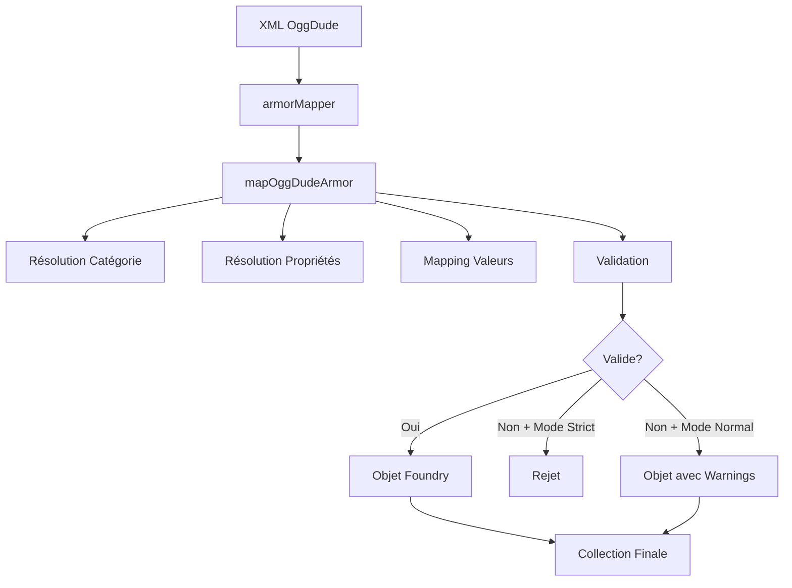

# Import des Armures OggDude

Ce document décrit le système d'import des armures depuis les fichiers XML OggDude vers le système SwerpgArmor de Foundry VTT.

## Vue d'ensemble

L'importeur d'armures OggDude a été refactorisé pour produire des objets compatibles avec le schéma `SwerpgArmor` défini dans `module/models/armor.mjs`. Il utilise des tables de correspondance déterministes pour mapper les catégories et propriétés, applique une validation stricte et fournit une instrumentation complète.

## Architecture

### Fichiers Principaux

- **`module/importer/items/armor-ogg-dude.mjs`** - Mapper principal
- **`module/importer/mappings/oggdude-armor-category-map.mjs`** - Table de mapping des catégories
- **`module/importer/mappings/oggdude-armor-property-map.mjs`** - Table de mapping des propriétés
- **`module/importer/utils/armor-import-utils.mjs`** - Utilitaires et statistiques

### Flux de Traitement



## Tables de Correspondance

### Catégories d'Armure

Le système mappe les catégories OggDude vers les catégories SwerpgArmor :

| OggDude | SwerpgArmor | Description |
|---------|-------------|-------------|
| `Light`, `light`, `1` | `light` | Armure légère |
| `Medium`, `medium`, `2` | `medium` | Armure moyenne |
| `Heavy`, `heavy`, `3` | `heavy` | Armure lourde |
| `Natural`, `4` | `natural` | Protection naturelle |
| `Unarmored`, `0` | `unarmored` | Sans armure |

**Comportement par défaut :** Si aucune catégorie n'est reconnue, la catégorie `medium` est utilisée par défaut (mode normal) ou l'armure est rejetée (mode strict).

### Propriétés d'Armure

Les propriétés OggDude sont mappées vers les propriétés SwerpgArmor supportées :

| OggDude | SwerpgArmor | Description |
|---------|-------------|-------------|
| `Bulky`, `bulky`, `Heavy`, `Unwieldy`, `1` | `bulky` | Armure encombrante |
| `Organic`, `organic`, `Natural`, `Leather`, `Hide`, `2` | `organic` | Matériau organique |

**Comportement :** Les propriétés inconnues sont ignorées avec un avertissement. Les propriétés sont dédupliquées et triées alphabétiquement.

## Structure des Objets Générés

### Format de Sortie

```javascript
{
  name: "Nom de l'armure",           // Sanitisé
  type: "armor",                     // Type Foundry
  img: "icons/armor.svg",            // Image par défaut
  system: {
    category: "medium",              // Catégorie résolue
    defense: { base: 5 },            // Defense clamped [0,100]
    soak: { base: 3 },               // Soak clamped [0,100]
    properties: Set<string>,         // Propriétés triées
    encumbrance: 2,                  // Clamped [0,∞]
    price: 100,                      // Clamped [0,∞]
    rarity: 1,                       // Clamped [0,20]
    restricted: false,               // Boolean
    description: "Description...",   // Sanitisée
    hp: 10                          // Optionnel, clamped [0,∞]
  }
}
```

### Champs Ignorés

Les champs OggDude suivants sont **supprimés** car non supportés par SwerpgArmor :
- `sources` - Références aux livres source
- `mods` - Modifications de base
- `weaponModifiers` - Modificateurs d'armes
- `eraPricing` - Prix par époque
- `key` - Identifiant OggDude
- `type` - Type OggDude (différent du type Foundry)

## Validation et Sécurité

### Validation des Données

- **Catégorie** : Doit être présente dans `SYSTEM.ARMOR.CATEGORIES`
- **Defense/Soak** : Entiers >= 0, clamped à [0,100]
- **Propriétés** : Doivent être dans `SYSTEM.ARMOR.PROPERTIES`
- **Rarity** : Entier dans [0,20]
- **Price/Encumbrance** : Entiers >= 0

### Sécurisation des Données

- **Sanitisation HTML** : Les balises `<script>` sont neutralisées dans les descriptions
- **Clamp des Valeurs** : Toutes les valeurs numériques sont bornées dans des intervalles sûrs
- **Validation de Type** : Vérification stricte des types de données

### Mode de Validation Strict

```javascript
// Configuration
export const FLAG_STRICT_ARMOR_VALIDATION = false // Par défaut

// En mode strict (true) :
// - Armures avec catégories inconnues → rejetées
// - Armures avec données invalides → rejetées
// 
// En mode normal (false) :
// - Catégories inconnues → fallback vers 'medium'
// - Données invalides → correction avec warning
```

## Instrumentation et Monitoring

### Statistiques d'Import

```javascript
import { getArmorImportStats, resetArmorImportStats } from './armor-ogg-dude.mjs'

// Obtenir les stats après import
const stats = getArmorImportStats()
console.log({
  total: stats.total,                    // Nombre total traité
  rejected: stats.rejected,              // Nombre rejeté
  unknownCategories: stats.unknownCategories,   // Catégories inconnues
  unknownProperties: stats.unknownProperties,   // Propriétés inconnues
  rejectionReasons: stats.rejectionReasons      // Codes de rejet
})

// Réinitialiser pour le prochain import
resetArmorImportStats()
```

### Codes de Logs

- **`ARMOR_DEFENSE_SOAK_ABNORMAL`** - Valeurs Defense/Soak > 100
- **`ARMOR_PROPERTIES_TRUNCATED`** - Plus de 12 propriétés (tronqué)
- **`ARMOR_IMPORT_INVALID`** - Validation échouée
- **`ARMOR_CATEGORY_UNKNOWN`** - Catégorie non reconnue
- **`ARMOR_SYSTEM_INVALID`** - Système invalide (mode strict)
- **`ARMOR_MAPPING_ERROR`** - Erreur de mapping

## Exemples d'Utilisation

### Import Standard

```javascript
import { armorMapper } from './module/importer/items/armor-ogg-dude.mjs'

// Données XML parsées
const xmlArmors = [{
  Name: "Padded Armor",
  Description: "Light protective gear",
  Defense: "2",
  Soak: "1", 
  Categories: {
    Category: ["Light", "Bulky"]
  },
  Encumbrance: "1",
  Price: "50",
  Rarity: "0",
  Restricted: false
}]

// Import
const foundryArmors = armorMapper(xmlArmors)

console.log(foundryArmors[0])
// {
//   name: "Padded Armor",
//   type: "armor",
//   system: {
//     category: "light",
//     defense: { base: 2 },
//     soak: { base: 1 },
//     properties: Set(["bulky"]),
//     ...
//   }
// }
```

### Gestion des Erreurs

```javascript
// Armure avec catégorie inconnue (mode normal)
const problematicArmor = [{
  Name: "Mystery Armor",
  Categories: { Category: ["UnknownType"] },
  Defense: "200", // Valeur aberrante
  Soak: "-5"      // Valeur négative
}]

const result = armorMapper(problematicArmor)
// Warnings logged:
// - "Catégorie d'armure inconnue: UnknownType"  
// - "Valeur Defense aberrante: 200, clamped à 100"
// - "Valeur Soak aberrante: -5, clamped à 0"

console.log(result[0].system.category) // "medium" (fallback)
console.log(result[0].system.defense.base) // 100 (clamped)
console.log(result[0].system.soak.base) // 0 (clamped)
```

## Limitations et Contraintes

### Propriétés

- **Maximum 12 propriétés** par armure (troncature automatique)
- **Dédoublonnage automatique** des propriétés identiques
- **Tri alphabétique** pour la cohérence

### Performance

- **Complexité O(n)** sur le nombre d'armures
- **Pas de copies profondes** inutiles pour optimiser la mémoire
- **Logs limités** aux cas d'erreurs/warnings pour éviter le spam

### Compatibilité

- **Foundry VTT v13+** requis pour les DataModels
- **Schéma SwerpgArmor** non modifiable (adaptation côté importeur seulement)

## Liens Connexes

- [Fix Mapper Species OggDude](../plan/features/fix-mapper-species-oggdude.md)
- [Fix Mapper Careers OggDude](../plan/features/fix-mapper-careers-oggdude.md)
- [Refactor Weapon OggDude Mapper](../plan/refactor-weapon-oggdude-mapper-1.md)
- [Foundry DataModel API](https://foundryvtt.com/api/classes/foundry.abstract.TypeDataModel.html)