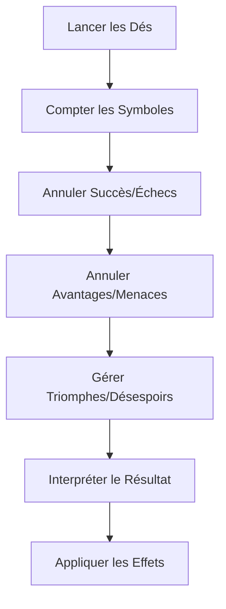

# Système de Dés Narratifs - Star Wars Edge RPG

## Introduction

Le système de dés narratifs est au cœur de Star Wars Edge RPG. Contrairement aux dés traditionnels qui ne produisent que des nombres, les dés narratifs génèrent des symboles qui enrichissent l'interprétation des actions et créent des opportunités narratives.

## Types de Dés

### Dés de Base

#### Ability Die (d8 - Vert)
- **Usage** : Représente la compétence naturelle du personnage
- **Symboles** :
  - Succès : 1 face
  - Avantage : 2 faces
  - Succès + Avantage : 1 face
  - Faces vides : 4 faces

#### Proficiency Die (d12 - Jaune)
- **Usage** : Représente l'entraînement et l'expertise
- **Symboles** :
  - Succès : 2 faces
  - Avantage : 1 face
  - Succès + Avantage : 2 faces
  - Triomphe : 1 face
  - Faces vides : 6 faces

### Dés de Difficulté

#### Difficulty Die (d8 - Violet)
- **Usage** : Représente la difficulté de base de l'action
- **Symboles** :
  - Échec : 1 face
  - Menace : 2 faces
  - Échec + Menace : 1 face
  - Faces vides : 4 faces

#### Challenge Die (d12 - Rouge)
- **Usage** : Représente les défis les plus ardus
- **Symboles** :
  - Échec : 2 faces
  - Menace : 1 face
  - Échec + Menace : 2 faces
  - Désespoir : 1 face
  - Faces vides : 6 faces

### Dés Spéciaux

#### Boost Die (d6 - Bleu)
- **Usage** : Bonus situationnels favorables
- **Symboles** :
  - Succès : 2 faces
  - Avantage : 2 faces
  - Succès + Avantage : 1 face
  - Face vide : 1 face

#### Setback Die (d6 - Noir)
- **Usage** : Malus situationnels défavorables
- **Symboles** :
  - Échec : 1 face
  - Menace : 2 faces
  - Face vide : 3 faces

#### Force Die (d12 - Blanc)
- **Usage** : Pouvoir de la Force (Force and Destiny)
- **Symboles** :
  - Force Lumineuse : 4 faces (1-2 points)
  - Force Obscure : 2 faces (1-2 points)
  - Faces vides : 6 faces

## Architecture du Système

### Structure des Classes

```javascript
// Classe principale du système de dés
class SwerpgDiceSystem {
    static pool = new SwerpgDicePool();
    static symbols = DICE_SYMBOLS;
    static faces = DICE_FACES;
}

// Pool de dés narratifs
class SwerpgDicePool {
    constructor() {
        this.ability = 0;      // Dés d'aptitude
        this.proficiency = 0;  // Dés de maîtrise
        this.difficulty = 0;   // Dés de difficulté
        this.challenge = 0;    // Dés de défi
        this.boost = 0;        // Dés de bonus
        this.setback = 0;      // Dés de revers
        this.force = 0;        // Dés de Force
    }
}
```

### Configuration des Symboles

```javascript
export const DICE_SYMBOLS = {
    success: {
        icon: "systems/swerpg/icons/dice/success.svg",
        color: "#4CAF50",
        priority: 1
    },
    advantage: {
        icon: "systems/swerpg/icons/dice/advantage.svg", 
        color: "#2196F3",
        priority: 2
    },
    triumph: {
        icon: "systems/swerpg/icons/dice/triumph.svg",
        color: "#FFD700",
        priority: 0
    },
    failure: {
        icon: "systems/swerpg/icons/dice/failure.svg",
        color: "#F44336", 
        priority: 1
    },
    threat: {
        icon: "systems/swerpg/icons/dice/threat.svg",
        color: "#FF5722",
        priority: 2
    },
    despair: {
        icon: "systems/swerpg/icons/dice/despair.svg",
        color: "#9C27B0",
        priority: 0
    },
    lightside: {
        icon: "systems/swerpg/icons/dice/lightside.svg",
        color: "#E3F2FD",
        priority: 3
    },
    darkside: {
        icon: "systems/swerpg/icons/dice/darkside.svg", 
        color: "#424242",
        priority: 3
    }
};
```

## Construction du Pool de Dés

### Algorithme de Base

```javascript
class DicePoolBuilder {
    static buildPool(characteristic, skill, difficulty) {
        const pool = new SwerpgDicePool();
        
        // 1. Déterminer les dés positifs
        const positive = this._calculatePositiveDice(characteristic, skill);
        pool.ability = positive.ability;
        pool.proficiency = positive.proficiency;
        
        // 2. Déterminer les dés négatifs
        const negative = this._calculateNegativeDice(difficulty);
        pool.difficulty = negative.difficulty;
        pool.challenge = negative.challenge;
        
        // 3. Ajouter les modificateurs
        this._applyModifiers(pool, modifiers);
        
        return pool;
    }
    
    static _calculatePositiveDice(characteristic, skill) {
        const base = Math.max(characteristic, skill);
        const upgrade = Math.min(characteristic, skill);
        
        return {
            ability: base - upgrade,
            proficiency: upgrade
        };
    }
}
```

### Règles d'Upgrade

Les dés s'améliorent selon ces règles :

1. **Ability → Proficiency** : Chaque upgrade transforme un dé vert en jaune
2. **Difficulty → Challenge** : Chaque upgrade transforme un dé violet en rouge
3. **Limitation** : On ne peut pas avoir plus de dés que la valeur de base

```javascript
static upgradeDice(pool, upgrades) {
    // Upgrade des dés positifs
    const positiveUpgrades = Math.min(upgrades.positive, pool.ability);
    pool.ability -= positiveUpgrades;
    pool.proficiency += positiveUpgrades;
    
    // Upgrade des dés négatifs  
    const negativeUpgrades = Math.min(upgrades.negative, pool.difficulty);
    pool.difficulty -= negativeUpgrades;
    pool.challenge += negativeUpgrades;
}
```

## Résolution des Jets

### Processus de Résolution



### Algorithme de Résolution

```javascript
class DiceResultResolver {
    static resolve(rollResult) {
        const symbols = this._countSymbols(rollResult);
        const netResult = this._calculateNetResult(symbols);
        const interpretation = this._interpretResult(netResult);
        
        return {
            symbols: symbols,
            net: netResult,
            success: netResult.success > 0,
            interpretation: interpretation
        };
    }
    
    static _calculateNetResult(symbols) {
        return {
            success: Math.max(0, symbols.success + symbols.triumph - symbols.failure),
            advantage: symbols.advantage + symbols.triumph - symbols.threat - symbols.despair,
            triumph: symbols.triumph,
            despair: symbols.despair,
            force: {
                light: symbols.lightside,
                dark: symbols.darkside
            }
        };
    }
}
```

### Interprétation Narrative

#### Table d'Interprétation des Avantages

| Avantages | Effets Possibles |
|-----------|------------------|
| 1-2 | Récupérer 1 point de Strain, ajout d'un détail mineur |
| 3-4 | Accomplir une manœuvre supplémentaire, petite complication pour l'adversaire |
| 5-6 | Gain d'un dé Boost pour l'action suivante, effet narratif notable |
| 7+ | Effet majeur, changement significatif de la situation |

#### Table d'Interprétation des Menaces

| Menaces | Effets Possibles |
|---------|------------------|
| 1-2 | Subir 1 point de Strain, détail défavorable mineur |
| 3-4 | Perdre une manœuvre, petit avantage pour l'adversaire |
| 5-6 | Dé Setback pour l'action suivante, complication narrative |
| 7+ | Complication majeure, escalade du conflit |

## Mécaniques Avancées

### Destinée et Force

```javascript
class DestinyPool {
    constructor() {
        this.light = 0;
        this.dark = 0;
        this.players = [];
        this.gm = null;
    }
    
    static async rollDestiny(playerCount) {
        const rolls = [];
        for (let i = 0; i < playerCount; i++) {
            const roll = await new Roll("1df").evaluate();
            rolls.push(roll);
        }
        
        const pool = this._processDestinyRolls(rolls);
        await this._updateDestinyDisplay(pool);
        return pool;
    }
}
```

### Dépense de Force

```javascript
class ForceUser {
    static async spendForcePoints(actor, cost, preference = "light") {
        const available = this._getAvailableForce(actor);
        
        if (available.total < cost) {
            ui.notifications.warn("Pas assez de points de Force disponibles");
            return false;
        }
        
        const spending = this._optimizeForceSpending(available, cost, preference);
        await this._applyForceSpending(actor, spending);
        
        return true;
    }
    
    static _optimizeForceSpending(available, cost, preference) {
        // Algorithme d'optimisation selon la préférence morale
        if (preference === "light" && available.light >= cost) {
            return { light: cost, dark: 0 };
        } else {
            // Utiliser le côté obscur génère du Conflit
            const darkUsed = Math.min(available.dark, cost);
            const lightUsed = Math.max(0, cost - darkUsed);
            return { light: lightUsed, dark: darkUsed };
        }
    }
}
```

### Jets de Groupe

```javascript
class GroupCheck {
    static async performGroupCheck(actors, skill, difficulty) {
        const results = [];
        
        for (const actor of actors) {
            const roll = await this._performIndividualRoll(actor, skill, difficulty);
            results.push(roll);
        }
        
        const groupResult = this._calculateGroupOutcome(results);
        await this._displayGroupResult(groupResult);
        
        return groupResult;
    }
    
    static _calculateGroupOutcome(results) {
        const successes = results.filter(r => r.success).length;
        const totalAdvantage = results.reduce((sum, r) => sum + r.advantage, 0);
        const anyTriumph = results.some(r => r.triumph > 0);
        const anyDespair = results.some(r => r.despair > 0);
        
        return {
            success: successes > results.length / 2,
            advantage: totalAdvantage,
            triumph: anyTriumph,
            despair: anyDespair,
            participants: results.length
        };
    }
}
```

## Interface Utilisateur

### Dice Roller Component

```javascript
class SwerpgDiceRoller extends HTMLElement {
    constructor() {
        super();
        this.pool = new SwerpgDicePool();
        this.attachShadow({ mode: 'open' });
    }
    
    connectedCallback() {
        this.render();
        this.addEventListeners();
    }
    
    render() {
        this.shadowRoot.innerHTML = `
            <div class="dice-roller">
                <div class="dice-pool">
                    ${this._renderDiceControls()}
                </div>
                <div class="roll-button">
                    <button onclick="this.performRoll()">Lancer les Dés</button>
                </div>
                <div class="results">
                    ${this._renderResults()}
                </div>
            </div>
        `;
    }
}

customElements.define('swerpg-dice-roller', SwerpgDiceRoller);
```

### Chat Integration

```javascript
class SwerpgChatMessage {
    static async create(rollData) {
        const messageData = {
            type: CONST.CHAT_MESSAGE_TYPES.ROLL,
            roll: rollData.roll,
            speaker: rollData.speaker,
            content: await renderTemplate("systems/swerpg/templates/dice/roll-result.hbs", {
                result: rollData.result,
                interpretation: rollData.interpretation,
                symbols: rollData.symbols
            })
        };
        
        return ChatMessage.create(messageData);
    }
}
```

## Patterns d'Utilisation

### Jest Simple

```javascript
// Jet de compétence standard
const actor = game.user.character;
const skill = "piloting";
const difficulty = 2;

const pool = DicePoolBuilder.buildPool(
    actor.system.characteristics.agility,
    actor.system.skills[skill].rank,
    difficulty
);

const roll = await pool.roll();
const result = DiceResultResolver.resolve(roll);
await SwerpgChatMessage.create({ roll, result, speaker: actor });
```

### Jest avec Modificateurs

```javascript
// Jet avec avantages et désavantages
const modifiers = {
    boost: 1,      // Situation favorable
    setback: 1,    // Complication mineure
    upgrade: 1,    // Équipement de qualité
    downgrade: 0   // Pas de complications majeures
};

const pool = DicePoolBuilder.buildPool(characteristic, skill, difficulty);
DicePoolBuilder.applyModifiers(pool, modifiers);
```

### Jets de Force

```javascript
// Utilisation d'un pouvoir de Force
const forcePower = actor.items.get(powerID);
const baseDifficulty = forcePower.system.difficulty;
const forceRating = actor.system.force.rating;

const pool = new SwerpgDicePool();
pool.force = forceRating;
pool.difficulty = baseDifficulty;

const result = await pool.roll();
const forcePoints = result.symbols.lightside + result.symbols.darkside;
```

## Performance et Optimisation

### Cache des Résultats

```javascript
class DiceResultCache {
    static cache = new Map();
    static maxSize = 100;
    
    static getCachedResult(poolString) {
        return this.cache.get(poolString);
    }
    
    static setCachedResult(poolString, result) {
        if (this.cache.size >= this.maxSize) {
            const firstKey = this.cache.keys().next().value;
            this.cache.delete(firstKey);
        }
        this.cache.set(poolString, result);
    }
}
```

### Optimisation des Rendus

```javascript
class DiceRenderer {
    static _symbolCache = new Map();
    
    static async renderSymbol(symbolType, count) {
        const cacheKey = `${symbolType}-${count}`;
        
        if (!this._symbolCache.has(cacheKey)) {
            const rendered = await this._generateSymbolHTML(symbolType, count);
            this._symbolCache.set(cacheKey, rendered);
        }
        
        return this._symbolCache.get(cacheKey);
    }
}
```

## Extensibilité

### Nouveaux Types de Dés

```javascript
// Exemple : Dé de Cybernétique (hypothétique)
export const CYBERNETIC_DIE = {
    faces: [
        { success: 1 },
        { advantage: 1, threat: 1 }, // Effet mixte
        { success: 1, strain: 1 },   // Coût en Strain
        { }, { }, { }  // Faces vides
    ],
    color: "#00BCD4",
    icon: "systems/swerpg/icons/dice/cybernetic.svg"
};
```

### Hooks pour Extensions

```javascript
// Hooks disponibles pour les modules
Hooks.on("swerpg.beforeRoll", (actor, poolData) => {
    // Modification avant le jet
});

Hooks.on("swerpg.afterRoll", (actor, result) => {
    // Traitement après le jet
});

Hooks.on("swerpg.symbolGenerated", (symbol, roll) => {
    // Réaction aux symboles spécifiques
});
```

## Conclusion

Le système de dés narratifs de Star Wars Edge RPG offre une richesse mécanique et narrative unique. L'implémentation dans Foundry VTT automatise les calculs complexes tout en préservant l'aspect interprétatif essentiel au système.

L'architecture modulaire permet une extension facile pour de nouveaux types de dés, modificateurs ou mécaniques spéciales, garantissant l'évolutivité du système.