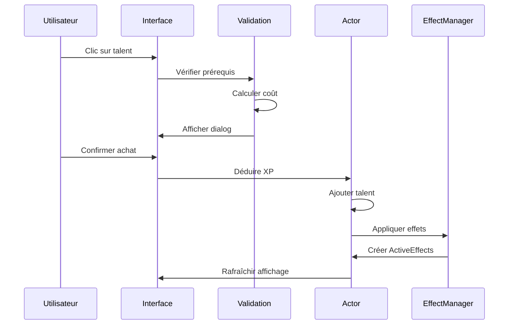

# Système de Talents - Star Wars Edge RPG

## Introduction

Le système de talents est l'une des mécaniques les plus caractéristiques de Star Wars Edge RPG. Il permet une progression non-linéaire et flexible des personnages à travers des arbres de spécialisation uniques, reflétant la diversité des carrières dans l'univers Star Wars.

## Vue d'Ensemble

### Concepts Clés

- **Carrières** : Professions de base (Contrebandier, Pilote, Soldat, etc.)
- **Spécialisations** : Branches spécialisées au sein des carrières
- **Talents** : Capacités spéciales organisées en arbres
- **Connexions** : Liens entre talents définissant les prérequis
- **Rangs** : Certains talents peuvent être acquis plusieurs fois

## Architecture du Système

### Structure des Classes

```javascript
class SwerpgTalentSystem {
    static trees = new Map();
    static nodes = new Map();
    static connections = new Map();
    
    static initialize() {
        this.loadSpecializationTrees();
        this.buildNodeNetwork();
        this.validateConnections();
    }
}

class SwerpgTalentTree {
    constructor(specializationId) {
        this.specializationId = specializationId;
        this.talents = new Map();
        this.connections = [];
        this.layout = new TalentTreeLayout();
    }
}

class SwerpgTalentNode {
    constructor(talentId, position, maxRank = 1) {
        this.talentId = talentId;
        this.position = position;  // { row, column }
        this.maxRank = maxRank;
        this.connections = [];
        this.prerequisites = [];
    }
}
```

### Configuration des Spécialisations

```javascript
export const SPECIALIZATIONS = {
    // Edge of the Empire
    smuggler: {
        pilot: "swerpg.specializations.pilot",
        scoundrel: "swerpg.specializations.scoundrel", 
        thief: "swerpg.specializations.thief"
    },
    
    // Age of Rebellion  
    ace: {
        pilot: "swerpg.specializations.ace_pilot",
        driver: "swerpg.specializations.driver",
        gunner: "swerpg.specializations.gunner"
    },
    
    // Force and Destiny
    mystic: {
        advisor: "swerpg.specializations.advisor",
        makashi_duelist: "swerpg.specializations.makashi_duelist",
        seer: "swerpg.specializations.seer"
    }
};
```

## Progression des Talents

### Calcul des Coûts

Le coût d'un talent dépend de sa position dans l'arbre et du statut de la spécialisation :

```javascript
class TalentCostCalculator {
    static calculateCost(actor, specialization, talentNode) {
        const isCareerSpec = this.isCareerSpecialization(actor, specialization);
        const distance = this.calculateDistance(talentNode);
        
        // Coûts de base selon la ligne
        const baseCosts = {
            career: [5, 10, 15, 20, 25],
            nonCareer: [10, 15, 20, 25, 30]
        };
        
        const costArray = isCareerSpec ? baseCosts.career : baseCosts.nonCareer;
        const row = talentNode.position.row;
        
        return costArray[row] || costArray[costArray.length - 1];
    }
    
    static calculateDistance(fromNode, toNode) {
        // Algorithme de pathfinding pour calculer la distance minimale
        return this.dijkstraDistance(fromNode, toNode);
    }
}
```

### Algorithme de Prérequis

```javascript
class TalentPrerequisites {
    static canPurchase(actor, talentNode) {
        // 1. Vérifier la possession de la spécialisation
        if (!this.hasSpecialization(actor, talentNode.specialization)) {
            return { 
                valid: false, 
                reason: "SWERPG.TalentError.MissingSpecialization" 
            };
        }
        
        // 2. Vérifier le rang maximum
        const currentRank = this.getCurrentRank(actor, talentNode.talentId);
        if (currentRank >= talentNode.maxRank) {
            return { 
                valid: false, 
                reason: "SWERPG.TalentError.MaxRankReached" 
            };
        }
        
        // 3. Vérifier les connexions (au moins une doit être satisfaite)
        if (!this.hasValidConnection(actor, talentNode)) {
            return { 
                valid: false, 
                reason: "SWERPG.TalentError.NoValidConnection" 
            };
        }
        
        return { valid: true };
    }
    
    static hasValidConnection(actor, talentNode) {
        // Premier rang (row 0) : toujours accessible
        if (talentNode.position.row === 0) {
            return true;
        }
        
        // Autres rangs : au moins une connexion doit être possédée
        for (const connectionId of talentNode.connections) {
            const connectedNode = SwerpgTalentSystem.nodes.get(connectionId);
            if (connectedNode && this.getCurrentRank(actor, connectedNode.talentId) > 0) {
                return true;
            }
        }
        
        return false;
    }
}
```

## Types de Talents

### Talents Passifs

```javascript
class PassiveTalent {
    static apply(actor, talent, rank) {
        const effect = new ActiveEffect({
            label: talent.name,
            icon: talent.img,
            origin: talent.uuid,
            changes: this.generateChanges(talent, rank),
            disabled: false,
            transfer: false
        });
        
        return actor.createEmbeddedDocuments("ActiveEffect", [effect]);
    }
    
    static generateChanges(talent, rank) {
        // Exemple : Toughened (+2 Wound Threshold par rang)
        if (talent.system.identifier === "toughened") {
            return [{
                key: "system.health.wounds.max",
                mode: CONST.ACTIVE_EFFECT_MODES.ADD,
                value: 2 * rank
            }];
        }
        
        // Exemple : Dedication (+1 à une caractéristique)
        if (talent.system.identifier === "dedication") {
            return [{
                key: `system.characteristics.${talent.system.characteristic}.value`,
                mode: CONST.ACTIVE_EFFECT_MODES.ADD,
                value: 1
            }];
        }
        
        return [];
    }
}
```

### Talents Actifs

```javascript
class ActiveTalent {
    constructor(actor, talent, rank) {
        this.actor = actor;
        this.talent = talent;
        this.rank = rank;
        this.action = this.createAction();
    }
    
    createAction() {
        return new SwerpgAction({
            type: "talent",
            name: this.talent.name,
            actor: this.actor,
            item: this.talent,
            cost: this.talent.system.activation.cost,
            target: this.talent.system.activation.target
        });
    }
    
    async activate() {
        // Vérifier les prérequis d'activation
        if (!await this.checkActivationRequirements()) {
            return false;
        }
        
        // Appliquer les coûts
        await this.applyCosts();
        
        // Exécuter l'effet
        return await this.executeEffect();
    }
}
```

## Interface Canvas

### Rendu de l'Arbre de Talents

```javascript
class TalentTreeCanvas extends PIXI.Container {
    constructor(specialization) {
        super();
        this.specialization = specialization;
        this.nodes = new Map();
        this.connections = [];
        this.scale.set(0.8);
    }
    
    async render() {
        await this.renderBackground();
        await this.renderConnections();
        await this.renderNodes();
        this.addInteractionHandlers();
    }
    
    async renderNodes() {
        const tree = SwerpgTalentSystem.trees.get(this.specialization.id);
        
        for (const [nodeId, node] of tree.talents) {
            const nodeSprite = await this.createNodeSprite(node);
            this.nodes.set(nodeId, nodeSprite);
            this.addChild(nodeSprite);
        }
    }
    
    async createNodeSprite(node) {
        const talent = await fromUuid(node.talentId);
        const sprite = new PIXI.Sprite();
        
        // État du talent (possédé, disponible, verrouillé)
        const state = this.getTalentState(node);
        sprite.tint = this.getStateColor(state);
        
        // Position dans la grille
        sprite.x = node.position.column * 120;
        sprite.y = node.position.row * 120;
        
        // Interaction
        sprite.interactive = true;
        sprite.buttonMode = true;
        sprite.on('click', () => this.onTalentClick(node));
        sprite.on('rightclick', () => this.onTalentRightClick(node));
        
        return sprite;
    }
}
```

### Interaction Utilisateur

```javascript
class TalentTreeInteraction {
    static onTalentClick(node) {
        const actor = game.user.character;
        if (!actor) return;
        
        // Vérifier si le talent peut être acheté
        const canPurchase = TalentPrerequisites.canPurchase(actor, node);
        
        if (canPurchase.valid) {
            this.showPurchaseDialog(actor, node);
        } else {
            ui.notifications.warn(game.i18n.localize(canPurchase.reason));
        }
    }
    
    static async showPurchaseDialog(actor, node) {
        const talent = await fromUuid(node.talentId);
        const cost = TalentCostCalculator.calculateCost(actor, node.specialization, node);
        
        const dialog = new Dialog({
            title: game.i18n.format("SWERPG.TalentPurchase.Title", {
                talent: talent.name
            }),
            content: await renderTemplate("systems/swerpg/templates/dialogs/talent-purchase.hbs", {
                talent: talent,
                cost: cost,
                currentXP: actor.system.experience.available
            }),
            buttons: {
                purchase: {
                    label: game.i18n.localize("SWERPG.TalentPurchase.Confirm"),
                    callback: () => this.purchaseTalent(actor, node, cost)
                },
                cancel: {
                    label: game.i18n.localize("Cancel")
                }
            }
        });
        
        dialog.render(true);
    }
}
```

## Gestion des Effets

### ActiveEffect Integration

```javascript
class TalentEffectManager {
    static async applyTalentEffects(actor, talent, rank) {
        const effectData = this.generateEffectData(talent, rank);
        
        if (effectData.length === 0) return;
        
        // Supprimer les anciens effets du même talent
        await this.removeExistingEffects(actor, talent);
        
        // Appliquer les nouveaux effets
        const effects = await actor.createEmbeddedDocuments("ActiveEffect", effectData);
        
        // Notifier les hooks
        Hooks.callAll("swerpg.talentApplied", actor, talent, rank, effects);
        
        return effects;
    }
    
    static generateEffectData(talent, rank) {
        const effects = [];
        
        // Effets basés sur le type de talent
        switch (talent.system.type) {
            case "passive":
                effects.push(...this.generatePassiveEffects(talent, rank));
                break;
                
            case "threshold":
                effects.push(...this.generateThresholdEffects(talent, rank));
                break;
                
            case "skill":
                effects.push(...this.generateSkillEffects(talent, rank));
                break;
        }
        
        return effects;
    }
}
```

### Talents Spéciaux

```javascript
class SpecialTalents {
    // Dedication : Augmente une caractéristique
    static async applyDedication(actor, talent) {
        const dialog = new Dialog({
            title: "Dedication",
            content: await renderTemplate("systems/swerpg/templates/dialogs/dedication.hbs", {
                characteristics: actor.system.characteristics
            }),
            buttons: {
                apply: {
                    label: "Appliquer",
                    callback: (html) => {
                        const selected = html.find('[name="characteristic"]:checked').val();
                        this.increaseBehavioristic(actor, selected);
                    }
                }
            }
        });
        
        dialog.render(true);
    }
    
    // Force Rating : Augmente la connexion à la Force
    static async applyForceRating(actor, talent, rank) {
        const currentRating = actor.system.force.rating;
        const newRating = currentRating + 1;
        
        await actor.update({
            "system.force.rating": newRating,
            "system.force.committed": Math.min(actor.system.force.committed, newRating)
        });
        
        ui.notifications.info(game.i18n.format("SWERPG.TalentEffect.ForceRating", {
            rating: newRating
        }));
    }
    
    // Signature Ability : Capacités ultimes
    static async unlockSignatureAbility(actor, talent) {
        const signatureAbilities = actor.items.filter(i => 
            i.type === "signatureAbility" && 
            i.system.specialization === talent.system.specialization
        );
        
        for (const ability of signatureAbilities) {
            await ability.update({ "system.unlocked": true });
        }
    }
}
```

## Arbre de Talents Canvas

### Intégration avec Foundry Canvas

```javascript
class SwerpgTalentTreeLayer extends CanvasLayer {
    constructor() {
        super();
        this.specialization = null;
        this.tree = null;
    }
    
    static get layerOptions() {
        return foundry.utils.mergeObject(super.layerOptions, {
            name: "talents",
            canDragCreate: false,
            canDelete: false,
            controllableObjects: true,
            rotatableObjects: false
        });
    }
    
    async loadSpecialization(specializationId) {
        this.specialization = await fromUuid(specializationId);
        this.tree = SwerpgTalentSystem.trees.get(specializationId);
        await this.draw();
    }
    
    async _draw() {
        if (!this.tree) return;
        
        // Dessiner les connexions
        this.drawConnections();
        
        // Dessiner les nœuds de talents
        for (const [nodeId, node] of this.tree.talents) {
            const talentObject = new TalentCanvasObject(node);
            await talentObject.draw();
            this.addChild(talentObject);
        }
    }
}
```

### Objet Canvas Talent

```javascript
class TalentCanvasObject extends PlaceableObject {
    constructor(talentNode) {
        super();
        this.talentNode = talentNode;
        this.talent = null;
    }
    
    static embeddedName = "Talent";
    
    async _draw() {
        this.talent = await fromUuid(this.talentNode.talentId);
        
        // Créer le sprite principal
        const sprite = await this.createSprite();
        this.addChild(sprite);
        
        // Ajouter le texte du nom
        const nameText = this.createNameText();
        this.addChild(nameText);
        
        // Ajouter l'indicateur de rang
        const rankIndicator = this.createRankIndicator();
        this.addChild(rankIndicator);
        
        return this;
    }
    
    get bounds() {
        const { x, y } = this.talentNode.position;
        return new PIXI.Rectangle(x * 120, y * 120, 100, 100);
    }
    
    async createSprite() {
        const texture = await loadTexture(this.talent.img);
        const sprite = new PIXI.Sprite(texture);
        
        sprite.width = 80;
        sprite.height = 80;
        sprite.x = 10;
        sprite.y = 10;
        
        // Appliquer la teinte selon l'état
        const state = this.getTalentState();
        sprite.tint = this.getStateColor(state);
        
        return sprite;
    }
}
```

## Workflow d'Achat de Talents

### Processus Complet



### Implémentation

```javascript
class TalentPurchaseWorkflow {
    static async execute(actor, talentNode) {
        try {
            // 1. Validation finale
            const validation = TalentPrerequisites.canPurchase(actor, talentNode);
            if (!validation.valid) {
                throw new Error(validation.reason);
            }
            
            // 2. Calcul du coût
            const cost = TalentCostCalculator.calculateCost(actor, talentNode.specialization, talentNode);
            
            // 3. Vérification des XP
            if (actor.system.experience.available < cost) {
                throw new Error("SWERPG.TalentError.InsufficientXP");
            }
            
            // 4. Transaction atomique
            await this.performTransaction(actor, talentNode, cost);
            
            // 5. Effets visuels et notifications
            await this.showPurchaseEffects(actor, talentNode);
            
        } catch (error) {
            ui.notifications.error(game.i18n.localize(error.message));
        }
    }
    
    static async performTransaction(actor, talentNode, cost) {
        const talent = await fromUuid(talentNode.talentId);
        
        const updates = {
            // Déduire XP
            "system.experience.spent": actor.system.experience.spent + cost,
            
            // Ajouter le talent (ou augmenter le rang)
            [`system.talents.${talent.system.identifier}`]: {
                id: talent.id,
                rank: (actor.system.talents[talent.system.identifier]?.rank || 0) + 1,
                source: talentNode.specialization
            }
        };
        
        await actor.update(updates);
        
        // Appliquer les effets du talent
        await TalentEffectManager.applyTalentEffects(actor, talent, updates[`system.talents.${talent.system.identifier}`].rank);
    }
}
```

## Intégration avec les Spécialisations

### Gestion des Carrières Multiples

```javascript
class MultipleCareerManager {
    static calculateTotalCost(actor, newSpecialization) {
        const currentSpecs = actor.system.specializations;
        const careerSpecs = currentSpecs.filter(s => 
            s.career === actor.system.career
        );
        
        // Coût de base selon le nombre de spécialisations
        const baseCost = this.getSpecializationBaseCost(careerSpecs.length);
        
        // Modificateur si c'est une spécialisation hors carrière
        const isOutOfCareer = newSpecialization.career !== actor.system.career;
        const multiplier = isOutOfCareer ? 2 : 1;
        
        return baseCost * multiplier;
    }
    
    static getSpecializationBaseCost(currentCount) {
        const costs = [0, 20, 30, 40, 50]; // Premier gratuit
        return costs[currentCount] || 50;
    }
}
```

## Hooks et Extensions

### Système d'Événements

```javascript
// Hooks appelés lors des opérations sur les talents
Hooks.on("swerpg.talentPurchased", (actor, talent, rank) => {
    console.log(`${actor.name} a acheté ${talent.name} rang ${rank}`);
});

Hooks.on("swerpg.talentActivated", (actor, talent, result) => {
    console.log(`${actor.name} a activé ${talent.name}`);
});

Hooks.on("swerpg.specializationAdded", (actor, specialization) => {
    console.log(`${actor.name} a ajouté la spécialisation ${specialization.name}`);
});
```

### API d'Extension

```javascript
class SwerpgTalentAPI {
    static registerCustomTalent(identifier, config) {
        // Enregistrer un nouveau type de talent
        SwerpgTalentSystem.customTalents.set(identifier, config);
    }
    
    static addTalentEffect(identifier, effectFunction) {
        // Ajouter un effet personnalisé à un talent
        SwerpgTalentSystem.customEffects.set(identifier, effectFunction);
    }
    
    static createSpecializationTree(specializationId, treeData) {
        // Créer un nouvel arbre de spécialisation
        const tree = new SwerpgTalentTree(specializationId);
        tree.loadFromData(treeData);
        SwerpgTalentSystem.trees.set(specializationId, tree);
    }
}
```

## Performance et Optimisation

### Cache des Calculs

```javascript
class TalentCalculationCache {
    static cache = new Map();
    static maxAge = 300000; // 5 minutes
    
    static getCachedCost(actorId, talentNodeId) {
        const key = `${actorId}-${talentNodeId}`;
        const cached = this.cache.get(key);
        
        if (cached && Date.now() - cached.timestamp < this.maxAge) {
            return cached.cost;
        }
        
        return null;
    }
    
    static setCachedCost(actorId, talentNodeId, cost) {
        const key = `${actorId}-${talentNodeId}`;
        this.cache.set(key, {
            cost: cost,
            timestamp: Date.now()
        });
    }
}
```

## Conclusion

Le système de talents de Star Wars Edge RPG offre une progression riche et flexible qui reflète la diversité des carrières dans l'univers Star Wars. L'implémentation dans Foundry VTT automatise les calculs complexes de coûts et de prérequis tout en préservant l'aspect visuel et tactile de la navigation dans les arbres de talents.

L'architecture modulaire permet l'ajout facile de nouvelles spécialisations et de talents personnalisés, assurant l'extensibilité du système pour les contenus officiels et communautaires.