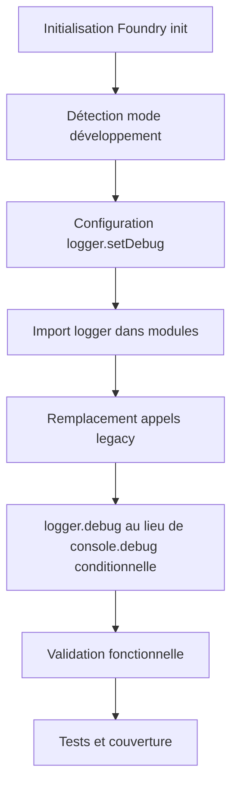

# Plan de Tâches : Migration des appels de logging vers logger.mjs

## 🎯 Contexte et Objectifs

### Contexte
Le projet utilise actuellement des appels de logging legacy avec des conditions `CONFIG.debug` et des appels directs à `console.xxx`. Une lib centralisée `logger.mjs` existe dans `module/utils/logger.mjs` mais n'est pas utilisée de manière cohérente dans le codebase.

### Objectifs
- **Primaire** : Migrer tous les appels de logging legacy vers `logger.mjs`
- **Secondaire** : Unifier la gestion du debug dans le système
- **Tertiaire** : Améliorer la traçabilité et la maintenabilité des logs

### Portée
- **Dans le périmètre** :
  - Remplacement des patterns `if (CONFIG.debug?.xxx) { console.xxx(...) }`
  - Remplacement des appels directs `console.xxx()` dans le module
  - Intégration du logger au cycle d'initialisation du système
  - Mise à jour des tests existants

- **Hors périmètre** :
  - Scripts de build (`build.mjs`, `get-next-version.mjs`, etc.)
  - Fichiers de documentation (gardent leurs exemples)
  - Logger lui-même (`module/utils/logger.mjs`)

## 🔒 Contraintes

### Technique
- **Foundry VTT v13** : Compatibilité avec les APIs ApplicationV2, DocumentSheetV2
- **Performance** : Éviter la création d'objets inutiles en mode non-debug
- **Rétrocompatibilité** : Les fonctionnalités existantes ne doivent pas être altérées

### Architecture
- Respect des standards du projet (`CODING_STYLES_AGENT.md`)
- Import/export ES6 modules
- Nommage cohérent (`camelCase`)
- Documentation JSDoc obligatoire pour méthodes publiques

### Qualité
- Tests Vitest pour les nouvelles fonctionnalités
- Couverture des cas d'erreur
- A11y : Pas d'impact sur l'accessibilité
- i18n : Pas d'impact sur l'internationalisation

## 🗺️ Dépendances et Intégration

### Modules impactés
- `module/utils/logger.mjs` (existant, intégration système)
- `swerpg.mjs` (initialisation du logger)
- `module/applications/sheets/*.mjs` (migration des appels)
- `module/documents/*.mjs` (migration des appels)
- `module/lib/**/*.mjs` (migration des appels)
- `module/config/*.mjs` (migration des appels)
- `module/canvas/*.mjs` (migration des appels)

### Hooks Foundry
- `init` : Initialisation du logger avec le mode debug du système
- Aucun nouveau hook requis

## 📊 Flux Principal



## ✅ Plan de Tâches

### Phase 1 : Préparation et Configuration

#### **Task 1.1** : Intégration du logger au système
- **Type** : js
- **Files** : `swerpg.mjs`
- **Refs** : Hook `init`, `detectDevelopmentMode()`
- **Acceptance** : 
  - Given le système démarre
  - When `detectDevelopmentMode()` retourne true/false
  - Then `logger.setDebug()` est appelé avec la bonne valeur
- **DoD** : Code lint, test unitaire, build successful
- **Risks** : Ordre d'initialisation - mitigation: placer après `detectDevelopmentMode()`
- **Estimate** : S

#### **Task 1.2** : Audit complet des appels de logging
- **Type** : docs
- **Files** : `documentation/tasks/core/logging-audit.md`
- **Refs** : N/A
- **Acceptance** :
  - Given le codebase complet
  - When recherche de tous les patterns de logging
  - Then liste exhaustive des fichiers et lignes à migrer
- **DoD** : Document complet avec chemins précis et types d'appels
- **Risks** : Patterns manqués - mitigation: regex multiples et revue manuelle
- **Estimate** : S

### Phase 2 : Migration des Application Sheets

#### **Task 2.1** : Migration base-actor-sheet.mjs
- **Type** : js
- **Files** : `module/applications/sheets/base-actor-sheet.mjs`
- **Refs** : `_prepareContext()`, méthodes de construction de contexte
- **Acceptance** :
  - Given les 3 appels `if (CONFIG.debug?.sheets)` existants
  - When remplacement par `logger.debug()`
  - Then même comportement, import logger ajouté
- **DoD** : Code lint, tests sheets passants, debug logs visibles en mode dev
- **Risks** : Import path incorrect - mitigation: utiliser path relatif
- **Estimate** : S

#### **Task 2.2** : Migration base-item.mjs
- **Type** : js
- **Files** : `module/applications/sheets/base-item.mjs`
- **Refs** : `_prepareContext()`
- **Acceptance** :
  - Given l'appel `if (CONFIG.debug?.sheets)` ligne 145
  - When remplacement par `logger.debug()`
  - Then comportement identique
- **DoD** : Code lint, tests passants
- **Risks** : Aucun majeur
- **Estimate** : S

#### **Task 2.3** : Migration character-sheet.mjs
- **Type** : js
- **Files** : `module/applications/sheets/character-sheet.mjs`
- **Refs** : `_prepareContext()`, handlers d'événements
- **Acceptance** :
  - Given les 6+ appels conditionnels de debug
  - When remplacement par `logger.debug()`
  - Then même niveau de détail dans les logs
- **DoD** : Code lint, tests sheets passants, fonctionnalités sheets inchangées
- **Risks** : Volume de logs important - mitigation: grouper les logs liés
- **Estimate** : M

#### **Task 2.4** : Migration origin.mjs
- **Type** : js
- **Files** : `module/applications/sheets/origin.mjs`
- **Refs** : `_prepareContext()`, handlers skills
- **Acceptance** :
  - Given les 8+ appels conditionnels de debug
  - When remplacement par `logger.debug()`
  - Then logs détaillés des opérations skills
- **DoD** : Code lint, tests sheets passants
- **Risks** : Logique skills complexe - mitigation: tests approfondis
- **Estimate** : M

#### **Task 2.5** : Migration sheets simples (obligation, taxonomy)
- **Type** : js
- **Files** : `module/applications/sheets/obligation.mjs`, `module/applications/sheets/taxonomy.mjs`
- **Refs** : `_prepareContext()`
- **Acceptance** :
  - Given 1 appel par fichier
  - When remplacement par `logger.debug()`
  - Then comportement identique
- **DoD** : Code lint, tests passants
- **Risks** : Aucun majeur
- **Estimate** : S

### Phase 3 : Migration des Documents

#### **Task 3.1** : Migration actor.mjs et actor-origin.mjs
- **Type** : js
- **Files** : `module/documents/actor.mjs`, `module/documents/actor-origin.mjs`
- **Refs** : Méthodes de gestion talents, flanking
- **Acceptance** :
  - Given les appels `console.warn()`, `console.error()`, `console.debug()`
  - When remplacement par `logger.warn()`, `logger.error()`, `logger.debug()`
  - Then même niveau de logging mais via logger centralisé
- **DoD** : Code lint, tests documents passants, fonctionnalités inchangées
- **Risks** : Logique talents complexe - mitigation: tests regression
- **Estimate** : M

#### **Task 3.2** : Migration item.mjs
- **Type** : js
- **Files** : `module/documents/item.mjs`
- **Refs** : Méthodes debug d'items
- **Acceptance** :
  - Given les appels `console.debug()` existants
  - When remplacement par `logger.debug()`
  - Then logs items via logger centralisé
- **DoD** : Code lint, tests items passants
- **Risks** : Aucun majeur
- **Estimate** : S

### Phase 4 : Migration des autres modules

#### **Task 4.1** : Migration config et lib
- **Type** : js
- **Files** : `module/config/system.mjs`, `module/config/talent-tree.mjs`, `module/lib/talents/ranked-trained-talent.mjs`
- **Refs** : Fonctions utilitaires, configuration système
- **Acceptance** :
  - Given les appels `console.warn()`, `console.debug()` existants
  - When remplacement par appels logger appropriés
  - Then logs système via logger centralisé
- **DoD** : Code lint, tests système passants, initialisation correcte
- **Risks** : Ordre d'initialisation - mitigation: logger disponible dès `init`
- **Estimate** : M

#### **Task 4.2** : Migration canvas
- **Type** : js
- **Files** : `module/canvas/token.mjs`
- **Refs** : Logique de flanking, visualisation
- **Acceptance** :
  - Given les appels conditionnels `CONFIG.debug.flanking`
  - When adaptation pour utiliser logger avec contexte
  - Then debug flanking via logger
- **DoD** : Code lint, tests canvas passants, fonctionnalités combat inchangées
- **Risks** : Impact performance combat - mitigation: tests performance
- **Estimate** : M

### Phase 5 : Tests et Validation

#### **Task 5.1** : Tests unitaires logger integration
- **Type** : test
- **Files** : `tests/utils/logger-integration.spec.js`
- **Refs** : Intégration système, configuration debug
- **Acceptance** :
  - Given différents modes debug (on/off)
  - When appels logger depuis modules
  - Then comportement correct selon mode
- **DoD** : Couverture >90%, tous les modes testés
- **Risks** : Mocks Foundry complexes - mitigation: helper de test
- **Estimate** : M

#### **Task 5.2** : Tests de régression sheets
- **Type** : test
- **Files** : `tests/applications/sheets/sheets-logging.spec.js`
- **Refs** : Fonctionnalités sheets existantes
- **Acceptance** :
  - Given sheets migrées vers logger
  - When utilisation normale des sheets
  - Then aucune régression fonctionnelle
- **DoD** : Tests existants passants, nouveaux tests logger
- **Risks** : Régression subtile - mitigation: tests exhaustifs
- **Estimate** : L

### Phase 6 : Documentation et Release

#### **Task 6.1** : Mise à jour documentation
- **Type** : docs
- **Files** : `documentation/swerpg/CODING_STYLES_AGENT.md`, changelog
- **Refs** : Standards de coding
- **Acceptance** :
  - Given migration complète vers logger
  - When mise à jour des exemples et guidelines
  - Then documentation cohérente avec nouvelle approche
- **DoD** : Exemples corrects, guidelines mises à jour
- **Risks** : Documentation obsolète - mitigation: revue complète
- **Estimate** : S

#### **Task 6.2** : Migration validation finale
- **Type** : test
- **Files** : Script de validation
- **Refs** : Codebase complet
- **Acceptance** :
  - Given codebase migré
  - When recherche patterns legacy
  - Then aucun appel direct `console.xxx` trouvé (hors logger.mjs)
- **DoD** : Script de validation, rapport clean
- **Risks** : Patterns manqués - mitigation: regex exhaustives
- **Estimate** : S

## 🧪 Plan de Tests

### Tests Unitaires

#### **File** : `tests/utils/logger-integration.spec.js`
- **Scenario 1** : Logger init avec mode debug
  - **Given** : Système en mode développement
  - **When** : `logger.setDebug(true)` appelé
  - **Then** : `logger.debug()` affiche les logs
- **Scenario 2** : Logger init sans mode debug
  - **Given** : Système en mode production
  - **When** : `logger.setDebug(false)` appelé
  - **Then** : `logger.debug()` n'affiche rien, mais `logger.error()` fonctionne
- **Mocks** : `CONFIG.debug`, `console` globals
- **Coverage target** : 100% du logger utilisé

#### **File** : `tests/applications/sheets/sheets-logging.spec.js`
- **Scenario 1** : Sheet debug logs en mode développement
  - **Given** : Sheet avec logger.debug() et mode debug on
  - **When** : `_prepareContext()` appelée
  - **Then** : Messages de debug affichés avec préfixe SWERPG
- **Scenario 2** : Sheet sans logs en production
  - **Given** : Sheet avec logger.debug() et mode debug off
  - **When** : `_prepareContext()` appelée  
  - **Then** : Aucun log debug affiché
- **Mocks** : Foundry ApplicationV2, logger
- **Coverage target** : 90% des sheets migrées

### Tests d'Intégration

#### **File** : `tests/integration/logging-migration.spec.js`
- **Scenario** : Migration end-to-end
  - **Given** : Système initialisé avec mode debug
  - **When** : Utilisation normale des features (sheets, combat, etc.)
  - **Then** : Logs cohérents via logger, aucun appel direct console
- **Mocks** : Environnement Foundry complet
- **Coverage target** : Chemins critiques couverts

## 🔄 Migration de Données

### Pas de migration de données nécessaire
Cette tâche est purement technique et n'impacte pas les données utilisateur.

### Configuration système
- Aucun nouveau setting requis
- Le mode debug reste basé sur `detectDevelopmentMode()`

## 🚀 Release et Communication

### Settings et flags
- Aucun nouveau setting utilisateur
- Flag interne possible : `swerpg.loggingMigrated = true`

### Changelog
```markdown
### Changed
- Migration du système de logging vers logger centralisé
- Amélioration de la cohérence des messages de debug
- Suppression des appels directs à console.xxx

### Technical
- Tous les modules utilisent désormais `logger.mjs`
- Configuration debug unifiée via `detectDevelopmentMode()`
```

### Documentation utilisateur
- Aucun impact visible pour les utilisateurs finaux
- Documentation développeur mise à jour

### Risques et rollback
- **Risque faible** : Migration technique sans impact fonctionnel
- **Rollback** : Restauration des appels console.xxx si nécessaire
- **Validation** : Tests de régression exhaustifs

## 📈 Critères de Succès

1. **Technique** : Aucun appel direct `console.xxx` dans le module (hors logger.mjs)
2. **Fonctionnel** : Toutes les fonctionnalités existantes opérationnelles
3. **Performance** : Aucune dégradation measurable
4. **Qualité** : Couverture de tests maintenue ou améliorée
5. **Maintenance** : Documentation à jour et cohérente

## 🏁 Définition of Done Globale

- [ ] Tous les appels `if (CONFIG.debug?.xxx) { console.xxx() }` migrés
- [ ] Tous les appels directs `console.xxx()` dans `/module/` migrés  
- [ ] Logger intégré au cycle d'initialisation système
- [ ] Tests unitaires et d'intégration passants
- [ ] Documentation mise à jour
- [ ] Script de validation confirme migration complète
- [ ] Aucune régression fonctionnelle détectée
- [ ] Build et lint clean