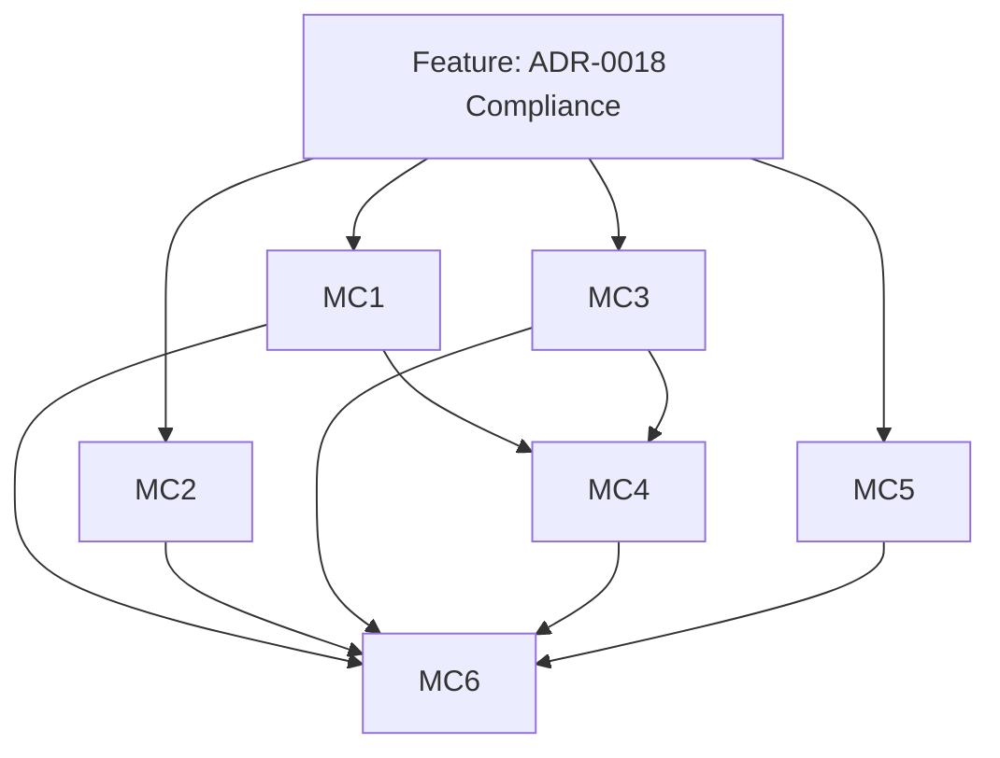

# Issues Checklist — ADR-0018 Magic Numbers Compliance

## Feature Issue

| # | Type | Titre | Priorité | Estimate |
| --- | --- | --- | --- | --- |
| F1 | Feature | ADR-0018 Magic Numbers Compliance — Mettre la codebase en conformité ADR-0018 | P1 | 21 |

## Story / Enabler Issues

| # | Type | Titre | Priorité | Estimate | Dépendances | Fichiers impactés (indicatif) |
| --- | --- | --- | --- | --- | --- | --- |
| MC1 | Story | Extraire les constantes de progression/XP/rangs/coûts métier | P1 | 5 | F1 | `module/lib/skills/*.mjs`, `module/lib/characteristics/*.mjs`, `module/lib/specializations/*.mjs`, `module/models/actor-type.mjs`, `module/models/character.mjs`, `module/models/adversary.mjs`, `module/config/skills.mjs`, `module/config/system.mjs` |
| MC2 | Story | Extraire les seuils du moteur de dés et du combat | P1 | 5 | F1 | `module/dice/standard-check.mjs`, `module/documents/combat.mjs`, `module/documents/actor-mixins/combat/attack.mixin.mjs`, `module/documents/actor-mixins/combat/defense.mixin.mjs`, `module/config/dice.mjs`, `module/config/system.mjs` |
| MC3 | Story | Centraliser les enums et defaults de schéma métier | P1 | 8 | F1 | `module/models/weapon.mjs`, `module/models/action.mjs`, `module/models/physical.mjs`, `module/models/adversary.mjs`, `module/models/species.mjs`, `module/documents/actor-mixins/combat/*.mjs`, `module/documents/actor.mjs`, `module/config/items.mjs`, `module/config/weapon.mjs`, `module/config/action.mjs` |
| MC4 | Enabler | Normaliser l'importer OggDude avec les constantes partagées | P2 | 3 | MC1, MC3 | `module/importer/items/weapon-ogg-dude.mjs`, `module/importer/items/armor-ogg-dude.mjs`, `module/importer/items/career-ogg-dude.mjs`, `module/importer/utils/description-markup-utils.mjs`, `module/importer/mappers/oggdude-talent-mapper.mjs` |
| MC5 | Enabler | Nommer les constantes UI/canvas locales | P2 | 3 | F1 | `module/canvas/token.mjs`, `module/canvas/talent-tree-node.mjs`, `module/canvas/talent-tree.mjs`, `module/canvas/talent-icon.mjs`, `module/applications/specialization-tree/pixi-tree-renderer.mjs` |
| MC6 | Test | Verrouiller les contrats config et valider la non-régression | P1 | 3 | MC1, MC2, MC3, MC4, MC5 | `tests/config/skills.test.mjs`, `tests/config/system.test.mjs`, `tests/config/dice.test.mjs`, `tests/config/items.test.mjs`, `tests/config/weapon.test.mjs`, `tests/config/action.test.mjs` |

## Labels recommandés

- `epic:core-refactor`
- `feature:adr-0018-compliance`
- `area:config`
- `area:models`
- `area:dice`
- `area:combat`
- `area:importer`
- `area:canvas`
- `type:refactor`
- `type:test`
- `priority:p1`
- `priority:p2`

## Dépendances entre sous-issues

## Ordre de création recommandé

1. **Feature** `F1`
2. **Story** `MC1` + `MC2` + `MC3` + `MC5` (parallélisables)
3. **Enabler** `MC4` (après MC1 et MC3 partiellement livrés)
4. **Test** `MC6` (après tous les lots)
