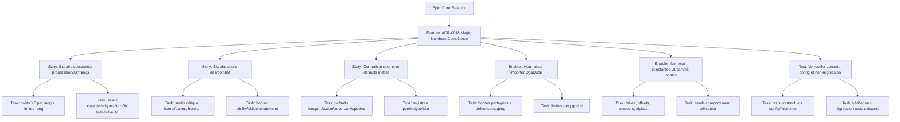

# Project Plan — Core Refactor / ADR-0018 Magic Numbers Compliance

## Contexte source

- `documentation/architecture/adr/adr-0018-no-magic-numbers-named-constants.md`
- `documentation/audit/adr-0018-audit-magic-numbers-mjs.md`

## 1. Vue d'ensemble

- **Epic**: `Core Refactor`
- **Feature**: `ADR-0018 Magic Numbers Compliance`
- **Positionnement**: mise en conformité transverse de la codebase `.mjs` avec l'ADR-0018 — interdiction des literals numériques et textuels à sens métier non nommés.

### Résumé

L'audit ADR-0018 a révélé **316 occurrences candidates** dans **73 fichiers**, avec une adoption partielle du pattern (constantes déjà extraites dans `module/config/skills.mjs`, `module/config/dice.mjs`). Ce plan organise la remédiation en 5 lots progressifs, du plus critique (progression/XP/rangs) au moins prioritaire (sentinelles/couleurs techniques).

### Valeur métier

- réduire le risque de **divergence silencieuse** des règles métier dupliquées ;
- rendre les **règles découvrables** depuis `module/config/` ;
- fiabiliser les **tests contractuels** en les adossant à des constantes nommées ;
- supprimer la **dette ADR** qui bloque la validation de conformité de l'architecture.

## 2. Critères de succès

- les règles métier de progression, XP, rangs, caractéristiques et spécialisations sont centralisées dans `module/config/` et consommées via `SYSTEM.*` ;
- les seuils du moteur de dés et de combat sont nommés ;
- les enums et valeurs par défaut de schéma sont adossés à des registres `SYSTEM.*` ;
- l'importer OggDude utilise les constantes partagées pour ses bornes et defaults ;
- les constantes UI/canvas sont au minimum nommées localement ;
- les tests contractuels `tests/config/*.test.mjs` couvrent les nouvelles constantes ;
- la règle ESLint `no-magic-numbers` peut être activée sans faux positifs bloquants.

## 3. Jalons

1. **Lot 1 — Métier critique** : progression, XP, rangs, caractéristiques, spécialisations.
2. **Lot 2 — Moteur de dés et combat** : seuils, bornes de check, pénalités et caps.
3. **Lot 3 — Magic strings métier** : defaults de schéma, enums, discriminants récurrents.
4. **Lot 4 — Importer OggDude** : clamps métier, defaults de mapping, limites contractuelles.
5. **Lot 5 — UI et canvas** : constantes locales nommées.

## 4. Risques

| Risque | Impact | Mitigation |
| --- | --- | --- |
| Sur-centralisation de constantes purement visuelles dans `module/config/` | dilution du catalogue, perte de lisibilité | lot 5 : nommer localement, ne centraliser que si la règle est transverse |
| Collision de namespace `SYSTEM.*` (ex. `SYSTEM.SKILLS` déjà utilisé) | régression silencieuse des consommateurs | vérifier itérateurs + `Object.defineProperty` si `enumerable: false` requis |
| Régressions sur règles métier partagées (XP, rangs) | fausse facturation, corruption de personnage | tests contractuels + tests existants inchangés |
| Étendue trop large du lot 3 (80+ magic strings) | dispersion, PR trop grosse | découper par entité métier (weapon, action, adversary, species, etc.) |

## 5. Hiérarchie des work items

## 6. Découpage GitHub recommandé

| Type | Titre | Priorité | Estimate | Dépendances |
| --- | --- | --- | --- | --- |
| Feature | `ADR-0018 Magic Numbers Compliance — Mettre la codebase en conformité ADR-0018` | P1 | 21 | Epic `Core Refactor` |
| Story | `MC1 — Extraire les constantes de progression/XP/rangs/coûts métier` | P1 | 5 | Feature |
| Story | `MC2 — Extraire les seuils du moteur de dés et du combat` | P1 | 5 | Feature |
| Story | `MC3 — Centraliser les enums et defaults de schéma métier` | P1 | 8 | Feature |
| Enabler | `MC4 — Normaliser l'importer OggDude avec les constantes partagées` | P2 | 3 | MC1, MC3 |
| Enabler | `MC5 — Nommer les constantes UI/canvas locales` | P2 | 3 | Feature |
| Test | `MC6 — Verrouiller les contrats config et valider la non-régression` | P1 | 3 | MC1, MC2, MC3, MC4, MC5 |

## 7. Dépendances et ordre recommandé

1. **MC1** — le plus gros gain métier, socle pour MC4.
2. **MC2** — indépendant, peut avancer en parallèle de MC1.
3. **MC3** — vaste (80+ strings), à découper par entité ; dépend de MC1 pour le pattern.
4. **MC4** — consomme MC1 + MC3 ; peut démarrer après livraison partielle.
5. **MC5** — indépendant, faible risque de régression.
6. **MC6** — ferme la boucle : tests contractuels + validation non-régression.

## 8. Board Kanban

- **Backlog**: feature et sous-issues créées
- **Sprint Ready**: AC détaillés, fichiers cibles listés, dépendances posées
- **In Progress**: un lot principal + au maximum un lot secondaire en parallèle
- **In Review**: relecture architecture + vérification ADR + tests
- **Testing**: validation locale + exécution complète `pnpm test`
- **Done**: constantes centralisées, tests contractuels présents, CI vert

### Champs recommandés

- `Priority`: `P1` / `P2`
- `Value`: `High` / `Medium`
- `Component`: `Core / Config / Models / Dice / Combat / Importer / Canvas`
- `Estimate`: `3`, `5`, `8`, `21`
- `Epic`: `Core Refactor`
- `Track`: `ADR-0018 Compliance`

## 9. Définition de done

- toutes les règles métier identifiées dans l'audit comme critiques sont centralisées dans `module/config/` ;
- les constantes sont exposées via `SYSTEM.*` et consommées par la logique applicative ;
- les enums et defaults de schéma sont adossés à des registres nommés ;
- l'importer utilise les constantes partagées pour ses bornes et defaults ;
- les constantes UI/canvas sont au minimum nommées localement ;
- les tests contractuels `tests/config/*.test.mjs` existent pour chaque groupe de constantes ;
- `pnpm test` passe intégralement ;
- la règle `no-magic-numbers` ESLint peut être activée sans régression.

## 10. Métriques de pilotage

- **Couverture audit traitée** : 100% des occurrences critiques, 100% des majeures, 0% des faibles (intentionnellement exclues) ;
- **Rétention de pattern** : 0 nouveau magic number introduit dans les fichiers modifiés ;
- **Tests contractuels** : chaque groupe de constantes a son test dans `tests/config/` ;
- **Stabilité** : `pnpm test` vert sur chaque PR.
