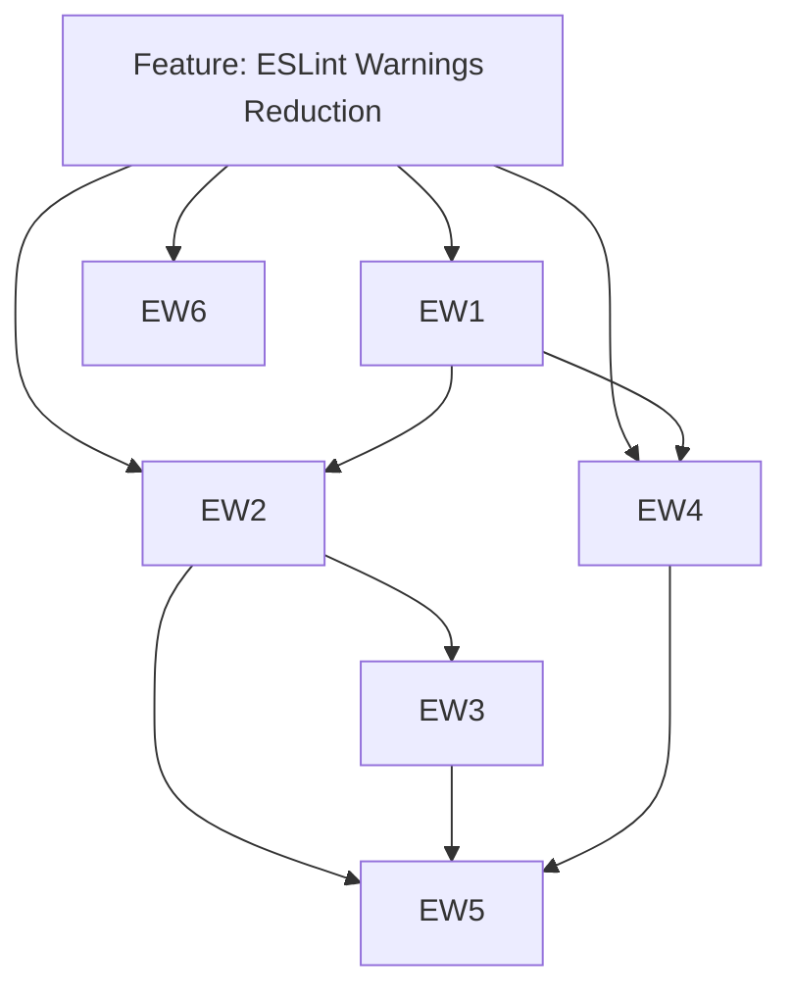

# Issues Checklist — ESLint Warnings Reduction

## Feature Issue

| #   | Type    | Titre                                                                | Priorité | Estimate |
| --- | ------- | -------------------------------------------------------------------- | -------- | -------- |
| F1  | Feature | ESLint Warnings Reduction — Reduire le backlog sans toucher ADR-0018 | P1       | 10-11h   |

## Story / Enabler / Test Issues

| #   | Type      | Titre                                                                     | Priorité | Estimate | Dépendances            | Fichiers impactés (indicatif)                                                                                              |
| --- | --------- | ------------------------------------------------------------------------- | -------- | -------- | ---------------------- | -------------------------------------------------------------------------------------------------------------------------- |
| EW1 | Story     | Appliquer les auto-fix et warnings triviaux                               | P1       | 1h       | F1                     | fichiers remontes par `pnpm exec eslint . --fix`, avec focus initial sur `module/**/*.mjs`, `tests/**/*.mjs`, `swerpg.mjs` |
| EW2 | Story     | Completer les types JSDoc manquants                                       | P1       | 2h       | EW1                    | fichiers remontes par `jsdoc/require-param-type`, priorite aux modules avec forte densite de warnings                      |
| EW3 | Story     | Rediger les descriptions JSDoc manquantes                                 | P1       | 3h       | EW2                    | fichiers remontes par `jsdoc/require-description`, traites par lots de modules coherents                                   |
| EW4 | Story     | Corriger les warnings de code restants                                    | P1       | 2h       | EW1                    | occurrences `no-proto`, `no-promise-executor-return`, `jsdoc/check-param-names` et cas isoles dans les fichiers lintes     |
| EW5 | Test      | Revalider le backlog ESLint et isoler le residuel ADR-0018                | P1       | 1h       | EW2, EW3, EW4          | rapport ESLint agrege du scope traite, documentation de l'ecart residuel                                                   |
| EW6 | Follow-up | Router les warnings `no-magic-numbers` vers la feature ADR-0018 existante | P2       | 3h       | Plan ADR-0018 existant | `documentation/ways-of-work/plan/core-refactor/adr-0018-magic-numbers-compliance/` et fichiers modules concernes           |

## Labels recommandés

- `epic:core-refactor`
- `feature:eslint-warnings-reduction`
- `area:tooling`
- `area:documentation`
- `type:refactor`
- `type:test`
- `priority:p1`
- `priority:p2`

## Dépendances entre sous-issues

## Ordre de création recommandé

1. **Feature** `F1`
2. **Story** `EW1`
3. **Story** `EW2` et `EW4` en parallele si le lot de fichiers le permet
4. **Story** `EW3`
5. **Test** `EW5`
6. **Follow-up** `EW6` uniquement comme lien vers le chantier ADR-0018 existant

## Checklist opérationnelle

- [ ] Creer la feature `F1` sur le board `Core Refactor`
- [ ] Capturer un baseline ESLint exportable pour mesurer la reduction lot par lot
- [ ] Executer `EW1` avec auto-fix limite au scope retenu
- [ ] Ouvrir `EW2` avec une strategie mecanique explicite pour les types JSDoc
- [ ] Ouvrir `EW3` par lots de modules pour garder les revues lisibles
- [ ] Ouvrir `EW4` pour les warnings de code restants non couverts par auto-fix
- [ ] Fermer `EW5` avec le bilan du residuel et la liste des warnings encore hors scope
- [ ] Lier `EW6` au plan `ADR-0018 Magic Numbers Compliance` sans absorber ce travail dans `F1`
