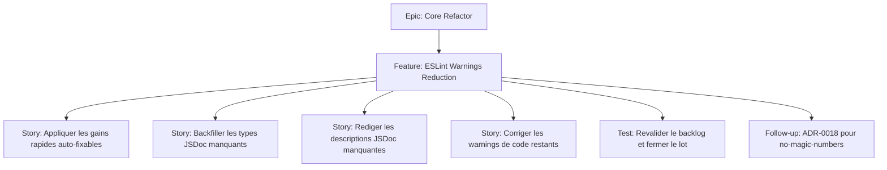

# Project Plan — Core Refactor / ESLint Warnings Reduction

## Contexte source

- cadrage d'estimation fourni le 2026-05-27 sur les `536 warnings` ESLint restants ;
- `AGENTS.md` du projet : utiliser `pnpm exec eslint <targets>` et non un script `lint:fix` inexistant ;
- `documentation/ways-of-work/plan/core-refactor/adr-0018-magic-numbers-compliance/project-plan.md` pour le traitement separe des warnings `no-magic-numbers`.

## 1. Vue d'ensemble

- **Epic**: `Core Refactor`
- **Feature**: `ESLint Warnings Reduction`
- **Positionnement**: reduction du backlog ESLint par lots a faible risque d'abord, sans melanger le chantier ADR-0018 deja planifie a part.

### Resume

Le backlog actuel se repartit entre `323` warnings `jsdoc/require-param-type`, `127` warnings `jsdoc/require-description`, une vingtaine de warnings auto-fixables ou triviaux, `25` warnings de code reels (`no-proto`, `no-var`, `no-promise-executor-return`, `jsdoc/check-param-names`, cas isoles), et `15` warnings `no-magic-numbers` qui doivent rester hors de ce lot. Ce plan vise un gain rapide sur les warnings mecanisables, puis une reduction controlee des warnings demandant du contexte, avec une execution par lots lisibles plutot qu'une PR monolithique.

### Valeur

- reduire le bruit de validation pour rendre les vrais ecarts plus visibles ;
- diminuer le cout d'entree des futures PR en limitant les warnings herites ;
- normaliser la JSDoc sur les surfaces actives sans changer le comportement runtime ;
- isoler clairement la dette ADR-0018 plutot que la noyer dans une campagne lint generique.

## 2. Critères de succès

- tous les warnings auto-fixables et triviaux de la campagne sont supprimes ;
- les warnings `jsdoc/require-param-type` sont traites par lot mecanique coherent, sans inventer de types metier faux ;
- les warnings `jsdoc/require-description` sont rediges avec des descriptions courtes, factuelles et alignees sur le contrat observable ;
- les warnings `no-proto`, `no-var`, `no-promise-executor-return`, `jsdoc/check-param-names` et le reste isole sont corriges ;
- aucun warning `no-magic-numbers` n'est traite ici sans rattachement explicite au plan ADR-0018 existant ;
- les fichiers modifies n'introduisent aucun nouveau warning ESLint.

## 3. Jalons

1. **Lot 1 — Gain rapide** : appliquer `eslint --fix` sur la cible retenue et fermer les warnings triviaux (`eqeqeq`, `no-var`, cas simples de style/coercion/escape).
2. **Lot 2 — JSDoc mecanique** : traiter les `jsdoc/require-param-type` par script ou lot manuel assiste, en priorisant les modules les plus denses.
3. **Lot 3 — JSDoc redactionnelle** : completer `jsdoc/require-description` avec des phrases courtes et verifiables.
4. **Lot 4 — Warnings de code reels** : corriger `no-proto`, `no-promise-executor-return`, `jsdoc/check-param-names` et les cas restants.
5. **Lot 5 — Fermeture et relais** : revalider le backlog residuel et rerouter `no-magic-numbers` vers la feature ADR-0018 si toujours presents.

## 4. Périmètre et exclusions

### Inclus

- remediation lint sans changement fonctionnel volontaire ;
- corrections JSDoc de type et de description ;
- corrections syntaxiques ou structurelles locales requises par ESLint ;
- decoupage par lots de fichiers pour garder des PRs relisibles.

### Exclus

- extraction de constantes et tests contractuels lies a `no-magic-numbers` ;
- refactors fonctionnels non necessaires a la levee d'un warning ;
- changements de regles ESLint ou baisse de l'exigence de lint pour faire disparaitre les warnings.

## 5. Risques

| Risque                                                 | Impact                                   | Mitigation                                                                     |
| ------------------------------------------------------ | ---------------------------------------- | ------------------------------------------------------------------------------ |
| Types JSDoc ajoutes trop agressivement                 | documentation trompeuse sur les APIs     | preferer des types larges et justifiables quand l'inference n'est pas certaine |
| Lot de descriptions trop gros                          | PR bruyante et relecture superficielle   | traiter par modules ou lots de taille comparable                               |
| Correction lint qui glisse vers un refactor            | augmentation du risque de regression     | rester sur le correctif minimal prouve par le warning                          |
| `no-magic-numbers` absorbe par erreur dans ce chantier | melange de deux scopes et hausse du cout | garder un suivi separe via la feature `ADR-0018 Magic Numbers Compliance`      |

## 6. Hiérarchie des work items

## 7. Découpage GitHub recommandé

| Type      | Titre                                                                  | Priorité | Estimate | Dépendances            |
| --------- | ---------------------------------------------------------------------- | -------- | -------- | ---------------------- |
| Feature   | `ESLint Warnings Reduction — Reduire le backlog sans toucher ADR-0018` | P1       | 10-11h   | Epic `Core Refactor`   |
| Story     | `EW1 — Appliquer les auto-fix et warnings triviaux`                    | P1       | 1h       | Feature                |
| Story     | `EW2 — Completer les types JSDoc manquants`                            | P1       | 2h       | EW1                    |
| Story     | `EW3 — Rediger les descriptions JSDoc manquantes`                      | P1       | 3h       | EW2                    |
| Story     | `EW4 — Corriger les warnings de code restants`                         | P1       | 2h       | EW1                    |
| Test      | `EW5 — Revalider le backlog ESLint et isoler le residuel ADR-0018`     | P1       | 1h       | EW2, EW3, EW4          |
| Follow-up | `EW6 — Traiter les warnings no-magic-numbers dans la feature ADR-0018` | P2       | 3h       | Plan ADR-0018 existant |

## 8. Dépendances et ordre recommandé

1. **EW1** pour obtenir le gain rapide et nettoyer le bruit facile.
2. **EW2** pour supprimer la masse mecanique dominante.
3. **EW4** peut avancer en parallele de **EW2** si le lot est decoupe par fichiers.
4. **EW3** une fois les signatures stabilisees par **EW2**.
5. **EW5** pour mesurer le residuel reel apres la campagne.
6. **EW6** reste hors feature et renvoie au plan ADR-0018 deja cree.

## 9. Board Kanban

- **Backlog**: feature et sous-issues creees avec lots explicites
- **Sprint Ready**: liste de fichiers ciblee, lot borne, commande lint definie
- **In Progress**: un lot mecanique principal et au plus un lot correctif parallele
- **In Review**: diff lisible, descriptions JSDoc controlees, aucun changement fonctionnel volontaire
- **Testing**: verification ESLint sur le lot touche puis sur le scope agrege
- **Done**: backlog cible supprime, residuel ADR-0018 isole et documente

### Champs recommandés

- `Priority`: `P1` / `P2`
- `Value`: `High`
- `Component`: `Tooling / Docs / Core`
- `Epic`: `Core Refactor`
- `Track`: `ESLint Warning Reduction`

## 10. Définition de done

- les warnings couverts par `EW1` a `EW5` sont supprimes ou explicitement reclasses hors scope ;
- les corrections restent minimales et sans modification comportementale intentionnelle ;
- les descriptions JSDoc ajoutees sont courtes, factuelles et coherentes avec le code ;
- les warnings `no-magic-numbers` restants sont references vers le plan ADR-0018, sans traitement opportuniste ;
- la commande ESLint projet choisie pour le lot ne remonte plus les warnings traites.

## 11. Métriques de pilotage

- **Reduction ciblee** : `~50` warnings apres `EW1`, `~373` apres `EW2`, puis reduction progressive du residuel contextuel ;
- **Part mecanique vs contextuelle** : verifier que la part mecanique est absorbée avant les descriptions manuelles ;
- **Residuel ADR-0018** : `15` warnings attendus tant que la feature dediee n'est pas executee ;
- **Qualite de lot** : aucun nouveau warning dans les fichiers modifies.
