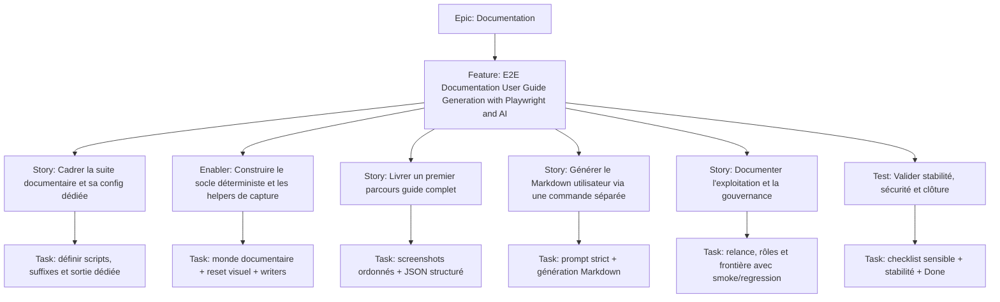

# Project Plan — Documentation / E2E Documentation User Guide Generation with Playwright and AI

## Contexte source

- `documentation/cadrage/documentation/e2e-documentation-user-guide-generation-with-playwright-and-ai.md`
- `documentation/tests/e2e/playwright-e2e-guide.md`

## 1. Vue d'ensemble

- **Epic**: `Documentation`
- **Feature**: `E2E Documentation User Guide Generation with Playwright and AI`
- **Positionnement**: troisième parcours E2E dédié à la production d'assets documentaires, distinct des suites smoke et regression.

### Résumé

Découper un plan d'issues court pour mettre en place une suite `e2e:documentation` capable de produire des screenshots stables, des métadonnées structurées et un brouillon de user guide en anglais, avec validation humaine obligatoire.

### Valeur métier

- produire une base documentaire visuelle maintenable à partir de parcours réels ;
- éviter de mélanger validation fonctionnelle et génération documentaire ;
- fiabiliser la génération d'assets pour l'IA sans exposer de données sensibles ;
- rendre le workflow relançable par l'équipe E2E et exploitable par la documentation produit.

## 2. Critères de succès

- une commande `pnpm run e2e:documentation` isole les specs `*.guide.spec.ts` ;
- la suite produit des screenshots stables et un JSON intermédiaire par guide ;
- au moins un parcours documentaire complet est disponible ;
- une commande séparée génère le guide Markdown en anglais ;
- les sorties Markdown référencent correctement les captures ;
- la frontière entre `e2e:documentation`, `e2e:smoke` et `e2e:regression` est documentée.

## 3. Jalons

1. **Contrat de suite documentaire** — config dédiée, périmètre et conventions de nommage.
2. **Socle déterministe** — monde documentaire, reset visuel, helpers de capture et métadonnées.
3. **Premier guide complet** — scénario documentaire, screenshots, JSON et structure de sortie.
4. **Génération éditoriale** — commande séparée de génération Markdown via prompt strict.
5. **Pilotage et gouvernance** — documentation d'exploitation, dépendances GitHub et critères de clôture.

## 4. Risques

| Risque | Impact | Mitigation |
| --- | --- | --- |
| Confusion avec les suites de tests existantes | mauvais usage de la suite, attentes erronées | suffixe `*.guide.spec.ts`, config dédiée, documentation explicite |
| Screenshots instables | artefacts inutilisables | viewport fixe, animations neutralisées, monde déterministe |
| Hallucinations IA | guide faux ou trompeur | JSON structuré, prompt restrictif, relecture humaine obligatoire |
| Données sensibles dans les captures | risque documentaire et sécurité | monde dédié, nettoyage des données, contrôle des captures |

## 5. Hiérarchie des work items

## 6. Découpage GitHub recommandé

| Type | Titre | Priorité | Estimate | Dépendances |
| --- | --- | --- | --- | --- |
| Feature | `Documentation E2E User Guides - Produire des guides utilisateur à partir de parcours Playwright` | P1 | 8 | Epic `Documentation` |
| Story | `EDG1 - Cadrer la suite e2e:documentation et sa configuration dédiée` | P1 | 2 | Feature |
| Enabler | `EDG2 - Mettre en place un monde documentaire déterministe et les helpers d'artefacts` | P1 | 3 | EDG1 |
| Story | `EDG3 - Livrer un premier parcours *.guide.spec.ts avec screenshots et JSON` | P1 | 3 | EDG1, EDG2 |
| Story | `EDG4 - Générer un user guide Markdown en anglais via commande séparée` | P1 | 3 | EDG3 |
| Story | `EDG5 - Documenter l'exploitation, la gouvernance et la séparation avec smoke/regression` | P2 | 2 | EDG1, EDG4 |
| Test | `EDG6 - Valider la stabilité des captures, la sûreté des données et la checklist de release` | P1 | 2 | EDG3, EDG4, EDG5 |

## 7. Dépendances et ordre recommandé

1. **EDG1** — verrouiller le contrat de la suite documentaire.
2. **EDG2** — construire le socle visuel déterministe avant tout guide.
3. **EDG3** — prouver la chaîne screenshots + JSON sur un parcours réel.
4. **EDG4** — brancher la génération Markdown séparée sur les artefacts validés.
5. **EDG5** — formaliser l'usage opérationnel et la gouvernance documentaire.
6. **EDG6** — fermer la boucle avec validation, sécurité et critères de clôture.

## 8. Board Kanban

- **Backlog**: epic, feature et sous-issues créées
- **Sprint Ready**: AC relus, monde documentaire confirmé, dépendances posées
- **In Progress**: une issue active par axe principal
- **In Review**: revue technique E2E + revue documentation produit
- **Testing**: vérification manuelle des captures, JSON et Markdown généré
- **Done**: suite stable, gouvernance claire, checklist clôturée

### Champs recommandés

- `Priority`: `P1` / `P2`
- `Value`: `High` / `Medium`
- `Component`: `Documentation / Testing / Playwright / AI`
- `Estimate`: `2`, `3`, `8`
- `Epic`: `Documentation`
- `Track`: `E2E Documentation User Guides`

## 9. Définition de done

- la suite documentaire reste séparée des validations smoke et regression ;
- le workflow produit des captures stables, lisibles et non sensibles ;
- le JSON intermédiaire suffit à alimenter une génération IA sans invention ;
- au moins un guide complet est généré en Markdown anglais ;
- la relecture humaine et les rôles de gouvernance sont explicités ;
- les issues GitHub disposent de dépendances, priorité et estimation cohérentes.

## 10. Métriques projet

- **Couverture documentaire**: au moins 1 parcours complet généré de bout en bout ;
- **Stabilité visuelle**: 0 capture dépendante d'un viewport aléatoire sur le scope retenu ;
- **Séparation de responsabilités**: 100% des issues rattachées explicitement au track documentaire, pas à la validation fonctionnelle ;
- **Sûreté des données**: 0 donnée sensible acceptée dans les captures validées ;
- **Pilotage GitHub**: 100% des issues créées avec priorité, estimate, dépendances et rattachement epic.
