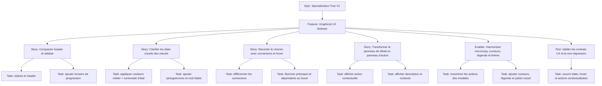

# Project Plan — Specialization Tree V1 / Graphical UX Refresh

## Contexte source

- `documentation/cadrage/character-sheet/specialization-tree/cadrage-refonte-graphique.md`
- `documentation/ways-of-work/plan/specialization-tree-v1/us16-graphical-tree-rendering/project-plan.md`
- `documentation/ways-of-work/plan/specialization-tree-v1/us17-talent-node-purchase-and-forget/project-plan.md`

## 1. Vue d'ensemble

- **Epic**: `Specialization Tree V1`
- **Feature**: `Graphical UX Refresh`
- **Prérequis**: la vue graphique US16 et le flux achat / oubli US17 sont déjà disponibles.

### Résumé

Réaliser une passe UX courte sur l'écran graphique des arbres de spécialisation pour rendre la lecture et l'action quasi immédiates : comprendre l'état global, distinguer les nœuds sans dépendre uniquement de la couleur, visualiser le chemin de progression et recentrer le panneau de détail sur l'action contextuelle.

### Valeur métier

- réduire le temps de compréhension de l'écran à quelques secondes ;
- rendre les états et coûts actionnables sans inspection manuelle de l'arbre ;
- mieux guider achat, oubli et planification de build ;
- renforcer l'identité visuelle Star Wars sans dégrader la lisibilité.

## 2. Critères de succès

- le header est compact et la progression utile est visible sans scroll ;
- la sidebar expose l'état global de l'arbre actif ;
- chaque nœud exprime son type et son état via couleur, contraste et pictogramme ;
- les nœuds verrouillés restent lisibles pour la planification ;
- le survol d'un nœud explique ses prérequis et ce qu'il débloque ;
- le panneau de détail devient le point d'entrée principal pour l'achat / l'oubli quand l'action est autorisée ;
- les dialogues et libellés d'action utilisent une microcopy explicite (`Purchase`, `Refund`, `Cancel`) ;
- la légende, le curseur et les affordances visuelles sont cohérents avec l'état métier.

## 3. Jalons

1. **Compactage de l'écran** — header réduit, synthèse de progression, sidebar clarifiée.
2. **Langage visuel des nœuds** — couleurs métier, contraste, pictogrammes, coût stabilisé.
3. **Lecture du chemin** — connexions différenciées et hover contextuel.
4. **Centre d'action** — panneau de détail enrichi, actions contextuelles et descriptions.
5. **Polish UX** — dialogues, curseurs, légende, ambiance visuelle et validation finale.

## 4. Risques

| Risque | Impact | Mitigation |
| --- | --- | --- |
| Surcharger l'écran avec trop de signaux visuels | bruit UX, perte de lisibilité | privilégier une hiérarchie sobre et des marqueurs discrets |
| Mélanger type de talent et état d'achat dans la même couleur | ambiguïté sur la signification des nœuds | séparer couleur métier, luminosité d'état et pictogramme |
| Hover trop agressif sur de grands arbres | fatigue visuelle | limiter l'atténuation du reste de l'arbre et garder des transitions sobres |
| Panneau d'action dépendant d'états déjà livrés par US17 | régression fonctionnelle si contrat instable | traiter le refresh UX comme couche au-dessus des contrats déjà en place |

## 5. Hiérarchie des work items

## 6. Découpage GitHub recommandé

| Type | Titre | Priorité | Estimate | Dépendances |
| --- | --- | --- | --- | --- |
| Feature | `Graphical UX Refresh - Rendre l'arbre de spécialisation plus lisible et actionnable` | P1 | 8 | Epic `Specialization Tree V1`, prérequis US16 + US17 |
| Story | `GUX1 - Compacter le header et clarifier la sidebar de progression` | P1 | 2 | Feature |
| Story | `GUX2 - Clarifier les états des nœuds avec couleurs, contraste et pictogrammes` | P1 | 3 | Feature |
| Story | `GUX3 - Rendre les connexions et le hover plus explicites pour la progression` | P1 | 2 | GUX2 |
| Story | `GUX4 - Transformer le panneau de détail en panneau d'action contextuelle` | P1 | 3 | GUX2, prérequis US17 |
| Enabler | `GUX5 - Harmoniser microcopy, curseurs, légende et ambiance visuelle` | P2 | 2 | GUX1, GUX2, GUX3, GUX4 |
| Test | `GUX6 - Valider lisibilité, affordances et non-régression du flux` | P1 | 2 | GUX1, GUX2, GUX3, GUX4, GUX5 |

## 7. Dépendances et ordre recommandé

1. **GUX1** — poser la nouvelle densité d'information de l'écran.
2. **GUX2** — établir le langage visuel stable des nœuds.
3. **GUX3** et **GUX4** — parallélisables après GUX2, avec dépendance fonctionnelle de GUX4 sur le contrat d'action US17.
4. **GUX5** — consolider la cohérence de surface une fois les interactions en place.
5. **GUX6** — verrouiller la non-régression et la cohérence UX observable.

## 8. Board Kanban

- **Backlog**: feature et sous-issues créées
- **Sprint Ready**: AC validés et dépendances posées
- **In Progress**: une story UX active par axe principal
- **In Review**: relecture UX + technique
- **Testing**: validation sur cas acheté / disponible / verrouillé / invalide
- **Done**: lecture, action et microcopy validées

### Champs recommandés

- `Priority`: `P1` / `P2`
- `Value`: `High` / `Medium`
- `Component`: `Character Sheet / Specialization Tree / UX`
- `Estimate`: `2`, `3`, `8`
- `Epic`: `Specialization Tree V1`
- `Track`: `Graphical UX Refresh`

## 9. Définition de done

- le header et la sidebar exposent la progression utile sans redondance ;
- les nœuds ne reposent plus sur la seule couleur pour exprimer leur état ;
- les coûts et états verrouillés restent lisibles pour la planification ;
- le hover aide à comprendre prérequis, déblocages et impacts d'oubli ;
- le panneau de détail propose l'action adaptée quand elle est possible ;
- les modales et actions utilisent des verbes explicites ;
- la légende et les curseurs sont cohérents avec les affordances visibles ;
- la passe visuelle renforce l'identité Star Wars sans bruit décoratif excessif.

## 10. Métriques projet

- **Lecture immédiate**: l'utilisateur identifie acheté / achetable / verrouillé / invalide sans inspection détaillée ;
- **Synthèse visible**: l'état global de progression est disponible dans la sidebar ;
- **Affordances cohérentes**: 100% des états interactifs ont curseur, hover et action cohérents ;
- **Microcopy**: 0 bouton générique `Yes / No` sur le flux ciblé ;
- **Planification**: 100% des nœuds verrouillés gardent un coût et un libellé lisibles ;
- **Non-régression**: achat / oubli restent pilotés par les contrats déjà livrés.
