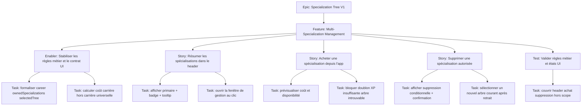

# Project Plan — Specialization Tree V1 / Multi-Specialization Management

## Contexte source

- `documentation/cadrage/character-sheet/specializations/cadrage-gestion-multi-specialisations-feuille-personnage.md`
- `documentation/ways-of-work/plan/specialization-tree-v1/us16-graphical-tree-rendering/project-plan.md`
- `documentation/ways-of-work/plan/specialization-tree-v1/us17-talent-node-purchase-and-forget/project-plan.md`
- `documentation/ways-of-work/plan/specialization-tree-v1/graphical-ux-refresh/project-plan.md`

## 1. Vue d'ensemble

- **Epic**: `Specialization Tree V1`
- **Feature**: `Multi-Specialization Management`
- **Positionnement**: étendre la fiche personnage et `SpecializationTreeApp` pour gérer plusieurs spécialisations sans
  confondre arbre courant UI et état métier.

### Résumé

Introduire une gestion V1 des spécialisations possédées avec trois capacités visibles : synthèse compacte dans le
header, achat cadré par les règles XP / doublon / résolution d'arbre, et suppression contrôlée d'une spécialisation non
initiale sans talents achetés.

### Valeur métier

- rendre lisible l'identité de spécialisation d'un personnage multi-spécialisé ;
- fiabiliser l'achat de spécialisation selon les règles Star Wars FFG ;
- éviter les états incohérents entre liste possédée, arbre courant et progression talents ;
- centraliser la gestion dans la fenêtre des arbres déjà connue par l'utilisateur.

## 2. Critères de succès

- le header affiche une spécialisation principale et une pastille `+N` avec tooltip sur les spécialisations
  supplémentaires ;
- le clic header ouvre la gestion des spécialisations dans `SpecializationTreeApp` ;
- `selectedSpecializationTree` reste un contexte UI et n'est jamais traité comme une spécialisation mécaniquement
  active ;
- l'achat affiche le coût calculé, le type carrière / hors carrière, et les raisons de blocage (`XP insuffisante`,
  doublon, arbre introuvable) ;
- un achat réussi ajoute la spécialisation, retire l'XP, ouvre l'accès à l'arbre et déclenche les recalculs dérivés
  nécessaires ;
- la suppression n'est possible que pour une spécialisation non initiale sans talent acheté, avec confirmation et sans
  remboursement XP ;
- après suppression, l'arbre courant bascule automatiquement vers une spécialisation encore disponible.

## 3. Jalons

1. **Contrat métier** — stabiliser `ownedSpecializations`, le calcul de coût et la sémantique de l'arbre courant.
2. **Synthèse header** — exposer l'information compacte et le point d'entrée de gestion.
3. **Achat guidé** — permettre l'ajout avec prévisualisation du coût et blocages explicites.
4. **Suppression contrôlée** — permettre le retrait autorisé avec confirmation et fallback de sélection.
5. **Validation ciblée** — verrouiller règles métier, états UI et non-régression V1.

## 4. Risques

| Risque                                                        | Impact                                | Mitigation                                                                                  |
|---------------------------------------------------------------|---------------------------------------|---------------------------------------------------------------------------------------------|
| Confondre arbre courant UI et spécialisation active métier    | bugs de progression ou d'affichage    | figer explicitement le contrat `career / ownedSpecializations / selectedSpecializationTree` |
| Autoriser l'achat d'une spécialisation non résoluble          | acteur incohérent, arbre inutilisable | bloquer la V1 si la spécialisation ne résout pas proprement son arbre                       |
| Supprimer une spécialisation avec talents achetés ou initiale | corruption de progression             | verrouiller la suppression par règles métier et message explicite                           |
| Oublier les effets dérivés après achat / suppression          | compétences ou vues désynchronisées   | traiter mise à jour acteur, recalculs et refresh UI dans le même flux                       |

## 5. Hiérarchie des work items

## 6. Découpage GitHub recommandé

| Type    | Titre                                                                                         | Priorité | Estimate | Dépendances                                           |
|---------|-----------------------------------------------------------------------------------------------|----------|----------|-------------------------------------------------------|
| Feature | `Multi-Specialization Management - Gérer ajout, synthèse et suppression des spécialisations`  | P1       | 8        | Epic `Specialization Tree V1`, continuité US16 + US17 |
| Enabler | `MSM1 - Stabiliser le contrat métier des spécialisations et de l'arbre courant`               | P1       | 2        | Feature                                               |
| Story   | `MSM2 - Résumer les spécialisations dans le header et ouvrir la gestion`                      | P1       | 2        | MSM1                                                  |
| Story   | `MSM3 - Acheter une spécialisation avec coût prévisualisé et blocages explicites`             | P1       | 3        | MSM1                                                  |
| Story   | `MSM4 - Supprimer une spécialisation autorisée avec confirmation et fallback d'arbre courant` | P1       | 3        | MSM1                                                  |
| Test    | `MSM5 - Valider coûts, états UI et non-régression multi-spécialisation`                       | P1       | 2        | MSM2, MSM3, MSM4                                      |

## 7. Dépendances et ordre recommandé

1. **MSM1** — verrouiller la distinction métier / UI et les règles de coût.
2. **MSM2** — rendre visible la synthèse et le point d'entrée utilisateur.
3. **MSM3** et **MSM4** — parallélisables après MSM1, avec partage du même centre de gestion.
4. **MSM5** — valider le flux complet sur cas nominaux et bloqués.

## 8. Board Kanban

- **Backlog**: feature et sous-issues documentées
- **Sprint Ready**: critères d'acceptation relus, dépendances posées
- **In Progress**: une story flux utilisateur active à la fois
- **In Review**: revue métier + revue UI
- **Testing**: validation des cas carrière / hors carrière / doublon / XP insuffisante / suppression verrouillée
- **Done**: règles V1 tenues et wording cohérent FR/EN

### Champs recommandés

- `Priority`: `P1`
- `Value`: `High`
- `Component`: `Character Sheet / Specializations / Specialization Tree`
- `Estimate`: `2`, `3`, `8`
- `Epic`: `Specialization Tree V1`
- `Track`: `Multi-Specialization Management`

## 9. Définition de done

- le header synthétise correctement 0, 1, 2+ spécialisations ;
- l'app distingue clairement spécialisation possédée et arbre courant ;
- le coût affiché respecte la règle `10 x (n + 1)` avec `+10` hors carrière ;
- les spécialisations déjà possédées ne peuvent pas être rachetées ;
- l'achat bloqué expose une raison claire au lieu de masquer l'action ;
- la suppression de la spécialisation initiale ou d'une spécialisation avec talents achetés est impossible ;
- aucune suppression V1 ne rembourse d'XP ;
- après retrait, l'arbre courant reste valide et visible.

## 10. Métriques projet

- **Lisibilité header**: 100% des cas `0 / 1 / N` ont un rendu déterministe ;
- **Règles de coût**: couverture des cas 2e et 3e spécialisation carrière / hors carrière ;
- **Blocages explicites**: 100% des achats refusés affichent une raison compréhensible ;
- **Intégrité suppression**: 0 cas où une spécialisation initiale ou avec talents achetés peut être retirée ;
- **Cohérence UI**: 100% des suppressions réassignent un arbre courant valide si un autre arbre existe ;
- **Scope V1**: 0 remboursement XP et 0 confusion entre arbre courant et état métier exclusif.
