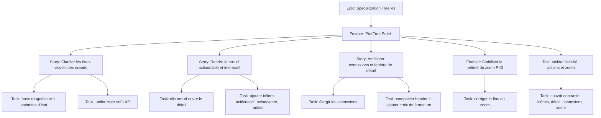

# Project Plan — Specialization Tree V1 / Pixi Tree Polish

## Contexte source

- Input utilisateur: TODO `Specialization Tree (Pixi)`
- `documentation/cadrage/character-sheet/specialization-tree/cadrage-refonte-graphique.md`
- `documentation/cadrage/character-sheet/specialization-tree/spec-cadrage-canvas-specialization-tree-ergonomie.md`
- `documentation/ways-of-work/plan/specialization-tree-v1/graphical-ux-refresh/project-plan.md`

## 1. Vue d'ensemble

- **Epic**: `Specialization Tree V1`
- **Feature**: `Pixi Tree Polish`
- **Positionnement**: passe courte de polish visuel et ergonomique sur la fenêtre PIXI des arbres de spécialisation.

### Résumé

Renforcer la lisibilité immédiate des nœuds et des connexions, rendre le panneau de détail plus actionnable, et corriger la perte de netteté au zoom sans changer la logique métier des arbres.

### Valeur métier

- distinguer en un coup d'œil actif/inactif, disponible/indisponible/acheté ;
- rendre le clic sur nœud plus évident et plus utile ;
- fiabiliser la lecture des connexions et du coût XP ;
- éviter qu'un zoom utile dégrade la qualité visuelle du canvas.

## 2. Critères de succès

- les nœuds actifs utilisent une base rouge, les nœuds inactifs une base bleue ;
- chaque état `available` / `locked` / `purchased` reste lisible à l'intérieur de cette base couleur ;
- le clic sur un nœud ouvre la fenêtre de détail ;
- les icônes métier sont cohérentes et stables: actif/inactif en haut à gauche, acheter/vendre en haut à droite, rang en bas à droite ;
- le coût XP est affiché de façon uniforme ;
- les connexions sont plus visibles ;
- la fenêtre de détail a un header compact et une action de fermeture explicite ;
- le zoom garde une image nette et exploitable.

## 3. Jalons

1. **Langage visuel des nœuds** — contraste, variantes d'état, icônes, coût XP.
2. **Affordances d'interaction** — clic nœud → détail, achat/vente explicites, ranked visible.
3. **Lisibilité de l'écran** — connexions renforcées, détail compact, fermeture claire.
4. **Qualité viewport** — correction du flou au zoom et validation finale.

## 4. Risques

| Risque | Impact | Mitigation |
| --- | --- | --- |
| Trop d'icônes sur un nœud | surcharge visuelle | garder des marqueurs discrets et positions stables |
| Couleur métier et état d'achat mélangés | ambiguïté utilisateur | séparer couleur de base et variation d'état |
| Connexions plus épaisses mais trop dominantes | bruit visuel | augmenter la visibilité sans concurrencer les nœuds |
| Correction du zoom qui casse le rendu courant | régression UX | isoler l'issue zoom comme enabler technique avec validation dédiée |

## 5. Hiérarchie des work items

## 6. Découpage GitHub recommandé

| Type | Titre | Priorité | Estimate | Dépendances |
| --- | --- | --- | --- | --- |
| Feature | `Pixi Tree Polish - Renforcer lisibilité et netteté de l'arbre de spécialisation` | P1 | 8 | Epic `Specialization Tree V1`, continuité `Graphical UX Refresh` |
| Story | `PXP1 - Clarifier contraste et états des nœuds actifs/inactifs` | P1 | 3 | Feature |
| Story | `PXP2 - Ouvrir le détail au clic et ajouter les icônes d'action des nœuds` | P1 | 3 | PXP1 |
| Story | `PXP3 - Renforcer connexions et compacter la fenêtre de détail` | P1 | 2 | PXP1 |
| Enabler | `PXP4 - Corriger le flou du zoom PIXI dans le viewport` | P0 | 3 | Feature |
| Test | `PXP5 - Valider lisibilité, affordances et netteté du canvas` | P1 | 2 | PXP1, PXP2, PXP3, PXP4 |

## 7. Dépendances et ordre recommandé

1. **PXP1** — établir le contrat visuel de base.
2. **PXP2** et **PXP3** — parallélisables après stabilisation des états visuels.
3. **PXP4** — peut avancer en parallèle, mais doit être validé avant clôture feature.
4. **PXP5** — verrouiller la non-régression observable.

## 8. Board Kanban

- **Backlog**: feature et sous-issues créées
- **Sprint Ready**: AC détaillés, assets confirmés, dépendances posées
- **In Progress**: une story UX + l'enabler zoom au maximum en parallèle
- **In Review**: relecture UX + rendu PIXI
- **Testing**: validation sur cas actif/inactif, acheté/disponible/indisponible, zoom
- **Done**: lisibilité, action et netteté validées

### Champs recommandés

- `Priority`: `P0` / `P1`
- `Value`: `High`
- `Component`: `Character Sheet / Specialization Tree / PIXI`
- `Estimate`: `2`, `3`, `8`
- `Epic`: `Specialization Tree V1`
- `Track`: `Pixi Tree Polish`

## 9. Définition de done

- les 6 variantes visuelles demandées sont distinguables sans ambiguïté majeure ;
- le détail s'ouvre au clic sur nœud ;
- les icônes `electricity.svg`, `plain-circle.svg`, `buy-card.svg`, `sell-card.svg`, `rank.svg` sont mappées aux bons cas ;
- le coût XP est présenté de façon uniforme ;
- les connexions sont plus visibles sans dominer les nœuds ;
- la fenêtre de détail peut se fermer explicitement et prend moins d'espace ;
- le zoom reste net dans la plage supportée par le viewport ;
- la feature et ses sous-issues sont traçables sur le board.

## 10. Métriques de pilotage

- **Predictibilité sprint**: >80 % des sous-issues livrées dans le sprint prévu
- **Cycle time cible**: <5 jours ouvrés par story/enabler
- **Couverture AC**: 100 % des critères de chaque issue relus en review/testing
- **Défauts UX post-livraison**: 0 défaut bloquant sur contraste, clic nœud, zoom flou
