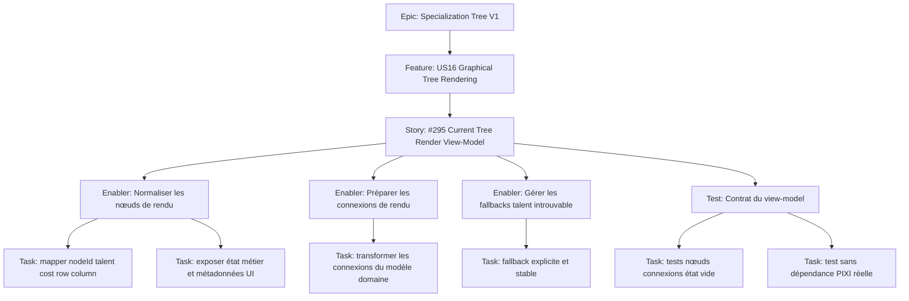

# Project Plan — Specialization Tree V1 / US16.2 Current Tree Render View-Model

## Contexte source

- `documentation/cadrage/character-sheet/specialization-tree/cadrage-us16-decoupage-rendu-graphique-arbres-specialisation.md`
- `documentation/cadrage/character-sheet/specialization-tree/cadrage-cles-metier-techniques-specialization-trees.md`
- `documentation/ways-of-work/plan/specialization-tree-v1/us16-graphical-tree-rendering/project-plan.md`
- `documentation/plan/character-sheet/talent/233-plan-afficher-arbre-par-defaut-noeuds-connexions.md`

## 1. Vue d'ensemble

- **Epic**: `Specialization Tree V1` (rattachement GitHub existant: Epic #184)
- **Feature parente**: `US16 - Graphical Tree Rendering` (rattachement GitHub existant: Feature #200)
- **Issue cible**: `#295 - US16.2 - Construire le view-model de rendu de l'arbre courant`

### Résumé

Construire, côté `SpecializationTreeApp`, un view-model pur et testable du tree courant pour alimenter le rendu graphique sans logique métier dans PIXI.

### Valeur métier

- séparer clairement domaine et rendu ;
- préparer les tickets de layout, mapping d'états et rendu PIXI ;
- fiabiliser le fallback sur talent introuvable ;
- rendre le contrat de rendu testable hors canvas.

## 2. Critères de succès

- le contexte expose un arbre courant exploitable par la vue ;
- chaque nœud expose `nodeId`, talent, coût, `row`, `column`, état métier et métadonnées d'affichage ;
- les connexions sont prêtes à être consommées par la couche de rendu ;
- le fallback talent introuvable est explicite et déterministe ;
- aucun calcul métier n'est déplacé dans PIXI ;
- le contrat reste testable sans rendu graphique réel.

## 3. Jalons

1. **Contrat d'entrée** — figer la forme du `currentTree` consommé par l'app.
2. **Normalisation des nœuds** — construire les nœuds de rendu à partir du modèle `specialization-tree`.
3. **Préparation des connexions** — exposer les arêtes prêtes pour le rendu.
4. **Fallbacks et tests** — couvrir talent introuvable, état vide et non-couplage PIXI.

## 4. Risques

| Risque                                              | Impact                            | Mitigation                                            |
| --------------------------------------------------- | --------------------------------- | ----------------------------------------------------- |
| Confusion entre `resolvedTreeStatus` et `nodeState` | mauvais contrat UI                | reprendre explicitement la convention du cadrage US16 |
| Talent référencé mais non résolu                    | nœud inutilisable au rendu        | fallback explicite + test dédié                       |
| View-model trop couplé au layout PIXI               | refactor coûteux pour US16.4/16.5 | limiter US16.2 aux données de rendu, pas au dessin    |
| Dépendance implicite à la sélection d'arbre courant | contrat instable                  | traiter US16.1 comme prérequis fonctionnel            |

## 5. Hiérarchie des work items

## 6. Découpage GitHub recommandé

| Type    | Titre                                                           | Priorité | Estimate | Dépendances                    |
| ------- | --------------------------------------------------------------- | -------- | -------- | ------------------------------ |
| Story   | `US16.2 - Construire le view-model de rendu de l'arbre courant` | P0       | 2        | Feature #200, prérequis US16.1 |
| Enabler | `US16.2.a - Normaliser les nœuds du tree courant`               | P0       | 1        | Story #295                     |
| Enabler | `US16.2.b - Préparer les connexions du view-model`              | P0       | 1        | Story #295                     |
| Enabler | `US16.2.c - Gérer le fallback talent introuvable`               | P0       | 1        | Story #295                     |
| Test    | `US16.2.t - Couvrir le contrat du view-model de rendu`          | P0       | 1        | 16.2.a, 16.2.b, 16.2.c         |

## 7. Dépendances et ordre recommandé

1. Vérifier le prérequis **US16.1** : un arbre courant déterministe existe déjà au contrat.
2. Créer **16.2.a** pour figer la structure des nœuds.
3. Créer **16.2.b** pour la structure des connexions.
4. Créer **16.2.c** pour les cas incomplets et les fallbacks.
5. Clore avec **16.2.t** pour verrouiller le contrat avant US16.3 et US16.4.

### Issues bloquées / débloquées

- **Blocked by**: Feature #200 ; disponibilité du contrat `currentTree` issu de US16.1.
- **Blocks**: US16.3 mapping états/raisons ; US16.4 layout graphique ; consolidation de US16.8.

## 8. Board Kanban

- **Backlog**: #295 et ses sous-issues documentées
- **Sprint Ready**: AC validés et dépendances posées
- **In Progress**: une seule sous-issue active à la fois sur le contrat
- **Testing**: validation des cas vide / nominal / talent introuvable
- **Done**: contrat du view-model figé et réutilisable par l'UI

### Champs recommandés

- `Priority`: `P0`
- `Value`: `High`
- `Component`: `Character Sheet / Specialization Tree`
- `Estimate`: `1` ou `2`
- `Epic`: `Specialization Tree V1`
- `Parent Feature`: `US16`

## 9. Définition de done

- le contexte de l'application expose le view-model du tree courant ;
- les nœuds et connexions sont prêts pour les tickets UI suivants ;
- le fallback talent introuvable est visible dans le contrat ;
- aucune dépendance PIXI n'est nécessaire pour tester le builder ;
- les dépendances GitHub reflètent correctement ce rôle de fondation.

## 10. Métriques projet

- **Couverture nœuds**: 100% des nœuds du tree courant présents dans le view-model ;
- **Couverture connexions**: 100% des connexions présentes dans le view-model ;
- **Fallbacks**: 100% des talents introuvables reçoivent un fallback explicite ;
- **Isolation UI**: 0 logique métier requise dans PIXI pour interpréter le contrat ;
- **Flux**: #295 prête les entrées nécessaires à US16.3 et US16.4 sans refonte.
