# Project Plan — Specialization Tree V1 / US16 Graphical Tree Rendering

## Contexte source

- `documentation/cadrage/character-sheet/specialization-tree/cadrage-us16-decoupage-rendu-graphique-arbres-specialisation.md`

## 1. Vue d'ensemble

### Epic

**Specialization Tree V1** — livrer une vue graphique interactive des arbres de spécialisation dans la feuille personnage.

### Feature

**US16 — Graphical Tree Rendering** — afficher arbres, nœuds et connexions dans une vue graphique en lecture seule avec nœuds positionnés, connexions visibles, coûts, états visuels et raisons minimales compréhensibles.

### Valeur métier

- offrir une visualisation exploitable des arbres de spécialisation aux joueurs ;
- remplacer la vue texte/tableau par une représentation graphique fidèle au format OggDude ;
- poser la fondation pour les interactions futures (achat, zoom, pan) ;
- fiabiliser la liaison entre le modèle domaine spécialisation et son rendu UI.

### Périmètre exclu (US17+)

- Sélection interactive de la spécialisation courante ;
- Achat de nœud ;
- Synchronisation post-achat avec l'onglet Talents ;
- Persistance d'un état UI ;
- Zoom, pan, drag ou navigation graphique avancée.

## 2. Critères de succès

- l'arbre affiché par défaut est déterministe : dernier arbre résolu `available` dans l'ordre des spécialisations possédées ;
- les nœuds sont positionnés à partir de leurs coordonnées logiques `row` / `column` ;
- les connexions relient correctement les nœuds parents/enfants ;
- les états métier (`purchased`, `available`, `locked`, `invalid`) sont visuellement distinguables ;
- les raisons de blocage sont localisées (i18n) et compréhensibles ;
- un fallback explicite existe si un talent référencé est introuvable ;
- aucun comportement d'achat ou de sélection n'est exposé ;
- les tests de contrat couvrent le view-model, le layout et le mapping d'états.

## 3. Jalons

1. **Choix de l'arbre** — déterminer l'arbre affiché par défaut (16.1).
2. **View-model de rendu** — construire le modèle UI de l'arbre courant (16.2).
3. **Mapping états/raisons** — traduire les états métier en variantes UI et libellés i18n (16.3).
4. **Layout graphique** — convertir `row`/`column` en coordonnées PIXI (16.4).
5. **Dessin PIXI** — afficher nœuds et connexions dans le viewport (16.5).
6. **Détail minimal** — tooltip ou libellé adjacent pour consultation (16.6).
7. **Traductions** — clés i18n FR/EN pour états et raisons (16.7).
8. **Tests de contrat** — sécuriser le comportement métier et applicatif (16.8).

## 4. Risques principaux

| Risque                                                                  | Impact                                | Mitigation                                                     |
| ----------------------------------------------------------------------- | ------------------------------------- | -------------------------------------------------------------- |
| Talents référencés dans les nœuds introuvables                          | nœud sans nom ni coût                 | fallback explicite avec log de diagnostic                      |
| Confusion `resolvedTreeStatus: "available"` vs `nodeState: "available"` | bugs de sémantique dans le view-model | adopter la convention de nommage du cadrage                    |
| Dépendance au viewport PIXI livré par US15                              | blocage si US15 non livrée            | US15 supposée livrée avant le début de US16                    |
| Layout non adapté à des arbres de taille réelle                         | troncature ou chevauchement           | paramétrer les constantes de layout, sans auto-layout complexe |

## 5. Hiérarchie des work items

```mermaid
graph TD
    A[Epic: Specialization Tree V1] --> B[Feature: US16 Graphical Tree Rendering]
    B --> C[Story: Choisir l'arbre affiché par défaut]
    B --> D[Story: Construire le view-model de rendu]
    B --> E[Enabler: Mapper états et raisons vers l'UI]
    B --> F[Enabler: Définir le layout graphique minimal]
    B --> G[Story: Dessiner nœuds et connexions dans PIXI]
    B --> H[Story: Exposer un détail minimal de consultation]
    B --> I[Enabler: Compléter les traductions FR/EN]
    B --> J[Test: Étendre les tests de contrat de rendu]

    C --> C1[Task: parcourir spécialisations possédées]
    C --> C2[Task: sélectionner dernier arbre available]
    C --> C3[Task: gérer l'état vide]
    D --> D1[Task: normaliser les nœuds du modèle domaine]
    D --> D2[Task: associer état métier et métadonnées d'affichage]
    D --> D3[Task: préparer la liste des connexions]
    E --> E1[Task: mapper purchased/available/locked/invalid]
    E --> E2[Task: mapper reasonCode vers clés i18n]
    F --> F1[Task: définir constantes de layout]
    F --> F2[Task: convertir row/column en positions graphiques]
    G --> G1[Task: dessiner connexions puis nœuds]
    G --> G2[Task: variante visuelle par état]
    H --> H1[Task: afficher nom, coût, état, raison]
    I --> I1[Task: ajouter clés dans fr.json et en.json]
    J --> J1[Task: tests view-model et layout]
    J --> J2[Task: tests mapping états et raisons]
```

## 6. Découpage GitHub Issues

### Epic issue

- **Titre** : `Epic: Specialization Tree V1 - vue graphique des arbres de spécialisation`
- **Labels** : `epic`, `priority-high`, `value-high`, `character-sheet`, `specialization-tree`
- **Estimate** : `M`

### Feature issue

- **Titre** : `Feature: US16 - Afficher arbres, nœuds et connexions dans la vue graphique`
- **Labels** : `feature`, `priority-high`, `value-high`, `character-sheet`, `specialization-tree`
- **Estimate** : `8`
- **Blocked by** : Epic

### Stories / Enablers / Tests

| #    | Type    | Titre                                                | Priorité | Estimate | Dépendances      |
| ---- | ------- | ---------------------------------------------------- | -------- | -------- | ---------------- |
| 16.1 | Story   | Déterminer l'arbre affiché par défaut                | P0       | 1        | Feature          |
| 16.2 | Story   | Construire le view-model de rendu de l'arbre courant | P0       | 2        | Feature          |
| 16.3 | Enabler | Mapper les états et raisons de nœud vers l'UI        | P0       | 1        | 16.2             |
| 16.4 | Enabler | Définir le layout graphique minimal                  | P0       | 1        | 16.2             |
| 16.5 | Story   | Dessiner les connexions et les nœuds dans PIXI       | P0       | 2        | 16.3, 16.4       |
| 16.6 | Story   | Exposer un détail minimal de consultation            | P1       | 1        | 16.5             |
| 16.7 | Enabler | Compléter les traductions FR/EN                      | P1       | 1        | 16.3             |
| 16.8 | Test    | Étendre les tests de contrat de rendu                | P0       | 1        | 16.2, 16.3, 16.4 |

## 7. Dépendances et ordre recommandé

1. **16.1** — Choix de l'arbre affiché par défaut (indépendant).
2. **16.2** — View-model de rendu (indépendant, mais peut consommer 16.1).
3. **16.3** — Mapping états/raisons (dépend du view-model).
4. **16.4** — Layout graphique minimal (dépend du view-model, indépendant de 16.3).
5. **16.5** — Dessin PIXI (dépend de 16.3 + 16.4).
6. **16.6** — Détail minimal de consultation (dépend du rendu PIXI).
7. **16.7** — Traductions FR/EN (dépend du mapping).
8. **16.8** — Tests de contrat (peut avancer en parallèle partiel dès 16.2, consolidation après 16.5).

Les sous-issues 16.3 et 16.4 sont indépendantes entre elles et peuvent être parallélisées.

## 8. Priorisation

| Issue               | Priorité | Valeur | Raison                                         |
| ------------------- | -------- | ------ | ---------------------------------------------- |
| 16.1 Défaut arbre   | P0       | High   | fondation de toute la feature                  |
| 16.2 View-model     | P0       | High   | pivot entre domaine et rendu                   |
| 16.3 Mapping états  | P0       | High   | visibilité des états sans recalcul domaine     |
| 16.4 Layout         | P0       | High   | nécessaire pour positionner les nœuds          |
| 16.5 Dessin PIXI    | P0       | High   | rendu effectif visible par l'utilisateur       |
| 16.6 Détail minimal | P1       | Medium | amélioration UX non bloquante                  |
| 16.7 Traductions    | P1       | Medium | qualité linguistique, blocable si temps manque |
| 16.8 Tests contrat  | P0       | High   | verrouille la non-régression                   |

## 9. Configuration board Kanban

- **Backlog** : Epic + Feature créées
- **Sprint Ready** : chaque sous-issue cadrée avec AC validés
- **In Progress** : sous-issue en développement
- **In Review** : sous-issue en relecture technique
- **Testing** : validation ciblée sur acteur de référence
- **Done** : AC validés, dépendances fermées

### Champs recommandés

- `Priority`: P0 / P1
- `Value`: High / Medium
- `Component`: Character Sheet / Specialization Tree
- `Estimate`: 1 / 2 (points)
- `Epic`: Specialization Tree V1
- `US`: US16

## 10. Définition de done

- l'arbre affiché par défaut est déterministe et couvert par test ;
- le view-model expose nœuds, connexions, états et métadonnées sans couplage PIXI ;
- chaque état métier possède une variante visuelle et un libellé i18n ;
- les coordonnées graphiques sont dérivées de `row` / `column` ;
- les connexions et nœuds sont rendus dans le viewport PIXI en lecture seule ;
- l'utilisateur peut consulter le détail d'un nœud (nom, coût, état, raison) ;
- aucune chaîne utilisateur n'est hardcodée (i18n FR + EN) ;
- les tests de contrat couvrent view-model, layout, mapping d'états et raison ;
- aucun comportement d'achat ou de sélection persistante n'est exposé.

## 11. Métriques projet

- **Arbre par défaut** : sélection déterministe validée par test ;
- **Couverture view-model** : tous les nœuds et connexions de l'arbre courant exposés ;
- **Couverture d'états** : 100% des états métier (`purchased`, `available`, `locked`, `invalid`) mappés vers une variante UI ;
- **i18n** : 0 chaîne utilisateur hardcodée dans le code de rendu ;
- **Régression** : 0 comportement d'achat ou de sélection exposé malgré le nouveau rendu ;
- **Cycle cible** : feature livrable en 2 itérations courtes.
