# Project Plan — Specialization Tree V1 / US17 Talent Node Purchase and Forget

## Contexte source

- `documentation/cadrage/character-sheet/specialization-tree/cadrage-amelioration-achat-oubli-talent-arbre-specialisation.md`
- `documentation/ways-of-work/plan/specialization-tree-v1/us16-graphical-tree-rendering/project-plan.md`

## 1. Vue d'ensemble

- **Epic**: `Specialization Tree V1`
- **Feature**: `US17 - Restaurer l'achat et l'oubli de talents depuis l'arbre de spécialisation`
- **Prérequis**: la vue graphique US16 est disponible et stable en lecture.

### Résumé

Rendre l'arbre de spécialisation à nouveau actionnable pour permettre l'achat et l'oubli contrôlé d'un nœud, avec validation métier centralisée, mise à jour atomique de l'acteur, confirmation utilisateur et rafraîchissement immédiat des vues concernées.

### Valeur métier

- redonner au joueur un flux complet de progression depuis l'arbre ;
- éviter les manipulations manuelles de `talentPurchases` ;
- fiabiliser les règles de prérequis, d'XP et d'oubli ;
- préparer une traçabilité propre via l'audit log.

## 2. Critères de succès

- un utilisateur autorisé peut acheter un nœud `available` depuis l'arbre ;
- un achat invalide est refusé avec un message compréhensible ;
- un nœud acheté peut être oublié seulement si aucun achat dépendant n'est cassé ;
- l'update acteur applique progression + XP de façon atomique ;
- l'arbre et l'onglet Talents consolidé reflètent immédiatement le nouvel état ;
- les événements d'audit d'achat et d'oubli sont émis sans rendre l'action bloquante.

## 3. Jalons

1. **Fondation domaine** — valider les règles d'achat/oubli et produire un service métier central.
2. **Persistance atomique** — stabiliser `actor.system.progression.talentPurchases` et l'impact XP.
3. **Contrat UI** — exposer un view-model de nœud actionnable et ses raisons de blocage.
4. **Flux utilisateur** — brancher clic, confirmation, action et notifications dans `SpecializationTreeApp`.
5. **Synchronisation** — rafraîchir l'arbre, l'onglet Talents et l'audit log.
6. **Sécurisation** — couvrir domaine, view-model et intégration Foundry.

## 4. Risques

| Risque                                               | Impact                                                     | Mitigation                                                                  |
| ---------------------------------------------------- | ---------------------------------------------------------- | --------------------------------------------------------------------------- |
| Règle des talents non ranked dupliqués non arbitrée  | comportement incohérent entre progression et consolidation | figer l'hypothèse V1 dans l'issue domaine avant implémentation              |
| Remboursement XP divergent du modèle acteur existant | dette métier ou régressions XP                             | aligner explicitement l'issue XP sur la convention déjà retenue côté acteur |
| Validation refaite côté UI au lieu du domaine        | duplication de logique et bugs de synchronisation          | imposer un unique service métier comme source de vérité                     |
| Refresh incomplet après update acteur                | arbre et onglet Talents désynchronisés                     | traiter la synchro comme une story dédiée avec test d'intégration           |

## 5. Hiérarchie des work items

```mermaid
graph TD
    A[Epic: Specialization Tree V1] --> B[Feature: US17 Achat / oubli depuis l'arbre]
    B --> C[Story: US17.1 Service métier achat / oubli]
    B --> D[Enabler: US17.2 Persistance acteur et XP atomique]
    B --> E[Enabler: US17.3 View-model de nœud actionnable]
    B --> F[Story: US17.4 Interactions UI et confirmations]
    B --> G[Story: US17.5 Synchronisation arbre et onglet Talents]
    B --> H[Enabler: US17.6 Audit log des opérations]
    B --> I[Test: US17.7 Couverture métier, view-model et intégration]

    C --> C1[Task: valider achat]
    C --> C2[Task: valider oubli]
    C --> C3[Task: produire erreurs métier exploitables]
    D --> D1[Task: ajouter / retirer purchase]
    D --> D2[Task: ajuster XP dans le même patch]
    E --> E1[Task: exposer actions possibles]
    E --> E2[Task: exposer blockedReason et blockingDependents]
    F --> F1[Task: confirmation achat]
    F --> F2[Task: confirmation oubli]
    G --> G1[Task: refresh arbre]
    G --> G2[Task: refresh vue consolidée]
    H --> H1[Task: événements succès / échec]
    I --> I1[Task: tests unitaires domaine]
    I --> I2[Task: tests view-model]
    I --> I3[Task: tests intégration UI]
```

## 6. Découpage GitHub recommandé

| Type    | Titre                                                                               | Priorité | Estimate | Dépendances                                   |
| ------- | ----------------------------------------------------------------------------------- | -------- | -------- | --------------------------------------------- |
| Feature | `US17 - Restaurer l'achat et l'oubli de talents depuis l'arbre de spécialisation`   | P0       | 8        | Epic `Specialization Tree V1`, prérequis US16 |
| Story   | `US17.1 - Créer le service métier d'achat et d'oubli de nœud`                       | P0       | 3        | Feature                                       |
| Enabler | `US17.2 - Stabiliser la persistance acteur et l'impact XP`                          | P0       | 2        | US17.1                                        |
| Enabler | `US17.3 - Exposer un view-model de nœud actionnable`                                | P0       | 2        | US17.1                                        |
| Story   | `US17.4 - Brancher les interactions UI et confirmations dans SpecializationTreeApp` | P0       | 2        | US17.2, US17.3                                |
| Story   | `US17.5 - Synchroniser l'arbre et l'onglet Talents après update acteur`             | P0       | 1        | US17.4                                        |
| Enabler | `US17.6 - Émettre les événements d'audit log d'achat et d'oubli`                    | P1       | 1        | US17.1, US17.2                                |
| Test    | `US17.7 - Couvrir achat, oubli, blocages et refreshs`                               | P0       | 2        | US17.2, US17.3, US17.4, US17.5                |

## 7. Dépendances et ordre recommandé

1. **US17.1** — centraliser les règles métier et les erreurs.
2. **US17.2** et **US17.3** — parallélisables après le contrat domaine.
3. **US17.4** — brancher le flux utilisateur sur les contrats métier/UI.
4. **US17.5** — verrouiller la synchro des vues après action.
5. **US17.6** — ajouter l'audit sans bloquer le flux nominal.
6. **US17.7** — consolider la non-régression sur le flux complet.

### Bloqueurs à poser

- **Blocked by**: Epic `Specialization Tree V1`
- **Blocked by**: disponibilité de la vue graphique US16 en lecture
- **Blocked by**: arbitrage V1 explicite sur les doublons de talents non ranked

## 8. Board Kanban

- **Backlog**: feature et sous-issues créées
- **Sprint Ready**: arbitrages V1 et AC validés
- **In Progress**: une seule issue sur le contrat domaine à la fois
- **Testing**: validation des cas achat, oubli, permissions et refresh
- **Done**: flux complet joueur disponible depuis l'arbre

### Champs recommandés

- `Priority`: `P0` / `P1`
- `Value`: `High`
- `Component`: `Character Sheet / Specialization Tree`
- `Estimate`: `1`, `2`, `3`, `8`
- `Epic`: `Specialization Tree V1`
- `US`: `US17`

## 9. Définition de done

- l'achat d'un nœud disponible passe exclusivement par le service métier ;
- l'oubli refuse toute casse de dépendance et explique le blocage ;
- la progression acteur et l'XP sont mises à jour atomiquement ;
- l'UI ne porte pas les règles métier ;
- l'arbre et la vue consolidée des talents se rafraîchissent après succès ;
- les notifications utilisateur sont explicites et localisables ;
- les événements d'audit utiles sont émis ;
- les dépendances GitHub reflètent l'ordre réel de livraison.

## 10. Métriques projet

- **Flux nominal**: 100% des nœuds `available` achetables via l'UI prévue ;
- **Blocages métier**: 100% des refus d'achat/oubli fournissent une raison exploitable ;
- **Atomicité**: 0 update partielle progression/XP observée dans le flux ciblé ;
- **Synchronisation**: 100% des actions réussies reflétées dans l'arbre et l'onglet Talents ;
- **Audit**: 100% des opérations succès/échec émettent un événement non bloquant.
