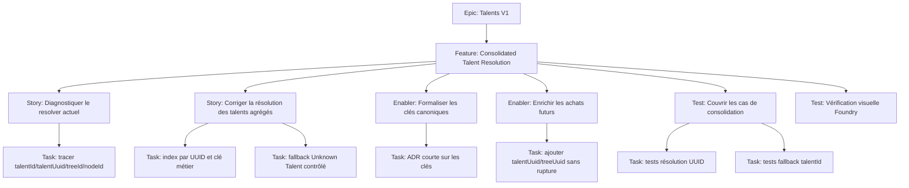

# Project Plan — Talents V1 / Consolidated Talent Resolution

## Contexte source

- `documentation/cadrage/character-sheet/talent/cadrage-resolution-talents-unknown-vue-consolidee.md`
- `documentation/cadrage/character-sheet/talent/0-EPIC-talents-v1.md`
- `documentation/cadrage/character-sheet/talent/07-plan-issues-github.md`

## 1. Vue d'ensemble

### Epic

**Talents V1** — fiabiliser la chaîne arbre de spécialisation → achat acteur → vue agrégée des talents.

### Feature

**Consolidated Talent Resolution** — corriger le mapping entre les nœuds achetés et les Items Talent référentiels afin d'éliminer les faux `Unknown Talent` dans l'onglet Talents.

### Valeur métier

- rétablir une vue Talents exploitable en jeu ;
- éviter les valeurs par défaut trompeuses dans la consolidation ;
- stabiliser la référence canonique entre `talentId` métier et `talentUuid` Foundry ;
- préparer les achats futurs sans casser les données existantes.

## 2. Critères de succès

- les talents connus (`conv`, `fearsome`, `intim`, `quickdr`, `senseadv`, `tough`) ne s'affichent plus en `Unknown Talent` ;
- la vue agrégée conserve les sources par spécialisation ;
- les talents ranked consolident correctement leur rang ;
- un talent introuvable garde un fallback explicite et un log exploitable ;
- les achats existants sans `talentUuid` restent compatibles.

## 3. Jalons

1. **Diagnostic prouvé** — localiser le resolver et confirmer la clé réellement disponible côté référentiel Talent.
2. **Stratégie de résolution validée** — formaliser l'ordre `talentUuid` puis `talentId`.
3. **Resolver corrigé** — index de résolution, fallback contrôlé, logs ciblés.
4. **Persistance enrichie** — ajout progressif de `talentUuid` et `treeUuid` aux nouveaux achats.
5. **Validation qualité** — tests unitaires de consolidation et scénario manuel Foundry.

## 4. Risques principaux

| Risque                                                     | Impact                             | Mitigation                                             |
| ---------------------------------------------------------- | ---------------------------------- | ------------------------------------------------------ |
| Les Items Talent référentiels n'existent pas réellement    | le bug persiste malgré le resolver | vérifier le référentiel avant correction lourde        |
| Les clés importées ne sont pas homogènes                   | faux négatifs de résolution        | documenter la clé canonique et les fallbacks supportés |
| Confusion entre `item.uuid`, `system.uuid` et `talentUuid` | modèle difficile à maintenir       | interdire l'ambiguïté dans la décision de design       |

## 5. Hiérarchie des work items

## 6. Découpage GitHub Issues

### Epic issue

- **Titre** : `Epic: Talents V1 - fiabiliser la résolution de la vue consolidée`
- **Labels** : `epic`, `priority-high`, `value-high`, `character-sheet`, `talents`
- **Estimate** : `S`

### Feature issue

- **Titre** : `Feature: Corriger la résolution des talents agrégés depuis les arbres de spécialisation`
- **Labels** : `feature`, `priority-high`, `value-high`, `character-sheet`, `talents`
- **Estimate** : `5`
- **Blocked by** : Epic

### Stories / Enablers / Tests

| Type    | Titre                                                           | Priorité | Estimate | Dépendances                       |
| ------- | --------------------------------------------------------------- | -------- | -------- | --------------------------------- |
| Story   | Diagnostiquer où `Unknown Talent` est produit                   | P0       | 2        | Feature                           |
| Enabler | Formaliser la stratégie de clés `talentId` / `talentUuid`       | P1       | 1        | Story diagnostic                  |
| Story   | Mettre à niveau le resolver de talents consolidés               | P0       | 3        | Diagnostic, enabler clés          |
| Enabler | Enrichir les nouveaux achats avec `talentUuid` et `treeUuid`    | P2       | 2        | Resolver corrigé                  |
| Test    | Couvrir les cas unitaires de consolidation                      | P0       | 2        | Resolver corrigé                  |
| Test    | Vérifier visuellement la fiche Foundry avec acteur de référence | P1       | 1        | Resolver corrigé, tests unitaires |

## 7. Dépendances et ordre recommandé

1. Diagnostic du resolver actuel.
2. Décision courte sur les clés canoniques.
3. Correction du resolver et du view-model.
4. Enrichissement non bloquant de la persistance future.
5. Tests unitaires.
6. Vérification manuelle Foundry.

## 8. Priorisation

| Issue                      | Priorité | Valeur | Raison                                                 |
| -------------------------- | -------- | ------ | ------------------------------------------------------ |
| Diagnostic resolver        | P0       | High   | l'échec exact doit être prouvé avant correction        |
| Resolver consolidé         | P0       | High   | bug utilisateur visible dans la feuille personnage     |
| Tests unitaires            | P0       | High   | verrouille la non-régression métier                    |
| Stratégie de clés          | P1       | Medium | réduit la dette de design et les ambiguïtés            |
| Vérification visuelle      | P1       | Medium | confirme le rendu réel Foundry                         |
| Enrichissement persistance | P2       | Medium | amélioration progressive, non bloquante pour le hotfix |

## 9. Configuration board Kanban

- **Backlog** : Epic + Feature créées
- **Sprint Ready** : diagnostic cadré, AC validés
- **In Progress** : story/enabler/test en cours
- **In Review** : correction ou tests en revue
- **Testing** : validation ciblée fonctionnelle
- **Done** : AC validés, dépendances fermées

### Champs recommandés

- `Priority`: P0 / P1 / P2
- `Value`: High / Medium
- `Component`: Character Sheet / Talents / Testing
- `Estimate`: 1 / 2 / 3 / 5
- `Epic`: Talents V1

## 10. Définition de done

- la vue agrégée n'affiche plus de faux `Unknown Talent` pour les talents connus ;
- le fallback reste visible pour les vraies références introuvables ;
- les logs de diagnostic sont ciblés et actionnables ;
- les cas unitaires de résolution et de consolidation sont couverts ;
- la validation manuelle Foundry confirme les sources et les rangs attendus.

## 11. Métriques projet

- **Taux de résolution** : 100% des talents connus du scénario de référence sont résolus ;
- **Défaut résiduel** : 0 faux `Unknown Talent` sur les achats existants couverts ;
- **Couverture d'acceptation** : 100% des cas listés au cadrage sont rattachés à une issue ;
- **Cycle cible** : feature livrable en une itération courte ;
- **Risque de régression** : abaissé par tests unitaires dédiés à la consolidation.
