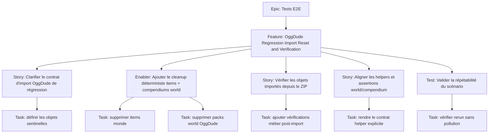

# Project Plan — Tests E2E / OggDude Regression Import Reset and Verification

## Contexte source

- `documentation/cadrage/tests/e2e/import-oggdude-save.md`
- `documentation/tests/e2e/playwright-e2e-guide.md`
- `e2e/regression/specs/02-oggdude-import.spec.ts`

## 1. Vue d'ensemble

- **Epic**: `Tests E2E`
- **Feature**: `OggDude Regression Import Reset and Verification`
- **Positionnement**: fiabiliser le scénario de régression OggDude pour qu'il soit rejouable, déterministe et réellement vérifiant sur les objets importés.

### Résumé

Le scénario de régression OggDude doit partir d'un monde propre, supprimer les items et compendiums world issus des imports précédents, relancer l'import ZIP, puis vérifier que des objets attendus sont bien créés depuis la donnée OggDude.

### Valeur métier

- éviter les faux positifs dus à un monde déjà pollué ;
- sécuriser le workflow d'import OggDude le plus risqué côté régression ;
- garantir qu'un rerun E2E valide la création réelle des données, pas seulement l'ouverture des dialogs ;
- garder la suite `regression` exploitable avant merge et avant release.

## 2. Critères de succès

- chaque exécution du scénario démarre après cleanup des items monde et compendiums world ciblés ;
- le test vérifie au moins un sous-ensemble représentatif d'objets importés depuis le ZIP OggDude ;
- le contrat `toCompendium` vs vérifications attendues est cohérent et explicite ;
- le scénario est rerunnable sans nettoyage manuel intermédiaire ;
- les erreurs navigateur et erreurs d'import restent bloquantes.

## 3. Jalons

1. **Contrat de non-régression clarifié** — définir ce que le scénario doit prouver côté import world et/ou compendium.
2. **Hygiène du monde de régression** — ajouter le cleanup déterministe des items et compendiums world.
3. **Assertions métier OggDude** — vérifier la présence d'objets importés attendus depuis le ZIP.
4. **Validation de rerun** — verrouiller l'absence de pollution résiduelle entre exécutions.

## 4. Risques

| Risque                                                           | Impact                                              | Mitigation                                                                   |
| ---------------------------------------------------------------- | --------------------------------------------------- | ---------------------------------------------------------------------------- |
| Mismatch entre `toCompendium: false` et assertions de compendium | test incohérent ou faux positif                     | formaliser le contrat cible avant de détailler les assertions                |
| Cleanup destructif trop large                                    | suppression de données hors périmètre de régression | limiter strictement aux items monde et packs world du monde E2E ciblé        |
| Import long ou asynchrone                                        | flakiness                                           | conserver des attentes web-first et des vérifications post-import explicites |
| ZIP de test instable                                             | assertions fragiles                                 | choisir un petit set d'objets sentinelles connus et stables                  |

## 5. Hiérarchie des work items

## 6. Découpage GitHub recommandé

| Type    | Titre                                                                                       | Priorité | Estimate | Dépendances      |
| ------- | ------------------------------------------------------------------------------------------- | -------- | -------- | ---------------- |
| Feature | `OGR0 - Fiabiliser la régression E2E d'import OggDude par cleanup et vérification d'objets` | P1       | 8        | Epic `Tests E2E` |
| Story   | `OGR1 - Clarifier le contrat cible du scénario OggDude de régression`                       | P1       | 2        | Feature          |
| Enabler | `OGR2 - Ajouter le cleanup déterministe des items monde et compendiums world OggDude`       | P1       | 3        | OGR1             |
| Story   | `OGR3 - Vérifier les objets importés depuis le ZIP OggDude dans le monde`                   | P1       | 3        | OGR1, OGR2       |
| Story   | `OGR4 - Aligner les helpers et assertions avec le mode d'import attendu`                    | P2       | 2        | OGR1, OGR3       |
| Test    | `OGR5 - Valider le rerun sans pollution résiduelle ni faux positif`                         | P1       | 2        | OGR2, OGR3, OGR4 |

## 7. Dépendances et ordre recommandé

1. **OGR1** — verrouiller le comportement attendu du scénario.
2. **OGR2** — rendre l'environnement de régression propre avant chaque exécution.
3. **OGR3** — ajouter les assertions métier sur les objets importés.
4. **OGR4** — éliminer les ambiguïtés entre import world et compendium.
5. **OGR5** — fermer la boucle sur la répétabilité et l'absence de pollution.

## 8. Board Kanban

- **Backlog**: feature et sous-issues créées
- **Sprint Ready**: objets sentinelles validés, stratégie de cleanup relue
- **In Progress**: une issue active sur l'axe cleanup ou assertions
- **In Review**: revue technique E2E + revue du contrat de destruction ciblée
- **Testing**: rerun local sur monde de régression dédié
- **Done**: scénario rejouable, déterministe et aligné sur le contrat attendu

### Champs recommandés

- `Priority`: `P1` / `P2`
- `Value`: `High`
- `Component`: `Testing / Playwright / Foundry / OggDude`
- `Estimate`: `2`, `3`, `8`
- `Epic`: `Tests E2E`
- `Track`: `OggDude Regression Import Reset and Verification`

## 9. Définition de done

- le scénario d'import OggDude peut être relancé sans nettoyage manuel ;
- les suppressions préalables sont limitées au périmètre world E2E ciblé ;
- les assertions prouvent la création effective d'objets issus du ZIP ;
- les helpers et le test n'expriment plus de contradiction entre import world et compendium ;
- la suite garde ses garde-fous d'erreurs navigateur et d'échec d'import.

## 10. Métriques projet

- **Répétabilité**: 0 dépendance à un état résiduel d'une exécution précédente ;
- **Valeur de preuve**: 100% du scénario cible vérifie au moins un objet importé concret ;
- **Hygiène world**: 100% des suppressions sont bornées aux items monde et packs world ciblés ;
- **Clarté du contrat**: 0 ambiguïté entre mode d'import demandé et artefacts vérifiés ;
- **Pilotage GitHub**: 100% des issues créées avec priorité, estimate et dépendances.
