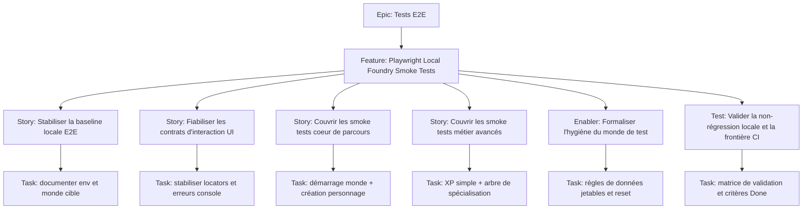

# Project Plan — Tests E2E / Playwright Local Foundry Smoke Tests

## Contexte source

- `documentation/cadrage/tests/e2e/presentation_playwright_e_2_e_foundry_swerpg.md`
- `documentation/tests/e2e/playwright-e2e-guide.md`

## 1. Vue d'ensemble

- **Epic**: `Tests E2E`
- **Feature**: `Playwright Local Foundry Smoke Tests`
- **Positionnement**: suite locale courte, déterministe et orientée non-régression utilisateur sur Foundry VTT.

### Résumé

Consolider un plan d'issues court pour faire de Playwright un filet de sécurité local sur les parcours MJ essentiels de SWERPG, en s'appuyant sur l'outillage E2E déjà documenté du dépôt.

### Valeur métier

- vérifier qu'un MJ peut encore utiliser le système après refactor ;
- sécuriser les parcours UI transverses que Vitest ne couvre pas seul ;
- garder une suite E2E locale, ciblée et maintenable ;
- éviter de reconstruire une pyramide complète de règles métier en E2E.

## 2. Critères de succès

- l'environnement local E2E et le monde de test sont documentés et reproductibles ;
- les interactions critiques reposent sur des locators stables (`getByRole`, `getByLabel`, `data-testid`) ;
- la suite couvre 3 à 5 smoke tests prioritaires : démarrage, création personnage, flux de création de base, dépense simple d'XP, ouverture arbre de spécialisation ;
- les erreurs console non autorisées font échouer les scénarios ;
- les artefacts lourds restent limités aux échecs ;
- le scope reste local-first, avec CI limitée aux parcours explicitement taggés si nécessaire.

## 3. Jalons

1. **Baseline E2E locale** — clarifier environnement, monde de test et frontières de la suite.
2. **Contrats d'interaction stables** — fiabiliser locators, session et capture d'erreurs.
3. **Smoke flows cœur de parcours** — couvrir démarrage du monde et création de personnage.
4. **Smoke flows métier avancés** — couvrir XP simple et ouverture arbre de spécialisation.
5. **Pilotage GitHub** — finaliser dépendances, checklist de création d'issues et critères de clôture.

## 4. Risques

| Risque | Impact | Mitigation |
| --- | --- | --- |
| Décalage entre cadrage initial et outillage E2E actuel du dépôt | plan d'issues mal ciblé | prendre le guide Playwright du projet comme référence d'exécution actuelle |
| Flakiness liée aux temps de chargement Foundry | faux négatifs, baisse de confiance | `workers: 1`, attentes web-first, helpers de session partagés |
| Sélecteurs dépendants du CSS ou des traductions | maintenance coûteuse | privilégier accessibilité et `data-testid` sur actions critiques |
| Pollution du monde de test | scénarios non déterministes | noms uniques puis stratégie de reset/cleanup dédiée |

## 5. Hiérarchie des work items

## 6. Découpage GitHub recommandé

| Type | Titre | Priorité | Estimate | Dépendances |
| --- | --- | --- | --- | --- |
| Feature | `Playwright Local Foundry Smoke Tests - Sécuriser les parcours MJ essentiels en local` | P1 | 8 | Epic `Tests E2E` |
| Story | `PWE1 - Stabiliser la baseline locale Playwright et le monde E2E` | P1 | 2 | Feature |
| Story | `PWE2 - Fiabiliser les contrats d'interaction et la capture d'erreurs navigateur` | P1 | 3 | PWE1 |
| Story | `PWE3 - Couvrir les smoke tests de démarrage du monde et de création personnage` | P1 | 3 | PWE2 |
| Story | `PWE4 - Couvrir la dépense simple d'XP et l'ouverture de l'arbre de spécialisation` | P1 | 3 | PWE2, PWE3 |
| Enabler | `PWE5 - Formaliser l'hygiène du monde de test et la stratégie de reset` | P2 | 2 | PWE1 |
| Test | `PWE6 - Valider la non-régression locale, les erreurs console et la frontière CI` | P1 | 2 | PWE3, PWE4, PWE5 |

## 7. Dépendances et ordre recommandé

1. **PWE1** — verrouiller le périmètre local et les prérequis réels du dépôt.
2. **PWE2** — établir des contrats d'interaction stables avant d'étendre les scénarios.
3. **PWE3** — sécuriser les parcours minimums à forte valeur.
4. **PWE5** — réduire la dérive du monde de test en parallèle des premiers smoke tests.
5. **PWE4** — ajouter les parcours métier plus sensibles une fois la base stable.
6. **PWE6** — fermer la boucle avec validation, labels, dépendances et garde-fous CI.

## 8. Board Kanban

- **Backlog**: feature et sous-issues créées
- **Sprint Ready**: AC relus, monde cible confirmé, dépendances posées
- **In Progress**: une story active par axe principal
- **In Review**: relecture technique + relecture maintenabilité E2E
- **Testing**: validation locale sur instance Foundry dédiée
- **Done**: scénarios stables, scope CI clarifié, documentation de pilotage à jour

### Champs recommandés

- `Priority`: `P1` / `P2`
- `Value`: `High` / `Medium`
- `Component`: `Testing / Playwright / Foundry`
- `Estimate`: `2`, `3`, `8`
- `Epic`: `Tests E2E`
- `Track`: `Playwright Local Foundry Smoke Tests`

## 9. Définition de done

- le périmètre E2E reste limité aux parcours utilisateur critiques ;
- les scénarios utilisent des locators robustes et explicites ;
- les erreurs console inattendues sont traitées comme des régressions ;
- les parcours prioritaires sont couverts sans dépendre d'un état manuel fragile ;
- la stratégie monde de test / reset est documentée ;
- la frontière entre exécution locale complète et CI ciblée est explicitée.

## 10. Métriques projet

- **Couverture smoke**: 3 à 5 parcours prioritaires documentés et suivis ;
- **Stabilité locale**: 0 dépendance à des sélecteurs CSS décoratifs sur le scope ciblé ;
- **Détection d'erreurs UI**: 100% des scénarios critiques surveillent les erreurs console non autorisées ;
- **Discipline de scope**: 0 tentative de déplacement de règles métier exhaustives vers l'E2E ;
- **Pilotage GitHub**: 100% des issues créées avec priorité, estimate, dépendances et rattachement epic.
